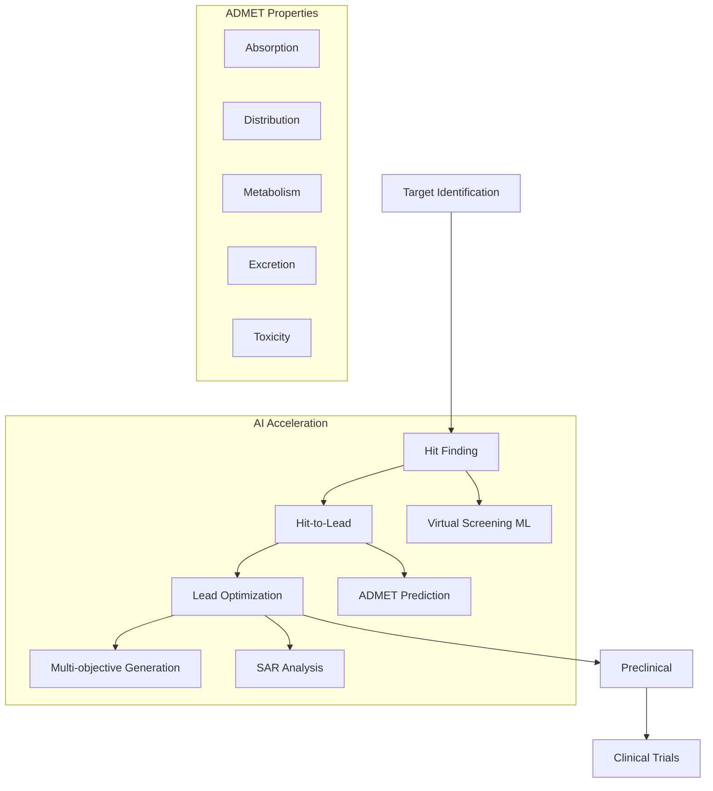

# Drug Discovery and ADMET Prediction

## Overview

Drug discovery is perhaps the highest-impact application of AI in chemistry. Developing a new drug traditionally takes 10-15 years and costs over $2 billion, with a >90% failure rate in clinical trials. AI is transforming every stage of this pipeline — from target identification to lead optimization to clinical trial design — with the potential to dramatically reduce timelines and costs.

The drug discovery pipeline begins with **target identification** (finding a disease-relevant protein) and **hit finding** (identifying molecules that bind the target). **Virtual screening** uses computational methods to rank millions of molecules by predicted binding affinity, replacing expensive experimental high-throughput screening. Traditional methods like molecular docking score binding poses using physics-based scoring functions. ML-based virtual screening trains on known active/inactive pairs to predict activity for new molecules, often achieving superior enrichment factors.

**Lead optimization** takes initial hit molecules and refines them for potency, selectivity, and drug-likeness. This is a multi-objective optimization problem: improving one property often degrades others. AI models enable rapid exploration of chemical modifications, predicting how each change affects the full property profile. Structure-activity relationship (SAR) analysis, once done manually by medicinal chemists, can be accelerated by attention-based models that highlight which molecular regions drive activity.

**ADMET** (Absorption, Distribution, Metabolism, Excretion, Toxicity) properties determine whether a potent molecule can actually become a drug. A molecule that binds its target perfectly but is rapidly metabolized, poorly absorbed, or toxic is useless. ADMET prediction is therefore critical for early-stage decision-making:

- **Absorption**: Oral bioavailability, intestinal permeability (Caco-2), P-glycoprotein substrate status
- **Distribution**: Blood-brain barrier penetration (BBBP), plasma protein binding, volume of distribution
- **Metabolism**: CYP450 inhibition/substrate status (CYP2D6, CYP3A4, etc.), metabolic stability
- **Excretion**: Clearance rate, half-life, renal elimination
- **Toxicity**: hERG channel inhibition (cardiac risk), mutagenicity (Ames test), hepatotoxicity, drug-drug interactions

Modern AI models predict ADMET endpoints with accuracy approaching experimental reproducibility for many endpoints. The key challenge is data quality — ADMET data comes from diverse assays with varying protocols, leading to noisy labels and dataset shift. Transfer learning across related endpoints and multi-task learning (predicting all ADMET properties jointly) improve data efficiency.

**De novo drug design** combines generative models with property predictors to design novel molecules from scratch. Systems like REINVENT use reinforcement learning to train SMILES generators toward multi-objective profiles (high potency + favorable ADMET + synthetic accessibility). Several AI-designed molecules have entered clinical trials, validating the approach.

## Key Concepts

- **Virtual screening**: Computationally ranking large molecular libraries by predicted activity; ML methods outperform traditional docking for many targets
- **Lead optimization**: Iteratively refining hit molecules to balance potency, selectivity, and ADMET properties
- **ADMET**: The pharmacokinetic and safety properties determining whether a molecule can become a drug
- **Multi-task learning**: Training one model to predict multiple related endpoints simultaneously, improving data efficiency through shared representations
- **Synthetic accessibility**: A score estimating how difficult a molecule is to synthesize; critical for ensuring AI-designed molecules are practical
- **Clinical candidate**: A molecule with the full profile (potency, selectivity, ADMET, safety) needed to enter human trials

## Code Examples

```python
"""
ADMET property prediction pipeline
Using molecular descriptors and ML for key drug discovery endpoints
"""
import numpy as np
from rdkit import Chem
from rdkit.Chem import Descriptors, AllChem, DataStructs, Crippen
from rdkit.Chem import FilterCatalog
from sklearn.ensemble import GradientBoostingClassifier

# Drug-likeness filters
def compute_admet_descriptors(smiles):
    """Compute ADMET-relevant molecular descriptors."""
    mol = Chem.MolFromSmiles(smiles)
    if mol is None:
        return None

    return {
        'MW': Descriptors.MolWt(mol),
        'LogP': Crippen.MolLogP(mol),
        'TPSA': Descriptors.TPSA(mol),
        'HBD': Descriptors.NumHDonors(mol),
        'HBA': Descriptors.NumHAcceptors(mol),
        'RotBonds': Descriptors.NumRotatableBonds(mol),
        'Rings': Descriptors.RingCount(mol),
        'AromaticRings': Descriptors.NumAromaticRings(mol),
        'FractionCSP3': Descriptors.FractionCSP3(mol),
    }

# Rule-based ADMET alerts
def check_drug_likeness(smiles):
    """Apply multiple drug-likeness rules."""
    mol = Chem.MolFromSmiles(smiles)
    desc = compute_admet_descriptors(smiles)

    results = {}

    # Lipinski's Rule of Five (oral bioavailability)
    lipinski_violations = sum([
        desc['MW'] > 500,
        desc['LogP'] > 5,
        desc['HBD'] > 5,
        desc['HBA'] > 10
    ])
    results['Lipinski'] = lipinski_violations <= 1

    # Veber's rules (oral bioavailability)
    results['Veber'] = desc['RotBonds'] <= 10 and desc['TPSA'] <= 140

    # CNS penetration (BBB)
    results['BBB_likely'] = (desc['MW'] < 450 and
                             desc['TPSA'] < 90 and
                             desc['HBD'] <= 3)

    # Pfizer 3/75 rule (toxicity risk)
    results['Pfizer_safe'] = not (desc['LogP'] > 3 and desc['TPSA'] < 75)

    return results

# Example: evaluate drug candidates
candidates = [
    ('CC(=O)Oc1ccccc1C(=O)O', 'Aspirin'),
    ('CC(C)Cc1ccc(cc1)C(C)C(=O)O', 'Ibuprofen'),
    ('CN1C=NC2=C1C(=O)N(C(=O)N2C)C', 'Caffeine'),
    ('CC12CCC3C(C1CCC2O)CCC4=CC(=O)CCC34C', 'Testosterone'),
    ('OC(=O)c1ccccc1O', 'Salicylic acid'),
]

print("Drug-likeness Assessment:")
print("-" * 70)
for smiles, name in candidates:
    desc = compute_admet_descriptors(smiles)
    rules = check_drug_likeness(smiles)
    print(f"\n{name} ({smiles})")
    print(f"  MW={desc['MW']:.0f}, LogP={desc['LogP']:.1f}, "
          f"TPSA={desc['TPSA']:.0f}, HBD={desc['HBD']}, HBA={desc['HBA']}")
    print(f"  Lipinski: {'✓' if rules['Lipinski'] else '✗'}, "
          f"Veber: {'✓' if rules['Veber'] else '✗'}, "
          f"BBB: {'✓' if rules['BBB_likely'] else '✗'}, "
          f"Pfizer safe: {'✓' if rules['Pfizer_safe'] else '✗'}")

# Synthetic accessibility score
from rdkit.Chem import RDConfig
import os, sys
sys.path.append(os.path.join(RDConfig.RDContribDir, 'SA_Score'))
try:
    import sascorer
    print("\n\nSynthetic Accessibility Scores (1=easy, 10=hard):")
    for smiles, name in candidates:
        mol = Chem.MolFromSmiles(smiles)
        sa = sascorer.calculateScore(mol)
        print(f"  {name}: {sa:.2f}")
except ImportError:
    print("\n(SA_Score module not available - install from RDKit Contrib)")
```

## Mathematical Formalism

Virtual screening enrichment factor:

$$EF = \frac{\text{Hits}_{\text{selected}} / N_{\text{selected}}}{\text{Hits}_{\text{total}} / N_{\text{total}}}$$

An enrichment factor of 10 means the model finds actives 10x more efficiently than random selection.

Multi-task loss for joint ADMET prediction ($K$ endpoints):

$$\mathcal{L}_{\text{MT}} = \sum_{k=1}^K w_k \cdot \mathcal{L}_k = \sum_{k=1}^K w_k \cdot \frac{1}{N_k}\sum_{i=1}^{N_k} \ell(y_i^{(k)}, \hat{y}_i^{(k)})$$

where $w_k$ balances tasks with different dataset sizes and $N_k$ accounts for missing labels.

Tanimoto-constrained optimization (lead optimization):

$$\max_{\mathbf{x}} \; \text{Activity}(\mathbf{x}) \quad \text{s.t.} \quad T(\mathbf{x}, \mathbf{x}_{\text{lead}}) \geq \delta, \; \text{ADMET}(\mathbf{x}) \in \text{acceptable}$$

## Diagrams



## Exercises/Projects

1. **ADMET profiling**: Download the TDC (Therapeutics Data Commons) ADMET benchmark. Train models for Caco-2 permeability and CYP2D6 inhibition. Which molecular features drive each endpoint?

2. **Virtual screening**: Using a set of known actives for a target (e.g., from ChEMBL), train a classifier and screen the ZINC-250K subset. Compute enrichment factor at 1% and 5%.

3. **Lead optimization**: Starting from aspirin, enumerate single-atom modifications (replace one atom, add one group). Score each modification for predicted activity and ADMET. Which modifications improve the profile?

4. **Multi-objective scoring**: Implement a Pareto-front approach that identifies molecules optimal across potency, solubility, and synthetic accessibility simultaneously.

## Further Reading

- Vamathevan et al. "Applications of machine learning in drug discovery and development" Nature Reviews Drug Discovery 18, 463-477 (2019)
- Xiong et al. "ADMETlab 2.0: an integrated online platform for accurate and comprehensive ADMET prediction" Nucleic Acids Research 49, W5-W14 (2021)
- Blaschke et al. "REINVENT 2.0: An AI Tool for De Novo Drug Design" J. Chem. Inf. Model. 60, 5918-5922 (2020)
