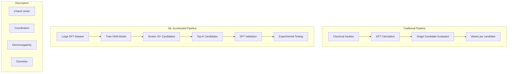

## Catalyst Design with Machine Learning

## Overview

Catalysts are the workhorses of the chemical industry — they accelerate reactions, enable selectivity, and reduce energy consumption. Over 90% of chemical manufacturing involves catalysis. Yet catalyst discovery remains largely empirical, relying on trial-and-error experimentation guided by chemical intuition. Machine learning is now transforming this field by learning structure-activity relationships from data and accelerating the search for next-generation catalysts.

**Heterogeneous catalysis** — reactions on solid surfaces — is the dominant form in industry (automotive exhaust treatment, ammonia synthesis, petroleum refining). The catalytic activity depends on how reactants bind to the surface, which in turn depends on the electronic structure of the active site. The classic **volcano plot** relates catalytic activity to a single descriptor: the binding energy of a key intermediate. Catalysts at the volcano peak bind intermediates "just right" — not too strongly (poisoning) and not too weakly (no activation). This Sabatier principle has guided catalyst design for decades.

Traditional computational catalysis uses Density Functional Theory (DFT) to compute binding energies and reaction barriers. While accurate, DFT calculations are expensive — each surface calculation takes hours to days on a supercomputer. This limits screening to hundreds of candidates. ML models trained on DFT data can predict binding energies in milliseconds, enabling screening of millions of candidate materials.

The **Open Catalyst Project (OC20/OC22)** from Meta AI created the largest dataset of DFT-computed catalytic properties: over 1.3 million relaxations of adsorbates on surfaces. This enabled training of large GNN models (GemNet, EquiformerV2, eSCN) that predict adsorption energies and relaxed structures with near-DFT accuracy. These models can screen vast compositional spaces for optimal catalysts.

**Descriptor-based approaches** use physics-informed features: d-band center, coordination number, electronegativity, and geometric descriptors of active sites. Combined with Gaussian process regression or neural networks, these achieve strong predictions with small datasets by encoding domain knowledge.

**Active site prediction** identifies where on a catalyst surface reactions occur. Graph neural networks operating on surface atom graphs can classify atoms as active or inactive, guiding rational design of nanostructured catalysts.

**Electrocatalysis** for renewable energy — CO₂ reduction, nitrogen fixation, hydrogen evolution, oxygen evolution — is a particularly active area. ML models are accelerating the search for earth-abundant alternatives to precious metal catalysts (Pt, Ir, Ru) for these critical reactions.

## Key Concepts

- **Sabatier principle**: Optimal catalysts bind intermediates with intermediate strength — neither too strongly nor too weakly
- **Volcano plot**: Activity vs. binding energy relationship showing the Sabatier optimum as a peak
- **d-band center**: The average energy of metal d-states; a powerful descriptor for transition metal catalysis
- **Adsorption energy**: The energy released when a molecule binds to a surface; key predictor of catalytic activity
- **Scaling relations**: Linear correlations between binding energies of related intermediates that simplify the descriptor space
- **Open Catalyst Project**: Large-scale dataset and models for heterogeneous catalysis (OC20/OC22)

## Code Examples

```python
"""
ML for catalyst screening: predicting adsorption energies
"""
import numpy as np
from sklearn.gaussian_process import GaussianProcessRegressor
from sklearn.gaussian_process.kernels import RBF, ConstantKernel
from sklearn.preprocessing import StandardScaler

# Simulated catalyst descriptors (inspired by d-band model)
# Features: [d-band center (eV), coordination number,
#            electronegativity, lattice constant (Å)]
# Target: CO adsorption energy (eV)

# Training data: transition metals and their CO binding energies
catalyst_data = {
    'Cu': {'features': [-2.67, 9, 1.90, 3.61], 'E_CO': -0.57},
    'Ag': {'features': [-4.30, 9, 1.93, 4.09], 'E_CO': -0.03},
    'Au': {'features': [-3.56, 9, 2.54, 4.08], 'E_CO': -0.15},
    'Pd': {'features': [-1.83, 9, 2.20, 3.89], 'E_CO': -1.34},
    'Pt': {'features': [-2.25, 9, 2.28, 3.92], 'E_CO': -1.37},
    'Ni': {'features': [-1.29, 9, 1.91, 3.52], 'E_CO': -1.72},
    'Rh': {'features': [-1.73, 9, 2.28, 3.80], 'E_CO': -1.55},
    'Ir': {'features': [-2.11, 9, 2.20, 3.84], 'E_CO': -1.50},
    'Fe': {'features': [-0.92, 8, 1.83, 2.87], 'E_CO': -1.60},
    'Co': {'features': [-1.17, 9, 1.88, 3.54], 'E_CO': -1.52},
}

# Prepare data
metals = list(catalyst_data.keys())
X = np.array([catalyst_data[m]['features'] for m in metals])
y = np.array([catalyst_data[m]['E_CO'] for m in metals])

# Gaussian Process Regression with uncertainty
scaler = StandardScaler()
X_scaled = scaler.fit_transform(X)

kernel = ConstantKernel(1.0) * RBF(length_scale=1.0)
gpr = GaussianProcessRegressor(kernel=kernel, alpha=0.01, random_state=42)
gpr.fit(X_scaled, y)

# Predict for hypothetical alloy catalysts
alloy_candidates = {
    'CuPd': [-2.25, 9, 2.05, 3.75],   # Cu-Pd alloy (interpolated)
    'NiAu': [-2.43, 9, 2.23, 3.80],   # Ni-Au alloy
    'PtCo': [-1.71, 9, 2.08, 3.73],   # Pt-Co alloy
    'AgPd': [-3.07, 9, 2.07, 3.99],   # Ag-Pd alloy
}

print("Catalyst CO Adsorption Energy Predictions")
print("=" * 55)
print(f"{'Catalyst':<10} {'E_CO (eV)':<12} {'Uncertainty':<12} {'Status'}")
print("-" * 55)

# Known catalysts
for metal in metals:
    pred, std = gpr.predict(
        scaler.transform([catalyst_data[metal]['features']]),
        return_std=True
    )
    print(f"{metal:<10} {pred[0]:>8.3f}    {std[0]:>8.3f}      (train)")

print("-" * 55)

# Novel alloy predictions
optimal_range = (-1.0, -0.5)  # Hypothetical volcano peak
for alloy, features in alloy_candidates.items():
    pred, std = gpr.predict(
        scaler.transform([features]), return_std=True
    )
    in_optimal = optimal_range[0] <= pred[0] <= optimal_range[1]
    status = "★ PROMISING" if in_optimal else ""
    print(f"{alloy:<10} {pred[0]:>8.3f}    {std[0]:>8.3f}      {status}")

print(f"\nOptimal volcano range: {optimal_range[0]} to {optimal_range[1]} eV")

# Feature importance via d-band model correlation
from scipy.stats import pearsonr
print("\nCorrelation with CO binding energy:")
feature_names = ['d-band center', 'coord. number', 'electronegativity', 'lattice const.']
for i, name in enumerate(feature_names):
    r, p = pearsonr(X[:, i], y)
    print(f"  {name:20s}: r = {r:+.3f} (p = {p:.4f})")
```

## Mathematical Formalism

The d-band model relates adsorption energy to electronic structure:

$$\Delta E_{\text{ads}} \approx \alpha \cdot \varepsilon_d + \beta$$

where $\varepsilon_d$ is the d-band center of the surface metal and $\alpha, \beta$ are reaction-specific constants.

Scaling relations between binding energies of intermediates A and B:

$$\Delta E_B = \gamma \cdot \Delta E_A + \xi$$

The volcano relationship (simplified):

$$\text{Activity} \propto \min\left(e^{-\Delta G_1 / k_BT}, \; e^{-\Delta G_2 / k_BT}\right)$$

where $\Delta G_1$ and $\Delta G_2$ are barriers for competing steps (e.g., adsorption vs. desorption), each linearly related to the binding energy descriptor.

Gaussian Process prediction with uncertainty:

$$\mu(\mathbf{x}_*) = \mathbf{k}_*^T (K + \sigma_n^2 I)^{-1} \mathbf{y}$$
$$\sigma^2(\mathbf{x}_*) = k(\mathbf{x}_*, \mathbf{x}_*) - \mathbf{k}_*^T (K + \sigma_n^2 I)^{-1} \mathbf{k}_*$$

## Diagrams



## Exercises/Projects

1. **Volcano plot**: Using the d-band center data above, plot a volcano curve: CO oxidation rate vs. CO binding energy. Which metals sit at the peak?

2. **Alloy screening**: Generate all binary alloy combinations of {Cu, Ag, Au, Pd, Pt, Ni} with 25/50/75% mixing ratios. Use interpolated features and the GP model to predict binding energies. Which alloys land on the volcano peak?

3. **Active learning for catalysis**: Implement a Bayesian optimization loop: pick the candidate with highest expected improvement, "measure" it (DFT), add to training set, retrain. How many iterations to find the optimal catalyst?

4. **OC20 exploration**: Download the OC20 IS2RE (Initial Structure to Relaxed Energy) dataset sample. Examine the data format and compute statistics on which surfaces and adsorbates are represented.

## Further Reading

- Nørskov et al. "Towards the computational design of solid catalysts" Nature Chemistry 1, 37-46 (2009)
- Chanussot et al. "Open Catalyst 2020 (OC20) Dataset and Community Challenges" ACS Catalysis 11, 6059-6072 (2021)
- Tran & Ulissi. "Active learning across intermetallics to guide discovery of electrocatalysts" Nature Catalysis 1, 696-703 (2018)
