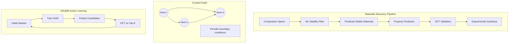

# Materials Discovery and Crystal Structure Prediction

## Overview

Materials science is experiencing an AI-driven revolution. The quest to discover new materials with specific properties — better batteries, more efficient solar cells, stronger alloys, novel superconductors — has been dramatically accelerated by machine learning. In 2023, Google DeepMind's GNoME (Graph Networks for Materials Exploration) predicted 2.2 million new stable crystals, expanding known stable materials by an order of magnitude.

**Crystal structure** defines a material's properties. A crystal is defined by its unit cell (the repeating unit), lattice parameters (lengths $a, b, c$ and angles $\alpha, \beta, \gamma$), and atomic positions within the cell. The space of possible crystal structures is enormous — predicting which arrangement of atoms will be stable is one of the grand challenges of materials science (the "crystal structure prediction" problem).

**The Materials Project** is a foundational database containing DFT-computed properties for over 150,000 inorganic materials. It provides formation energies, band gaps, elastic moduli, and more — serving as training data for ML models. Similar databases include AFLOW, OQMD, and JARVIS.

**Band gap prediction** is a key application. The band gap determines whether a material is a metal (zero gap), semiconductor (small gap), or insulator (large gap). For solar cells, the optimal band gap is ~1.3 eV (Shockley-Queisser limit). ML models trained on Materials Project data can predict band gaps from composition and structure, enabling rapid screening of candidate materials.

**Perovskites** (ABX₃ structure) are a particularly active research area. Their tunable band gaps make them promising for solar cells, LEDs, and catalysts. With millions of possible compositions (varying A, B, and X site atoms), ML-guided screening is essential. Models predict stability (formation energy, decomposition energy) and target properties simultaneously.

**Crystal Graph Neural Networks** represent crystals as periodic graphs. CGCNN (Crystal Graph Convolutional Neural Network) encodes atoms as nodes and bonds (within a distance cutoff) as edges, with periodicity handled by including bonds to neighboring unit cells. MEGNet and M3GNet extend this with multi-fidelity learning and universal force fields.

**GNoME** combined graph neural networks with active learning. Starting from Materials Project data, it iteratively: predicted stability of candidate structures, ran DFT on the most promising candidates, added validated structures to the training set, and retrained. This cycle discovered 2.2 million stable structures — 800x more than all previous human discoveries combined.

**Generative models for crystals** are emerging. CDVAE (Crystal Diffusion Variational Autoencoder) generates novel crystal structures by diffusing atom positions, lattice parameters, and compositions simultaneously. DiffCSP uses diffusion to predict crystal structures from composition alone.

## Key Concepts

- **Unit cell**: The smallest repeating unit of a crystal, defined by lattice parameters and atomic positions
- **Formation energy**: Energy released/required to form a material from its elements; negative = thermodynamically stable
- **Band gap**: Energy difference between valence and conduction bands; determines electronic/optical properties
- **Convex hull**: The set of thermodynamically stable phases at each composition; materials above the hull are metastable
- **Crystal graph**: Representation of a crystal as a periodic graph with atoms as nodes and bonds as edges
- **GNoME**: Google DeepMind's system that discovered 2.2M new stable crystals using GNNs + active learning

## Code Examples

```python
"""
Crystal property prediction with composition-based features
"""
import numpy as np
from sklearn.ensemble import RandomForestRegressor
from sklearn.model_selection import cross_val_score

# Element properties database (simplified)
element_props = {
    'Li': {'Z': 3, 'EN': 0.98, 'r': 1.52, 'IE': 5.39, 'group': 1},
    'Na': {'Z': 11, 'EN': 0.93, 'r': 1.86, 'IE': 5.14, 'group': 1},
    'O':  {'Z': 8, 'EN': 3.44, 'r': 0.73, 'IE': 13.62, 'group': 16},
    'S':  {'Z': 16, 'EN': 2.58, 'r': 1.05, 'IE': 10.36, 'group': 16},
    'Ti': {'Z': 22, 'EN': 1.54, 'r': 1.47, 'IE': 6.83, 'group': 4},
    'Zr': {'Z': 40, 'EN': 1.33, 'r': 1.60, 'IE': 6.63, 'group': 4},
    'Si': {'Z': 14, 'EN': 1.90, 'r': 1.11, 'IE': 8.15, 'group': 14},
    'Ge': {'Z': 32, 'EN': 2.01, 'r': 1.20, 'IE': 7.90, 'group': 14},
    'Pb': {'Z': 82, 'EN': 2.33, 'r': 1.75, 'IE': 7.42, 'group': 14},
    'Ba': {'Z': 56, 'EN': 0.89, 'r': 2.17, 'IE': 5.21, 'group': 2},
    'Sr': {'Z': 38, 'EN': 0.95, 'r': 2.15, 'IE': 5.69, 'group': 2},
    'Ca': {'Z': 40, 'EN': 1.00, 'r': 1.97, 'IE': 6.11, 'group': 2},
    'I':  {'Z': 53, 'EN': 2.66, 'r': 1.33, 'IE': 10.45, 'group': 17},
    'Br': {'Z': 35, 'EN': 2.96, 'r': 1.14, 'IE': 11.81, 'group': 17},
    'Cl': {'Z': 17, 'EN': 3.16, 'r': 0.99, 'IE': 12.97, 'group': 17},
}

def composition_features(formula_dict):
    """
    Generate features from composition.
    formula_dict: {'element': fraction}, e.g., {'Ba': 0.2, 'Ti': 0.2, 'O': 0.6}
    """
    props = ['Z', 'EN', 'r', 'IE']
    features = []

    for prop in props:
        values = [element_props[el][prop] * frac
                  for el, frac in formula_dict.items()
                  if el in element_props]
        if values:
            features.extend([
                np.mean(values),      # weighted mean
                np.std(values),       # variance in property
                np.max(values) - np.min(values),  # range
            ])
        else:
            features.extend([0, 0, 0])

    # Add electronegativity difference (proxy for ionicity)
    ens = [element_props[el]['EN'] for el in formula_dict if el in element_props]
    features.append(max(ens) - min(ens) if len(ens) > 1 else 0)

    return np.array(features)

# Example: perovskite band gap prediction (ABX3)
perovskite_data = [
    # (composition, band_gap_eV)
    ({'Ba': 1/5, 'Ti': 1/5, 'O': 3/5}, 3.2),    # BaTiO3
    ({'Sr': 1/5, 'Ti': 1/5, 'O': 3/5}, 3.3),    # SrTiO3
    ({'Ba': 1/5, 'Zr': 1/5, 'O': 3/5}, 5.3),    # BaZrO3
    ({'Ca': 1/5, 'Ti': 1/5, 'O': 3/5}, 3.5),    # CaTiO3
    ({'Ba': 1/5, 'Pb': 1/5, 'O': 3/5}, 2.7),    # BaPbO3 (est.)
    ({'Sr': 1/5, 'Zr': 1/5, 'O': 3/5}, 5.6),    # SrZrO3
]

X = np.array([composition_features(comp) for comp, _ in perovskite_data])
y = np.array([bg for _, bg in perovskite_data])

# Train model
rf = RandomForestRegressor(n_estimators=100, random_state=42)
rf.fit(X, y)
print("Perovskite Band Gap Prediction")
print("=" * 50)
names = ['BaTiO3', 'SrTiO3', 'BaZrO3', 'CaTiO3', 'BaPbO3', 'SrZrO3']
preds = rf.predict(X)
for name, true, pred in zip(names, y, preds):
    print(f"  {name:<10} True: {true:.1f} eV, Predicted: {pred:.1f} eV")

# Screen novel perovskites
print("\nNovel Perovskite Screening:")
novel = [
    ({'Ba': 1/5, 'Si': 1/5, 'O': 3/5}, 'BaSiO3'),
    ({'Sr': 1/5, 'Ge': 1/5, 'O': 3/5}, 'SrGeO3'),
]
for comp, name in novel:
    X_new = composition_features(comp).reshape(1, -1)
    pred = rf.predict(X_new)[0]
    print(f"  {name:<10} Predicted band gap: {pred:.1f} eV")
```

## Mathematical Formalism

Formation energy from DFT:

$$\Delta H_f = E_{\text{total}}^{\text{compound}} - \sum_i n_i \mu_i$$

where $E_{\text{total}}$ is the DFT total energy, $n_i$ is the number of atoms of element $i$, and $\mu_i$ is the chemical potential of element $i$ in its reference state.

Energy above convex hull (thermodynamic stability):

$$E_{\text{hull}} = E_f(\text{compound}) - E_f(\text{hull at same composition})$$

A material is stable if $E_{\text{hull}} = 0$; metastable if $E_{\text{hull}} > 0$.

Tolerance factor for perovskites (ABX₃):

$$t = \frac{r_A + r_X}{\sqrt{2}(r_B + r_X)}$$

Stable perovskites typically have $0.8 < t < 1.0$. This geometric criterion is a simple but powerful descriptor.

Crystal graph convolution (CGCNN):

$$v_i^{(t+1)} = v_i^{(t)} + \sum_{j,k} \sigma\left(z_{(i,j)_k}^{(t)} W_f + b_f\right) \odot g\left(z_{(i,j)_k}^{(t)} W_s + b_s\right)$$

where $z_{(i,j)_k}^{(t)} = v_i^{(t)} \oplus v_j^{(t)} \oplus u_{(i,j)_k}$ concatenates atom and bond features.

## Diagrams



## Exercises/Projects

1. **Tolerance factor screening**: Compute the Goldschmidt tolerance factor for all combinations of common A-site (Ba, Sr, Ca, Pb) and B-site (Ti, Zr, Sn, Ge) cations with O, S, or halide X-sites. Which compositions are predicted to form stable perovskites?

2. **Materials Project API**: Use the Materials Project API (mp-api) to download band gaps and formation energies for all titanates. Plot band gap vs. A-site cation radius. Is there a trend?

3. **Stability classification**: Build a binary classifier predicting whether a composition is stable ($E_{\text{hull}} < 25$ meV/atom) or unstable. Use composition features and evaluate with leave-one-out CV.

4. **Crystal structure visualization**: Install pymatgen and visualize the unit cells of BaTiO₃ in its cubic, tetragonal, and rhombohedral phases. How do the lattice parameters change?

## Further Reading

- Xie & Grossman. "Crystal Graph Convolutional Neural Networks for an Accurate and Interpretable Prediction of Material Properties" Physical Review Letters 120, 145301 (2018)
- Merchant et al. "Scaling deep learning for materials discovery" Nature 624, 80-85 (2023) — GNoME
- Chen et al. "A Universal Graph Deep Learning Interatomic Potential for the Periodic Table" Nature Computational Science 2, 718-728 (2022) — M3GNet
