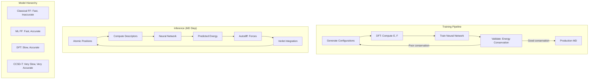

# Molecular Dynamics with ML Force Fields

## Overview

Molecular dynamics (MD) simulates how atoms move over time by integrating Newton's equations of motion. The critical input is the **force field** — the function mapping atomic positions to energies and forces. Traditional force fields use simple analytical functions (harmonic bonds, Lennard-Jones interactions) that are fast but inaccurate. Quantum mechanical methods (DFT) are accurate but prohibitively expensive for large systems or long timescales. ML force fields bridge this gap: they achieve quantum-mechanical accuracy at a fraction of the computational cost, enabling simulations previously impossible.

The key insight is that the potential energy surface (PES) is a smooth, learnable function of atomic coordinates. Given enough DFT training data (atomic configurations with their energies and forces), a neural network can interpolate the PES and predict forces for new configurations. This enables MD simulations with DFT-level accuracy running 1000x faster than actual DFT-MD.

**SchNet** (2017) pioneered continuous-filter convolutions on atomic distances, learning representations that are invariant to translation and rotation. It uses radial basis function expansions of interatomic distances as filter generators, enabling smooth interpolation.

**NequIP** (Neural Equivariant Interatomic Potentials, 2022) uses E(3)-equivariant neural networks that operate directly on vector and tensor features. By building in rotational equivariance, NequIP achieves state-of-the-art accuracy with remarkably few training structures (often <1000). The model processes features that transform predictably under rotation, eliminating the need for data augmentation and improving sample efficiency dramatically.

**DeePMD-kit** (Deep Potential Molecular Dynamics) uses a symmetry-preserving descriptor that maps local atomic environments to invariant representations. It has been scaled to simulate millions of atoms on supercomputers (winning the 2020 Gordon Bell Prize for a 100-million-atom copper simulation) and is widely used in materials science.

**MACE** (Multi-Atomic Cluster Expansion, 2022) combines equivariant message passing with the mathematical framework of atomic cluster expansions. It achieves exceptional accuracy with computational efficiency, making it practical for production MD simulations.

**Universal force fields** like M3GNet and MACE-MP-0 are trained on diverse datasets spanning the periodic table. Unlike system-specific potentials, these can simulate any material composition without retraining, dramatically lowering the barrier to ML-MD simulations.

The training process involves: (1) generating diverse configurations (random perturbations, MD trajectories, phase transitions), (2) computing DFT energies and forces for each configuration, (3) training the neural network to predict both energy and forces (forces are the negative gradient of energy), and (4) validating stability by running MD and checking conservation laws.

## Key Concepts

- **Potential energy surface (PES)**: The function mapping atomic positions $\{r_i\}$ to total energy $E$; forces are $F_i = -\nabla_{r_i} E$
- **Equivariance**: The property that rotating inputs produces predictably rotated outputs; essential for physical consistency
- **Body-ordered expansions**: Representing interactions as sums of 2-body, 3-body, ..., n-body terms; higher order = more accurate but expensive
- **Active learning for training data**: Selecting configurations where model uncertainty is high for DFT labeling, efficiently exploring configuration space
- **Energy conservation**: A well-trained ML force field should conserve energy in NVE simulations; drift indicates model errors
- **Transferability**: The ability to predict accurately for configurations not in the training set (different temperatures, pressures, compositions)

## Code Examples

```python
"""
ML Force Field concepts: building a simple neural network potential
"""
import numpy as np
import torch
import torch.nn as nn

# Symmetry functions (Behler-Parrinello descriptors)
def radial_symmetry_function(distances, eta, Rs):
    """G2 radial symmetry function."""
    return np.exp(-eta * (distances - Rs)**2)

def compute_descriptor(positions, center_idx, cutoff=6.0,
                       n_radial=8, eta=0.5):
    """
    Compute symmetry function descriptor for an atom.
    This creates a rotationally invariant representation of the
    local atomic environment.
    """
    center = positions[center_idx]
    descriptor = []

    # Radial symmetry functions at different Rs values
    Rs_values = np.linspace(0.5, cutoff - 0.5, n_radial)

    for other_idx in range(len(positions)):
        if other_idx == center_idx:
            continue
        dist = np.linalg.norm(positions[other_idx] - center)
        if dist < cutoff:
            for Rs in Rs_values:
                descriptor.append(radial_symmetry_function(dist, eta, Rs))

    # Pad or truncate to fixed size
    descriptor = np.array(descriptor[:n_radial * 10])
    if len(descriptor) < n_radial * 10:
        descriptor = np.pad(descriptor, (0, n_radial * 10 - len(descriptor)))

    return descriptor

# Simple Neural Network Potential
class NeuralNetworkPotential(nn.Module):
    """
    A simplified Behler-Parrinello style neural network potential.
    Each atom gets its own subnet mapping descriptor -> atomic energy.
    Total energy = sum of atomic energies.
    """
    def __init__(self, descriptor_dim=80, hidden_dim=64):
        super().__init__()
        self.net = nn.Sequential(
            nn.Linear(descriptor_dim, hidden_dim),
            nn.SiLU(),
            nn.Linear(hidden_dim, hidden_dim),
            nn.SiLU(),
            nn.Linear(hidden_dim, 1)
        )

    def forward(self, descriptors):
        """
        descriptors: (n_atoms, descriptor_dim)
        Returns: total energy (scalar)
        """
        atomic_energies = self.net(descriptors)  # (n_atoms, 1)
        total_energy = atomic_energies.sum()
        return total_energy

# Force computation via automatic differentiation
def compute_forces(model, positions_tensor, descriptor_fn):
    """
    Compute forces as negative gradient of energy w.r.t. positions.
    This is the key advantage of autodiff-based potentials.
    """
    positions_tensor.requires_grad_(True)

    # In practice, descriptors would be differentiable functions of positions
    # Here we demonstrate the concept
    descriptors = descriptor_fn(positions_tensor)
    energy = model(descriptors)

    # Forces = -dE/dr
    forces = -torch.autograd.grad(energy, positions_tensor,
                                   create_graph=True)[0]
    return energy, forces

# Example: water molecule
positions = np.array([
    [0.000, 0.000, 0.117],  # O
    [0.000, 0.757, -0.469],  # H
    [0.000, -0.757, -0.469],  # H
])

# Compute descriptors
desc_O = compute_descriptor(positions, 0)
desc_H1 = compute_descriptor(positions, 1)
desc_H2 = compute_descriptor(positions, 2)

print("ML Force Field - Water Molecule Demo")
print("=" * 50)
print(f"Atom positions (Angstrom):")
for i, (pos, label) in enumerate(zip(positions, ['O', 'H', 'H'])):
    print(f"  {label}: ({pos[0]:.3f}, {pos[1]:.3f}, {pos[2]:.3f})")

print(f"\nDescriptor dimensions: {desc_O.shape[0]}")
print(f"Descriptor (O, first 8): {desc_O[:8].round(4)}")

# Initialize and evaluate model
model = NeuralNetworkPotential(descriptor_dim=80)
all_descriptors = torch.tensor(
    np.stack([desc_O, desc_H1, desc_H2]), dtype=torch.float32
)
energy = model(all_descriptors)
print(f"\nPredicted energy: {energy.item():.6f} (untrained, arbitrary units)")
print(f"Model parameters: {sum(p.numel() for p in model.parameters()):,}")

# Velocity Verlet integration (MD step)
def velocity_verlet_step(positions, velocities, forces, masses, dt):
    """Single Velocity Verlet integration step."""
    # Half-step velocity update
    velocities_half = velocities + 0.5 * dt * forces / masses[:, None]
    # Full-step position update
    positions_new = positions + dt * velocities_half
    # (Recompute forces at new positions - omitted here)
    # Full-step velocity update
    # velocities_new = velocities_half + 0.5 * dt * forces_new / masses[:, None]
    return positions_new, velocities_half

print("\n\nVerlet Integration (concept):")
print("  1. F = -∇E(r)       [ML model predicts energy & forces]")
print("  2. v += 0.5*dt*F/m  [half-step velocity]")
print("  3. r += dt*v        [update positions]")
print("  4. Recompute F      [new forces from ML model]")
print("  5. v += 0.5*dt*F/m  [complete velocity step]")
```

## Mathematical Formalism

The potential energy as a sum of atomic contributions:

$$E(\{r_i\}) = \sum_i \varepsilon_i(\mathcal{G}_i)$$

where $\mathcal{G}_i$ is the local environment descriptor of atom $i$.

Behler-Parrinello radial symmetry function (G2):

$$G_i^2 = \sum_{j \neq i} e^{-\eta(r_{ij} - R_s)^2} \cdot f_c(r_{ij})$$

with cutoff function $f_c(r) = \frac{1}{2}\left[\cos\left(\frac{\pi r}{r_c}\right) + 1\right]$ for $r \leq r_c$.

Training loss combining energy and forces:

$$\mathcal{L} = \frac{w_E}{N}\sum_n (E_n^{\text{pred}} - E_n^{\text{DFT}})^2 + \frac{w_F}{3N_{\text{atoms}}}\sum_n \sum_i \|\mathbf{F}_i^{\text{pred}} - \mathbf{F}_i^{\text{DFT}}\|^2$$

Force consistency (guaranteed by construction in autodiff-based models):

$$\mathbf{F}_i = -\frac{\partial E}{\partial \mathbf{r}_i}$$

Equivariance constraint for NequIP: if $R$ is a rotation matrix:

$$f(R \cdot \{r_i\}) = D(R) \cdot f(\{r_i\})$$

where $D(R)$ is the appropriate Wigner-D matrix representation.

## Diagrams



## Exercises/Projects

1. **Symmetry function implementation**: Implement both G2 (radial) and G4 (angular) symmetry functions. Verify they are invariant to translation and rotation by applying random transformations to a water molecule.

2. **Training a simple potential**: Generate training data for a Lennard-Jones dimer (vary bond length from 0.8σ to 3.0σ). Train a neural network to predict energy and force. Plot the learned PES vs. the true LJ potential.

3. **Energy conservation test**: Run NVE molecular dynamics with your trained potential. Plot total energy vs. time. How does conservation depend on integration timestep and model accuracy?

4. **Compare ML potentials**: Using ASE (Atomic Simulation Environment) with a pretrained MACE or M3GNet model, compute the equation of state for copper (energy vs. volume). Compare with DFT reference values.

## Further Reading

- Behler & Parrinello. "Generalized Neural-Network Representation of High-Dimensional Potential-Energy Surfaces" Physical Review Letters 98, 146401 (2007)
- Batzner et al. "E(3)-equivariant graph neural networks for data-efficient and accurate interatomic potentials" Nature Communications 13, 2453 (2022) — NequIP
- Jia et al. "Pushing the Limit of Molecular Dynamics with Ab Initio Accuracy to 100 Million Atoms with Machine Learning" SC20 Gordon Bell Prize — DeePMD
- Batatia et al. "MACE: Higher Order Equivariant Message Passing Neural Networks for Fast and Accurate Force Fields" NeurIPS 2022
