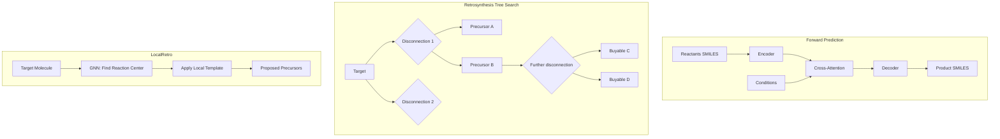

# Chemical Reaction Prediction and Retrosynthesis

## Overview

Predicting the outcome of chemical reactions and planning synthetic routes are central challenges in chemistry. A synthetic chemist must answer two questions: "What will I get if I mix these reagents?" (forward prediction) and "How can I make this target molecule?" (retrosynthesis). Both have been revolutionized by AI, with transformer-based models now rivaling expert chemists in accuracy.

**Forward reaction prediction** takes reactants and reagents as input and predicts products. The challenge is that the same reactants can yield different products depending on conditions (temperature, solvent, catalyst). Template-based approaches enumerate known reaction rules and apply matching templates. Template-free approaches treat the problem as sequence-to-sequence translation: input SMILES of reactants → output SMILES of products. The Molecular Transformer (Schwaller et al., 2019) applied the transformer architecture to this task, achieving >90% top-1 accuracy on the USPTO dataset.

**Retrosynthetic analysis** — working backward from a target molecule to commercially available starting materials — is perhaps AI's most practically impactful application in synthetic chemistry. Proposed by E.J. Corey (Nobel Prize, 1990) as a systematic approach, retrosynthesis involves iteratively disconnecting bonds to simplify the target into simpler precursors.

**Template-based retrosynthesis** uses a database of known reaction templates (SMARTS patterns). Given a target, all applicable templates are identified, scored by likelihood, and the highest-scoring disconnections are proposed. Models like RetroXpert learn to select and rank templates using molecular features.

**Template-free retrosynthesis** generates precursors directly without explicit templates. Models like the Molecular Transformer (used in reverse), MEGAN, and Graph2SMILES learn retrosynthetic transformations end-to-end. They can propose disconnections never seen in training data, potentially discovering novel synthetic routes.

**LocalRetro** (2022) is a state-of-the-art semi-template approach. It identifies the reaction center (atoms where bonds break/form) using a GNN, then applies local templates only at the predicted center. This combines the novelty of template-free methods with the chemical validity guarantee of template-based methods.

**Multi-step retrosynthesis** plans complete routes from target to buyable starting materials. This requires search over a tree of possible disconnections. Methods include Monte Carlo Tree Search (MCTS), beam search, and A* search guided by learned value functions. Systems like ASKCOS, AiZynthFinder, and Retro* combine single-step models with tree search to plan full routes.

**Reaction condition prediction** — predicting optimal solvents, catalysts, temperatures, and reagents — complements forward/retro prediction. Models trained on reaction databases suggest conditions that maximize yield for a given transformation.

## Key Concepts

- **Forward prediction**: Reactants + conditions → products; framed as seq2seq translation on SMILES
- **Retrosynthesis**: Target → precursors; iteratively disconnecting bonds to reach available starting materials
- **Reaction template (SMARTS)**: A pattern encoding how atoms rearrange in a reaction; captures the transformation rule
- **Reaction center**: The atoms and bonds that change during a reaction; identifying these is the key subproblem
- **Multi-step planning**: Searching over trees of single-step disconnections to find complete routes to buyable materials
- **Atom mapping**: Establishing correspondence between atoms in reactants and products; essential for understanding mechanisms

## Code Examples

```python
"""
Reaction prediction and retrosynthesis concepts
Using RDKit for reaction handling and template application
"""
from rdkit import Chem
from rdkit.Chem import AllChem, Draw, rdChemReactions
import numpy as np

# Define a reaction template (SMARTS)
# Ester hydrolysis: R-C(=O)-O-R' + H2O -> R-C(=O)-OH + R'-OH
ester_hydrolysis = rdChemReactions.ReactionFromSmarts(
    '[C:1](=[O:2])[O:3][C:4]>>[C:1](=[O:2])O.[O:3][C:4]'
)

# Apply template to a specific molecule (ethyl acetate)
ethyl_acetate = Chem.MolFromSmiles('CC(=O)OCC')
products = ester_hydrolysis.RunReactants((ethyl_acetate,))

print("Forward Reaction Prediction (Template-based)")
print("=" * 50)
print(f"Reactant: CC(=O)OCC (ethyl acetate)")
print(f"Template: Ester hydrolysis")
print(f"Products:")
for prod_set in products:
    prod_smiles = [Chem.MolToSmiles(p) for p in prod_set]
    print(f"  -> {' + '.join(prod_smiles)}")

# Retrosynthetic disconnection
print("\n\nRetrosynthetic Analysis")
print("=" * 50)

# Define retrosynthetic templates
retro_templates = {
    'amide_bond': '[C:1](=[O:2])[NH:3][C:4]>>[C:1](=[O:2])O.[NH2:3][C:4]',
    'ester_bond': '[C:1](=[O:2])[O:3][C:4]>>[C:1](=[O:2])O.[OH:3][C:4]',
    'Suzuki': '[c:1]-[c:2]>>[c:1]Br.[c:2]B(O)O',
}

# Target molecule: a simple amide
target = Chem.MolFromSmiles('CC(=O)NCC')  # N-methylacetamide
print(f"Target: CC(=O)NCC (N-ethylacetamide)")
print(f"\nApplying retrosynthetic templates:")

for name, smarts in retro_templates.items():
    rxn = rdChemReactions.ReactionFromSmarts(smarts)
    precursors = rxn.RunReactants((target,))
    if precursors:
        for prec_set in precursors:
            prec_smiles = [Chem.MolToSmiles(p) for p in prec_set]
            print(f"  [{name}]: {' + '.join(prec_smiles)}")
    else:
        print(f"  [{name}]: No match")

# Reaction fingerprints for similarity-based prediction
print("\n\nReaction Fingerprints")
print("=" * 50)

def reaction_difference_fp(reactant_smiles, product_smiles, radius=2, nbits=2048):
    """
    Compute reaction fingerprint as difference between product and reactant FPs.
    This captures the structural transformation.
    """
    react_mol = Chem.MolFromSmiles(reactant_smiles)
    prod_mol = Chem.MolFromSmiles(product_smiles)

    react_fp = np.zeros(nbits)
    prod_fp = np.zeros(nbits)

    from rdkit.Chem import DataStructs
    fp_r = AllChem.GetMorganFingerprintAsBitVect(react_mol, radius, nBits=nbits)
    fp_p = AllChem.GetMorganFingerprintAsBitVect(prod_mol, radius, nBits=nbits)
    DataStructs.ConvertToNumpyArray(fp_r, react_fp)
    DataStructs.ConvertToNumpyArray(fp_p, prod_fp)

    return prod_fp - react_fp  # Difference FP captures transformation

# Compare two reactions
rxn_fps = []
reactions = [
    ('CC(=O)OCC', 'CC(=O)O', 'Ester hydrolysis'),
    ('CC(=O)OC', 'CC(=O)O', 'Ester hydrolysis (methyl)'),
    ('c1ccccc1Br', 'c1ccccc1O', 'Aromatic substitution'),
]

for react, prod, name in reactions:
    fp = reaction_difference_fp(react, prod)
    rxn_fps.append(fp)
    n_changed = int(np.abs(fp).sum())
    print(f"  {name:30s}: {n_changed} bits changed in difference FP")

# Cosine similarity between reaction fingerprints
from numpy.linalg import norm
sim_01 = np.dot(rxn_fps[0], rxn_fps[1]) / (norm(rxn_fps[0]) * norm(rxn_fps[1]))
sim_02 = np.dot(rxn_fps[0], rxn_fps[2]) / (norm(rxn_fps[0]) * norm(rxn_fps[2]))
print(f"\nSimilarity (ester hydrolysis vs ester hydrolysis methyl): {sim_01:.3f}")
print(f"Similarity (ester hydrolysis vs aromatic substitution): {sim_02:.3f}")

# Multi-step retrosynthesis tree (conceptual)
print("\n\nMulti-step Retrosynthesis (Conceptual Tree)")
print("=" * 50)
print("""
Target: Drug molecule X
  ├── Step 1 (Amide coupling): Acid A + Amine B
  │   ├── Acid A: commercially available ($50/g)
  │   └── Amine B:
  │       ├── Step 2 (Reduction): Nitro C
  │       │   └── Nitro C: commercially available ($30/g)
  │       └── [Alternative] Step 2' (Buchwald): ArBr + NH3
  └── [Alternative] Step 1' (Suzuki): ArBr D + ArB(OH)2 E
      ├── ArBr D: 2 steps from commercial
      └── ArB(OH)2 E: commercially available ($80/g)

Route scoring: cost + # steps + predicted yield
Best route: Step 1 → Step 2 (2 steps, ~$80/g, est. yield 65%)
""")
```

## Mathematical Formalism

The forward prediction problem as conditional generation:

$$P(\text{products} | \text{reactants}, \text{conditions}) = \prod_{t=1}^T P(y_t | y_{<t}, \mathbf{x})$$

where $\mathbf{x}$ is the encoded reactant SMILES and $y_t$ is the $t$-th token of the product SMILES (autoregressive generation).

Transformer attention for reaction prediction:

$$\text{Attention}(Q, K, V) = \text{softmax}\left(\frac{QK^T}{\sqrt{d_k}}\right)V$$

Retrosynthesis as tree search. The value function for route scoring:

$$V(\text{route}) = \prod_{i=1}^{n} P(\text{step}_i) \cdot \text{Yield}_i - \lambda \cdot \text{Cost}$$

LocalRetro's two-stage approach:
1. Reaction center identification: $P(\text{center} | \text{target}) = \text{GNN}(\text{target})$
2. Local template application: $P(\text{template} | \text{center}, \text{target})$

## Diagrams



## Exercises/Projects

1. **Template extraction**: From the USPTO-50K dataset, extract reaction templates as SMARTS patterns. How many unique templates cover 90% of reactions? What's the long-tail distribution?

2. **Forward prediction baseline**: Implement a simple nearest-neighbor forward predictor: given reactant fingerprints, find the most similar reaction in the training set and return its product. Evaluate top-1 accuracy.

3. **Retrosynthetic tree**: For a simple target molecule (e.g., ibuprofen), manually build a retrosynthetic tree with 3 possible routes. Score each route by number of steps and estimated availability of starting materials.

4. **Reaction classification**: Train a classifier to predict reaction type (oxidation, reduction, C-C coupling, etc.) from reaction SMILES difference fingerprints. What accuracy can you achieve?

## Further Reading

- Schwaller et al. "Molecular Transformer: A Model for Uncertainty-Calibrated Chemical Reaction Prediction" ACS Central Science 5, 1572-1583 (2019)
- Chen & Jung. "Deep Retrosynthetic Reaction Prediction using Local Reactivity and Global Attention" JACS Au 1, 1612-1620 (2021) — LocalRetro
- Segler et al. "Planning chemical syntheses with deep neural networks and symbolic AI" Nature 555, 604-610 (2018)
- Coley et al. "A robotic platform for flow synthesis of organic compounds informed by AI planning" Science 365, eaax1566 (2019)
