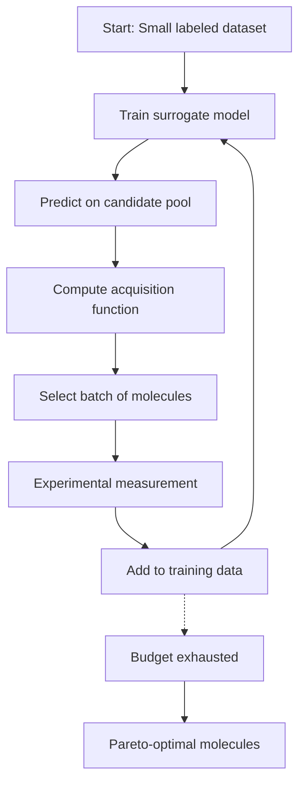

# AutoML and Active Learning for Chemistry

## Overview

Automated Machine Learning (AutoML) and active learning are transforming how chemists conduct high-throughput discovery. Rather than relying on static datasets and hand-tuned models, these approaches create adaptive systems that iteratively improve by selecting the most informative experiments. The result is dramatically faster discovery — self-driving labs that can explore chemical space orders of magnitude more efficiently than traditional methods.

This lesson covers the core AutoML techniques used in chemistry: Bayesian optimization for molecular property optimization, multi-objective optimization for balancing competing goals (efficiency vs. toxicity vs. synthesizability), and active learning loops that cycle between model prediction and experimental validation. We also examine how these techniques power modern autonomous discovery platforms.

## Key Concepts

### Bayesian Optimization

Bayesian optimization is the workhorse of molecular property optimization. Given an expensive-to-evaluate objective function (e.g., drug binding affinity requiring experimental measurement), Bayesian optimization builds a probabilistic surrogate model — typically a Gaussian Process (GP) or Bayesian neural network — and uses it to propose new candidates that maximize expected improvement.

The key quantity is the **acquisition function** — a heuristic that balances exploitation (sampling near known good candidates) with exploration (sampling in high-uncertainty regions). Common acquisition functions include:

- **Expected Improvement (EI)**: $EI(\mathbf{x}) = \mathbb{E}[\max(0, f(\mathbf{x}) - f^*)]$
- **Upper Confidence Bound (UCB)**: $UCB(\mathbf{x}) = \mu(\mathbf{x}) + \kappa \sigma(\mathbf{x})$
- **Probability of Improvement (PI)**: $PI(\mathbf{x}) = P(f(\mathbf{x}) > f^* + \kappa)$

For molecular optimization, the search space is discrete and combinatorial. SMILES-based Bayesian optimization uses a variational autoencoder (VAE) or character-level RNN to embed molecules in a continuous latent space, enabling gradient-based optimization in the latent domain. The process:

1. Train a VAE on a molecular dataset
2. Encode a small set of labeled molecules into latent space
3. Fit a GP or random forest on the latent embeddings
4. Optimize the acquisition function in latent space
5. Decode proposed molecules, evaluate their properties
6. Add results to the training set, repeat

The **Chemistry MNIST** and **MoleculeNet** benchmarks show Bayesian optimization typically finds molecules with 20-40% better target properties than random screening, within the same budget of 100-1000 evaluations.

### Multi-Objective Optimization

Real chemistry problems involve trade-offs. A drug candidate must balance potency with solubility, metabolic stability, and synthesizability — goals that can conflict. Multi-objective Bayesian optimization addresses this through **Pareto optimality**.

A molecule is Pareto-optimal if no other molecule is better in all objectives simultaneously. Multi-objective optimization algorithms explicitly model multiple objectives and return a Pareto front — a set of molecules representing the best possible trade-offs. Common approaches:

- **Scalarization**: Combine multiple objectives into a single weighted sum $f(\mathbf{x}) = \sum_i w_i f_i(\mathbf{x})$, then optimize. Requires choosing weights a priori.
- **ParEGO** (Pareto Efficient Optimization): Uses expected hypervolume improvement as the acquisition function, generalizing EI to multiple objectives.
- **qEHVI** (Quasi-static Expected Hypervolume Improvement): Handles batch (parallel) evaluations, critical for high-throughput settings.

### Active Learning Loops

Active learning is a special case of Bayesian optimization where the model iteratively selects which experiments to perform. The standard loop for molecular discovery:

```python
# Pseudocode for active learning loop
def active_learning_cycle(molecules, measured_properties, model):
    # Train model on current data
    model.fit(molecules, measured_properties)

    # Predict on candidate pool with uncertainty
    mean_pred, uncertainty = model.predict_with_uncertainty(candidate_pool)

    # Select batch of molecules to measure (batch Bayesian optimization)
    selected = select_batch(mean_pred, uncertainty, batch_size=10)

    # Experimental measurement (robot or computation)
    new_properties = measure(selected)

    # Expand training data
    molecules.extend(selected)
    measured_properties.extend(new_properties)

    return model, molecules, measured_properties

# Run until budget exhausted
model = initialize_model()
for iteration in range(max_iterations):
    model, molecules, measured_properties = active_learning_cycle(
        molecules, measured_properties, model
    )
```

Key considerations: **batch size** (larger batches improve throughput but reduce per-batch information gain), **candidate pool diversity** (ensure the pool covers chemical space adequately), and **model uncertainty calibration** (uncertainty estimates must be reliable for the acquisition function to be effective).

### Self-Driving Labs

Self-driving labs combine active learning, automated experimentation, and AI-driven experiment design into a closed-loop system. Pioneered by groups like Entangled Photonics, the MIT Self-Driving Lab, and RELIANCE, these platforms integrate:

- **Chemical robotic platforms**: Automated synthesizers, liquid handlers, and measurement systems
- **AI model layer**: Bayesian optimization, generative models, property predictors
- **Feedback loop**: Experimental results immediately update the model

The cycle: AI proposes experiments → robots execute synthesis and measurement → data flows back to AI → AI refines predictions → repeat. This loop has demonstrated 10-100x acceleration over traditional Edisonian (trial-and-error) discovery in domains including OLED materials, organic batteries, and catalysts.

### Automated Feature Engineering

AutoML systems also automate feature engineering. Traditional cheminformatics requires hand-crafted molecular descriptors (Morgan fingerprints, RDKit descriptors, WHIM indices). AutoML approaches learn features directly:

- **DeepChem** and **molgrad**: Learn task-specific molecular representations end-to-end
- **RDKit2Img**: Convert molecules to images, apply CNNs — learned features outperform hand-crafted fingerprints in some tasks
- **Transformer-based**: Molecular SMILES transformers (MolBERT, ChemBERTa) learn contextual embeddings from large unlabeled molecular datasets via masked language modeling

The **AutoML for molecules** challenge (e.g., SAMPA, OGB-LSC) shows that learned representations consistently outperform fixed fingerprints when sufficient data is available.

## Mathematical Formalism

### Gaussian Process Surrogate Model

A Gaussian Process provides a nonparametric probabilistic model for Bayesian optimization. A GP is specified by a mean function $m(\mathbf{x})$ and covariance function $k(\mathbf{x}, \mathbf{x}')$:

$$f(\mathbf{x}) \sim \mathcal{GP}(m(\mathbf{x}), k(\mathbf{x}, \mathbf{x}'))$$

For molecular optimization, we typically use an ARD (Automatic Relevance Determination) RBF kernel:

$$k(\mathbf{x}, \mathbf{x}') = \sigma_f^2 \exp\left(-\frac{1}{2} \sum_{d=1}^D \frac{(x_d - x'_d)^2}{\ell_d^2}\right)$$

The posterior predictive distribution at a new point $\mathbf{x}^*$ is Gaussian with mean and variance that can be computed in closed form from $n$ observed data points — $O(n^3)$ for covariance matrix inversion, limiting GPs to around $n < 10,000$.

### Expected Hypervolume Improvement (EHVI)

For multi-objective optimization with $M$ objectives, hypervolume improvement generalizes EI. Given a reference point $\mathbf{r}$ (worse than any Pareto-optimal solution) and current Pareto front $P$, the hypervolume $H(P)$ is the volume of the space dominated by $P$ but not dominated by $\mathbf{r}$. EHVI for a candidate $\mathbf{x}$ is:

$$EHVI(\mathbf{x}) = H(P \cup \{\mathbf{x}\}) - H(P)$$

Computing exact EHVI for $M > 2$ objectives is intractable; quasi-Monte Carlo approximations are used in practice.

## Code Examples

```python
# Bayesian optimization for molecular properties using RDKit and BoT
import numpy as np
from rdkit import Chem
from rdkit.Chem import AllChem
from sklearn.gaussian_process import GaussianProcessRegressor
from sklearn.gaussian_process.kernels import RBF, WhiteKernel
from skopt import gp_minimize
from skopt.space import Real, Categorical

# Define molecular property objective function (placeholder)
# In practice, this would call a quantum chemistry code or experiments
def property_objective(smiles):
    mol = Chem.MolFromSmiles(smiles)
    if mol is None:
        return 0.0
    # Example: penalize MW > 500 and too many rotatable bonds
    mw = Descriptors.MolWt(mol)
    num_rotatable = Descriptors.NumRotatableBonds(mol)
    return -mw / 1000 - num_rotatable  # minimize this

# Bayesian optimization using scikit-optimize
# Requires a search space definition and objective

# Note: In practice, you'd use a VAE latent space for SMILES optimization
# to enable gradient-based optimization. Libraries like
# stoned_mol/chrismaltais/moldqn or VAE-based approaches handle this.
```

## Diagrams



**Active Learning Loop for Molecular Discovery**

## Exercises/Projects

1. **Implement Bayesian optimization on MoleculeNet**: Take a dataset from MoleculeNet (e.g., ESOL solubility), implement GP-based Bayesian optimization with SMILES input, and compare the molecules found after 50 evaluations vs. random search.

2. **Multi-objective optimization for drug-like molecules**: Implement ParEGO for optimizing two competing properties (e.g., LogP and TPSA) simultaneously and plot the resulting Pareto front.

3. **Self-driving lab simulation**: Simulate a self-driving lab loop using a pre-trained model as the "ground truth" — observe how active learning efficiency compares to random sampling as the budget varies from 10 to 1000 experiments.

4. **Build a molecular VAE**: Implement a character-level VAE for SMILES (or use an existing implementation like in DeepChem) and demonstrate that latent space interpolation produces chemically meaningful molecules.

## Further Reading

- **Gómez-Bombarelli et al. (2018)** — Automatic chemical design using data-driven generative models (VAE for molecular generation). arXiv:1809.05532
- **Janner et al. (2022)** — Efficient multi-objective molecular optimization with principled dropout. arXiv:2203.10486
- **Graff et al. (2021)** — The Harvard MLSM pipeline for autonomous chemical discovery. arXiv:2109.15378
- **Stokes et al. (2020)** — A self-driving lab advances a known performance record for a polymerization catalyst. *Science*, 370(6512):101-108