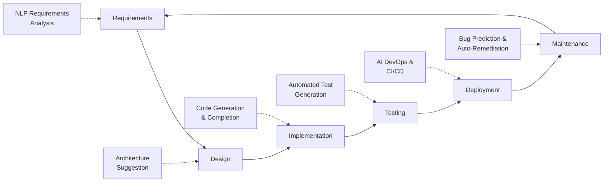
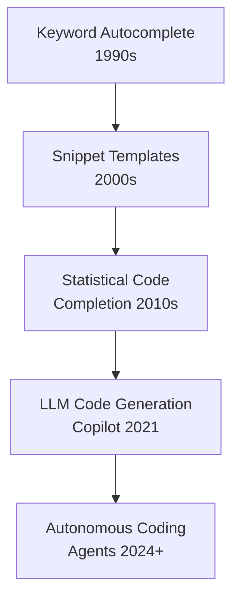

## Introduction to AI for Computer Science

## Overview

Artificial intelligence is reshaping the practice of computer science itself. For decades, software development relied on human intuition, experience, and manual effort at every stage — from writing the first line of code to diagnosing a production outage at 3 AM. Today, AI systems can generate code from natural-language descriptions, detect bugs before they reach production, optimize algorithms beyond human capability, and even reason about the correctness of software using formal methods.

The story begins with simple autocomplete. Early IDEs offered keyword completion and template snippets — useful, but shallow. The leap came when statistical language models, trained on billions of lines of open-source code, learned the implicit patterns and conventions that programmers follow. GitHub Copilot, released in 2021, demonstrated that a large language model (LLM) could suggest entire functions, not just variable names. Within two years, AI-assisted programming moved from novelty to standard practice.

But code generation is only one dimension. AI is now applied across the entire software development lifecycle (SDLC). Static analysis tools powered by machine learning can flag potential security vulnerabilities with far fewer false positives than rule-based scanners. AI-driven test generators can produce unit tests that achieve high coverage without manual effort. Code review bots can catch style violations, logic errors, and even suggest architectural improvements. In the realm of DevOps, AI monitors production systems, predicts failures, and can even auto-remediate certain classes of incidents.

At the research frontier, AI is making contributions that were once thought to require deep human creativity. DeepMind's AlphaCode demonstrated competitive programming ability by generating solutions that ranked in the top 54% of human contestants on Codeforces. More recently, AI systems have discovered novel sorting algorithms (AlphaDev), optimized matrix multiplication beyond known human methods, and assisted in formal theorem proving for software verification.

The implications extend beyond productivity. AI is changing who can build software. Natural-language interfaces to code generation lower the barrier to entry, enabling domain experts — biologists, financial analysts, educators — to create functional software without years of programming training. This democratization raises questions about code quality, security, and the evolving role of professional software engineers.

This track surveys AI's applications across computer science: from code generation and bug detection to formal verification, autonomous coding agents, and the frontiers of AI-driven programming language design. Each lesson combines conceptual explanation with working code examples, giving you both the theoretical grounding and practical skills to leverage AI in your own software engineering practice.

## Key Concepts

- **AI-Assisted Programming**: Using AI models to help write, complete, and suggest code. Tools like GitHub Copilot, Codeium, and Claude use LLMs trained on large code corpora.
- **Software Development Lifecycle (SDLC)**: The stages software passes through — requirements, design, implementation, testing, deployment, and maintenance. AI now touches every stage.
- **Code Generation Models**: Neural networks (typically Transformers) trained on source code to predict the next token, complete functions, or translate natural language to code.
- **Static Analysis**: Examining code without executing it to find bugs, vulnerabilities, or style issues. AI-enhanced static analysis reduces false positives.
- **Automated Testing**: AI-generated unit tests, property-based tests, and fuzz tests that explore code behavior systematically.
- **Formal Verification**: Mathematically proving that software meets its specification. AI assists by suggesting proof strategies and lemmas.
- **Autonomous Coding Agents**: Systems like Devin and Claude Code that can independently plan, write, test, and debug code with minimal human intervention.
- **Democratization of Software**: AI tools enabling non-programmers to build functional software through natural-language interaction.

## Code Examples

A simple example of using an LLM API to generate code from a natural-language prompt:

```python
from anthropic import Anthropic

client = Anthropic()

def generate_code(task_description: str) -> str:
    """Use an LLM to generate Python code for a given task."""
    message = client.messages.create(
        model="claude-sonnet-4-20250514",
        max_tokens=1024,
        messages=[
            {
                "role": "user",
                "content": f"Write a Python function that: {task_description}\n"
                           f"Return only the code, no explanations."
            }
        ]
    )
    return message.content[0].text

# Example usage
code = generate_code("sorts a list of integers using merge sort")
print(code)
```

- **Lines 1-2**: Import the Anthropic SDK and create a client.
- **Lines 4-15**: The `generate_code` function sends a natural-language task description to an LLM and returns the generated code.
- **Lines 17-19**: We call the function with a concrete task and print the result.

## Diagrams

**AI across the Software Development Lifecycle**



**Evolution of AI in Programming**



## Exercises

1. **Map the SDLC**: For each stage of the software development lifecycle (requirements, design, implementation, testing, deployment, maintenance), identify one specific AI tool or technique that applies. Write a brief explanation of how it helps.

2. **Try code generation**: Using any available AI coding assistant (Copilot, Claude, ChatGPT), ask it to generate a function that validates email addresses using regex. Evaluate the result: is it correct? Does it handle edge cases?

3. **Historical comparison**: Compare the capabilities of IDE autocomplete from 2010 with modern LLM-based code completion. What changed technically to enable the leap?

4. **Ethical reflection**: Write a short essay (300 words) on how AI-generated code affects software engineering as a profession. Consider both the benefits (productivity, accessibility) and risks (deskilling, security, intellectual property).

## Further Reading

- [GitHub Copilot Research](https://github.blog/2022-09-07-research-quantifying-github-copilots-impact-on-developer-productivity-and-happiness/)
- [AlphaCode: Competition-Level Code Generation (Li et al., 2022)](https://arxiv.org/abs/2203.07814)
- [Large Language Models for Software Engineering: A Survey (Fan et al., 2023)](https://arxiv.org/abs/2308.10620)
- [The Impact of AI on Developer Productivity: Evidence from GitHub Copilot (Peng et al., 2023)](https://arxiv.org/abs/2302.06590)
