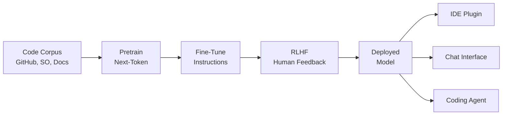
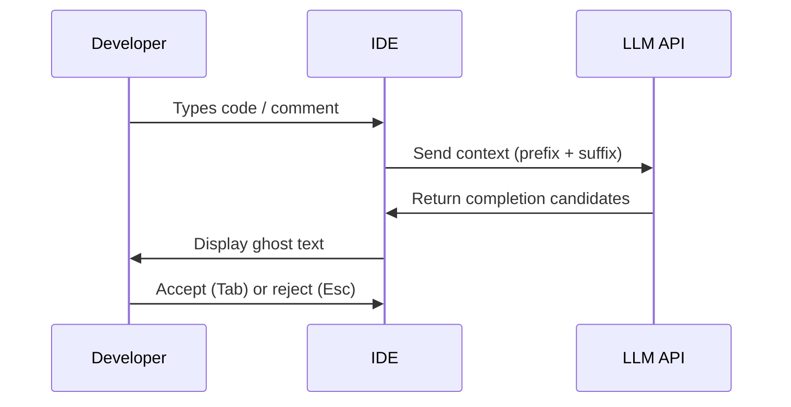

# AI-Assisted Programming and Code Generation

## Overview

AI-assisted programming has moved from research curiosity to everyday tool. At its core, the idea is simple: train a neural network on vast quantities of source code, and it learns to predict what comes next — completing lines, suggesting functions, and even generating entire programs from natural-language descriptions. The practical impact has been enormous. Studies show that developers using GitHub Copilot complete tasks 55% faster on average, and adoption has reached millions of users within two years of launch.

The foundation is the Transformer architecture, the same model family behind GPT and Claude. When applied to code, these models learn syntax, semantics, common patterns, API usage, and even stylistic conventions. The training data typically includes public repositories from GitHub, Stack Overflow answers, documentation, and sometimes curated datasets of high-quality code. The model learns to predict the next token given the preceding context — and because code is highly structured and patterned, this next-token prediction turns out to be remarkably effective.

GitHub Copilot, powered by OpenAI's Codex model, was the first widely adopted AI coding assistant. It integrates directly into the IDE and provides inline suggestions as the developer types. Competitors quickly followed: Codeium offers a free alternative, Amazon CodeWhisperer targets AWS developers, and Anthropic's Claude provides code generation through conversation and agentic workflows.

How are these models trained? The process has three stages. First, **pretraining** on a large corpus of code and natural language teaches the model general programming knowledge. Second, **fine-tuning** on curated datasets of instruction-following examples (e.g., "Write a function that..." → working code) aligns the model with user intent. Third, **reinforcement learning from human feedback (RLHF)** further refines the model by training it to prefer outputs that human evaluators rate as correct, helpful, and safe.

Despite their power, code generation models have important limitations. They can produce plausible-looking code that is subtly wrong — a function that handles 95% of cases but fails on edge cases. They may generate insecure code, such as SQL queries vulnerable to injection or cryptographic code using deprecated algorithms. They sometimes "hallucinate" APIs that don't exist. And they struggle with complex, multi-file architectural decisions that require understanding the broader system context.

The key to effective use is treating AI as a pair programmer, not an oracle. Review every suggestion. Write clear comments and docstrings that guide the model. Use tests to verify generated code. Understand what the model is good at (boilerplate, common patterns, API usage) and where it needs human oversight (security, architecture, domain-specific logic).

## Key Concepts

- **Next-Token Prediction**: The core training objective — given a sequence of tokens, predict the next one. Applied to code, this learns syntax, patterns, and semantics.
- **Fill-in-the-Middle (FIM)**: A training technique where the model learns to complete code given both prefix and suffix context, enabling better inline suggestions.
- **Codex / Code Llama / StarCoder**: Major code-specialized LLMs. Codex powers Copilot; Code Llama is Meta's open model; StarCoder is a community-built alternative.
- **Instruction Tuning**: Fine-tuning models to follow natural-language instructions like "Write a function that..." rather than just completing code.
- **RLHF**: Reinforcement Learning from Human Feedback — training models to prefer outputs humans rate highly.
- **Hallucinated APIs**: When the model generates calls to functions or libraries that don't exist, a common failure mode.
- **Context Window**: The maximum amount of code the model can "see" at once. Larger windows enable better understanding of project structure.

## Code Examples

Using fill-in-the-middle to complete a function body given its signature and a test:

```python
# The model sees the signature and the test, and fills in the body.

def fibonacci(n: int) -> int:
    """Return the n-th Fibonacci number (0-indexed)."""
    # <FILL_IN_THE_MIDDLE>
    # The model generates:
    if n <= 1:
        return n
    a, b = 0, 1
    for _ in range(2, n + 1):
        a, b = b, a + b
    return b

# Test that guides the model
assert fibonacci(0) == 0
assert fibonacci(1) == 1
assert fibonacci(10) == 55
```

A more realistic example — generating a REST endpoint from a docstring:

```python
from flask import Flask, jsonify, request

app = Flask(__name__)

# AI-generated from the docstring below:
@app.route("/api/users/<int:user_id>", methods=["GET"])
def get_user(user_id):
    """
    Retrieve a user by ID from the database.
    Returns 404 if the user is not found.
    """
    user = db.session.get(User, user_id)
    if user is None:
        return jsonify({"error": "User not found"}), 404
    return jsonify({
        "id": user.id,
        "name": user.name,
        "email": user.email
    })
```

- The AI model uses the docstring, route decorator, and function name to infer the complete implementation.
- Note: a human should verify the database query pattern and error handling match the project's conventions.

## Math/Formulas (KaTeX)

Code generation is fundamentally a conditional probability problem. Given a sequence of tokens $x_1, x_2, \ldots, x_{t-1}$, the model estimates:

$$P(x_t \mid x_1, x_2, \ldots, x_{t-1}) = \text{softmax}(W \cdot h_t + b)$$

where $h_t$ is the hidden state from the Transformer at position $t$. The training loss is the negative log-likelihood:

$$\mathcal{L} = -\sum_{t=1}^{T} \log P(x_t \mid x_1, \ldots, x_{t-1})$$

For fill-in-the-middle, the objective changes. Given prefix $x_{1:a}$ and suffix $x_{b:T}$, the model predicts the middle $x_{a+1:b-1}$:

$$P(x_{a+1:b-1} \mid x_{1:a}, x_{b:T})$$

## Diagrams

**Code generation pipeline**



**How inline code completion works**



## Exercises

1. **Benchmark code generation**: Pick 5 simple programming tasks (e.g., reverse a string, find duplicates, implement binary search). Ask an AI assistant to solve each one. Score each solution on correctness, efficiency, and readability.

2. **Adversarial prompting**: Try to get an AI coding assistant to produce insecure code (e.g., SQL injection, hardcoded credentials). Document what guardrails it has and where they fail.

3. **FIM experiment**: Write the signature and tests for a function, leaving the body empty. Compare the AI-generated implementation against your own. Which is more readable? More efficient?

4. **Context window impact**: Generate a function that depends on types and utilities defined earlier in the same file. Then move those definitions to a separate file. Does the AI's output quality change?

## Further Reading

- [Evaluating Large Language Models Trained on Code (Chen et al., 2021)](https://arxiv.org/abs/2107.03374)
- [StarCoder: A State-of-the-Art LLM for Code (Li et al., 2023)](https://arxiv.org/abs/2305.06161)
- [Code Llama: Open Foundation Models for Code (Rozière et al., 2023)](https://arxiv.org/abs/2308.12950)
- [GitHub Copilot Documentation](https://docs.github.com/en/copilot)
