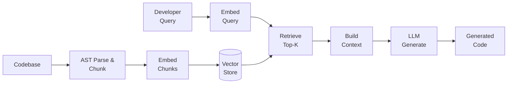
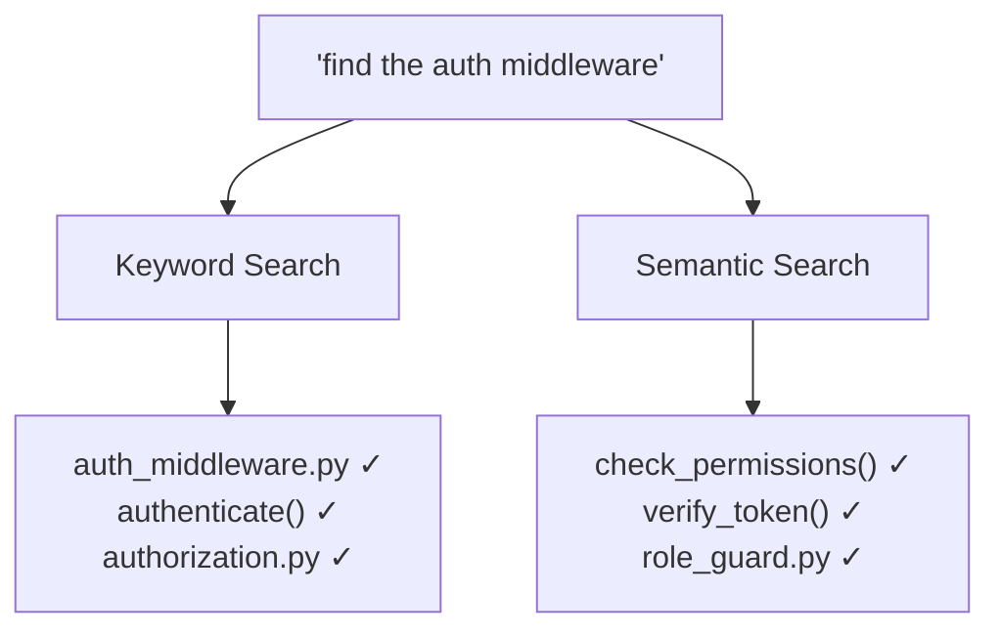

# Code Search and Retrieval-Augmented Code Generation

## Overview

Large language models are powerful code generators, but they have a fundamental limitation: their knowledge is frozen at training time. They cannot know about your proprietary codebase, your team's internal libraries, or the API you released last week. Retrieval-Augmented Generation (RAG) addresses this by giving the model access to external code at inference time — fetching relevant snippets from a codebase and injecting them into the prompt before the model generates its response.

The idea mirrors how human developers work. When faced with an unfamiliar codebase, a developer doesn't try to memorize everything — they search for relevant files, read the most pertinent functions, and then write code that fits the existing patterns. RAG automates this process: a query (the developer's current context or question) is used to retrieve relevant code from an indexed repository, and the retrieved code becomes part of the LLM's context.

Code search is the retrieval component of this pipeline. Traditional code search relies on keyword matching — tools like `grep` and GitHub's built-in search find files containing specific strings. But keyword search fails when the developer describes what they want conceptually ("the function that validates user permissions") rather than lexically. Semantic code search uses embeddings — dense vector representations of code — to find functionally similar code regardless of naming conventions.

The embedding process works by passing code snippets through a neural encoder that maps them to high-dimensional vectors. Snippets that are semantically similar end up close together in this vector space. At query time, the developer's question is also encoded, and the nearest neighbors in embedding space are retrieved. Tools like Sourcegraph Cody, Cursor, and Continue use this approach to power context-aware code generation.

CodeQL takes a different approach. Developed by GitHub, CodeQL treats code as data — it parses source code into a relational database and allows users to write queries in a SQL-like language to find patterns, vulnerabilities, and code smells. While not embedding-based, CodeQL is a powerful complement to semantic search for structured code analysis.

The quality of RAG depends critically on chunking (how code is split into retrievable units), embedding quality, and the retrieval strategy. Naive chunking by line count breaks functions in half. Better approaches chunk by AST (abstract syntax tree) nodes — functions, classes, and methods become natural units. Hybrid retrieval combines keyword search (for exact matches like function names) with semantic search (for conceptual matches) to get the best of both worlds.

## Key Concepts

- **Retrieval-Augmented Generation (RAG)**: Enhancing an LLM's generation by retrieving relevant documents (here, code) and including them in the prompt context.
- **Semantic Code Search**: Finding code by meaning rather than keywords, using neural embeddings to measure similarity.
- **Code Embeddings**: Dense vector representations of code snippets that capture semantic meaning. Similar code maps to nearby vectors.
- **AST Chunking**: Splitting code into retrievable units based on the Abstract Syntax Tree — functions, classes, and methods as natural boundaries.
- **Hybrid Retrieval**: Combining keyword-based (BM25, TF-IDF) and embedding-based (dense retrieval) search for better recall and precision.
- **CodeQL**: GitHub's query language that treats code as a database, enabling structured queries for patterns and vulnerabilities.
- **Sourcegraph**: A code intelligence platform providing cross-repository search, navigation, and AI-powered code understanding.

## Code Examples

Building a simple code RAG pipeline with embeddings:

```python
import os
import ast
import numpy as np
from anthropic import Anthropic

client = Anthropic()

def extract_functions(filepath: str) -> list[dict]:
    """Parse a Python file and extract function definitions."""
    with open(filepath) as f:
        tree = ast.parse(f.read())
    functions = []
    for node in ast.walk(tree):
        if isinstance(node, ast.FunctionDef):
            source = ast.get_source_segment(open(filepath).read(), node)
            functions.append({
                "name": node.name,
                "source": source,
                "file": filepath,
                "line": node.lineno,
            })
    return functions

def build_index(directory: str) -> list[dict]:
    """Index all Python functions in a directory."""
    index = []
    for root, _, files in os.walk(directory):
        for f in files:
            if f.endswith(".py"):
                path = os.path.join(root, f)
                index.extend(extract_functions(path))
    return index

def retrieve_relevant(query: str, index: list[dict], top_k: int = 3) -> list[dict]:
    """Simple keyword-based retrieval (production systems use embeddings)."""
    scored = []
    for item in index:
        # Count query term matches in function source
        score = sum(1 for word in query.lower().split()
                    if word in item["source"].lower())
        scored.append((score, item))
    scored.sort(key=lambda x: x[0], reverse=True)
    return [item for _, item in scored[:top_k]]

def rag_generate(query: str, index: list[dict]) -> str:
    """Retrieve relevant code and generate with context."""
    relevant = retrieve_relevant(query, index)
    context = "\n\n".join(
        f"# From {r['file']}:{r['line']}\n{r['source']}"
        for r in relevant
    )
    response = client.messages.create(
        model="claude-sonnet-4-20250514",
        max_tokens=1024,
        messages=[{
            "role": "user",
            "content": f"Given this existing codebase context:\n\n{context}\n\n"
                       f"Write code that: {query}"
        }]
    )
    return response.content[0].text
```

- **Lines 8-22**: Extract function definitions from Python files using the AST parser — each function becomes a retrievable chunk.
- **Lines 24-31**: Walk a directory tree and build an index of all functions.
- **Lines 33-41**: Simple keyword retrieval (production systems would use vector embeddings for semantic matching).
- **Lines 43-57**: The RAG pipeline: retrieve relevant code, inject it as context, and generate.

## Diagrams

**RAG pipeline for code**



**Keyword vs. semantic search**



## Exercises

1. **Build a mini RAG**: Using the code example above, index a small Python project (your own or an open-source one). Ask questions about the codebase and evaluate whether the retrieved context improves the LLM's answers.

2. **Chunking strategies**: Take a 500-line Python file and chunk it three ways: (a) by fixed 50-line windows, (b) by function/class, (c) by function with docstrings included. Compare retrieval quality for the same query across all three approaches.

3. **CodeQL exploration**: Install CodeQL and write a query to find all functions in a repository that accept user input but don't validate it. Document your query and results.

4. **Hybrid retrieval**: Implement a simple hybrid retriever that combines BM25 keyword scores with cosine similarity from embeddings. Evaluate whether the hybrid approach outperforms either method alone.

## Further Reading

- [Retrieval-Augmented Generation for Code (Parvez et al., 2021)](https://arxiv.org/abs/2108.11601)
- [CodeQL Documentation](https://codeql.github.com/docs/)
- [Sourcegraph Cody](https://sourcegraph.com/cody)
- [Dense Passage Retrieval (Karpukhin et al., 2020)](https://arxiv.org/abs/2004.04906)
