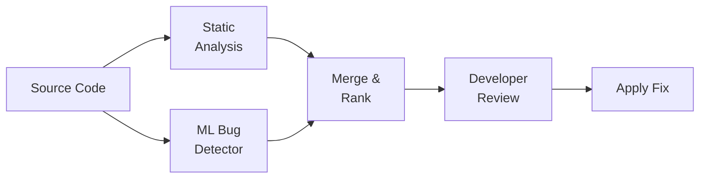
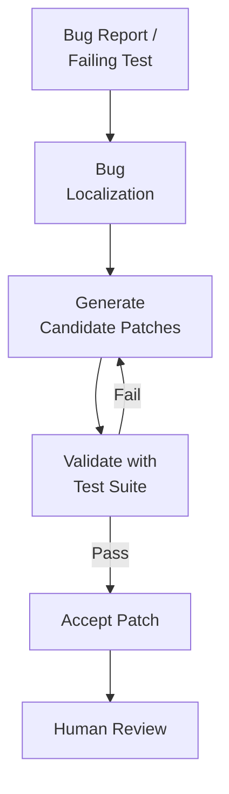

# Automated Bug Detection and Code Repair

## Overview

Bugs are an inevitable part of software development. The average developer introduces roughly 15-50 defects per 1,000 lines of code, and finding and fixing them consumes a significant portion of development time. AI is transforming this landscape by enabling systems that can detect bugs before they reach production and, increasingly, fix them automatically.

Traditional static analysis tools like ESLint, Pylint, and FindBugs use hand-crafted rules to identify code patterns associated with bugs. They work well for common issues — null pointer dereferences, resource leaks, type mismatches — but suffer from high false positive rates and cannot detect logic errors or subtle semantic bugs. AI-powered bug detection goes further by learning from millions of real bug-fix pairs in version control history, recognizing patterns that rule-based systems miss.

The key insight is that bugs create statistical anomalies in code. A neural network trained on correct code develops an internal model of "normal" code patterns. When it encounters code that deviates from these patterns — an unusual variable usage, a missing boundary check, an incorrect operator — it flags it as suspicious. This approach is analogous to anomaly detection in other domains.

DeepBugs, developed by researchers at ETH Zurich, pioneered this approach by learning name-based bug patterns. It detected bugs like swapped function arguments by learning that `setPosition(y, x)` is anomalous when the convention is `setPosition(x, y)`. Facebook's Infer uses abstract interpretation combined with machine learning to detect null pointer exceptions, memory leaks, and race conditions at scale across their entire codebase.

Automated Program Repair (APR) takes detection a step further by generating fixes. Early APR systems like GenProg used genetic programming to mutate code until tests passed. Modern systems use LLMs. Given a buggy function and a failing test, the model generates candidate patches. The test suite serves as an oracle — if the patched code passes all tests, the fix is likely correct. GitHub's Copilot Autofix applies this approach to security vulnerabilities, automatically generating patches for issues detected by CodeQL.

Self-healing systems represent the frontier. In production environments, AI monitors application behavior, detects anomalies (unusual error rates, latency spikes, memory patterns), diagnoses root causes, and applies fixes — all without human intervention. While fully autonomous repair remains limited to well-understood failure modes, the technology is advancing rapidly.

## Key Concepts

- **Static Analysis**: Analyzing code without executing it. Traditional tools use rules; AI-enhanced tools use learned patterns.
- **Anomaly-Based Bug Detection**: Training models on correct code and flagging deviations from learned patterns as potential bugs.
- **Bug Localization**: Identifying which lines or functions contain the bug, narrowing the search space for repair.
- **Automated Program Repair (APR)**: Automatically generating code patches that fix detected bugs.
- **Test-Based Validation**: Using the existing test suite to verify that a generated patch is correct — patches that pass all tests are accepted.
- **Self-Healing Systems**: Production systems that detect, diagnose, and fix issues autonomously without human intervention.
- **False Positive Rate**: The fraction of flagged issues that are not actual bugs. High false positive rates erode developer trust.

## Code Examples

A simple anomaly-based bug detector using token frequency analysis:

```python
import ast
from collections import Counter

def analyze_function_patterns(codebase_functions: list[str]) -> dict:
    """Learn common patterns from a codebase."""
    patterns = {
        "comparison_ops": Counter(),
        "return_types": Counter(),
        "arg_counts": Counter(),
    }
    for func_source in codebase_functions:
        tree = ast.parse(func_source)
        for node in ast.walk(tree):
            if isinstance(node, ast.Compare):
                for op in node.ops:
                    patterns["comparison_ops"][type(op).__name__] += 1
            if isinstance(node, ast.FunctionDef):
                patterns["arg_counts"][len(node.args.args)] += 1
    return patterns

def detect_anomalies(func_source: str, learned_patterns: dict) -> list[str]:
    """Flag code patterns that deviate from learned norms."""
    warnings = []
    tree = ast.parse(func_source)
    for node in ast.walk(tree):
        # Detect potential off-by-one: using < where <= is typical
        if isinstance(node, ast.Compare):
            for op in node.ops:
                op_name = type(op).__name__
                if op_name == "Lt" and learned_patterns["comparison_ops"].get("LtE", 0) > \
                        learned_patterns["comparison_ops"].get("Lt", 0) * 3:
                    warnings.append(
                        f"Line {node.lineno}: '<' used where '<=' is "
                        f"much more common — possible off-by-one?"
                    )
    return warnings

# Example: detecting a potential off-by-one error
buggy_code = """
def binary_search(arr, target):
    lo, hi = 0, len(arr) - 1
    while lo < hi:  # Bug: should be lo <= hi
        mid = (lo + hi) // 2
        if arr[mid] == target:
            return mid
        elif arr[mid] < target:
            lo = mid + 1
        else:
            hi = mid - 1
    return -1
"""
```

- **Lines 4-18**: Learn common patterns (comparison operators, argument counts) from a corpus of functions.
- **Lines 20-34**: Check a function against learned patterns and flag deviations — here, flagging `<` where `<=` is much more common.
- **Lines 37-48**: An example buggy binary search where `<` should be `<=` in the while condition.

## Diagrams

**AI bug detection pipeline**



**Automated program repair cycle**



## Exercises

1. **Bug classification**: Examine 10 recent bugs from an open-source project's issue tracker. Classify each as: (a) detectable by rule-based static analysis, (b) detectable by AI pattern analysis, (c) requires runtime testing, or (d) requires human reasoning.

2. **Build a simple detector**: Extend the anomaly detector above to also flag: (a) functions with more than 5 parameters, (b) deeply nested conditionals (depth > 3), (c) unused variables.

3. **APR experiment**: Take a function with a known bug. Write a failing test. Then use an LLM to generate 5 candidate patches. Evaluate which ones pass the test and whether any introduce new issues.

4. **False positive analysis**: Run a static analysis tool (pylint, eslint) on a project. Count the true bugs vs. false positives. How could AI reduce the false positive rate?

## Further Reading

- [DeepBugs: A Learning Approach to Name-Based Bug Detection (Pradel & Sen, 2018)](https://arxiv.org/abs/1805.11683)
- [Facebook Infer](https://fbinfer.com/)
- [Automated Program Repair: A Survey (Gazzola et al., 2019)](https://arxiv.org/abs/1801.10012)
- [GitHub Copilot Autofix](https://github.blog/2024-03-20-found-means-fixed-introducing-code-scanning-autofix-powered-by-github-copilot-and-codeql/)
