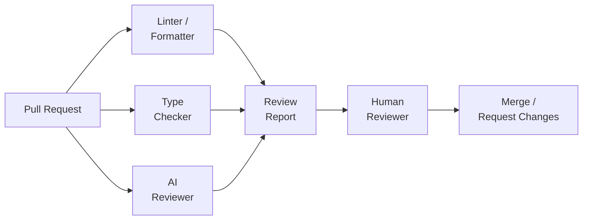
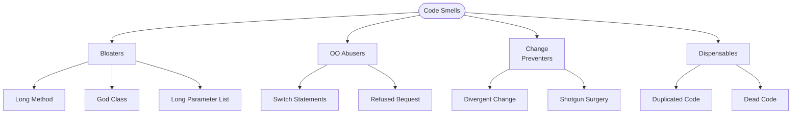

# AI for Code Review and Quality Analysis

## Overview

Code review is one of the most important practices in professional software development. Studies consistently show that code review catches 60-90% of defects before they reach production, improves code quality, and transfers knowledge across teams. Yet it is also time-consuming — reviewers spend 30-60 minutes per review on average, and review bottlenecks slow down the entire development pipeline. AI is transforming this process by automating routine review tasks and augmenting human reviewers with deeper analysis.

Traditional automated review tools check formatting (Prettier, Black), enforce linting rules (ESLint, Pylint), and verify type safety (mypy, TypeScript). These tools catch surface-level issues but cannot reason about logic, architecture, or maintainability. AI-powered code review adds a layer of semantic understanding. An LLM can read a pull request diff, understand the intent of the change, and provide feedback on correctness, clarity, naming, error handling, and potential edge cases — much like an experienced human reviewer.

Technical debt detection is another area where AI excels. Technical debt accumulates when teams take shortcuts — copy-pasted code, quick hacks, outdated patterns — that save time now but create maintenance burden later. AI can identify these patterns at scale. Machine learning models trained on code evolution data can predict which components are likely to become maintenance hotspots, enabling teams to prioritize refactoring where it matters most.

Code smells are surface-level indicators of deeper design problems. Classic examples include "God classes" (classes that do too many things), "long methods" (functions that should be decomposed), "feature envy" (methods that access another class's data more than their own), and "shotgun surgery" (a single change requiring modifications across many files). While rule-based tools can detect some code smells using metrics like cyclomatic complexity and coupling, AI models can recognize subtler patterns by learning from codebases where these smells were identified and refactored.

Modern AI code review systems work at multiple levels. At the line level, they flag potential bugs and suggest improvements. At the function level, they assess complexity, naming, and documentation. At the PR level, they summarize changes, identify risks, and check for consistency with project conventions. Some systems even learn a team's specific style and enforce it automatically, reducing the cognitive load on human reviewers.

## Key Concepts

- **Automated Code Review**: Using AI to provide feedback on pull requests — identifying bugs, suggesting improvements, and checking style.
- **Technical Debt**: The accumulated cost of shortcuts in code. AI can detect and quantify technical debt across a codebase.
- **Code Smells**: Surface-level indicators of design problems — long methods, large classes, duplicated code, complex conditionals.
- **Cyclomatic Complexity**: A measure of the number of linearly independent paths through a function. Higher values indicate harder-to-test code.
- **Coupling and Cohesion**: Coupling measures dependencies between modules (lower is better); cohesion measures how related a module's responsibilities are (higher is better).
- **Change Risk Analysis**: Predicting which files or modules are most likely to contain bugs based on historical change patterns.
- **PR Summarization**: AI-generated summaries of pull requests that help reviewers understand changes quickly.

## Code Examples

Calculating code quality metrics for a Python function:

```python
import ast
import math

def analyze_complexity(source: str) -> dict:
    """Analyze code quality metrics for a Python function."""
    tree = ast.parse(source)
    metrics = {
        "lines": len(source.strip().split("\n")),
        "functions": 0,
        "classes": 0,
        "max_depth": 0,
        "cyclomatic_complexity": 1,  # Start at 1 for the function itself
    }

    def walk_with_depth(node, depth=0):
        metrics["max_depth"] = max(metrics["max_depth"], depth)
        if isinstance(node, ast.FunctionDef):
            metrics["functions"] += 1
        elif isinstance(node, ast.ClassDef):
            metrics["classes"] += 1
        # Each branch adds to cyclomatic complexity
        elif isinstance(node, (ast.If, ast.While, ast.For)):
            metrics["cyclomatic_complexity"] += 1
        elif isinstance(node, ast.BoolOp):
            # 'and' / 'or' add paths
            metrics["cyclomatic_complexity"] += len(node.values) - 1
        elif isinstance(node, ast.ExceptHandler):
            metrics["cyclomatic_complexity"] += 1
        for child in ast.iter_child_nodes(node):
            walk_with_depth(child, depth + (1 if isinstance(node, (
                ast.If, ast.For, ast.While, ast.With, ast.Try
            )) else 0))

    walk_with_depth(tree)

    # Maintainability index (simplified Microsoft formula)
    loc = metrics["lines"]
    cc = metrics["cyclomatic_complexity"]
    hv = loc * math.log2(max(loc, 1))  # Simplified Halstead volume
    mi = max(0, (171 - 5.2 * math.log(hv) - 0.23 * cc - 16.2 * math.log(loc)) * 100 / 171)
    metrics["maintainability_index"] = round(mi, 1)

    return metrics

# Example
code = """
def process_order(order, user, inventory):
    if not order:
        raise ValueError("Empty order")
    if not user.is_active:
        raise PermissionError("Inactive user")
    total = 0
    for item in order.items:
        if item.id in inventory:
            if inventory[item.id] >= item.quantity:
                total += item.price * item.quantity
                inventory[item.id] -= item.quantity
            else:
                raise ValueError(f"Insufficient stock for {item.id}")
        else:
            raise ValueError(f"Item {item.id} not found")
    if user.discount:
        total *= (1 - user.discount)
    return total
"""

result = analyze_complexity(code)
# Output: {lines: 18, functions: 1, cyclomatic_complexity: 7,
#          max_depth: 3, maintainability_index: 52.3}
```

- **Lines 6-13**: Initialize metrics including cyclomatic complexity (starting at 1 for the function entry point).
- **Lines 15-33**: Walk the AST, counting branches (if/for/while/except) that increase cyclomatic complexity and tracking nesting depth.
- **Lines 36-39**: Calculate a simplified Maintainability Index — scores below 65 indicate hard-to-maintain code.

## Math/Formulas (KaTeX)

The **Maintainability Index** (MI) combines several metrics:

$$MI = \max\left(0,\; \frac{171 - 5.2 \ln(HV) - 0.23 \cdot CC - 16.2 \ln(LOC)}{171} \times 100\right)$$

where $HV$ is the Halstead Volume, $CC$ is cyclomatic complexity, and $LOC$ is lines of code.

**Cyclomatic complexity** $V(G)$ for a control flow graph $G$ with $E$ edges and $N$ nodes:

$$V(G) = E - N + 2$$

## Diagrams

**AI-assisted code review pipeline**



**Code smell taxonomy**



## Exercises

1. **Metric analysis**: Run the complexity analyzer on 5 functions from a project. Identify the function with the highest cyclomatic complexity and suggest a refactoring to reduce it.

2. **AI reviewer comparison**: Submit the same PR to both a human reviewer and an AI reviewer (Claude, Copilot). Compare the feedback: what did each catch that the other missed?

3. **Code smell hunt**: Analyze a medium-sized open-source project for code smells. Find at least one example each of: God class, long method, duplicated code, and dead code.

4. **Technical debt scoring**: Design a scoring system that combines cyclomatic complexity, code duplication, and test coverage into a single "debt score" per module. Apply it to a real project.

## Further Reading

- [Modern Code Review: A Case Study at Google (Sadowski et al., 2018)](https://research.google/pubs/pub47025/)
- [Code Smells: A Comprehensive Survey (Sharma & Spinellis, 2018)](https://doi.org/10.1016/j.jss.2018.09.022)
- [Managing Technical Debt (Kruchten et al., 2019)](https://www.sei.cmu.edu/publications/technical-reports/)
- [AI-Assisted Code Review Research](https://arxiv.org/abs/2404.18496)
