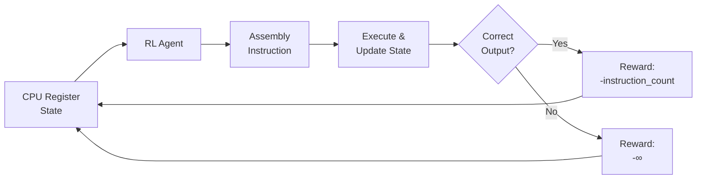
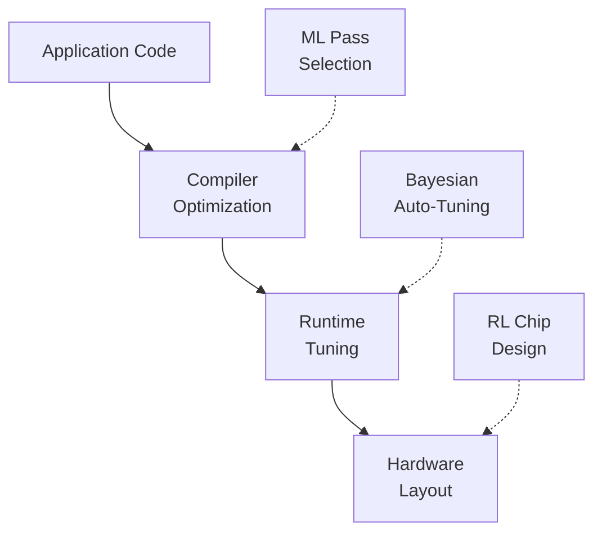

# Algorithm Optimization and AI for HPC

## Overview

For decades, algorithm design has been a deeply human endeavor — requiring mathematical insight, creative intuition, and painstaking analysis. AI is changing this by discovering algorithms that surpass human-designed ones in efficiency. The most striking example is DeepMind's AlphaDev, which used reinforcement learning to discover sorting algorithms that are up to 70% faster than the ones in the C++ standard library. These are algorithms that millions of programmers use billions of times per day, and AI found improvements that human experts missed for decades.

AlphaDev works by treating algorithm discovery as a game. The "board" is the current state of CPU registers and memory. The "moves" are assembly instructions (mov, cmp, jmp, etc.). The objective is to produce a correct sorting algorithm in the fewest instructions possible. A reinforcement learning agent explores the space of possible instruction sequences, guided by rewards for correctness (the output must be sorted) and efficiency (fewer instructions = higher reward). The key insight is that at the assembly level, there exist instruction sequences that no human would write but that produce correct, faster results.

Neural Architecture Search (NAS) applies similar ideas to the design of neural networks themselves. Instead of manually designing layer configurations, NAS uses search algorithms — reinforcement learning, evolutionary strategies, or gradient-based methods — to find optimal architectures for a given task and compute budget. Google's NASNet and EfficientNet families were discovered this way, outperforming hand-designed architectures on ImageNet.

In High-Performance Computing (HPC), AI optimizes at multiple levels. At the hardware level, AI-guided chip design (like Google's work on TPU layout) uses reinforcement learning to place components on silicon more efficiently than human engineers. At the compiler level, ML-based compiler optimization selects the best optimization passes, loop tiling strategies, and vectorization decisions for specific hardware. At the application level, AI tunes parameters like MPI communication patterns, cache blocking factors, and GPU kernel configurations.

Auto-tuning frameworks like OpenTuner and Ytopt use machine learning to navigate the vast configuration spaces of HPC applications. A typical scientific simulation might have dozens of tunable parameters — block sizes, thread counts, algorithm variants — with billions of possible combinations. Exhaustive search is impossible, but Bayesian optimization can find near-optimal configurations in a fraction of the time.

The broader implication is that AI is becoming a tool for meta-optimization — optimizing the tools and algorithms that we use to build everything else. When AI can find better sorting algorithms, better neural network architectures, and better hardware layouts, the improvements cascade through the entire technology stack.

## Key Concepts

- **Algorithm Discovery via RL**: Using reinforcement learning to search the space of possible algorithms, treating instruction sequences as actions in a game.
- **AlphaDev**: DeepMind's system that discovered faster sorting algorithms by exploring assembly-level instruction sequences.
- **Neural Architecture Search (NAS)**: Automated search for optimal neural network architectures using RL, evolution, or gradient methods.
- **Compiler Optimization with ML**: Using machine learning to select the best compiler optimization passes for specific code and hardware.
- **Auto-Tuning**: Automatically finding optimal configuration parameters for HPC applications using Bayesian optimization or other search methods.
- **Superoptimization**: Finding the provably shortest or fastest instruction sequence that implements a given function.
- **Performance Modeling**: Building ML models that predict execution time or throughput for different configurations without running the actual code.

## Code Examples

Using Bayesian optimization to tune algorithm parameters:

```python
import numpy as np
from scipy.optimize import minimize

def matrix_multiply_tiled(A, B, block_size):
    """Tiled matrix multiplication with configurable block size."""
    n = A.shape[0]
    C = np.zeros((n, n))
    for i in range(0, n, block_size):
        for j in range(0, n, block_size):
            for k in range(0, n, block_size):
                i_end = min(i + block_size, n)
                j_end = min(j + block_size, n)
                k_end = min(k + block_size, n)
                C[i:i_end, j:j_end] += A[i:i_end, k:k_end] @ B[k:k_end, j:j_end]
    return C

def benchmark(block_size: int, n: int = 512, trials: int = 3) -> float:
    """Measure average execution time for a given block size."""
    import time
    A = np.random.randn(n, n)
    B = np.random.randn(n, n)
    times = []
    for _ in range(trials):
        start = time.perf_counter()
        matrix_multiply_tiled(A, B, block_size)
        times.append(time.perf_counter() - start)
    return np.mean(times)

# Search for optimal block size using grid search
# (production systems use Bayesian optimization)
block_sizes = [8, 16, 32, 64, 128, 256]
results = {bs: benchmark(bs) for bs in block_sizes}
optimal = min(results, key=results.get)
print(f"Optimal block size: {optimal}, time: {results[optimal]:.4f}s")
```

- **Lines 4-15**: Tiled matrix multiplication — the block size affects cache utilization and therefore performance.
- **Lines 17-26**: Benchmark function that measures execution time for a given block size.
- **Lines 30-33**: Simple grid search over block sizes. Production auto-tuners would use Bayesian optimization to explore larger parameter spaces efficiently.

## Math/Formulas (KaTeX)

The speedup from tiling depends on cache behavior. For an $n \times n$ matrix multiplication with block size $b$ and cache of size $M$:

$$\text{Cache misses} = O\left(\frac{n^3}{b\sqrt{M}}\right)$$

The optimal block size is approximately:

$$b^* \approx \sqrt{M / 3}$$

ensuring three $b \times b$ blocks fit in cache simultaneously.

In neural architecture search, the optimization problem is:

$$\alpha^* = \arg\min_{\alpha \in \mathcal{A}} \; \mathcal{L}_{\text{val}}(w^*(\alpha), \alpha)$$

where $\alpha$ defines the architecture, $w^*(\alpha)$ are the weights trained for that architecture, and $\mathcal{L}_{\text{val}}$ is the validation loss.

## Diagrams

**AlphaDev: Algorithm discovery as a game**



**HPC optimization layers**



## Exercises

1. **Auto-tuning experiment**: Modify the matrix multiplication benchmark to search over both block size and number of threads (using Python's multiprocessing). Find the optimal combination for your machine.

2. **Algorithm analysis**: Read the AlphaDev paper and explain how the discovered `swap-and-compare` network for sorting 3 elements differs from the textbook approach. Why is it faster?

3. **NAS simulation**: Implement a simple random search NAS that tries 20 different neural network configurations (varying layers, widths, activation functions) on MNIST and reports the best architecture found.

4. **Performance modeling**: Build a simple regression model that predicts matrix multiplication time from matrix size and block size. Train it on benchmark data and evaluate its predictions.

## Further Reading

- [Faster Sorting Algorithms Discovered Using Deep RL (Mankowitz et al., 2023)](https://www.nature.com/articles/s41586-023-06004-9)
- [Neural Architecture Search: A Survey (Elsken et al., 2019)](https://arxiv.org/abs/1808.05377)
- [A Graph Placement Methodology for Fast Chip Design (Mirhoseini et al., 2021)](https://www.nature.com/articles/s41586-021-03544-w)
- [OpenTuner: An Extensible Framework for Program Autotuning](https://opentuner.org/)
