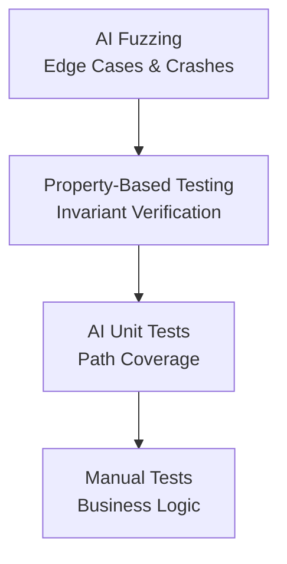
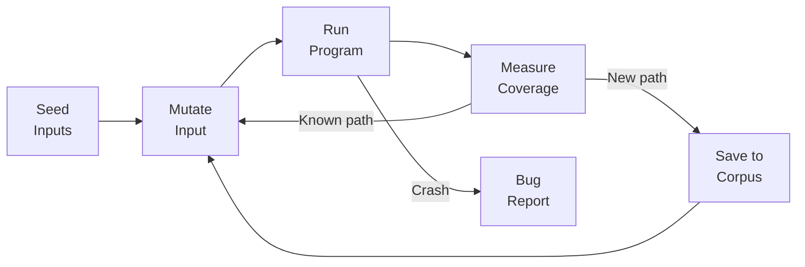

# Automated Testing and Test Generation

## Overview

Testing is one of the most labor-intensive activities in software development. Studies estimate that testing consumes 30-50% of total development effort, yet many codebases still have inadequate coverage. AI is poised to transform testing by automatically generating test cases, discovering edge cases that humans miss, and making test suites more effective with less manual effort.

AI-driven test generation operates at several levels. At the simplest level, an LLM can read a function's signature, docstring, and implementation, then generate unit tests that exercise different code paths. This is already practical — tools like Diffblue Cover for Java and CodiumAI's TestGPT generate production-quality test suites that achieve 70-90% code coverage automatically. The key advantage over template-based test generators is that LLMs understand the function's intent, not just its structure, so they generate tests with meaningful assertions and realistic input values.

Property-based testing (PBT) is a paradigm where instead of writing specific test cases, you define properties that should hold for all inputs, and the framework generates random inputs to try to falsify those properties. Libraries like Hypothesis (Python) and QuickCheck (Haskell) implement this approach. AI enhances PBT by helping developers identify non-obvious properties and by guiding the random generation toward inputs most likely to reveal bugs. LLMs can analyze a function and suggest invariants like "the output should always be sorted" or "the length of the output should equal the length of the input."

Fuzz testing (fuzzing) pushes random or semi-random inputs into a program to find crashes, memory errors, and unexpected behaviors. Coverage-guided fuzzing, pioneered by AFL (American Fuzzy Lop), mutates inputs to maximize code coverage. AI-guided fuzzing takes this further by learning which mutations are most likely to reach new code paths. Neural network-based fuzzers can learn the input grammar of a program (e.g., the structure of a PDF parser's inputs) and generate well-structured inputs that penetrate deeper into the code.

The combination of these approaches — LLM-generated unit tests for basic coverage, property-based tests for invariant verification, and AI-guided fuzzing for edge-case discovery — creates a comprehensive testing strategy that exceeds what manual testing alone can achieve. The challenge is not generating tests but generating good tests: tests that are readable, maintainable, and catch real bugs rather than testing implementation details.

## Key Concepts

- **AI Unit Test Generation**: Using LLMs to generate unit tests from function signatures, docstrings, and implementations.
- **Property-Based Testing (PBT)**: Defining properties that should hold for all inputs and using a framework to generate test cases automatically.
- **Fuzz Testing (Fuzzing)**: Feeding random or mutated inputs to a program to discover crashes and unexpected behavior.
- **Coverage-Guided Fuzzing**: Mutating inputs to maximize the code paths exercised, using coverage feedback to guide the search.
- **Grammar-Based Fuzzing**: Generating inputs that conform to a learned grammar, enabling deeper penetration into parsers and complex input handlers.
- **Mutation Testing**: Introducing small changes (mutations) to the code and checking whether tests catch them — a measure of test suite quality.
- **Test Oracle Problem**: Determining what the correct output should be for a generated test case. Without an oracle, tests can only check for crashes, not correctness.

## Code Examples

Using Hypothesis for property-based testing:

```python
from hypothesis import given, strategies as st

# The function under test
def sort_and_deduplicate(lst: list[int]) -> list[int]:
    """Sort a list and remove duplicates."""
    return sorted(set(lst))

# Property-based tests
@given(st.lists(st.integers()))
def test_output_is_sorted(lst):
    result = sort_and_deduplicate(lst)
    assert all(result[i] <= result[i + 1] for i in range(len(result) - 1))

@given(st.lists(st.integers()))
def test_no_duplicates(lst):
    result = sort_and_deduplicate(lst)
    assert len(result) == len(set(result))

@given(st.lists(st.integers()))
def test_all_elements_preserved(lst):
    result = sort_and_deduplicate(lst)
    assert set(result) == set(lst)

@given(st.lists(st.integers()))
def test_output_not_longer_than_input(lst):
    result = sort_and_deduplicate(lst)
    assert len(result) <= len(lst)
```

AI-generated unit tests from function analysis:

```python
# An LLM might generate these tests after reading the function

def test_empty_list():
    assert sort_and_deduplicate([]) == []

def test_single_element():
    assert sort_and_deduplicate([42]) == [42]

def test_already_sorted_unique():
    assert sort_and_deduplicate([1, 2, 3]) == [1, 2, 3]

def test_reverse_sorted():
    assert sort_and_deduplicate([3, 2, 1]) == [1, 2, 3]

def test_with_duplicates():
    assert sort_and_deduplicate([3, 1, 2, 1, 3]) == [1, 2, 3]

def test_all_same():
    assert sort_and_deduplicate([5, 5, 5]) == [5]

def test_negative_numbers():
    assert sort_and_deduplicate([-3, -1, -2]) == [-3, -2, -1]

def test_mixed_positive_negative():
    assert sort_and_deduplicate([3, -1, 0, -1, 3]) == [-1, 0, 3]
```

- **Lines 1-8** (first block): Property-based tests define invariants that hold for any list of integers — sortedness, uniqueness, element preservation.
- **Lines 1-23** (second block): LLM-generated tests cover specific cases: empty, single, sorted, reversed, duplicated, negative — demonstrating the kind of systematic case generation AI excels at.

## Diagrams

**Testing strategy pyramid with AI**



**Coverage-guided fuzzing loop**



## Exercises

1. **Generate tests with AI**: Pick a non-trivial function from an open-source project. Ask an LLM to generate unit tests for it. Run the tests and evaluate: how many pass? Do they achieve good coverage? Did the AI find any real bugs?

2. **Property discovery**: For each of these functions, identify at least 3 properties suitable for property-based testing: (a) `reverse(lst)`, (b) `compress(data)` / `decompress(data)`, (c) `parse_json(string)`.

3. **Fuzzing experiment**: Install AFL or a Python fuzzer (e.g., atheris). Fuzz a simple parser (JSON, CSV, or URL). Report any crashes or unexpected behaviors found.

4. **Mutation testing**: Use mutmut or cosmic-ray to run mutation testing on a small test suite. What percentage of mutants are killed? Which surviving mutants reveal gaps in the test suite?

## Further Reading

- [Hypothesis: Property-Based Testing for Python](https://hypothesis.readthedocs.io/)
- [AFL: American Fuzzy Lop](https://lcamtuf.coredump.cx/afl/)
- [CodiumAI: AI Test Generation](https://www.codium.ai/)
- [An Analysis of LLM-Generated Tests (Schäfer et al., 2023)](https://arxiv.org/abs/2305.00418)
