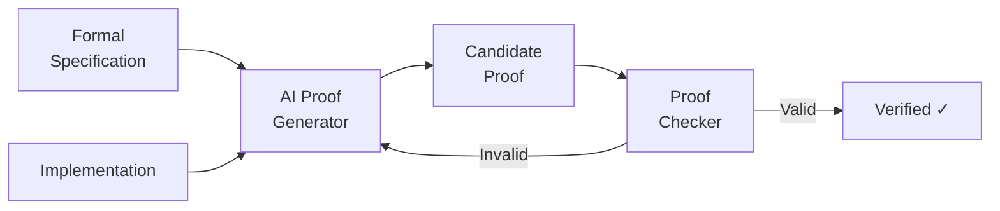
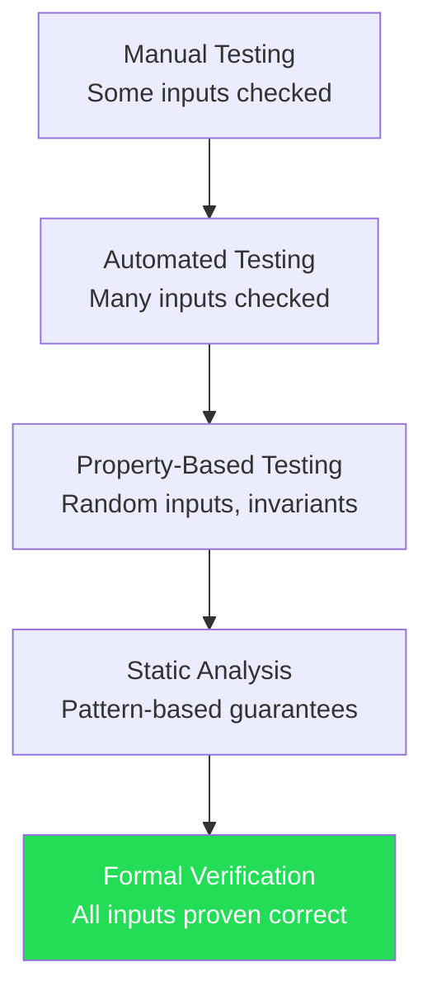

# Formal Verification and AI

## Overview

Testing can show the presence of bugs, but it cannot prove their absence. Formal verification fills this gap by using mathematical proofs to demonstrate that software meets its specification for all possible inputs — not just the ones you happened to test. Historically, formal verification has been confined to safety-critical systems (avionics, medical devices, cryptographic protocols) because it requires deep expertise and enormous manual effort. AI is changing this equation by automating the hardest parts of the verification process.

Formal verification tools like Coq, Lean, Isabelle, and Agda allow developers to write specifications alongside code and prove that the code satisfies those specifications. The proof is checked mechanically by the tool — if the proof compiles, the code is correct by construction. The challenge is writing the proofs. Even for relatively simple programs, constructing a formal proof can take 10-100x longer than writing the code itself. Much of this effort goes into finding the right proof strategy, identifying helpful intermediate lemmas, and managing the combinatorial explosion of proof states.

AI-assisted theorem proving attacks this bottleneck directly. Language models trained on proof corpora can suggest proof tactics, complete partial proofs, and even generate entire proofs from scratch. Meta's work with Lean demonstrated that an LLM could solve 40% of undergraduate-level math competition problems by generating proofs in the Lean 4 language. Google's AlphaProof used a reinforcement learning approach to solve International Mathematical Olympiad problems at the silver medal level.

For software verification specifically, the opportunity is even larger. Software proofs tend to be more formulaic than mathematical proofs — many follow recurring patterns like structural induction, case analysis, or rewriting. An LLM trained on a corpus of verified software proofs can recognize these patterns and apply them to new programs.

Program synthesis from specifications is the inverse problem: given a formal specification (what the program should do), automatically generate code that provably satisfies it. Traditional synthesis techniques explore the space of possible programs systematically, but the search space grows explosively. LLMs can dramatically narrow this search by generating candidate programs that are likely to satisfy the specification, leaving the formal verification tool to confirm correctness.

The dream is a development workflow where the programmer writes a specification in a formal language, AI generates the implementation, and a proof checker verifies correctness — all automatically. We are not there yet, but the pieces are falling into place. Recent work on verified code generation shows that LLMs can produce both code and proofs simultaneously, achieving verified correctness for simple algorithms and data structures.

## Key Concepts

- **Formal Verification**: Mathematically proving that a program satisfies its specification for all possible inputs.
- **Proof Assistants**: Tools like Coq, Lean, Isabelle, and Agda that provide a language for writing both specifications and machine-checked proofs.
- **Tactics**: Proof commands that transform the current proof goal (e.g., `induction`, `rewrite`, `apply`). AI models learn to suggest effective tactics.
- **Dependent Types**: Type systems where types can depend on values, enabling specifications to be encoded as types. Programs that typecheck are correct by construction.
- **Program Synthesis**: Automatically generating programs from specifications. AI narrows the search space by proposing likely candidates.
- **Invariant Generation**: Automatically discovering loop invariants and function contracts needed for verification — a key bottleneck that AI can address.
- **SMT Solvers**: Satisfiability Modulo Theories solvers (Z3, CVC5) that can automatically prove many verification conditions without human-written proofs.

## Code Examples

A verified sorting function in a Lean-like pseudocode:

```lean
-- Specification: a list is sorted if every adjacent pair is in order
def IsSorted : List Nat → Prop
  | []          => True
  | [_]         => True
  | a :: b :: t => a ≤ b ∧ IsSorted (b :: t)

-- Specification: the output is a permutation of the input
def IsPermutation (xs ys : List Nat) : Prop :=
  ∀ n, xs.count n = ys.count n

-- The function we want to verify
def insertionSort : List Nat → List Nat
  | []      => []
  | x :: xs => insert x (insertionSort xs)
where
  insert (x : Nat) : List Nat → List Nat
    | []      => [x]
    | y :: ys => if x ≤ y then x :: y :: ys else y :: insert x ys

-- Theorem: insertionSort produces a sorted list
-- AI can suggest the proof strategy: induction on the list,
-- with a helper lemma about insert preserving sortedness
theorem sort_sorted (xs : List Nat) : IsSorted (insertionSort xs) := by
  induction xs with
  | nil => simp [insertionSort, IsSorted]
  | cons x xs ih => exact insert_preserves_sorted x _ ih
```

Using Z3 (SMT solver) to verify a simple program property in Python:

```python
from z3 import Int, Solver, And, If, sat

def verify_abs_correct():
    """Verify that our abs implementation is correct for all integers."""
    x = Int('x')

    # Our implementation
    abs_x = If(x >= 0, x, -x)

    # Specification: result >= 0 and result*result == x*x
    spec = And(abs_x >= 0, abs_x * abs_x == x * x)

    # Try to find a counterexample (negate the spec)
    solver = Solver()
    solver.add(Not(spec))

    if solver.check() == sat:
        counter = solver.model()
        print(f"Bug found! Counterexample: x = {counter[x]}")
    else:
        print("Verified: abs is correct for all integers")

verify_abs_correct()
# Output: Verified: abs is correct for all integers
```

- **Lines 1-20** (Lean block): A formal specification of sorting (sorted output, permutation of input) with a verified implementation. The `by` block contains proof tactics — AI can generate these.
- **Lines 1-19** (Python/Z3 block): Using Z3 to verify that an absolute value function satisfies its specification for all integers. The solver exhaustively checks all cases.

## Diagrams

**AI-assisted formal verification workflow**



**Levels of software correctness assurance**



## Exercises

1. **Z3 verification**: Using Z3 (Python bindings), verify that a `max(a, b)` function always returns a value that is ≥ both inputs and equals one of them. Write the specification and check it.

2. **Proof by induction**: For the `insertionSort` function above, sketch (in English) the proof that insert preserves sortedness. What are the base case and inductive step?

3. **Specification writing**: Write formal specifications (as logical predicates) for: (a) a function that reverses a list, (b) a function that merges two sorted lists into a sorted list, (c) a binary search function.

4. **Synthesis experiment**: Give an LLM a formal specification (e.g., "Write a function that takes a sorted list and a target, returns the index if present, -1 otherwise, and prove it correct in Lean/Coq"). Evaluate the result.

## Further Reading

- [LLM-Based Theorem Proving (First et al., 2023)](https://arxiv.org/abs/2310.04353)
- [AlphaProof: AI System for Formal Mathematical Reasoning](https://deepmind.google/discover/blog/ai-solves-imo-problems-at-silver-medal-level/)
- [Lean 4 Documentation](https://lean-lang.org/)
- [Z3 SMT Solver](https://github.com/Z3Prover/z3)
- [Verified Software Toolchain (Appel et al.)](https://vst.cs.princeton.edu/)
