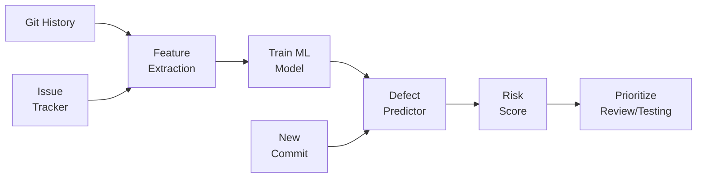
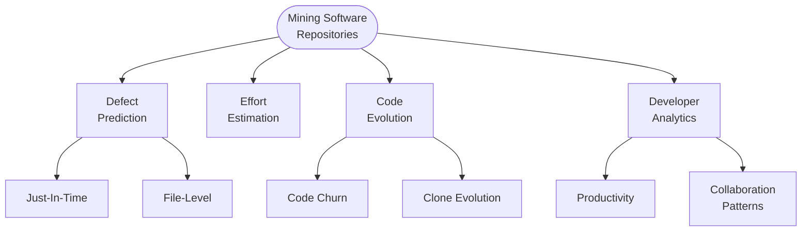

# AI for Software Engineering Research

## Overview

Software engineering research has always been data-rich. Every commit, pull request, bug report, code review comment, and stack trace is a potential data point. AI and machine learning have transformed how researchers extract insights from this data, enabling predictions about software quality, developer productivity, and system reliability that were previously impossible.

Mining Software Repositories (MSR) is a research field dedicated to extracting actionable knowledge from version control systems, issue trackers, and communication channels. Early MSR work used simple statistics — counting bug-fix commits, measuring code churn, analyzing commit frequency. Modern approaches use deep learning to model complex relationships. For example, a graph neural network can represent a codebase as a dependency graph and predict which modules are most likely to contain undiscovered bugs based on structural properties, change history, and developer activity patterns.

Defect prediction is one of the most studied applications. The goal is to predict which files, modules, or commits are likely to introduce bugs, so that testing and review effort can be focused where it matters most. Classic features include code complexity metrics (cyclomatic complexity, lines of code), process metrics (number of developers, change frequency), and social metrics (developer experience, communication patterns). Modern approaches add deep features learned from the code itself — embeddings that capture semantic properties beyond what hand-crafted metrics can express.

Just-In-Time (JIT) defect prediction predicts whether a specific commit introduces a bug, providing feedback at the most actionable moment — before the code is merged. Features include the size of the change (lines added/deleted), the number of files modified, whether the change touches previously buggy files, the developer's experience with the modified files, and the time of day. LLMs add a new dimension by actually reading the code diff and reasoning about whether it looks correct.

AI for software documentation addresses another persistent pain point. Documentation is perpetually outdated, incomplete, or missing. LLMs can generate documentation from code (docstrings, README sections, API references), summarize code changes for release notes, and even answer natural-language questions about a codebase. The challenge is ensuring generated documentation is accurate — hallucinated API descriptions are worse than no documentation at all.

Software effort estimation — predicting how long a task will take — has long been unreliable. Historical data shows that human estimates are systematically biased (usually optimistic). ML models trained on historical project data (task descriptions, actual completion times, team composition) can provide data-driven estimates, though they work best for organizations with large historical datasets and consistent task tracking.

## Key Concepts

- **Mining Software Repositories (MSR)**: Extracting structured knowledge from version control, issue trackers, and developer communications.
- **Defect Prediction**: Predicting which code units are likely to contain bugs, enabling focused testing and review.
- **Just-In-Time (JIT) Prediction**: Predicting whether a specific commit introduces a defect, providing immediate actionable feedback.
- **Code Churn**: The amount of code added, modified, and deleted over time — a strong predictor of defect density.
- **Process Metrics**: Features derived from development process (change frequency, developer count, review coverage) rather than code structure.
- **Automated Documentation**: Using LLMs to generate, update, and maintain software documentation from code.
- **Effort Estimation**: Predicting the time and resources needed to complete software tasks using ML models trained on historical data.

## Code Examples

Building a JIT defect prediction model from git history:

```python
import subprocess
import json
import pandas as pd
from sklearn.ensemble import RandomForestClassifier
from sklearn.model_selection import cross_val_score

def extract_commit_features(repo_path: str, n_commits: int = 500) -> pd.DataFrame:
    """Extract features from recent commits for defect prediction."""
    log_format = '{"hash":"%H","author":"%an","date":"%aI","message":"%s"}'
    result = subprocess.run(
        ["git", "log", f"-{n_commits}", f"--format={log_format}", "--numstat"],
        cwd=repo_path, capture_output=True, text=True
    )

    commits = []
    current = None
    for line in result.stdout.strip().split("\n"):
        if line.startswith("{"):
            if current:
                commits.append(current)
            current = json.loads(line)
            current["files_changed"] = 0
            current["lines_added"] = 0
            current["lines_deleted"] = 0
        elif line.strip() and current:
            parts = line.split("\t")
            if len(parts) == 3 and parts[0] != "-":
                current["files_changed"] += 1
                current["lines_added"] += int(parts[0])
                current["lines_deleted"] += int(parts[1])
    if current:
        commits.append(current)

    df = pd.DataFrame(commits)
    # Feature engineering
    df["change_size"] = df["lines_added"] + df["lines_deleted"]
    df["add_del_ratio"] = df["lines_added"] / (df["lines_deleted"] + 1)
    df["is_fix"] = df["message"].str.contains(
        r"fix|bug|patch|repair", case=False, regex=True
    ).astype(int)
    # Label: commit is buggy if a later fix-commit references it
    df["is_buggy"] = df["is_fix"].shift(-1).fillna(0).astype(int)
    return df

def train_defect_predictor(df: pd.DataFrame):
    """Train a random forest defect predictor."""
    features = ["files_changed", "lines_added", "lines_deleted",
                "change_size", "add_del_ratio"]
    X = df[features].fillna(0)
    y = df["is_buggy"]

    clf = RandomForestClassifier(n_estimators=100, random_state=42)
    scores = cross_val_score(clf, X, y, cv=5, scoring="f1")
    print(f"Defect prediction F1: {scores.mean():.3f} ± {scores.std():.3f}")
    return clf.fit(X, y)
```

- **Lines 7-34**: Extract features from git log: files changed, lines added/deleted per commit.
- **Lines 36-42**: Engineer features: change size, add/delete ratio, and a simple labeling heuristic (a commit is "buggy" if the next commit is a bug fix).
- **Lines 44-52**: Train a Random Forest classifier and evaluate with cross-validation. Production systems use more sophisticated labeling (SZZ algorithm) and additional features.

## Diagrams

**Software defect prediction pipeline**



**MSR research areas**



## Exercises

1. **MSR data collection**: Clone a popular open-source repository and extract the following from its git history: (a) the 10 most-changed files, (b) the ratio of bug-fix commits to feature commits, (c) the distribution of commit sizes. Visualize your findings.

2. **Defect prediction**: Run the code example on a real repository. Experiment with additional features (time of day, day of week, author experience). Does prediction quality improve?

3. **Documentation generation**: Pick 5 undocumented functions from an open-source project. Use an LLM to generate docstrings. Evaluate accuracy by reading the function implementations.

4. **Effort estimation**: Collect data from a project's issue tracker (estimated vs. actual completion time). Build a regression model to predict completion time from issue description length, label, and assignee experience.

## Further Reading

- [The Promises and Perils of Mining Git (Bird et al., 2009)](https://dl.acm.org/doi/10.1145/1547476.1547510)
- [A Survey on Software Defect Prediction (Li et al., 2022)](https://arxiv.org/abs/2208.10875)
- [SZZ Algorithm: Identifying Bug-Introducing Changes](https://dl.acm.org/doi/10.1145/1082983.1083147)
- [MSR Conference Proceedings](https://www.msrconf.org/)
