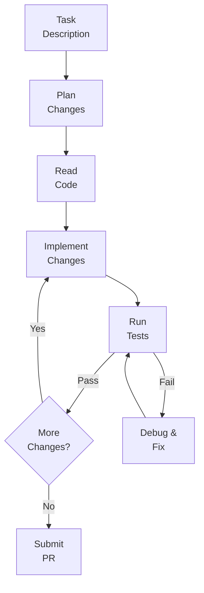
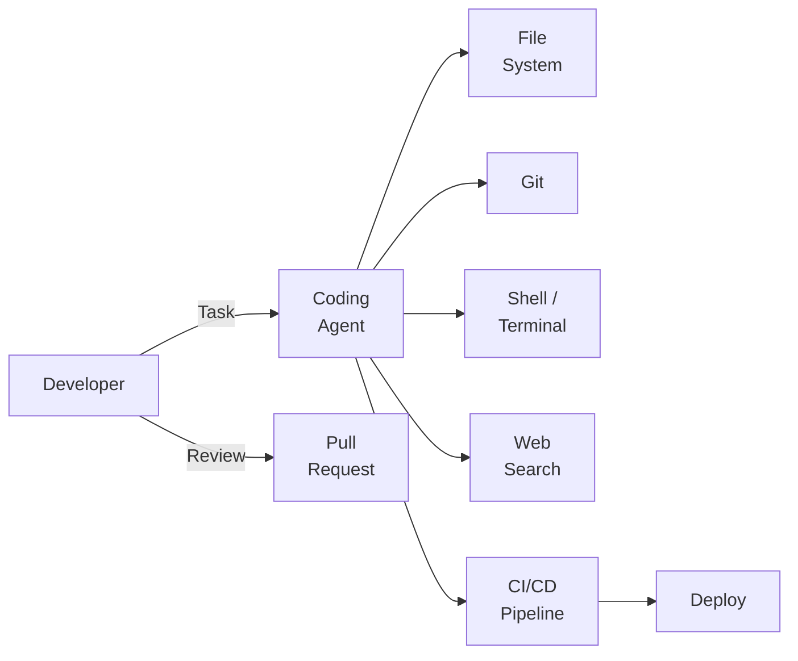

# AI-Native Development: Autonomous Coding Agents

## Overview

Autonomous coding agents represent the most ambitious application of AI to software development. Unlike code completion tools that suggest the next few lines, autonomous agents can take a high-level task description — "Add pagination to the users API endpoint" — and independently plan the implementation, write the code, run tests, debug failures, and submit a pull request. They operate in a loop, making decisions at each step based on the results of their previous actions.

Devin, announced by Cognition in 2024, was the first AI system marketed as a "software engineer." It can navigate codebases, use a terminal, install dependencies, run tests, and debug issues. Claude Code, developed by Anthropic, operates directly in the developer's terminal with full access to the file system, git, and shell commands. These systems share a common architecture: an LLM serves as the reasoning core, wrapped in an agent loop with access to tools (file reading/writing, shell execution, web search, browser interaction).

The typical autonomous coding workflow follows a plan-implement-verify cycle. Given a task, the agent first reads relevant code to understand the existing architecture. It then creates a plan — which files to modify, what changes to make, and in what order. It implements the changes one by one, running tests after each modification to catch regressions early. If tests fail, it reads the error output, diagnoses the issue, and applies a fix. This cycle continues until all tests pass and the task is complete.

AI for CI/CD pipeline creation is a natural extension. Agents can analyze a project's structure, identify the build system, testing framework, and deployment target, and generate a complete CI/CD configuration (GitHub Actions, GitLab CI, Jenkins). They can also debug failing pipelines by reading log output, identifying the root cause, and applying fixes.

AI for DevOps and Infrastructure as Code (IaC) takes this further. Agents can generate Terraform configurations, Kubernetes manifests, and Docker files from high-level descriptions. They can analyze infrastructure costs, suggest optimizations, and even respond to production incidents by reading monitoring dashboards, correlating signals, and implementing remediations.

The practical reality is nuanced. Current autonomous agents work well for well-defined tasks with clear success criteria (tests pass, linter is clean) but struggle with ambiguous requirements, novel architectures, and tasks requiring deep domain knowledge. They are most effective as force multipliers for experienced developers who can review their output, not as replacements. The best results come from tight collaboration: the developer provides direction and reviews output, while the agent handles implementation details.

## Key Concepts

- **Autonomous Coding Agent**: An AI system that can independently plan, implement, test, and debug software changes with minimal human intervention.
- **Plan-Implement-Verify Loop**: The core cycle: understand the task, plan changes, implement them, verify with tests, debug if needed.
- **Tool Use**: Agents interact with the development environment through tools: file operations, shell commands, git, web search, and browser automation.
- **Agentic Coding**: A development paradigm where the human provides high-level direction and the AI handles implementation — shifting the developer's role toward specification and review.
- **CI/CD Automation**: AI agents that generate, maintain, and debug continuous integration and deployment pipelines.
- **Infrastructure as Code (IaC)**: Managing infrastructure through machine-readable configuration files. AI agents can generate and optimize these configurations.
- **Human-in-the-Loop**: The pattern where AI operates autonomously but checkpoints with a human reviewer at critical decision points.

## Code Examples

A simplified autonomous coding agent that can read files, edit code, and run tests:

```python
from anthropic import Anthropic

client = Anthropic()

TOOLS = [
    {
        "name": "read_file",
        "description": "Read the contents of a file",
        "input_schema": {
            "type": "object",
            "properties": {"path": {"type": "string"}},
            "required": ["path"]
        }
    },
    {
        "name": "write_file",
        "description": "Write content to a file",
        "input_schema": {
            "type": "object",
            "properties": {
                "path": {"type": "string"},
                "content": {"type": "string"}
            },
            "required": ["path", "content"]
        }
    },
    {
        "name": "run_command",
        "description": "Run a shell command and return output",
        "input_schema": {
            "type": "object",
            "properties": {"command": {"type": "string"}},
            "required": ["command"]
        }
    }
]

def execute_tool(name: str, args: dict) -> str:
    """Execute a tool and return its output."""
    if name == "read_file":
        with open(args["path"]) as f:
            return f.read()
    elif name == "write_file":
        with open(args["path"], "w") as f:
            f.write(args["content"])
        return f"Wrote {len(args['content'])} chars to {args['path']}"
    elif name == "run_command":
        import subprocess
        result = subprocess.run(
            args["command"], shell=True,
            capture_output=True, text=True, timeout=30
        )
        return f"stdout:\n{result.stdout}\nstderr:\n{result.stderr}"

def coding_agent(task: str, max_steps: int = 20):
    """An autonomous coding agent that plans, implements, and tests."""
    messages = [{"role": "user", "content": f"""You are an autonomous coding agent. 
Your task: {task}

Approach:
1. Read relevant files to understand the codebase
2. Plan your changes
3. Implement changes one file at a time
4. Run tests after each change
5. Debug and fix any failures
6. Report completion when done"""}]
    
    for step in range(max_steps):
        response = client.messages.create(
            model="claude-sonnet-4-20250514",
            max_tokens=4096,
            tools=TOOLS,
            messages=messages
        )
        
        # Process tool calls
        if response.stop_reason == "tool_use":
            tool_results = []
            for block in response.content:
                if block.type == "tool_use":
                    result = execute_tool(block.name, block.input)
                    tool_results.append({
                        "type": "tool_result",
                        "tool_use_id": block.id,
                        "content": result
                    })
            messages.append({"role": "assistant", "content": response.content})
            messages.append({"role": "user", "content": tool_results})
        else:
            # Agent finished — extract final message
            for block in response.content:
                if hasattr(block, "text"):
                    print(f"Agent complete: {block.text}")
            return
    
    print("Max steps reached")
```

- **Lines 5-35**: Define three tools the agent can use: reading files, writing files, and running shell commands.
- **Lines 37-51**: Tool execution functions that perform the actual file I/O and command execution.
- **Lines 53-87**: The agent loop: send the task to the LLM with tool access, execute any tool calls, feed results back, and repeat until the agent reports completion.

## Diagrams

**Autonomous coding agent architecture**



**AI-native development ecosystem**



## Exercises

1. **Agent evaluation**: Give an autonomous coding agent (Claude Code, Cursor, etc.) a well-defined task: "Add a `/health` endpoint to this Flask app that returns `{"status": "ok"}` with a 200 status code." Evaluate: did it work on the first try? How many steps did it take? Did it write tests?

2. **CI/CD generation**: Ask an AI agent to generate a GitHub Actions workflow for a Python project that: (a) runs tests on push, (b) checks formatting with Black, (c) publishes to PyPI on tag. Review the output for correctness.

3. **Failure analysis**: Intentionally give an agent an ambiguous task (e.g., "improve the user experience"). Document how it handles the ambiguity. Does it ask for clarification or make assumptions?

4. **Agent limitations**: Identify three categories of software engineering tasks where autonomous agents currently struggle. For each, explain why and suggest what advancements would be needed.

## Further Reading

- [SWE-bench: Can Language Models Resolve Real-World GitHub Issues? (Jimenez et al., 2023)](https://arxiv.org/abs/2310.06770)
- [Claude Code Documentation](https://docs.anthropic.com/en/docs/claude-code)
- [Devin AI](https://devin.ai/)
- [The Shift from Writing Code to Reviewing AI-Generated Code](https://arxiv.org/abs/2405.14723)
