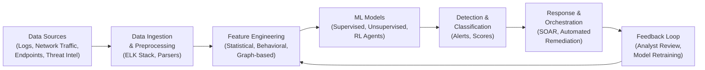

# Introduction to AI for Cybersecurity

## Overview

The cybersecurity threat landscape has grown dramatically in scale and sophistication. Organizations face millions of potential security events daily, from phishing attempts and ransomware campaigns to advanced persistent threats (APTs) orchestrated by nation-state actors. Traditional rule-based defenses, while still essential, struggle to keep pace with the volume and velocity of modern attacks. This is where artificial intelligence enters the picture, not as a silver bullet, but as a force multiplier that enables security teams to detect, analyze, and respond to threats at machine speed.

The motivation for applying AI to cybersecurity is straightforward: attackers automate, so defenders must automate too. A single security operations center (SOC) may process tens of thousands of alerts per day, most of which are false positives. Machine learning models can triage these alerts, surface the ones that matter, and even recommend response actions. The MITRE ATT&CK framework, a comprehensive knowledge base of adversary tactics and techniques, provides a structured vocabulary that AI systems can leverage to classify and correlate attack behaviors across the kill chain.

Machine learning for cybersecurity generally falls into three broad categories. **Supervised learning** is used when we have labeled datasets of known good and known bad behavior. Malware detection is the classic example: given a corpus of benign and malicious executables, a classifier learns to distinguish between them based on extracted features such as PE headers, API call sequences, or raw byte distributions. Tools like YARA rules offer a traditional signature-based approach to malware identification, and ML classifiers extend this by generalizing beyond exact signatures to detect novel variants.

**Unsupervised learning** shines in anomaly detection, where the goal is to find things that are unusual rather than things that match a known pattern. Network intrusion detection systems (IDS) benefit enormously from this approach. By learning a baseline model of normal network traffic, an unsupervised model can flag deviations that may indicate lateral movement, data exfiltration, or command-and-control communication. The ELK stack (Elasticsearch, Logstash, Kibana) is widely deployed for log aggregation and analysis, and integrating AI-powered anomaly detection into ELK pipelines is an increasingly common practice. Research such as "Parser-Free Querying of Security Logs" by Evan Luo et al. (advised by David Wagner) explores how ML can reduce the burden of writing complex log parsers by enabling natural-language or learned queries over raw log data.

**Reinforcement learning (RL)** represents a newer frontier. In RL for cybersecurity, an agent learns an adaptive defense policy by interacting with a simulated environment. The Tamarin prover, a tool for formal verification of security protocols, has been combined with RL techniques to automate the search for protocol vulnerabilities, using the prover's symbolic reasoning as a reward signal. RL agents can also learn to dynamically reconfigure firewalls, adjust access controls, or orchestrate honeypots in response to ongoing attacks.

A key concept gaining traction is **AI-native security**, the idea that security should be designed around AI capabilities from the ground up rather than bolting ML models onto legacy systems. This includes building feedback loops where model predictions are continuously validated by analysts, retraining pipelines that adapt to concept drift (the phenomenon where the statistical properties of attack data change over time), and adversarial robustness testing using libraries like CleverHans to ensure models are resistant to evasion attacks.

The history of AI in cybersecurity stretches back to the late 1990s, when early intrusion detection systems like ADAM and MADAM used statistical methods to detect anomalies. The 2010s saw an explosion of ML-based antivirus engines (Cylance, CrowdStrike Falcon) and the adoption of deep learning for threat intelligence. Today, large language models are being applied to tasks ranging from automated vulnerability assessment to natural-language threat hunting queries. The field continues to evolve rapidly, driven by an arms race between attackers who use AI to craft more convincing phishing lures and polymorphic malware, and defenders who use AI to detect and counter these tactics.

## Key Concepts

- **Threat landscape**: The full range of cyber threats facing an organization, from commodity malware to targeted APTs.
- **MITRE ATT&CK framework**: A structured knowledge base mapping adversary tactics, techniques, and procedures (TTPs) across the attack lifecycle.
- **Supervised ML for security**: Classification of known threat types (malware, phishing, spam) using labeled training data.
- **Unsupervised ML for security**: Anomaly detection to surface unknown threats by learning normal behavior baselines.
- **Reinforcement learning for adaptive defense**: Agents that learn dynamic security policies through interaction with simulated environments.
- **AI-native security**: Designing security architectures with AI at the core, including continuous retraining and adversarial robustness.
- **Concept drift**: The shift in data distributions over time that degrades model accuracy, a critical challenge in malware and intrusion detection.
- **Adversarial robustness**: Ensuring ML models resist evasion by adversaries who craft inputs to fool classifiers (evaluated with tools like CleverHans).

## Code Examples

Below is a simple Python example that demonstrates how to categorize security events using basic ML preprocessing. This snippet shows feature extraction from simulated log data and a quick classification pass.

```python
import numpy as np
from sklearn.ensemble import RandomForestClassifier
from sklearn.model_selection import train_test_split
from sklearn.metrics import classification_report

# Simulated security event features:
# [packet_rate, avg_payload_size, unique_dst_ports, failed_logins, is_encrypted]
np.random.seed(42)
n_benign = 500
n_malicious = 100

benign = np.column_stack([
    np.random.normal(50, 10, n_benign),    # packet_rate
    np.random.normal(512, 128, n_benign),  # avg_payload_size
    np.random.randint(1, 10, n_benign),    # unique_dst_ports
    np.random.randint(0, 2, n_benign),     # failed_logins
    np.random.randint(0, 2, n_benign),     # is_encrypted
])
malicious = np.column_stack([
    np.random.normal(200, 50, n_malicious),
    np.random.normal(1024, 256, n_malicious),
    np.random.randint(10, 65, n_malicious),
    np.random.randint(3, 20, n_malicious),
    np.random.randint(0, 2, n_malicious),
])

X = np.vstack([benign, malicious])
y = np.array([0] * n_benign + [1] * n_malicious)

X_train, X_test, y_train, y_test = train_test_split(X, y, test_size=0.3, random_state=42)
clf = RandomForestClassifier(n_estimators=100, random_state=42)
clf.fit(X_train, y_train)
y_pred = clf.predict(X_test)

print(classification_report(y_test, y_pred, target_names=["Benign", "Malicious"]))
```

## Diagrams

The following diagram illustrates the end-to-end AI cybersecurity pipeline, from data collection through threat response.



## Case Studies / Applications

- **CrowdStrike Falcon**: Uses ML models trained on billions of events to detect malware and lateral movement in real time, mapping detections to MITRE ATT&CK techniques.
- **Darktrace**: Deploys unsupervised ML (self-learning AI) to build a model of normal network behavior and detect anomalies across enterprise environments.
- **Google Chronicle / VirusTotal**: Leverages massive threat intelligence datasets and ML to correlate indicators of compromise (IOCs) across organizations.
- **Tamarin + RL research**: Academic work combining formal protocol verification with reinforcement learning to automatically discover vulnerabilities in cryptographic protocols.

## Further Reading

- MITRE ATT&CK Framework: [https://attack.mitre.org/](https://attack.mitre.org/)
- Goodfellow et al., "CleverHans: An adversarial example library for constructing attacks, building defenses, and benchmarking" (2016)
- Evan Luo et al., "Parser-Free Querying of Security Logs" (advised by David Wagner)
- Meier et al., "Tamarin Prover: Automated Analysis of Security Protocols"
- Buczak & Guven, "A Survey of Data Mining and Machine Learning Methods for Cyber Security Intrusion Detection" (ACM Computing Surveys, 2016)
