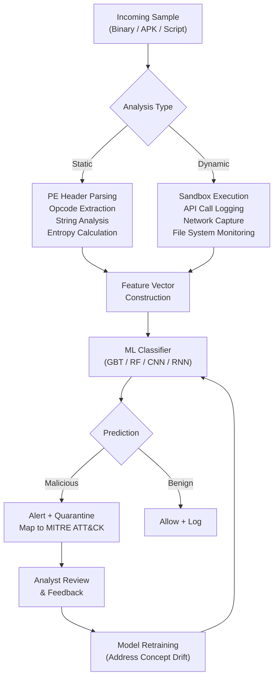

## Malware Detection with Machine Learning

## Overview

Malware detection is one of the most mature applications of machine learning in cybersecurity. Traditional antivirus software relies on signature databases: a hash or byte pattern is computed for each known malicious file, and incoming files are checked against this database. The problem is that modern malware authors use polymorphism, packing, and code obfuscation to generate variants that evade exact-match signatures. Machine learning addresses this limitation by learning generalizable patterns that can detect previously unseen malware families.

There are two fundamental approaches to analyzing a suspicious binary. **Static analysis** examines the file without executing it. Features are extracted from the file's structure: Portable Executable (PE) headers (section sizes, entropy, imported libraries), opcode frequency distributions, printable strings, and raw byte histograms. Static analysis is fast and safe but can be defeated by packing and obfuscation. **Dynamic analysis** executes the binary in a sandbox and observes its runtime behavior: API call sequences, registry modifications, network connections, and file system changes. Dynamic features are harder to obfuscate but are expensive to collect and can be evaded by sandbox-aware malware that detects the analysis environment.

Feature extraction is the critical first step. For PE files, common features include the number and entropy of each section (high entropy in the `.text` section suggests packing), the ratio of imported to exported functions, and the presence of suspicious API calls like `VirtualAlloc`, `WriteProcessMemory`, or `CreateRemoteThread`. Opcode sequences can be treated as an n-gram language model, where the frequency distribution of instruction bigrams or trigrams forms a feature vector. YARA rules complement ML by providing expert-authored pattern-matching rules that flag known indicators; for example, a YARA rule might match a specific decryption routine shared across a malware family. In practice, YARA rules and ML classifiers work together: YARA provides high-precision detection for known patterns while ML generalizes to novel variants.

For classical ML approaches, **gradient boosted decision trees** (XGBoost, LightGBM) and **random forests** consistently perform well on tabular malware feature sets. These models handle mixed feature types, are relatively interpretable through feature importance scores, and train quickly. A typical pipeline extracts hundreds of features from PE headers and API calls, selects the most discriminative features using mutual information or chi-squared tests, and trains an ensemble classifier.

Deep learning extends the toolbox further. **Convolutional neural networks (CNNs)** can be applied to malware binary visualization, where raw bytes of an executable are reshaped into a 2D grayscale image and the CNN learns spatial patterns corresponding to code structures. This approach, pioneered by Nataraj et al., avoids manual feature engineering entirely. **Recurrent neural networks (RNNs)** and LSTMs are applied to sequential data such as API call traces from dynamic analysis, learning temporal patterns that distinguish benign from malicious execution flows.

A critical challenge in deployed malware detection is **concept drift**. The distribution of malware changes over time as attackers develop new techniques and abandon old ones. The paper "Adversarial Vulnerability Under Temporal Concept Drift: A Longitudinal Study of Android Malware Detection" studies this phenomenon in the Android ecosystem, finding that classifiers trained on one time period degrade significantly when evaluated on later periods. The study also shows that concept drift increases adversarial vulnerability: as the decision boundary shifts, the perturbation required to evade the classifier decreases. This motivates continuous retraining pipelines and drift-detection mechanisms that alert analysts when model performance degrades.

The math behind a simple decision boundary illustrates why drift matters. A binary classifier learns a function $f: \mathbb{R}^d \to \{0, 1\}$ that separates benign ($y=0$) from malicious ($y=1$) samples. If the malware distribution at training time is $P_t(x \mid y=1)$ but shifts to $P_{t+\Delta}(x \mid y=1)$ at deployment, then the classifier's expected error increases:

$$\epsilon_{t+\Delta} = \mathbb{E}_{x \sim P_{t+\Delta}} \left[ \mathbf{1}[f(x) \neq y] \right] \geq \epsilon_t$$

The magnitude of this increase depends on the divergence $D_{\mathrm{KL}}(P_{t+\Delta} \| P_t)$ between the training and deployment distributions.

## Key Concepts

- **Static analysis**: Examining file structure (PE headers, opcodes, strings) without execution.
- **Dynamic analysis**: Observing runtime behavior (API calls, network activity) in a sandbox.
- **Feature extraction**: Converting raw binaries into numerical feature vectors for ML models.
- **YARA rules**: Pattern-matching rules authored by analysts to detect known malware indicators.
- **Gradient boosting / Random forests**: Ensemble tree methods well-suited for tabular malware features.
- **Binary visualization with CNNs**: Reshaping raw bytes into images and applying convolutional networks.
- **API call sequence modeling with RNNs**: Learning temporal patterns in dynamic analysis traces.
- **Concept drift**: The degradation of model accuracy over time as the malware landscape evolves.
- **Adversarial evasion**: Attackers crafting samples that cross the decision boundary to evade detection.

## Code Examples

The following example demonstrates a simplified malware feature extraction and classification pipeline. It simulates extracting features from PE file metadata and training a gradient boosting classifier.

```python
import numpy as np
from sklearn.ensemble import GradientBoostingClassifier
from sklearn.model_selection import train_test_split
from sklearn.metrics import classification_report, roc_auc_score

# Simulated PE feature extraction
# Features: [text_entropy, data_entropy, num_imports, num_sections,
#            has_debug, avg_section_size, suspicious_api_count]

np.random.seed(42)

def generate_pe_features(n_samples, is_malware=False):
    """Simulate PE header features for benign or malicious files."""
    if is_malware:
        text_entropy = np.random.uniform(6.5, 8.0, n_samples)   # packed/encrypted
        data_entropy = np.random.uniform(5.0, 7.5, n_samples)
        num_imports = np.random.randint(5, 30, n_samples)        # fewer imports (packed)
        num_sections = np.random.randint(3, 12, n_samples)
        has_debug = np.random.binomial(1, 0.1, n_samples)        # rarely has debug info
        avg_section_size = np.random.uniform(50000, 500000, n_samples)
        suspicious_api_count = np.random.randint(3, 15, n_samples)
    else:
        text_entropy = np.random.uniform(4.0, 6.5, n_samples)   # normal code
        data_entropy = np.random.uniform(2.0, 5.5, n_samples)
        num_imports = np.random.randint(20, 200, n_samples)      # rich import table
        num_sections = np.random.randint(3, 8, n_samples)
        has_debug = np.random.binomial(1, 0.7, n_samples)        # often has debug info
        avg_section_size = np.random.uniform(10000, 200000, n_samples)
        suspicious_api_count = np.random.randint(0, 3, n_samples)
    return np.column_stack([
        text_entropy, data_entropy, num_imports, num_sections,
        has_debug, avg_section_size, suspicious_api_count
    ])

benign_features = generate_pe_features(800, is_malware=False)
malware_features = generate_pe_features(200, is_malware=True)

X = np.vstack([benign_features, malware_features])
y = np.array([0] * 800 + [1] * 200)

X_train, X_test, y_train, y_test = train_test_split(
    X, y, test_size=0.25, random_state=42, stratify=y
)

clf = GradientBoostingClassifier(
    n_estimators=150, max_depth=4, learning_rate=0.1, random_state=42
)
clf.fit(X_train, y_train)

y_pred = clf.predict(X_test)
y_prob = clf.predict_proba(X_test)[:, 1]

print("Classification Report:")
print(classification_report(y_test, y_pred, target_names=["Benign", "Malware"]))
print(f"ROC AUC: {roc_auc_score(y_test, y_prob):.4f}")

# Feature importance
feature_names = [
    "text_entropy", "data_entropy", "num_imports", "num_sections",
    "has_debug", "avg_section_size", "suspicious_api_count"
]
importances = clf.feature_importances_
for name, imp in sorted(zip(feature_names, importances), key=lambda x: -x[1]):
    print(f"  {name}: {imp:.4f}")
```

A minimal example of a YARA-style rule expressed programmatically:

```python
def yara_like_scan(file_bytes: bytes) -> dict:
    """Simple pattern-matching scan inspired by YARA rules."""
    rules = {
        "suspicious_packer_upx": {
            "strings": [b"UPX0", b"UPX1", b"UPX!"],
            "description": "Possible UPX-packed binary"
        },
        "process_injection_apis": {
            "strings": [b"VirtualAllocEx", b"WriteProcessMemory",
                        b"CreateRemoteThread"],
            "description": "APIs commonly used for process injection"
        },
        "crypto_ransomware_indicator": {
            "strings": [b"CryptEncrypt", b"CryptGenKey", b"YOUR FILES"],
            "description": "Indicators of ransomware behavior"
        },
    }
    detections = {}
    for rule_name, rule in rules.items():
        matched = [s.decode() for s in rule["strings"] if s in file_bytes]
        if matched:
            detections[rule_name] = {
                "matched_strings": matched,
                "description": rule["description"]
            }
    return detections

# Example usage with simulated binary content
sample_bytes = b"\x00" * 100 + b"UPX0" + b"\x00" * 50 + b"VirtualAllocEx" + b"\x00" * 100
results = yara_like_scan(sample_bytes)
for rule, info in results.items():
    print(f"[MATCH] {rule}: {info['description']}")
    print(f"  Matched: {info['matched_strings']}")
```

## Diagrams

The following diagram shows the malware detection pipeline from sample ingestion through classification.



## Case Studies / Applications

- **EMBER dataset**: An open benchmark of PE file features for malware classification, widely used to evaluate ML-based detectors (Endgame/Elastic).
- **Android malware concept drift**: The longitudinal study on Android malware demonstrates that classifiers degrade by 10-20% F1 over 12 months without retraining, and adversarial vulnerability increases as concept drift widens.
- **MalConv**: A deep learning architecture that operates directly on raw byte sequences (up to 2 MB) of PE files, avoiding manual feature engineering entirely.
- **VirusTotal + YARA**: VirusTotal allows researchers to deploy custom YARA rules at scale, scanning millions of samples daily and providing community-driven threat intelligence.

## Further Reading

- "Adversarial Vulnerability Under Temporal Concept Drift: A Longitudinal Study of Android Malware Detection"
- Anderson & Roth, "EMBER: An Open Dataset for Training Static PE Malware Machine Learning Models" (2018)
- Nataraj et al., "Malware Images: Visualization and Automatic Classification" (VizSec 2011)
- YARA documentation: [https://yara.readthedocs.io/](https://yara.readthedocs.io/)
- Raff et al., "Malware Detection by Eating a Whole EXE" (MalConv, 2018)
- MITRE ATT&CK Malware techniques: [https://attack.mitre.org/techniques/enterprise/](https://attack.mitre.org/techniques/enterprise/)
