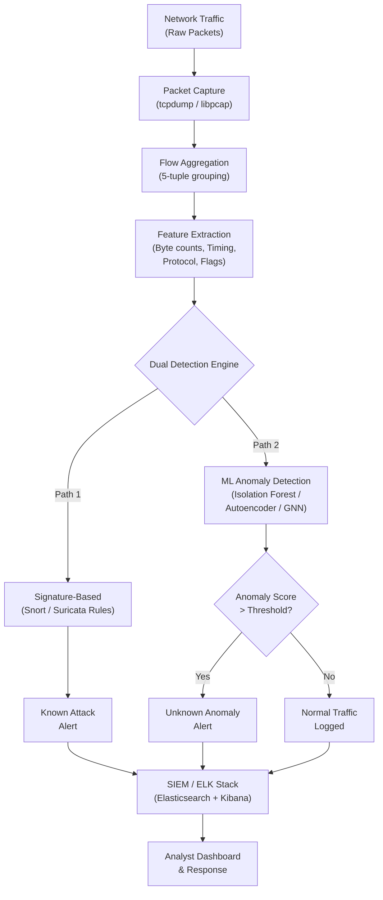
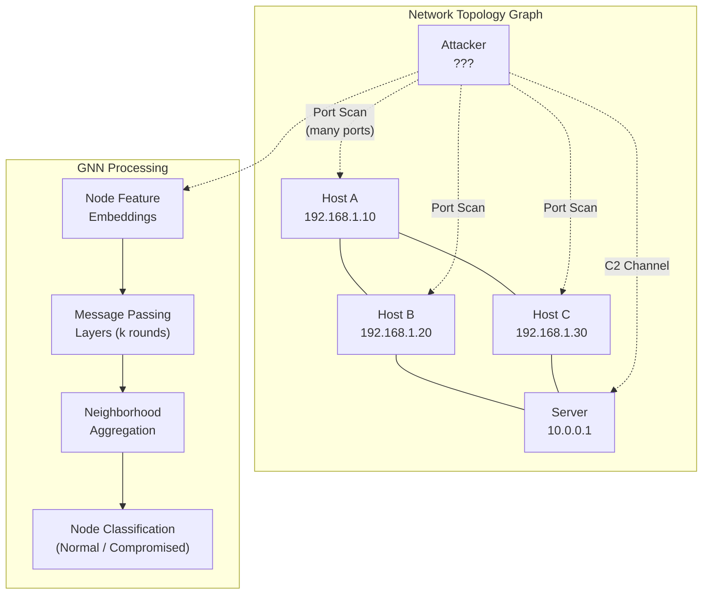

# Network Intrusion Detection

## Overview

Network intrusion detection systems (IDS) monitor traffic flowing through a network to identify malicious activity. As enterprise networks grow in complexity and attackers become more sophisticated, the volume of traffic that must be analyzed has outstripped the capacity of purely manual or rule-based approaches. Machine learning offers a path to scalable, adaptive intrusion detection that can identify both known attack patterns and previously unseen anomalies.

There are two classical paradigms for intrusion detection. **Signature-based IDS** (exemplified by Snort and Suricata) matches network packets against a database of known attack signatures, much like antivirus software matches file signatures. This approach has high precision for known attacks but zero recall for novel ones. **Anomaly-based IDS** builds a statistical model of normal network behavior and flags deviations. The trade-off is higher recall for unknown attacks at the cost of more false positives. Modern AI-driven IDS systems typically combine both approaches, using signatures for high-confidence detection and ML-based anomaly detection as a second layer.

The foundation of any ML-based IDS is **feature engineering from network flows**. Raw packet captures are aggregated into flows (groups of packets sharing the same source IP, destination IP, source port, destination port, and protocol). From each flow, features are extracted including: total bytes transferred, packet count, average packet size, inter-arrival time statistics (mean, variance, skewness), the ratio of incoming to outgoing bytes, TCP flag distributions, and protocol type. For the NSL-KDD and CICIDS2017 benchmark datasets, these features are precomputed and labeled with attack categories such as DoS, probe, R2L (remote-to-local), and U2R (user-to-root).

Several ML approaches have proven effective for network anomaly detection. The **Isolation Forest** algorithm is particularly well-suited: it isolates anomalies by randomly partitioning the feature space, and anomalous points (which are few and different) require fewer partitions to isolate. Its anomaly score for a sample $x$ is derived from the average path length $E[h(x)]$ in the ensemble of isolation trees:

$$s(x, n) = 2^{-\frac{E[h(x)]}{c(n)}}$$

where $c(n)$ is the average path length in an unsuccessful search in a binary search tree of $n$ samples (serving as a normalization factor). Scores near 1 indicate anomalies; scores near 0.5 indicate normal points.

**Autoencoders** provide another powerful approach. A neural network is trained to compress normal traffic into a low-dimensional latent representation and reconstruct it. The reconstruction error $\mathcal{L}(x) = \|x - \hat{x}\|^2$ serves as an anomaly score: normal traffic is reconstructed well (low error) while attack traffic, which differs from the training distribution, yields high reconstruction error. A threshold $\tau$ is set such that samples with $\mathcal{L}(x) > \tau$ are flagged as suspicious.

An emerging direction is **Graph Neural Networks (GNNs)** for topology-aware IDS. Instead of treating each flow independently, GNNs model the network as a graph where nodes are hosts and edges are communication flows. This captures structural patterns: a compromised host communicating with many unusual destinations creates a distinctive subgraph pattern. GNNs can detect coordinated attacks like distributed port scanning or botnet command-and-control communication that are invisible when flows are analyzed in isolation. The message-passing mechanism in a GNN aggregates information from a node's neighborhood:

$$h_v^{(k+1)} = \sigma\left(W^{(k)} \cdot \text{AGG}\left(\{h_u^{(k)} : u \in \mathcal{N}(v)\}\right)\right)$$

where $h_v^{(k)}$ is the embedding of node $v$ at layer $k$, $\mathcal{N}(v)$ is the set of neighbors, and AGG is an aggregation function (sum, mean, or attention-weighted).

In production deployments, the ELK stack (Elasticsearch, Logstash, Kibana) serves as the backbone for log aggregation and visualization. Network flow data and IDS alerts are ingested through Logstash, indexed in Elasticsearch, and visualized in Kibana dashboards. ML anomaly detection jobs can run directly within Elasticsearch's ML plugin, or external models can push scored results back into the index. Research like "Parser-Free Querying of Security Logs" (Evan Luo et al., David Wagner) points toward a future where analysts can query raw log data using natural language or learned representations, eliminating the brittle step of writing custom parsers for each log format.

## Key Concepts

- **Signature-based IDS**: Pattern matching against known attack signatures (high precision, low recall for novel attacks).
- **Anomaly-based IDS**: Statistical modeling of normal behavior to detect deviations (higher recall, more false positives).
- **Network flow features**: Aggregated statistics from packet captures including byte counts, timing, protocol, and flag distributions.
- **Isolation Forest**: An ensemble method that scores anomalies based on how easily they are isolated by random partitions.
- **Autoencoders**: Neural networks trained to reconstruct normal data; high reconstruction error signals anomalies.
- **Graph Neural Networks (GNNs)**: Models that operate on graph-structured data to capture network topology patterns.
- **NSL-KDD / CICIDS2017**: Standard benchmark datasets for evaluating network intrusion detection systems.
- **ELK stack integration**: Using Elasticsearch, Logstash, and Kibana for log ingestion, indexing, and visualization alongside ML models.

## Code Examples

The following example demonstrates anomaly-based intrusion detection using an Isolation Forest on simulated network flow data.

```python
import numpy as np
from sklearn.ensemble import IsolationForest
from sklearn.preprocessing import StandardScaler
from sklearn.metrics import classification_report

np.random.seed(42)

def generate_network_flows(n_normal, n_attack):
    """Generate simulated network flow features."""
    # Normal traffic features:
    # [bytes_total, packet_count, avg_pkt_size, avg_iat, dst_port_count, syn_ratio]
    normal = np.column_stack([
        np.random.normal(50000, 15000, n_normal),    # bytes_total
        np.random.normal(100, 30, n_normal),          # packet_count
        np.random.normal(500, 100, n_normal),         # avg_pkt_size
        np.random.normal(0.05, 0.02, n_normal),       # avg inter-arrival time (s)
        np.random.randint(1, 5, n_normal),             # unique dst ports
        np.random.uniform(0.01, 0.1, n_normal),       # SYN flag ratio
    ])
    # Attack traffic: port scan (many dst ports, small packets, high SYN ratio)
    port_scan = np.column_stack([
        np.random.normal(5000, 2000, n_attack // 2),
        np.random.normal(500, 100, n_attack // 2),
        np.random.normal(60, 10, n_attack // 2),
        np.random.normal(0.001, 0.0005, n_attack // 2),
        np.random.randint(50, 500, n_attack // 2),
        np.random.uniform(0.8, 1.0, n_attack // 2),
    ])
    # Attack traffic: data exfiltration (large bytes, few packets)
    exfil = np.column_stack([
        np.random.normal(500000, 100000, n_attack // 2),
        np.random.normal(20, 5, n_attack // 2),
        np.random.normal(25000, 5000, n_attack // 2),
        np.random.normal(1.0, 0.5, n_attack // 2),
        np.random.randint(1, 2, n_attack // 2),
        np.random.uniform(0.01, 0.05, n_attack // 2),
    ])
    attacks = np.vstack([port_scan, exfil])
    return normal, attacks

normal_flows, attack_flows = generate_network_flows(1000, 100)

# Train Isolation Forest on normal traffic only (unsupervised)
scaler = StandardScaler()
normal_scaled = scaler.fit_transform(normal_flows)

iso_forest = IsolationForest(
    n_estimators=200, contamination=0.05, random_state=42
)
iso_forest.fit(normal_scaled)

# Evaluate on mixed test data
X_test = np.vstack([normal_flows[:200], attack_flows])
y_true = np.array([0] * 200 + [1] * len(attack_flows))  # 0=normal, 1=attack

X_test_scaled = scaler.transform(X_test)
predictions = iso_forest.predict(X_test_scaled)
# Isolation Forest: 1 = normal (inlier), -1 = anomaly (outlier)
y_pred = np.where(predictions == -1, 1, 0)

print("Isolation Forest - Network Intrusion Detection")
print(classification_report(y_true, y_pred, target_names=["Normal", "Attack"]))

# Print anomaly scores for a few samples
scores = iso_forest.decision_function(X_test_scaled)
print("Sample anomaly scores (more negative = more anomalous):")
print(f"  Normal flow score:    {scores[0]:.4f}")
print(f"  Port scan score:      {scores[200]:.4f}")
print(f"  Exfiltration score:   {scores[250]:.4f}")
```

An autoencoder-based approach for comparison:

```python
import numpy as np

class SimpleAutoencoder:
    """Minimal autoencoder for anomaly detection using numpy."""

    def __init__(self, input_dim, encoding_dim, lr=0.01):
        self.W_enc = np.random.randn(input_dim, encoding_dim) * 0.1
        self.b_enc = np.zeros(encoding_dim)
        self.W_dec = np.random.randn(encoding_dim, input_dim) * 0.1
        self.b_dec = np.zeros(input_dim)
        self.lr = lr

    def _relu(self, x):
        return np.maximum(0, x)

    def forward(self, x):
        self.z = self._relu(x @ self.W_enc + self.b_enc)
        x_hat = self.z @ self.W_dec + self.b_dec
        return x_hat

    def train_step(self, x):
        x_hat = self.forward(x)
        error = x_hat - x
        loss = np.mean(error ** 2)
        # Backprop through decoder
        grad_W_dec = self.z.T @ error / len(x)
        grad_b_dec = np.mean(error, axis=0)
        # Backprop through encoder
        grad_z = error @ self.W_dec.T
        grad_z *= (self.z > 0).astype(float)  # ReLU derivative
        grad_W_enc = x.T @ grad_z / len(x)
        grad_b_enc = np.mean(grad_z, axis=0)
        # Update weights
        self.W_dec -= self.lr * grad_W_dec
        self.b_dec -= self.lr * grad_b_dec
        self.W_enc -= self.lr * grad_W_enc
        self.b_enc -= self.lr * grad_b_enc
        return loss

    def reconstruction_error(self, x):
        x_hat = self.forward(x)
        return np.mean((x - x_hat) ** 2, axis=1)

# Train on normal traffic, detect anomalies by reconstruction error
ae = SimpleAutoencoder(input_dim=6, encoding_dim=3, lr=0.001)
for epoch in range(200):
    loss = ae.train_step(normal_scaled)
    if (epoch + 1) % 50 == 0:
        print(f"Epoch {epoch+1}, Loss: {loss:.6f}")

# Compute reconstruction error as anomaly score
errors = ae.reconstruction_error(X_test_scaled)
threshold = np.percentile(
    ae.reconstruction_error(normal_scaled), 95
)  # 95th percentile of training error
ae_pred = (errors > threshold).astype(int)

print(f"\nAutoencoder threshold: {threshold:.4f}")
print("Autoencoder - Network Intrusion Detection")
print(classification_report(y_true, ae_pred, target_names=["Normal", "Attack"]))
```

## Diagrams

The following diagram illustrates a hybrid IDS architecture combining signature-based and ML-based anomaly detection.



The GNN-based IDS views the network as a graph structure:



## Case Studies / Applications

- **NSL-KDD benchmark**: An improved version of the KDD Cup 1999 dataset, widely used for IDS evaluation. Contains labeled flows across four attack categories (DoS, Probe, R2L, U2R) with 41 features per flow.
- **CICIDS2017**: A modern IDS dataset from the Canadian Institute for Cybersecurity containing realistic traffic with labeled attacks including brute force, DDoS, web attacks, and infiltration.
- **ELK + ML in production**: Organizations deploy Elasticsearch's built-in ML anomaly detection to monitor network flow indices in real time, automatically detecting unusual spikes in traffic volume, novel destination IPs, or abnormal protocol usage.
- **Parser-Free Log Querying**: Research by Evan Luo et al. (advised by David Wagner) demonstrates that learned representations of raw log data can eliminate the need for hand-crafted parsers, enabling more flexible and robust querying of security logs stored in SIEM platforms.
- **Darktrace Enterprise Immune System**: A commercial GNN-inspired system that models the network as an interconnected graph and uses unsupervised learning to detect anomalous communication patterns, lateral movement, and insider threats.

## Further Reading

- Evan Luo et al., "Parser-Free Querying of Security Logs" (advised by David Wagner)
- Liu, Ting & Zhou, "Isolation Forest" (ICDM 2008)
- Sharafaldin et al., "Toward Generating a New Intrusion Detection Dataset and Intrusion Traffic Characterization" (CICIDS2017)
- Zhou et al., "Graph Neural Networks for Network Intrusion Detection: A Survey"
- ELK Stack documentation: [https://www.elastic.co/what-is/elk-stack](https://www.elastic.co/what-is/elk-stack)
- MITRE ATT&CK Network-based techniques: [https://attack.mitre.org/tactics/enterprise/](https://attack.mitre.org/tactics/enterprise/)
- CleverHans library for adversarial robustness testing: [https://github.com/cleverhans-lab/cleverhans](https://github.com/cleverhans-lab/cleverhans)
