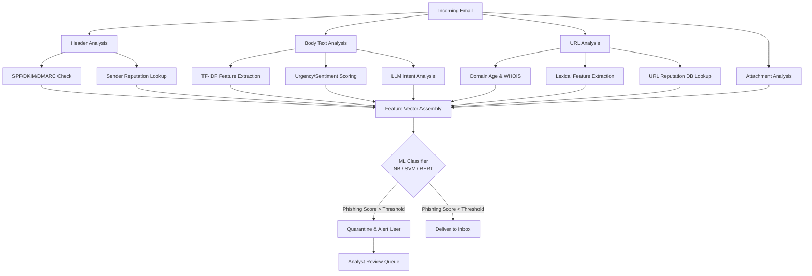

## Phishing and Spam Detection

## Overview

Phishing remains one of the most effective attack vectors in cybersecurity. According to the FBI's Internet Crime Complaint Center, phishing attacks caused over $10 billion in losses in 2022 alone. Attackers craft emails, messages, and websites that impersonate trusted entities — banks, employers, cloud services — to trick victims into revealing credentials, installing malware, or transferring funds. Spam, while less targeted, floods inboxes with unwanted content and often serves as the delivery mechanism for phishing campaigns.

Traditional rule-based filters — blacklists, keyword matching, regular expressions — were the first line of defense. They work against bulk spam but fail against sophisticated phishing, especially spear-phishing where attackers personalize messages using information harvested from social media, corporate websites, or data breaches. An email that reads "Hi Sarah, here's the Q3 budget report you asked about" and comes from a lookalike domain (`cfo@company-inc.com` instead of `cfo@companyinc.com`) easily bypasses keyword filters.

Machine learning transformed email security by learning to distinguish legitimate messages from malicious ones based on hundreds of features extracted from the email itself. These features fall into several categories. **Header features** include sender reputation, SPF/DKIM/DMARC authentication results, routing hops, and reply-to mismatches. **Body features** include text sentiment, urgency language ("act now", "account suspended"), grammatical anomalies, and HTML/text ratio. **URL features** include domain age, registration information, URL length, use of IP addresses instead of domains, URL shortener usage, and certificate validity. **Behavioral features** include sender-recipient relationship history and sending patterns.

Classical ML approaches like Naive Bayes and Support Vector Machines (SVMs) perform well on these handcrafted features. Naive Bayes, rooted in Bayes' theorem, computes the probability of an email being phishing given its features:

$$P(\text{phish} \mid \mathbf{x}) = \frac{P(\mathbf{x} \mid \text{phish}) \cdot P(\text{phish})}{P(\mathbf{x})}$$

The "naive" conditional independence assumption — that each feature contributes independently — is unrealistic but works surprisingly well in practice. SVMs find optimal hyperplanes separating legitimate from malicious emails in high-dimensional feature space, handling the curse of dimensionality gracefully with kernel tricks.

Modern approaches use transformer-based models like BERT to analyze email text directly, capturing semantic nuances that handcrafted features miss. A BERT-based classifier can understand that "Please review the attached invoice" following a conversation about a real project is likely legitimate, while the same sentence from an unknown sender with a suspicious attachment is likely phishing. Fine-tuning BERT on labeled phishing datasets yields classifiers with F1 scores exceeding 0.98 on benchmark datasets.

LLMs add a new dimension to both attack and defense. Attackers use LLMs to generate grammatically flawless, contextually appropriate phishing emails at scale — eliminating the spelling and grammar errors that once served as telltale signs. Defenders leverage LLMs to analyze email intent, detect social engineering patterns, and flag messages that attempt to manipulate recipients through urgency, authority, or reciprocity. The paper "Blind Spots in the Guard: Domain-Camouflaged Injection Attacks Evade Detection in Multi-Agent LLM Systems" demonstrates how multi-agent LLM systems used for security filtering can themselves be vulnerable to prompt injection attacks that camouflage malicious instructions within seemingly benign domains — a reminder that AI defenses introduce their own attack surface.

URL analysis is another critical component. Phishing URLs often use typosquatting (e.g., `g00gle.com`), subdomain abuse (`login.bank.attacker.com`), or path manipulation. ML models analyze URL lexical features — character distribution, entropy, n-gram frequencies — alongside WHOIS data and page content to classify URLs as benign or malicious. The MITRE ATT&CK framework catalogs phishing under the Initial Access tactic (technique T1566), with sub-techniques covering spear-phishing via attachment (T1566.001), link (T1566.002), and service (T1566.003), providing structured knowledge for building detection signatures.

## Key Concepts

- **Feature Extraction**: Deriving structured signals from raw emails — headers, body text, URLs, metadata — for classification.
- **Naive Bayes Classifier**: A probabilistic model that applies Bayes' theorem with independence assumptions to classify emails.
- **Support Vector Machines (SVM)**: A discriminative model that finds maximum-margin decision boundaries in feature space.
- **BERT-based Classification**: Fine-tuning pretrained language models on phishing datasets for semantic understanding of email content.
- **Spear-Phishing**: Targeted phishing attacks personalized to specific individuals using OSINT reconnaissance.
- **URL Reputation Analysis**: Evaluating URLs based on domain age, registration patterns, lexical features, and content analysis.
- **MITRE ATT&CK T1566**: The phishing technique entry in the ATT&CK framework covering attachment, link, and service-based phishing.
- **Domain-Camouflaged Injection**: Attacks that embed malicious prompts within legitimate-seeming content to evade LLM-based filters.

## Code Examples

A phishing email classifier using NLP features and scikit-learn:

```python
import re
import numpy as np
from sklearn.feature_extraction.text import TfidfVectorizer
from sklearn.naive_bayes import MultinomialNB
from sklearn.svm import LinearSVC
from sklearn.pipeline import Pipeline
from sklearn.model_selection import cross_val_score

def extract_email_features(email_text: str) -> dict:
    """Extract handcrafted features from email text."""
    urgency_words = ["urgent", "immediately", "act now", "suspend",
                     "verify", "expire", "unauthorized", "click here"]
    urls = re.findall(r'https?://[^\s<>"]+', email_text)
    text_lower = email_text.lower()

    features = {
        "urgency_score": sum(1 for w in urgency_words if w in text_lower),
        "url_count": len(urls),
        "has_ip_url": any(re.search(r'https?://\d+\.\d+\.\d+\.\d+', u) for u in urls),
        "avg_word_length": np.mean([len(w) for w in text_lower.split()] or [0]),
        "exclamation_count": text_lower.count("!"),
        "html_tag_count": len(re.findall(r'<[^>]+>', email_text)),
        "suspicious_domain": any(
            re.search(r'[0O][0O]gle|paypa1|amaz0n|micr0soft', u, re.I)
            for u in urls
        ),
    }
    return features

# Example labeled dataset (body text, label)
emails = [
    ("Dear customer, your account has been suspended. Click here immediately "
     "to verify: http://192.168.1.1/login", 1),
    ("Hi team, the Q3 report is ready for review in the shared drive.", 0),
    ("URGENT: Unauthorized access detected! Act now to secure your account "
     "at http://paypa1-secure.com/verify", 1),
    ("Meeting rescheduled to Thursday at 3pm. Updated invite attached.", 0),
    ("Your package delivery failed. Confirm your address: "
     "http://amaz0n-delivery.tk/confirm", 1),
    ("Reminder: code review for PR #142 is due by end of day Friday.", 0),
]

texts = [e[0] for e in emails]
labels = [e[1] for e in emails]

# TF-IDF + Naive Bayes pipeline
nb_pipeline = Pipeline([
    ("tfidf", TfidfVectorizer(max_features=5000, ngram_range=(1, 2))),
    ("clf", MultinomialNB(alpha=0.1)),
])

# TF-IDF + SVM pipeline
svm_pipeline = Pipeline([
    ("tfidf", TfidfVectorizer(max_features=5000, ngram_range=(1, 2))),
    ("clf", LinearSVC(max_iter=10000)),
])

# Train and evaluate (with a real dataset, use cross_val_score)
nb_pipeline.fit(texts, labels)

# Classify a new email
test_email = "Your bank account will be closed! Verify now: http://b4nk-secure.net"
prediction = nb_pipeline.predict([test_email])
print(f"Prediction: {'PHISHING' if prediction[0] == 1 else 'LEGITIMATE'}")
# Output: Prediction: PHISHING

# Feature analysis on the test email
features = extract_email_features(test_email)
print(f"Extracted features: {features}")
# urgency_score: 1, url_count: 1, suspicious_domain: False, ...
```

## Diagrams

The phishing detection pipeline from raw email to classification decision:



## Case Studies / Applications

- **Google Gmail**: Uses a deep learning model that blocks over 99.9% of spam and phishing emails. Their system processes billions of messages daily and adapts to new attack patterns within hours.
- **Microsoft Defender for Office 365**: Combines ML models with detonation chambers that open attachments and follow URLs in sandboxed environments to detect zero-day phishing campaigns.
- **MITRE ATT&CK Mapping**: Security teams map detected phishing emails to ATT&CK technique T1566 and its sub-techniques, enabling structured threat intelligence sharing and detection coverage analysis.
- **LLM-Powered Spear-Phishing**: Research by Heiding et al. (2024) showed GPT-4-generated phishing emails achieved click-through rates comparable to human-crafted spear-phishing, highlighting the need for AI-powered defenses to keep pace with AI-powered attacks.
- **Domain-Camouflaged Injection**: The paper "Blind Spots in the Guard" shows that multi-agent LLM systems deployed for email filtering can be bypassed when attackers embed injection prompts within content that appears domain-appropriate, underscoring the need for defense-in-depth beyond pure LLM-based filtering.

## Further Reading

- MITRE ATT&CK Phishing Technique: https://attack.mitre.org/techniques/T1566/
- "Blind Spots in the Guard: Domain-Camouflaged Injection Attacks Evade Detection in Multi-Agent LLM Systems" (2025)
- Heiding et al., "Devising and Detecting Phishing: Large Language Models vs. Smaller Human Models" (2024)
- Google AI Blog: "How Gmail Uses ML to Block Spam and Phishing"
- APWG Phishing Activity Trends Reports: https://apwg.org/trendsreports/
