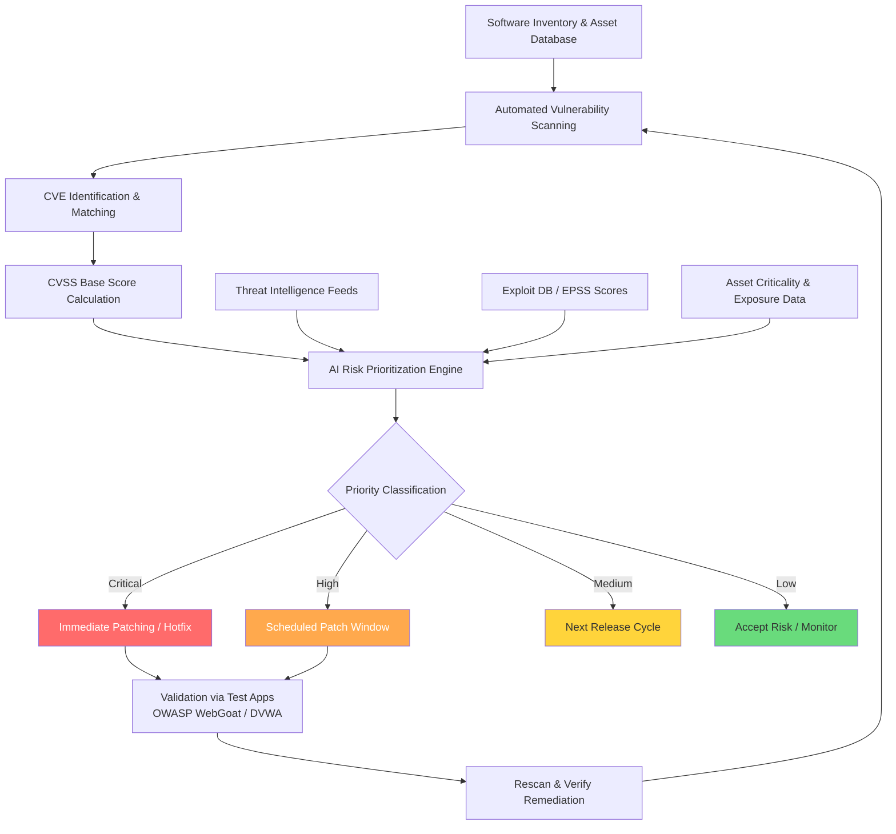

# Vulnerability Assessment with AI

## Overview

Every piece of software ships with vulnerabilities. The National Vulnerability Database (NVD) catalogs over 200,000 CVEs (Common Vulnerabilities and Exposures), and thousands more are discovered each year. For organizations running hundreds of applications across thousands of servers, the challenge is not just finding vulnerabilities — it is prioritizing which ones to fix first. AI is transforming vulnerability assessment from a manual, reactive process into an automated, predictive discipline.

Traditional vulnerability scanning tools like Nessus, OpenVAS, and Qualys compare software versions against known CVE databases and run signature-based checks. They excel at detecting known vulnerabilities but generate overwhelming numbers of findings. A typical enterprise scan might return tens of thousands of CVEs, most of which pose minimal actual risk in context. Security teams drown in alerts, and critical vulnerabilities get lost in the noise.

The Common Vulnerability Scoring System (CVSS) provides a standardized severity metric. A CVSS vector encodes attack characteristics:

$$\text{CVSS Score} = f(\text{AV}, \text{AC}, \text{PR}, \text{UI}, \text{S}, \text{C}, \text{I}, \text{A})$$

where AV is Attack Vector (network, adjacent, local, physical), AC is Attack Complexity, PR is Privileges Required, UI is User Interaction, S is Scope, and C/I/A represent Confidentiality, Integrity, and Availability impact. Base scores range from 0.0 to 10.0. However, CVSS alone is insufficient for prioritization — a CVSS 9.8 vulnerability in an isolated test server matters less than a CVSS 7.5 vulnerability in a public-facing payment system.

AI-powered prioritization models incorporate contextual factors beyond CVSS: asset criticality, network exposure, exploit availability, threat intelligence feeds, and historical exploitation data. The Exploit Prediction Scoring System (EPSS) uses machine learning to estimate the probability that a CVE will be exploited in the wild within the next 30 days. EPSS models are trained on features including CVE age, CVSS metrics, vendor, CWE type, and references to exploit code or proof-of-concept publications. Research shows EPSS outperforms CVSS alone for prioritization, reducing remediation workload by over 80% while covering the same fraction of exploited vulnerabilities.

Static analysis with ML takes vulnerability detection deeper into the code itself. Traditional static analyzers use rule-based pattern matching — they know that `strcpy(buf, user_input)` without bounds checking is dangerous. ML-enhanced analyzers learn vulnerability patterns from labeled datasets of vulnerable and patched code. Models like CodeBERT and StarCoder, fine-tuned on vulnerability datasets, can identify subtle issues like time-of-check-time-of-use (TOCTOU) races, integer overflow conditions, and improper input validation that rule-based tools miss.

AI-guided fuzzing represents another frontier. Traditional fuzzers like AFL generate random or mutated inputs and monitor programs for crashes. AI-guided fuzzers use reinforcement learning or neural networks to generate inputs more likely to trigger deep code paths and edge cases. Google's FuzzBench benchmark shows that ML-guided fuzzers achieve higher code coverage faster than purely random approaches. The fitness function for guided fuzzing can be expressed as maximizing:

$$\mathcal{F}(s) = \alpha \cdot \text{Coverage}(s) + \beta \cdot \text{BugDensity}(s) + \gamma \cdot \text{Novelty}(s)$$

where $s$ is the input seed, and $\alpha, \beta, \gamma$ are tunable weights balancing exploration vs. exploitation.

Threat modeling validation connects vulnerability assessment to real-world attack paths. The MITRE ATT&CK framework maps vulnerabilities to attack techniques — a SQL injection vulnerability (CWE-89) maps to ATT&CK technique T1190 (Exploit Public-Facing Application). Vulnerable test applications like OWASP WebGoat, DVWA, and Juice Shop serve as ground truth for validating that AI-powered scanners actually detect the vulnerabilities they claim to find, a critical step often overlooked in tool evaluation.

## Key Concepts

- **CVE (Common Vulnerabilities and Exposures)**: A standardized identifier for publicly known software vulnerabilities.
- **CVSS (Common Vulnerability Scoring System)**: A framework for rating vulnerability severity on a 0.0-10.0 scale based on exploitability and impact metrics.
- **EPSS (Exploit Prediction Scoring System)**: An ML model that predicts the probability of a CVE being exploited in the wild.
- **Static Analysis with ML**: Using trained models to detect vulnerability patterns in source code without executing it.
- **AI-Guided Fuzzing**: Using ML to generate smarter test inputs that maximize code coverage and bug discovery.
- **Patch Prioritization**: Ranking vulnerabilities by actual risk (exploitability, asset value, exposure) rather than severity score alone.
- **Threat Modeling Validation**: Testing AI scanners against known-vulnerable applications to verify detection accuracy.

## Code Examples

A CVE analysis and prioritization system using CVSS and EPSS-like scoring:

```python
import json
from dataclasses import dataclass

@dataclass
class CVEEntry:
    cve_id: str
    description: str
    cvss_score: float
    attack_vector: str   # NETWORK, ADJACENT, LOCAL, PHYSICAL
    exploit_available: bool
    asset_criticality: float  # 0.0 - 1.0 (business importance)
    network_exposure: str     # EXTERNAL, INTERNAL, ISOLATED

def compute_risk_priority(cve: CVEEntry) -> float:
    """
    Compute a contextual risk priority score combining CVSS,
    exploit availability, asset criticality, and network exposure.
    Inspired by EPSS-style probability estimation.
    """
    # Base score from CVSS (normalized to 0-1)
    base = cve.cvss_score / 10.0

    # Exploit availability multiplier
    exploit_mult = 1.5 if cve.exploit_available else 0.7

    # Network exposure weight
    exposure_weights = {"EXTERNAL": 1.0, "INTERNAL": 0.5, "ISOLATED": 0.1}
    exposure = exposure_weights.get(cve.network_exposure, 0.5)

    # Attack vector weight (remote attacks are higher risk)
    av_weights = {"NETWORK": 1.0, "ADJACENT": 0.7, "LOCAL": 0.4, "PHYSICAL": 0.1}
    av_score = av_weights.get(cve.attack_vector, 0.5)

    # Combined priority score
    priority = base * exploit_mult * exposure * av_score * (0.5 + 0.5 * cve.asset_criticality)
    return round(min(priority, 1.0), 4)


# Example vulnerability inventory
vulnerabilities = [
    CVEEntry("CVE-2024-3094", "XZ Utils backdoor (supply chain)",
             cvss_score=10.0, attack_vector="NETWORK",
             exploit_available=True, asset_criticality=0.9,
             network_exposure="EXTERNAL"),
    CVEEntry("CVE-2023-44487", "HTTP/2 Rapid Reset DDoS",
             cvss_score=7.5, attack_vector="NETWORK",
             exploit_available=True, asset_criticality=0.7,
             network_exposure="EXTERNAL"),
    CVEEntry("CVE-2024-1001", "Local privilege escalation in dev tool",
             cvss_score=7.8, attack_vector="LOCAL",
             exploit_available=False, asset_criticality=0.2,
             network_exposure="ISOLATED"),
    CVEEntry("CVE-2024-2002", "SQL injection in internal admin panel",
             cvss_score=9.1, attack_vector="NETWORK",
             exploit_available=False, asset_criticality=0.6,
             network_exposure="INTERNAL"),
]

# Prioritize
scored = [(cve, compute_risk_priority(cve)) for cve in vulnerabilities]
scored.sort(key=lambda x: x[1], reverse=True)

print("Vulnerability Priority Ranking:")
print(f"{'Rank':<5} {'CVE ID':<18} {'CVSS':<6} {'Priority':<10} {'Action'}")
print("-" * 65)
for rank, (cve, priority) in enumerate(scored, 1):
    action = "PATCH NOW" if priority > 0.7 else "SCHEDULE" if priority > 0.3 else "MONITOR"
    print(f"{rank:<5} {cve.cve_id:<18} {cve.cvss_score:<6} {priority:<10} {action}")

# Output:
# Rank  CVE ID             CVSS   Priority   Action
# -----------------------------------------------------------------
# 1     CVE-2024-3094      10.0   1.0        PATCH NOW
# 2     CVE-2023-44487     7.5    0.9563     PATCH NOW
# 3     CVE-2024-2002      9.1    0.5096     SCHEDULE
# 4     CVE-2024-1001      7.8    0.0328     MONITOR
```

## Diagrams

The AI-powered vulnerability assessment workflow:



## Case Studies / Applications

- **EPSS in Practice**: The FIRST.org EPSS model, trained on historical exploitation data, demonstrated that only 5% of published CVEs are ever exploited. By focusing on high-EPSS vulnerabilities, organizations reduce remediation workload by 80%+ while maintaining the same security coverage.
- **Google OSS-Fuzz**: Google's continuous fuzzing platform uses AI-guided fuzzing to test open-source projects. It has found over 10,000 vulnerabilities in 1,000+ projects including OpenSSL, FFmpeg, and the Linux kernel.
- **MITRE ATT&CK for Vulnerability Mapping**: Security teams map CVEs to ATT&CK techniques (e.g., CVE-2021-44228 / Log4Shell maps to T1190 Exploit Public-Facing Application) to understand how vulnerabilities fit into real attack chains.
- **Threat Modeling Validation**: Organizations use deliberately vulnerable applications (OWASP Juice Shop, DVWA, WebGoat) as ground truth benchmarks to validate that AI-powered scanners achieve acceptable detection rates before deploying them in production environments.

## Further Reading

- NIST National Vulnerability Database: https://nvd.nist.gov/
- FIRST EPSS Model: https://www.first.org/epss/
- CVSS v3.1 Specification: https://www.first.org/cvss/v3.1/specification-document
- MITRE ATT&CK Framework: https://attack.mitre.org/
- OWASP Vulnerable Web Applications Directory: https://owasp.org/www-project-vulnerable-web-applications-directory/
- Google OSS-Fuzz: https://github.com/google/oss-fuzz
