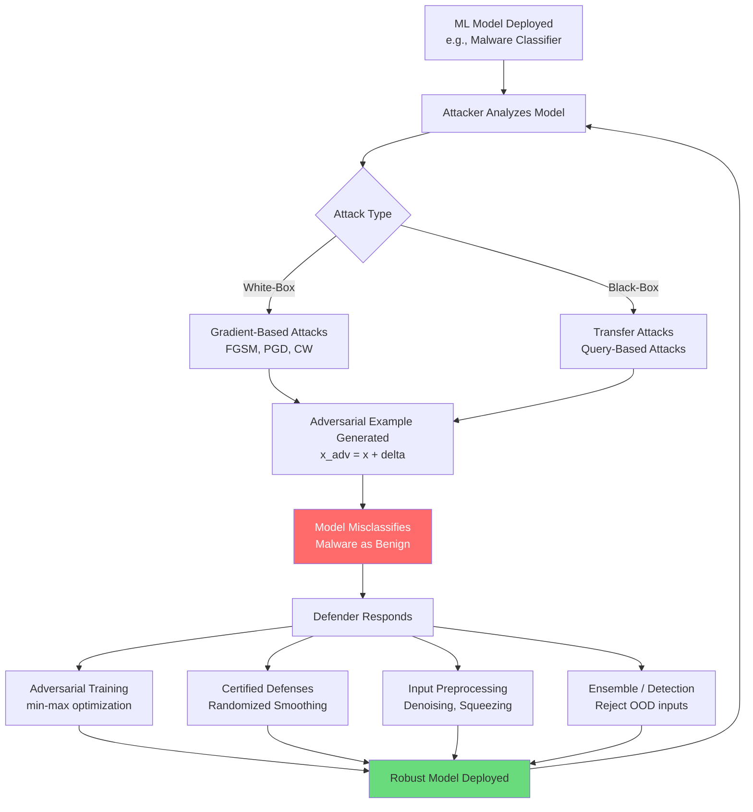

# Adversarial Machine Learning

## Overview

Machine learning models are powerful but brittle. Small, carefully crafted perturbations to inputs — imperceptible to humans — can cause state-of-the-art classifiers to produce wildly incorrect outputs with high confidence. This phenomenon, known as adversarial examples, poses a fundamental challenge to deploying ML in security-critical applications like malware detection, intrusion detection, and autonomous systems.

An adversarial example is formally defined as:

$$x_{\text{adv}} = x + \delta \quad \text{where} \quad \|\delta\|_p \leq \epsilon$$

Here $x$ is the original input, $\delta$ is the adversarial perturbation, and $\epsilon$ bounds the perturbation magnitude under an $L_p$ norm. The constraint ensures the perturbation is small enough to be imperceptible (for images) or functionally equivalent (for malware). The $L_\infty$ norm bounds the maximum change to any single feature, while the $L_2$ norm bounds the overall Euclidean magnitude.

The Fast Gradient Sign Method (FGSM), introduced by Goodfellow et al. (2014), generates adversarial examples in a single step by following the gradient of the loss function:

$$x_{\text{adv}} = x + \epsilon \cdot \text{sign}(\nabla_x J(\theta, x, y))$$

where $J(\theta, x, y)$ is the loss function (e.g., cross-entropy), $\theta$ represents model parameters, and $y$ is the true label. FGSM is fast but produces suboptimal perturbations. Projected Gradient Descent (PGD), introduced by Madry et al. (2018), iterates FGSM multiple times with smaller step sizes:

$$x^{t+1} = \Pi_{x + \mathcal{S}} \left( x^t + \alpha \cdot \text{sign}(\nabla_x J(\theta, x^t, y)) \right)$$

where $\Pi$ projects back onto the allowed perturbation set $\mathcal{S}$ (the $\epsilon$-ball around $x$) and $\alpha$ is the step size. PGD is considered the strongest first-order attack and serves as the standard benchmark for evaluating robustness.

In cybersecurity, adversarial ML has immediate practical implications. Malware classifiers that analyze PE file features, API call sequences, or raw bytes can be evaded by modifying non-functional parts of malware binaries — adding benign imports, padding sections, or modifying headers — to shift the feature vector into the "benign" region of the classifier's decision space. Research has demonstrated evasion rates exceeding 60% against commercial antivirus engines using gradient-based perturbations on malware feature representations.

The threat extends beyond malware. Network intrusion detection systems (NIDS) that use ML to classify traffic can be fooled by adversarially crafted packets. The paper "Adversarial Testing of Learning- and Non-Learning-Based Congestion Controllers" demonstrates that even network congestion control algorithms — both ML-based (like Aurora and Orca) and traditional (like CUBIC and BBR) — are vulnerable to adversarial traffic patterns. Adversarial agents can degrade throughput of learning-based controllers by 40-50% by strategically manipulating network conditions, revealing that the adversarial threat extends well beyond classification tasks.

Adversarial training is the most widely adopted defense. The model is trained on a mixture of clean and adversarial examples, solving a min-max optimization:

$$\min_\theta \mathbb{E}_{(x,y) \sim D} \left[ \max_{\|\delta\|_p \leq \epsilon} J(\theta, x + \delta, y) \right]$$

This formulation explicitly trains the model to be robust against worst-case perturbations. While adversarial training increases robustness significantly, it typically reduces clean accuracy by 2-10% — a fundamental tension between standard and robust performance.

Certified defenses go further by providing mathematical guarantees. Randomized smoothing, for instance, certifies that a classifier's prediction is provably unchanged for any perturbation within a certified radius $r$. If the base classifier predicts class $c_A$ with probability $p_A$ under Gaussian noise, the certified $L_2$ radius is:

$$r = \frac{\sigma}{2} \left( \Phi^{-1}(p_A) - \Phi^{-1}(p_B) \right)$$

where $\sigma$ is the noise level, $\Phi^{-1}$ is the inverse Gaussian CDF, and $p_B$ is the runner-up class probability.

The CleverHans library, originally developed by Goodfellow and Papernot, provides reference implementations of adversarial attacks and defenses. It supports FGSM, PGD, CW attacks, and more, serving as both a research tool and a practical adversarial testing framework. Security teams use CleverHans (and its successors like Adversarial Robustness Toolbox) to red-team their models before deployment, evaluating robustness against known attack algorithms.

## Key Concepts

- **Adversarial Examples**: Inputs crafted with small perturbations ($\|\delta\|_p \leq \epsilon$) that cause ML models to misclassify.
- **FGSM (Fast Gradient Sign Method)**: A single-step attack that perturbs inputs along the sign of the loss gradient.
- **PGD (Projected Gradient Descent)**: An iterative attack that applies FGSM repeatedly with projection, considered the strongest first-order attack.
- **Evasion Attacks**: Adversarial attacks at inference time, designed to cause misclassification of malicious inputs as benign.
- **Adversarial Training**: A defense strategy that augments training data with adversarial examples via min-max optimization.
- **Certified Robustness**: Mathematical guarantees that a classifier's prediction is stable within a provable perturbation radius.
- **CleverHans / ART**: Open-source libraries for implementing and evaluating adversarial attacks and defenses.
- **Transferability**: The property that adversarial examples crafted for one model often fool different models, enabling black-box attacks.

## Code Examples

Demonstrating the FGSM attack on a simple neural network using PyTorch:

```python
import torch
import torch.nn as nn
import torch.nn.functional as F
import numpy as np

class SimpleClassifier(nn.Module):
    """A small network for demonstration (e.g., malware feature classifier)."""
    def __init__(self, input_dim=20, hidden_dim=64, num_classes=2):
        super().__init__()
        self.fc1 = nn.Linear(input_dim, hidden_dim)
        self.fc2 = nn.Linear(hidden_dim, hidden_dim)
        self.fc3 = nn.Linear(hidden_dim, num_classes)

    def forward(self, x):
        x = F.relu(self.fc1(x))
        x = F.relu(self.fc2(x))
        return self.fc3(x)

def fgsm_attack(model: nn.Module, x: torch.Tensor, y: torch.Tensor,
                epsilon: float) -> torch.Tensor:
    """
    Fast Gradient Sign Method (FGSM) attack.
    x_adv = x + epsilon * sign(grad_x J(theta, x, y))
    """
    x_adv = x.clone().detach().requires_grad_(True)
    logits = model(x_adv)
    loss = F.cross_entropy(logits, y)
    loss.backward()

    # Perturbation: step in the direction that maximizes loss
    perturbation = epsilon * x_adv.grad.sign()
    x_adv = x_adv + perturbation
    return x_adv.detach()

def pgd_attack(model: nn.Module, x: torch.Tensor, y: torch.Tensor,
               epsilon: float, alpha: float = 0.01,
               num_steps: int = 40) -> torch.Tensor:
    """
    Projected Gradient Descent (PGD) attack.
    Iterative FGSM with projection onto the epsilon-ball.
    """
    x_adv = x.clone().detach() + torch.empty_like(x).uniform_(-epsilon, epsilon)
    x_adv = x_adv.clamp(0, 1)

    for _ in range(num_steps):
        x_adv.requires_grad_(True)
        logits = model(x_adv)
        loss = F.cross_entropy(logits, y)
        loss.backward()

        # Gradient step
        x_adv = x_adv.detach() + alpha * x_adv.grad.sign()

        # Project back onto epsilon-ball around original x
        delta = torch.clamp(x_adv - x, min=-epsilon, max=epsilon)
        x_adv = torch.clamp(x + delta, 0, 1)

    return x_adv.detach()

# Demonstration
torch.manual_seed(42)
model = SimpleClassifier(input_dim=20)
model.eval()

# Simulated malware feature vector (normalized to [0, 1])
x_malware = torch.rand(1, 20)
y_true = torch.tensor([1])  # 1 = malware

# Original prediction
with torch.no_grad():
    orig_logits = model(x_malware)
    orig_pred = orig_logits.argmax(dim=1).item()
    orig_conf = F.softmax(orig_logits, dim=1).max().item()
print(f"Original prediction: class {orig_pred} (confidence: {orig_conf:.3f})")

# FGSM attack with epsilon = 0.1
x_fgsm = fgsm_attack(model, x_malware, y_true, epsilon=0.1)
with torch.no_grad():
    fgsm_logits = model(x_fgsm)
    fgsm_pred = fgsm_logits.argmax(dim=1).item()
    fgsm_conf = F.softmax(fgsm_logits, dim=1).max().item()
print(f"FGSM prediction:    class {fgsm_pred} (confidence: {fgsm_conf:.3f})")

# Perturbation magnitude
l_inf = (x_fgsm - x_malware).abs().max().item()
l_2 = (x_fgsm - x_malware).norm(p=2).item()
print(f"Perturbation: L_inf={l_inf:.4f}, L_2={l_2:.4f}")

# PGD attack (stronger)
x_pgd = pgd_attack(model, x_malware, y_true, epsilon=0.1, alpha=0.01, num_steps=40)
with torch.no_grad():
    pgd_logits = model(x_pgd)
    pgd_pred = pgd_logits.argmax(dim=1).item()
    pgd_conf = F.softmax(pgd_logits, dim=1).max().item()
print(f"PGD prediction:     class {pgd_pred} (confidence: {pgd_conf:.3f})")
```

## Diagrams

The adversarial attack and defense cycle:



## Case Studies / Applications

- **Malware Evasion**: Researchers demonstrated that gradient-based perturbations on PE file feature vectors can evade commercial AV engines (including those using ML) with over 60% success rate, by modifying non-functional binary sections like padding, imports, and section names.
- **Adversarial Congestion Control**: The paper "Adversarial Testing of Learning- and Non-Learning-Based Congestion Controllers" shows that adversarial traffic patterns can degrade throughput of ML-based congestion controllers (Aurora, Orca) by 40-50%, and even classical algorithms (CUBIC, BBR) are vulnerable — demonstrating adversarial threats extend beyond classification to control systems.
- **CleverHans and ART**: The CleverHans library (Papernot et al.) provides reference implementations of FGSM, PGD, Carlini-Wagner, and other attacks. IBM's Adversarial Robustness Toolbox (ART) extends this with defenses and supports frameworks including PyTorch, TensorFlow, and scikit-learn.
- **Autonomous Vehicle Attacks**: Adversarial patches placed on stop signs have been shown to cause misclassification by vision models (e.g., reading a stop sign as a speed limit sign), highlighting real-world safety implications.
- **LLM Prompt Injection**: Adversarial ML principles extend to language models. The paper "Blind Spots in the Guard" shows that domain-camouflaged injection attacks can evade detection in multi-agent LLM systems, connecting classical adversarial ML to emerging LLM security challenges.

## Further Reading

- Goodfellow et al., "Explaining and Harnessing Adversarial Examples" (2014): https://arxiv.org/abs/1412.6572
- Madry et al., "Towards Deep Learning Models Resistant to Adversarial Attacks" (2018): https://arxiv.org/abs/1706.06083
- CleverHans Library: https://github.com/cleverhans-lab/cleverhans
- IBM Adversarial Robustness Toolbox: https://github.com/Trusted-AI/adversarial-robustness-toolbox
- "Adversarial Testing of Learning- and Non-Learning-Based Congestion Controllers" (2024)
- "Blind Spots in the Guard: Domain-Camouflaged Injection Attacks Evade Detection in Multi-Agent LLM Systems" (2025)
- Cohen et al., "Certified Adversarial Robustness via Randomized Smoothing" (2019): https://arxiv.org/abs/1902.02918
