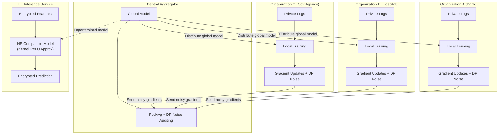

# Privacy-Preserving ML for Security

## Overview

Modern cybersecurity depends on sharing threat intelligence across organizations. When one bank detects a novel phishing campaign, every other bank benefits from knowing the indicators of compromise immediately. Yet sharing raw security logs means exposing sensitive customer data, internal network topologies, and proprietary detection logic. This tension between **collaborative defense** and **data privacy** is one of the defining challenges of applied AI in cybersecurity.

Privacy-preserving machine learning (PPML) offers a family of techniques that let multiple parties train models, run inference, and exchange threat signals — all without revealing the underlying data. The four pillars of PPML in security are federated learning, differential privacy, homomorphic encryption, and secure multi-party computation. Each trades off computation cost, model accuracy, and privacy guarantees differently, and modern systems often combine several of them.

**Federated learning (FL)** keeps each organization's data on-premises. A central aggregator sends a global model to each participant; each participant trains on local data and returns only gradient updates. The aggregator merges updates (typically via FedAvg) and redistributes the improved model. For threat detection this is powerful: a consortium of hospitals can collaboratively train a ransomware classifier without any hospital sharing patient records or network logs. The key mathematical operation is weighted averaging of local model parameters:

$$w_{t+1} = \sum_{k=1}^{K} \frac{n_k}{n} w_{t+1}^k$$

where $w_{t+1}^k$ is the updated weight vector from participant $k$, $n_k$ is that participant's local dataset size, and $n$ is the total across all participants.

**Differential privacy (DP)** adds calibrated noise to query outputs or gradient updates so that no single data record materially changes the result. The Laplace mechanism is the classic approach: given a function $f$ with sensitivity $\Delta f$, the privatized output is:

$$\tilde{f}(x) = f(x) + \text{Lap}\!\left(\frac{\Delta f}{\epsilon}\right)$$

Here $\epsilon$ is the privacy budget — smaller $\epsilon$ means stronger privacy but more noise. In federated security systems, DP is applied to gradient updates before transmission, preventing a malicious aggregator from reconstructing any participant's raw data.

**Homomorphic encryption (HE)** allows computation directly on encrypted data. A security operations center can send encrypted network flow features to a cloud-hosted ML model; the model runs inference on ciphertexts and returns an encrypted prediction that only the SOC can decrypt. The main bottleneck has been that standard neural-network activations like ReLU are non-polynomial and therefore incompatible with HE schemes (which support only addition and multiplication on ciphertexts). Recent work on **kernel-based ReLU approximation** (see Further Reading) addresses this by replacing ReLU with low-degree polynomial approximations derived from kernel methods, achieving accuracy within 1-2% of plaintext models while remaining fully HE-compatible. This makes encrypted inference on deep networks practical for the first time in production security pipelines.

**Secure multi-party computation (SMPC)** lets $N$ parties jointly compute a function over their combined inputs without any party learning another's input. In threat intelligence, SMPC enables "private set intersection" — two organizations can discover which IP addresses appear in both their blocklists without revealing the rest of their lists.

Finally, **privacy-aware KV cache sharing** is an emerging concern as large language models enter security workflows. The CachePrune framework (see Further Reading) enables efficient LLM inference across tenants by sharing key-value caches while pruning tokens that could leak sensitive context. This is directly relevant for security teams running shared LLM-based log analysis services where queries from different business units must remain isolated.

---

## Key Concepts

- **Federated Learning (FL)**: Collaborative model training without centralizing data; gradient updates are shared instead of raw records.
- **Differential Privacy (DP)**: Mathematical guarantee that individual records cannot be reverse-engineered from model outputs; controlled by privacy budget $\epsilon$.
- **Homomorphic Encryption (HE)**: Computation on ciphertexts; kernel-based ReLU approximation enables deep learning inference on encrypted security data.
- **Secure Multi-Party Computation (SMPC)**: Joint computation (e.g., private set intersection of threat indicators) without revealing individual inputs.
- **Privacy-aware KV Cache Sharing**: Fine-grained pruning of cached LLM tokens to prevent cross-tenant data leakage during shared inference (CachePrune).

---

## Code Examples

### Federated Learning Simulation for Threat Detection

The following example simulates three organizations collaboratively training a simple intrusion detection model using federated averaging. Each organization holds a private dataset of network flow features and labels.

```python
import numpy as np

# --- Simulate private datasets for 3 organizations ---
np.random.seed(42)

def generate_org_data(n_samples=200, malicious_ratio=0.3):
    """Generate synthetic network flow features: [bytes_sent, packets, duration]."""
    n_mal = int(n_samples * malicious_ratio)
    n_ben = n_samples - n_mal
    benign = np.random.normal(loc=[500, 10, 30], scale=[100, 3, 10], size=(n_ben, 3))
    malicious = np.random.normal(loc=[1500, 50, 5], scale=[300, 15, 2], size=(n_mal, 3))
    X = np.vstack([benign, malicious])
    y = np.array([0] * n_ben + [1] * n_mal)
    return X, y

org_datasets = [generate_org_data() for _ in range(3)]

# --- Simple logistic regression model (no frameworks needed) ---
def sigmoid(z):
    return 1.0 / (1.0 + np.exp(-np.clip(z, -500, 500)))

def local_train(X, y, weights, lr=0.01, epochs=5):
    """Train locally and return updated weights."""
    w = weights.copy()
    for _ in range(epochs):
        preds = sigmoid(X @ w[:-1] + w[-1])
        error = preds - y
        grad_w = X.T @ error / len(y)
        grad_b = error.mean()
        w[:-1] -= lr * grad_w
        w[-1] -= lr * grad_b
    return w

def add_dp_noise(weights, epsilon=1.0, sensitivity=1.0):
    """Apply Laplace mechanism for differential privacy."""
    noise = np.random.laplace(0, sensitivity / epsilon, size=weights.shape)
    return weights + noise

def federated_average(weight_list, sample_counts):
    """FedAvg: weighted average of model parameters."""
    total = sum(sample_counts)
    return sum(w * (n / total) for w, n in zip(weight_list, sample_counts))

# --- Federated training loop ---
global_weights = np.zeros(4)  # 3 features + 1 bias

for round_num in range(10):
    local_weights = []
    sample_counts = []
    for X, y in org_datasets:
        updated = local_train(X, y, global_weights)
        noisy = add_dp_noise(updated, epsilon=2.0)  # DP protection
        local_weights.append(noisy)
        sample_counts.append(len(y))
    global_weights = federated_average(local_weights, sample_counts)

    # Evaluate on combined (simulated) test set
    X_all = np.vstack([d[0] for d in org_datasets])
    y_all = np.concatenate([d[1] for d in org_datasets])
    preds = (sigmoid(X_all @ global_weights[:-1] + global_weights[-1]) > 0.5).astype(int)
    acc = (preds == y_all).mean()
    print(f"Round {round_num + 1:2d} | Global accuracy: {acc:.3f}")
```

This simulation shows the core FL loop: local training, differential-privacy noise injection, and federated averaging. In production, frameworks like PySyft or Flower handle communication, serialization, and secure aggregation.

---

## Diagrams

### Federated Security Architecture



---

## Case Studies / Applications

- **NVIDIA FLARE for healthcare cybersecurity**: Hospitals in a federated consortium trained ransomware detection models while complying with HIPAA, achieving detection rates comparable to centralized training with only a 2% accuracy drop.
- **Google's RAPPOR**: Uses randomized response (a form of local DP) to collect browser telemetry for detecting malicious extensions without tracking individual users.
- **Private threat-intel sharing via SMPC**: The Cyber Threat Alliance uses MPC-inspired protocols so member companies can compare IOC lists without exposing proprietary detection rules.
- **CachePrune in shared SOC LLMs**: Security operations teams deploying shared LLM instances for log summarization use KV cache pruning to prevent analyst queries from leaking context across organizational boundaries.

---

## Further Reading

- McMahan et al., "Communication-Efficient Learning of Deep Networks from Decentralized Data" (FedAvg, 2017)
- Dwork & Roth, "The Algorithmic Foundations of Differential Privacy" (2014)
- **Kernel-Based ReLU Approximation for Homomorphic Encryption-Compatible Privacy-preserving Deep Learning Models** — polynomial activation approximation enabling encrypted neural network inference.
- **CachePrune: Privacy-Aware and Fine-Grained KV Cache Sharing for Efficient LLM Inference** — token-level pruning for cross-tenant LLM privacy.
- Bonawitz et al., "Practical Secure Aggregation for Privacy-Preserving Machine Learning" (Google, 2017)
- PySyft library: [github.com/OpenMined/PySyft](https://github.com/OpenMined/PySyft)
