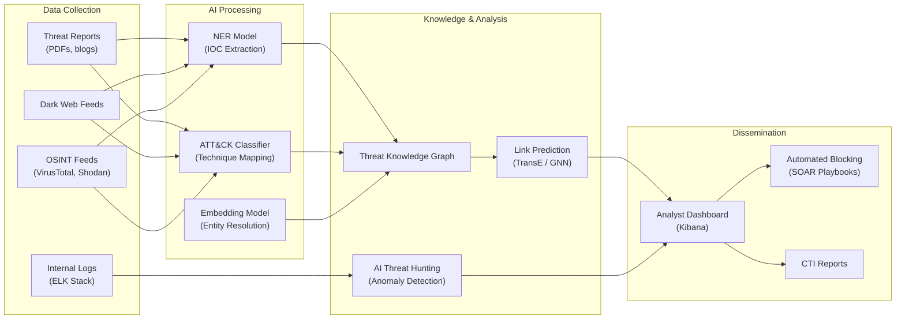
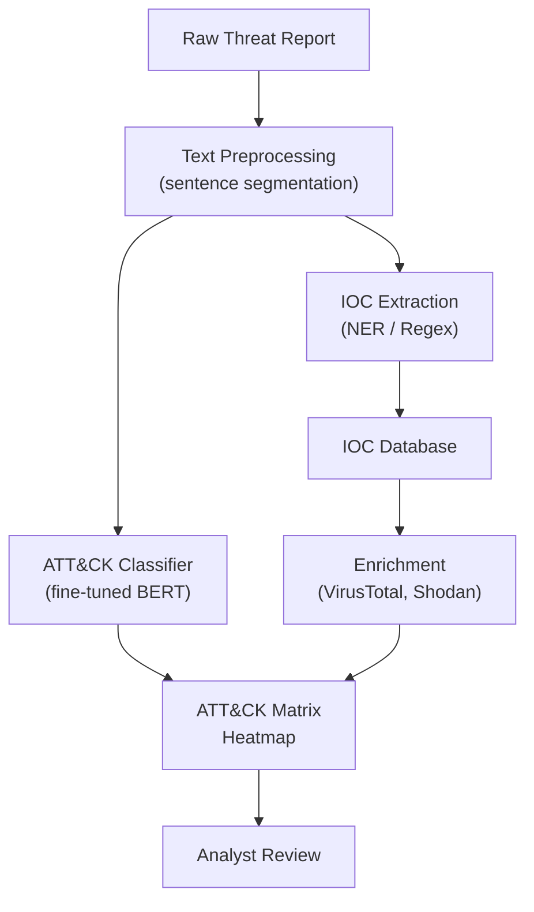

## AI for Threat Intelligence

## Overview

Cyber Threat Intelligence (CTI) is the practice of collecting, analyzing, and operationalizing information about adversary tactics, techniques, and procedures (TTPs). The volume of threat data has grown far beyond what human analysts can process manually: thousands of new CVEs per year, millions of malware samples, and a constant stream of threat reports, dark-web posts, and security advisories. AI — particularly natural language processing and graph-based learning — is transforming every stage of the threat intelligence lifecycle.

The **MITRE ATT&CK framework** is the industry-standard knowledge base that catalogs adversary behaviors across the attack lifecycle. It organizes techniques into a matrix of 14 tactics (e.g., Initial Access, Execution, Persistence, Exfiltration) with hundreds of specific techniques and sub-techniques. Mapping observed activity to ATT&CK is the first step in structured threat intelligence, and AI automates this mapping at scale. NLP models trained on labeled threat reports can classify paragraphs to specific ATT&CK technique IDs (e.g., T1566 for Phishing, T1059 for Command and Scripting Interpreter) with F1 scores exceeding 0.85 on benchmark datasets.

**Indicators of Compromise (IOCs)** — IP addresses, domain names, file hashes, URLs, email addresses — are the atomic units of tactical threat intelligence. Manually extracting IOCs from unstructured reports is tedious and error-prone. Named Entity Recognition (NER) models fine-tuned on cybersecurity corpora can extract IOCs with high precision. The key challenge is distinguishing between benign mentions (e.g., "google.com" used as an example) and actual malicious indicators, which requires contextual understanding that modern transformer-based NER handles well.

**Knowledge graphs** elevate threat intelligence from flat IOC lists to structured, queryable relationships. Nodes represent entities (threat actors, malware families, vulnerabilities, infrastructure), and edges represent relationships (uses, targets, exploits, communicates-with). Graph neural networks and embedding methods like TransE can predict missing links — for example, predicting which threat actor is likely behind a newly observed infrastructure cluster, even before manual attribution. The embedding objective for TransE minimizes:

$$\mathcal{L} = \sum_{(h,r,t) \in S} \sum_{(h',r,t') \in S'} \left[ \gamma + d(\mathbf{h} + \mathbf{r}, \mathbf{t}) - d(\mathbf{h'} + \mathbf{r}, \mathbf{t'}) \right]_+$$

where $(h, r, t)$ are positive triples, $(h', r, t')$ are corrupted negatives, and $d$ is a distance function.

**AI-powered threat hunting** goes beyond reactive detection. Instead of waiting for alerts, hunting models proactively search for anomalous patterns in logs, network telemetry, and endpoint data. Unsupervised approaches (autoencoders, isolation forests) flag unusual behavior; supervised models trained on ATT&CK-labeled data identify specific technique signatures. The integration of AI with the **ELK stack** (Elasticsearch, Logstash, Kibana) enables real-time enrichment: as logs are ingested, ML models classify events, extract IOCs, and map them to ATT&CK techniques, making the data immediately actionable in analyst dashboards.

**Parser-free querying** is an emerging capability where LLMs translate natural-language security questions ("Show me all lateral movement from the finance subnet in the last 48 hours") directly into Elasticsearch or Splunk queries. This dramatically lowers the barrier for junior analysts and speeds up investigations.

---

## Key Concepts

- **MITRE ATT&CK**: Structured knowledge base of adversary tactics, techniques, and procedures (TTPs); the common language for threat intelligence.
- **IOC Extraction**: Using NER models to automatically identify IP addresses, hashes, domains, and URLs from unstructured threat reports.
- **Cyber Threat Intelligence (CTI) Lifecycle**: Direction, Collection, Processing, Analysis, Dissemination, Feedback — AI accelerates every phase.
- **Knowledge Graphs**: Graph-structured representations of threat actor relationships; enable link prediction and attribution.
- **ELK + AI Integration**: Real-time log enrichment using ML classifiers embedded in the Elasticsearch ingest pipeline.
- **Parser-free Querying**: LLM-based natural language to security query translation (e.g., natural language to KQL/SPL).

---

## Code Examples

### Automated IOC Extraction from Threat Reports

This example uses regex-based extraction combined with contextual filtering to pull IOCs from raw threat report text. In production, this would be augmented with a fine-tuned NER model.

```python
import re
from collections import defaultdict

# --- IOC extraction patterns ---
IOC_PATTERNS = {
    "ipv4": r"\b(?:(?:25[0-5]|2[0-4]\d|[01]?\d\d?)\.){3}(?:25[0-5]|2[0-4]\d|[01]?\d\d?)\b",
    "domain": r"\b(?:[a-zA-Z0-9-]+\.)+(?:com|net|org|io|ru|cn|xyz|top|tk|info|biz)\b",
    "md5": r"\b[a-fA-F0-9]{32}\b",
    "sha256": r"\b[a-fA-F0-9]{64}\b",
    "url": r"https?://[^\s\"'>]+",
    "email": r"\b[a-zA-Z0-9._%+-]+@[a-zA-Z0-9.-]+\.[a-zA-Z]{2,}\b",
    "cve": r"CVE-\d{4}-\d{4,7}",
}

# Known benign values to filter out (example allowlist)
ALLOWLIST = {"8.8.8.8", "1.1.1.1", "google.com", "example.com", "microsoft.com"}

# MITRE ATT&CK keyword mapping (simplified)
ATTACK_KEYWORDS = {
    "T1566": ["phishing", "spear-phishing", "malicious attachment", "credential harvesting"],
    "T1059": ["powershell", "command line", "scripting", "cmd.exe", "bash script"],
    "T1071": ["c2 communication", "command and control", "beacon", "http c2"],
    "T1486": ["ransomware", "encrypt files", "ransom note", "data encrypted"],
    "T1040": ["packet capture", "network sniffing", "wireshark", "tcpdump"],
}

def extract_iocs(text: str) -> dict[str, set[str]]:
    """Extract IOCs from unstructured text and filter benign entries."""
    results = defaultdict(set)
    for ioc_type, pattern in IOC_PATTERNS.items():
        matches = re.findall(pattern, text, re.IGNORECASE)
        for match in matches:
            if match.lower() not in ALLOWLIST:
                results[ioc_type].add(match)
    return dict(results)

def map_to_attack(text: str) -> list[tuple[str, str, float]]:
    """Map report text to MITRE ATT&CK techniques via keyword matching."""
    text_lower = text.lower()
    mappings = []
    for technique_id, keywords in ATTACK_KEYWORDS.items():
        hits = sum(1 for kw in keywords if kw in text_lower)
        if hits > 0:
            confidence = min(hits / len(keywords), 1.0)
            mappings.append((technique_id, keywords[0], round(confidence, 2)))
    return sorted(mappings, key=lambda x: -x[2])

# --- Example threat report ---
report = """
APT29 launched a spear-phishing campaign targeting government agencies on 2025-12-01.
The malicious attachment drops a PowerShell loader that contacts the C2 server at
198.51.100.47 over HTTPS. Secondary C2 infrastructure includes evil-domain.xyz
and 203.0.113.99. The payload hash is
e3b0c44298fc1c149afbf4c8996fb92427ae41e4649b934ca495991b7852b855.
Victims are redirected to https://evil-domain.xyz/payload.exe.
Related CVE: CVE-2024-21412. Contact: threat-intel@evil-domain.xyz.
After initial access, the actor used cmd.exe for lateral movement and deployed
ransomware to encrypt files across network shares.
"""

print("=== Extracted IOCs ===")
iocs = extract_iocs(report)
for ioc_type, values in iocs.items():
    for v in values:
        print(f"  [{ioc_type:>8}] {v}")

print("\n=== ATT&CK Mapping ===")
for tech_id, description, conf in map_to_attack(report):
    print(f"  {tech_id} ({description}) — confidence: {conf}")
```

This produces structured output mapping raw text to actionable IOCs and ATT&CK technique IDs. In a production pipeline, the regex extraction would be a first pass, refined by a transformer-based NER model for disambiguation.

---

## Diagrams

### AI-Powered Threat Intelligence Pipeline



### MITRE ATT&CK Mapping Flow



---

## Case Studies / Applications

- **Microsoft Threat Intelligence Center**: Uses transformer-based NLP to automatically classify threat reports to ATT&CK techniques, processing thousands of reports per day that would take analysts weeks manually.
- **VirusTotal + knowledge graphs**: VirusTotal's graph interface links file hashes, domains, and IP addresses into a queryable knowledge graph, enabling analysts to pivot across relationships and discover related infrastructure.
- **CrowdStrike Falcon OverWatch**: Combines ML-based anomaly detection with human threat hunters; the AI identifies suspicious process trees and network connections, then human experts confirm and contextualize findings.
- **ELK + ML for SOC automation**: Security operations centers embed ML models into Elasticsearch ingest pipelines for real-time log classification, reducing mean time to detect (MTTD) by up to 60%.

---

## Further Reading

- MITRE ATT&CK: [attack.mitre.org](https://attack.mitre.org/)
- Bordes et al., "Translating Embeddings for Modeling Multi-relational Data" (TransE, 2013)
- Li et al., "A Survey on Cyber Threat Intelligence" (ACM Computing Surveys, 2023)
- STIX/TAXII standards for structured threat intelligence exchange
- OpenCTI platform: [github.com/OpenCTI-Platform/opencti](https://github.com/OpenCTI-Platform/opencti)
- Elastic ML documentation: [elastic.co/guide/en/machine-learning](https://www.elastic.co/guide/en/machine-learning)
