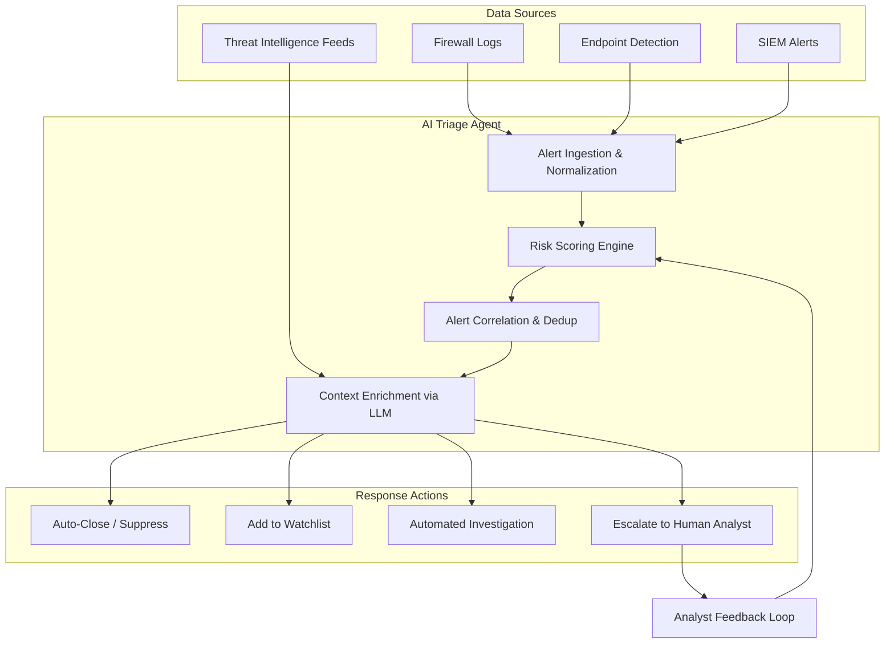
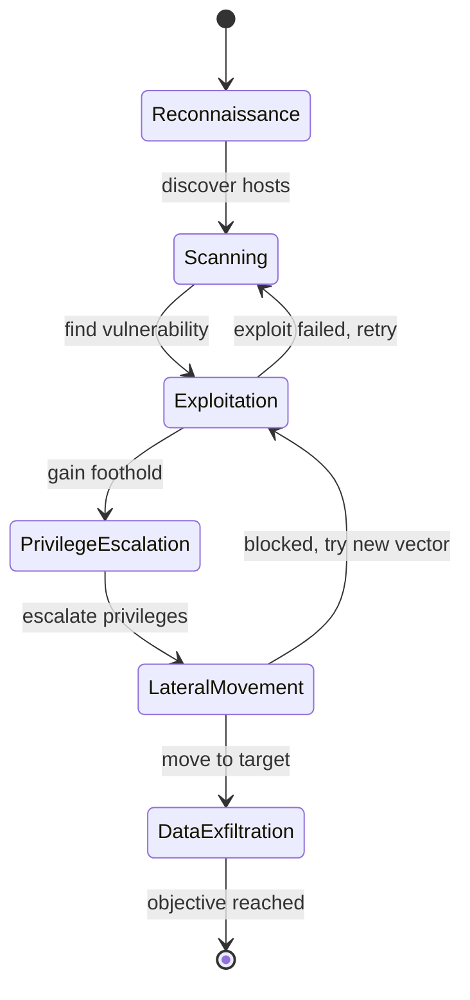

# Autonomous Security Agents

## Overview

Modern Security Operations Centers (SOCs) face an overwhelming volume of alerts — often tens of thousands per day — while skilled analysts are in short supply. Autonomous security agents, powered by large language models (LLMs) and reinforcement learning (RL), represent a paradigm shift from passive detection tools to active, reasoning systems that can triage alerts, correlate incidents, and even conduct offensive security assessments with minimal human oversight.

The core idea is straightforward: rather than presenting a human analyst with a raw stream of alerts from firewalls, endpoint detection, and SIEM systems, an AI agent consumes these signals, reasons about their context and severity, correlates them with known attack patterns, and either resolves the issue autonomously or escalates it with a concise, actionable summary. This dramatically reduces mean-time-to-respond (MTTR) and lets human analysts focus on the most complex, ambiguous threats.

### LLM-Powered Incident Response

LLM-based agents excel at the "reasoning" layer of SOC automation. Given a security alert — say, an unusual outbound connection from a developer workstation — an LLM agent can query asset inventories, check recent vulnerability scan results, correlate with threat intelligence feeds, and produce a structured incident report. Systems like Microsoft Security Copilot and open-source frameworks such as LangChain-based SOC agents demonstrate this pattern in production environments.

The mathematical foundation for alert prioritization often involves a risk score that combines multiple factors:

$$R(a) = w_1 \cdot S(a) + w_2 \cdot V(a) + w_3 \cdot C(a) + w_4 \cdot H(a)$$

where $S(a)$ is the severity from the detection system, $V(a)$ is the vulnerability score of the affected asset (e.g., CVSS), $C(a)$ is a contextual score based on the asset's business criticality, and $H(a)$ is a historical score based on past true/false positive rates for similar alerts. The weights $w_i$ are learned from analyst feedback over time.

### AI-Driven Penetration Testing and RL for Attack Path Exploration

Reinforcement learning provides a natural framework for automated penetration testing. The network is modeled as a state space where each state represents the attacker's current access level and knowledge, actions correspond to exploitation attempts (port scans, credential attacks, privilege escalation), and the reward signal reflects successful lateral movement or data access. Systems like PentestGPT and NASim (Network Attack Simulator) implement this approach.

A particularly compelling research direction is **RL for security protocol analysis**. The work by Cosler et al. on using reinforcement learning with the Tamarin prover demonstrates that RL agents can learn to guide symbolic verification tools, discovering attack traces in security protocols that traditional automated strategies miss. The RL agent learns which proof steps to apply in the Tamarin prover's search space, effectively combining the rigor of formal verification with the exploratory power of learned heuristics. This bridges the gap between AI-driven fuzzing and mathematically provable security guarantees.

### Autonomous Vulnerability Discovery

Beyond penetration testing, AI agents are increasingly used for zero-day vulnerability discovery. Fuzzing frameworks enhanced with ML-guided mutation strategies (like Google's OSS-Fuzz integrated with LLM-suggested inputs) can explore code paths more efficiently than purely random approaches. The agent learns which input mutations are most likely to trigger crashes or unexpected behavior, guided by coverage feedback and reward shaping.

### Challenges: False Positives, Trust, and Autonomy Boundaries

The central tension in autonomous security is **trust**. A false positive in alert triage wastes analyst time; a false negative lets an attacker through. More critically, an autonomous penetration testing agent operating without guardrails could cause real damage to production systems. The field is converging on a "human-on-the-loop" model where agents act autonomously within defined boundaries but escalate to humans for high-impact decisions. Confidence calibration — ensuring the agent knows what it does not know — remains an active research challenge.

## Key Concepts

- **SOC automation**: Using AI agents to automate alert triage, investigation, and response in security operations
- **Risk scoring**: Combining severity, vulnerability, context, and historical data into a unified prioritization metric
- **RL for penetration testing**: Modeling network exploitation as a Markov Decision Process where the agent learns optimal attack paths
- **Security protocol analysis with RL**: Using reinforcement learning to guide formal verification tools like Tamarin (Cosler et al.)
- **Human-on-the-loop**: Autonomous operation within boundaries with human escalation for high-stakes decisions
- **Confidence calibration**: Ensuring agents accurately represent their uncertainty to avoid dangerous false negatives

## Code Examples

A simplified security alert triage agent that scores and prioritizes alerts:

```python
import random
from dataclasses import dataclass

@dataclass
class SecurityAlert:
    alert_id: str
    source: str          # e.g., "firewall", "edr", "siem"
    severity: float      # 0-1 from detection system
    asset_criticality: float  # 0-1 business importance
    cvss_score: float    # 0-10 vulnerability score
    historical_tp_rate: float  # historical true-positive rate for this alert type

    def __repr__(self):
        return f"Alert({self.alert_id}, src={self.source}, sev={self.severity:.2f})"

class TriageAgent:
    """Simple risk-scoring triage agent for SOC alert prioritization."""

    def __init__(self, weights: dict[str, float] | None = None):
        # Learned weights for risk factors (could be tuned via analyst feedback)
        self.weights = weights or {
            "severity": 0.3,
            "cvss": 0.25,
            "criticality": 0.25,
            "history": 0.2,
        }

    def compute_risk_score(self, alert: SecurityAlert) -> float:
        """R(a) = w1*S + w2*V + w3*C + w4*H"""
        score = (
            self.weights["severity"] * alert.severity
            + self.weights["cvss"] * (alert.cvss_score / 10.0)
            + self.weights["criticality"] * alert.asset_criticality
            + self.weights["history"] * alert.historical_tp_rate
        )
        return round(score, 4)

    def triage(self, alerts: list[SecurityAlert]) -> list[dict]:
        """Score, rank, and assign disposition to each alert."""
        scored = []
        for alert in alerts:
            risk = self.compute_risk_score(alert)
            if risk > 0.75:
                action = "ESCALATE — immediate analyst review"
            elif risk > 0.5:
                action = "INVESTIGATE — automated enrichment then review"
            elif risk > 0.25:
                action = "MONITOR — add to watchlist"
            else:
                action = "AUTO-CLOSE — likely false positive"
            scored.append({"alert": alert, "risk_score": risk, "action": action})
        scored.sort(key=lambda x: x["risk_score"], reverse=True)
        return scored

# --- Simulation ---
sample_alerts = [
    SecurityAlert("ALT-001", "edr", 0.9, 0.8, 9.1, 0.85),
    SecurityAlert("ALT-002", "firewall", 0.3, 0.4, 3.2, 0.20),
    SecurityAlert("ALT-003", "siem", 0.7, 0.9, 7.5, 0.60),
    SecurityAlert("ALT-004", "edr", 0.2, 0.1, 2.0, 0.10),
    SecurityAlert("ALT-005", "siem", 0.6, 0.7, 6.8, 0.55),
]

agent = TriageAgent()
results = agent.triage(sample_alerts)

print("=== SOC Triage Agent Results ===")
for r in results:
    print(f"  {r['alert']}  Risk: {r['risk_score']:.3f}  -> {r['action']}")
```

This agent computes a weighted risk score for each alert and assigns a disposition. In production, the weights would be continuously updated based on analyst feedback (which escalations turned out to be true incidents), creating a feedback loop that improves triage accuracy over time.

## Diagrams

### SOC Automation Architecture



### RL-Based Penetration Testing as MDP



## Case Studies / Applications

- **Microsoft Security Copilot**: An LLM-powered assistant integrated into Microsoft Sentinel and Defender that automates incident summarization, KQL query generation, and threat intelligence correlation. Early adopters report 40% reduction in mean-time-to-respond.
- **PentestGPT**: An open-source framework that uses GPT-4 to guide penetration testers through reconnaissance, exploitation, and reporting phases, demonstrating the LLM-as-reasoning-engine pattern for offensive security.
- **RL for Tamarin Prover (Cosler et al.)**: Reinforcement learning agents trained to select proof strategies in the Tamarin symbolic protocol verifier, discovering attack traces in TLS and authentication protocols faster than default heuristics.
- **Google OSS-Fuzz + AI**: ML-guided fuzzing that has discovered thousands of vulnerabilities in open-source software by learning which input mutations maximize code coverage.

## Further Reading

- Cosler, M. et al., "Reinforcement Learning for Security Protocol Analysis in Tamarin" (2024) — RL-guided formal verification of security protocols
- Schwartz, J. & Kurniawati, H., "Autonomous Penetration Testing using Reinforcement Learning" (2023)
- Microsoft Security Copilot Documentation: https://learn.microsoft.com/en-us/security-copilot/
- NASim: Network Attack Simulator for RL research — https://github.com/jaromiru/nasim
- MITRE ATT&CK Framework — https://attack.mitre.org/
