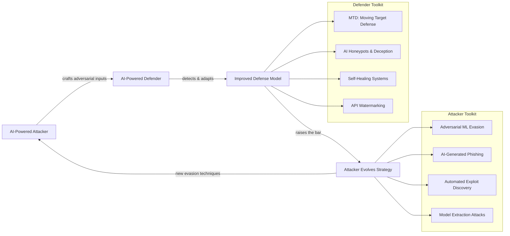
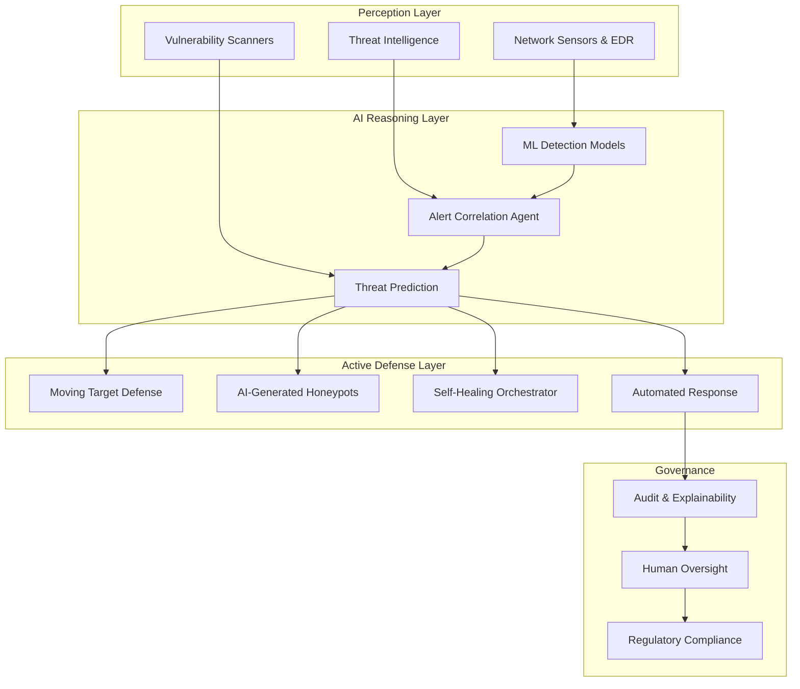

## Frontiers: AI-Native Cybersecurity

## Overview

Cybersecurity is entering an era where AI is not an add-on to existing security stacks but the foundational substrate on which defense — and attack — operates. AI-native cybersecurity describes systems designed from the ground up around machine learning, where models defend against adversarial models, deception is automated, and the attack surface itself is dynamically reshaped by AI. This lesson explores the frontier research directions that define this emerging landscape.

### The AI Security Arms Race

The most fundamental dynamic in AI-native cybersecurity is co-evolution: every improvement in AI-powered defense creates selective pressure for more sophisticated AI-powered attacks, and vice versa. Adversarial machine learning research (e.g., Goodfellow et al.'s work on adversarial examples) showed that small perturbations can fool classifiers. In cybersecurity, this manifests as adversarial malware that modifies its behavior to evade ML-based detectors, and adversarial network traffic designed to fool AI-based intrusion detection systems.

The research by Joshi et al. on "Adversarial Testing of Learning- and Non-Learning-Based Congestion Controllers" demonstrates a concrete instance of this arms race: RL-trained adversaries can discover failure modes in both traditional and ML-based network congestion controllers, revealing vulnerabilities that standard testing misses. The adversarial agent learns traffic patterns that push congestion controllers into pathological states — a technique directly applicable to discovering weaknesses in network security systems.

Formally, the arms race can be modeled as a two-player game where the defender minimizes and the attacker maximizes a loss function:

$$\min_{\theta_D} \max_{\theta_A} \mathbb{E}_{x \sim \mathcal{D}} \left[ \mathcal{L}(f_{\theta_D}(x + \delta_{\theta_A}(x)), y) \right]$$

where $f_{\theta_D}$ is the defender's model, $\delta_{\theta_A}$ is the attacker's perturbation function, and $\mathcal{L}$ is the security-relevant loss (e.g., misclassification of malicious traffic as benign).

### Moving Target Defense with AI

Traditional systems present a static attack surface — the same OS, the same ports, the same configurations. Moving Target Defense (MTD) dynamically changes system configurations to invalidate attacker reconnaissance. AI makes MTD practical at scale by learning optimal mutation strategies that maximize attacker confusion while minimizing operational disruption.

An AI-driven MTD system might randomly rotate IP addresses, shuffle service ports, swap runtime environments, or modify memory layouts — all guided by an RL agent that learns which mutations are most effective against observed attack patterns. The key constraint is that mutations must preserve system functionality, which can be expressed as an optimization problem: maximize entropy of the attack surface subject to maintaining service-level objectives.

### Deception Technologies: AI-Generated Honeypots

Traditional honeypots are static decoys that look obviously fake to sophisticated attackers. AI-generated honeypots use language models and generative AI to create convincing fake services, databases, and even email conversations that lure attackers into revealing their techniques. An LLM can generate realistic-looking database records, API responses, and file systems that are indistinguishable from production assets, wasting attacker time and providing high-fidelity intelligence about their methods.

### API Watermarking for Model Protection

As organizations deploy proprietary AI models via APIs, protecting these models from theft becomes critical. API watermarking embeds invisible statistical signatures into model outputs that can later prove ownership if the model is stolen or its outputs are used to train a competitor. The watermark is designed to be robust against fine-tuning, distillation, and output post-processing. Research in this area explores trade-offs between watermark detectability, robustness, and impact on model quality — a key challenge being that the watermark must survive even if an adversary knows the watermarking scheme exists.

### Self-Healing Systems and Quantum Implications

Self-healing architectures use AI to automatically detect compromise, isolate affected components, and restore clean state — all without human intervention. Combined with containerized microservices, an AI orchestrator can spin down compromised containers and launch clean replacements in seconds.

Looking further ahead, quantum computing threatens current cryptographic foundations. Post-quantum cryptography is being standardized (NIST PQC standards), and AI plays a dual role: assisting in cryptanalysis of candidate algorithms and helping organizations plan migration strategies for their cryptographic infrastructure.

### Regulatory Landscape

The EU AI Act classifies AI systems used in critical infrastructure (including cybersecurity) as high-risk, requiring conformity assessments, transparency, and human oversight. The NIST AI Risk Management Framework (AI RMF) provides voluntary guidelines for managing AI risks in security applications. Organizations deploying autonomous security agents must navigate these frameworks while maintaining operational effectiveness.

## Key Concepts

- **AI security co-evolution**: The adversarial arms race between AI-powered attackers and AI-powered defenders
- **Moving Target Defense (MTD)**: Dynamically changing system configurations to invalidate attacker knowledge
- **AI-generated honeypots**: Using generative AI to create convincing decoy systems for threat intelligence
- **API watermarking**: Embedding statistical signatures in model outputs to prove ownership and detect theft
- **Self-healing systems**: Autonomous detection, isolation, and recovery from compromise
- **Adversarial testing of network systems**: Using RL to discover failure modes in congestion controllers and network security (Joshi et al.)
- **Post-quantum cryptography**: Preparing cryptographic systems for the quantum computing era
- **EU AI Act / NIST AI RMF**: Regulatory frameworks governing AI use in critical security infrastructure

## Code Examples

A simulation of Moving Target Defense where an AI defender randomly mutates system configurations to evade an attacker's learned model:

```python
import random
import math

class SystemConfig:
    """Represents a mutable system configuration."""
    def __init__(self, n_services: int = 5):
        self.n_services = n_services
        # Each service has a port (1024-65535) and a runtime variant (0-3)
        self.ports = [random.randint(1024, 65535) for _ in range(n_services)]
        self.runtimes = [random.randint(0, 3) for _ in range(n_services)]

    def fingerprint(self) -> tuple:
        return tuple(self.ports + self.runtimes)

    def mutate(self, mutation_rate: float = 0.4):
        """Randomly change a subset of configurations."""
        for i in range(self.n_services):
            if random.random() < mutation_rate:
                self.ports[i] = random.randint(1024, 65535)
            if random.random() < mutation_rate:
                self.runtimes[i] = random.randint(0, 3)

class Attacker:
    """Models an attacker that builds a map of the system."""
    def __init__(self):
        self.known_configs: set[tuple] = set()

    def reconnaissance(self, config: SystemConfig) -> bool:
        """Returns True if attacker recognizes (has seen) this config."""
        fp = config.fingerprint()
        if fp in self.known_configs:
            return True  # attacker can exploit known config
        self.known_configs.add(fp)
        return False  # new config, attacker must re-learn

class MTDSimulator:
    """Simulates Moving Target Defense over multiple rounds."""
    def __init__(self, n_services: int = 5, mutation_rate: float = 0.4):
        self.config = SystemConfig(n_services)
        self.attacker = Attacker()
        self.mutation_rate = mutation_rate

    def run(self, rounds: int = 20) -> dict:
        attacks_succeeded = 0
        attacks_failed = 0

        for r in range(1, rounds + 1):
            # Attacker attempts to exploit based on known configs
            if self.attacker.reconnaissance(self.config):
                attacks_succeeded += 1
                outcome = "EXPLOITED (config was known)"
            else:
                attacks_failed += 1
                outcome = "BLOCKED  (config unknown to attacker)"

            # Defender mutates the system configuration
            self.config.mutate(self.mutation_rate)

            if r <= 8 or r == rounds:  # print first 8 and last round
                print(f"  Round {r:2d}: {outcome}")

        success_rate = attacks_succeeded / rounds
        print(f"\n  Attacker success rate: {success_rate:.1%}")
        print(f"  Config entropy (unique configs seen): {len(self.attacker.known_configs)}")
        return {"success_rate": success_rate, "unique_configs": len(self.attacker.known_configs)}

# --- Run simulations with different mutation rates ---
print("=== Moving Target Defense Simulation ===\n")

for rate in [0.0, 0.3, 0.7]:
    print(f"--- Mutation rate: {rate} ---")
    sim = MTDSimulator(n_services=4, mutation_rate=rate)
    sim.run(rounds=20)
    print()
```

With a mutation rate of 0, the attacker quickly learns the static configuration and succeeds on every subsequent attempt. As the mutation rate increases, the attacker's knowledge becomes stale and exploitation success drops — demonstrating the core MTD principle that a moving target is harder to hit.

## Diagrams

### AI Security Co-Evolution Cycle



### AI-Native Security Operations Architecture



## Case Studies / Applications

- **Adversarial Congestion Controller Testing (Joshi et al.)**: RL-trained adversaries systematically discover failure modes in both learning-based and classical network congestion controllers, demonstrating that adversarial AI testing reveals vulnerabilities invisible to conventional benchmarks.
- **API Watermarking at Scale**: Major AI providers (OpenAI, Anthropic, Google) are researching output watermarking to detect unauthorized model distillation and protect intellectual property, with active debate about robustness vs. detectability trade-offs.
- **DARPA Cyber Grand Challenge**: Autonomous systems that find, patch, and exploit vulnerabilities in real time — a precursor to today's AI-native security agents.
- **CrowdStrike Charlotte AI**: A generative AI assistant embedded in the Falcon platform that summarizes threats, suggests response actions, and enables natural-language threat hunting queries.
- **EU AI Act Compliance**: Organizations deploying AI in cybersecurity must now document risk assessments, ensure human oversight mechanisms, and maintain audit trails for high-risk AI systems under the EU AI Act (effective 2025-2026).

## Further Reading

- Joshi, K. et al., "Adversarial Testing of Learning- and Non-Learning-Based Congestion Controllers" — RL-based adversarial testing of network systems
- Kirchenbauer, J. et al., "A Watermark for Large Language Models" (2023) — foundational work on LLM output watermarking
- Jajodia, S. et al., "Moving Target Defense: Creating Asymmetric Uncertainty for Cyber Threats" (Springer)
- NIST AI Risk Management Framework: https://www.nist.gov/artificial-intelligence/ai-risk-management-framework
- EU AI Act Official Text: https://artificialintelligenceact.eu/
- Cosler, M. et al., "Reinforcement Learning for Security Protocol Analysis in Tamarin" — RL-guided formal verification (referenced in Lesson 10)
