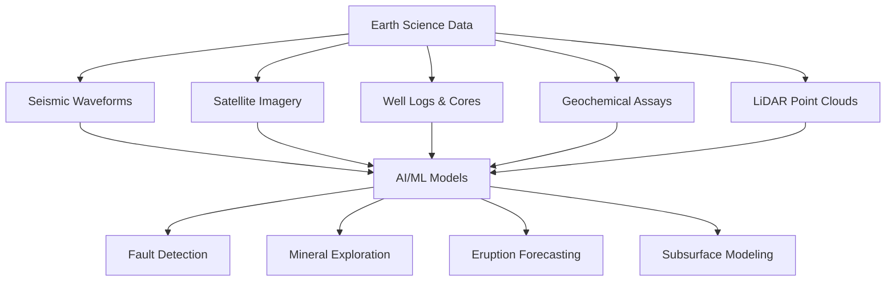

# Introduction to AI for Earth Science

## Overview

Earth science encompasses the study of our planet's solid structure, from the deep mantle to the surface crust — including geology, seismology, volcanology, tectonics, mineralogy, and geomorphology. These disciplines generate vast, heterogeneous datasets: seismic waveforms, well logs, satellite imagery, geochemical assays, LiDAR point clouds, and more. Traditional analysis relies heavily on expert interpretation, but the sheer volume and complexity of modern Earth science data have made artificial intelligence an indispensable tool.

AI for Earth science is distinct from environmental science (which focuses on ecology, climate, biodiversity, and conservation). Here, we focus on the **solid Earth** — understanding what lies beneath the surface, how tectonic plates move, where mineral deposits form, when volcanoes erupt, and how geological processes shape landscapes over millions of years.

## Why AI Matters for Geology

Geoscientists face three fundamental challenges that AI is uniquely positioned to address:

1. **Scale**: A single 3D seismic survey can produce terabytes of data. Manual interpretation of faults, horizons, and lithological boundaries is slow and subjective.
2. **Complexity**: Geological systems involve nonlinear, multi-scale processes — from crystal-level mineral reactions to continent-scale plate motions.
3. **Incomplete observations**: We can only sample the subsurface at discrete points (boreholes, outcrops). AI helps interpolate and extrapolate from sparse data.

## Types of AI Problems in Earth Science

Earth science AI problems broadly fall into several categories:

- **Classification**: Identifying rock types from thin-section images, classifying seismic facies, labeling geological features in satellite imagery
- **Regression and prediction**: Estimating porosity from well logs, predicting earthquake magnitudes, forecasting volcanic eruptions
- **Inverse problems**: Recovering subsurface velocity models from seismic data, inferring mantle properties from surface observations
- **Anomaly detection**: Identifying unusual geochemical signatures that indicate ore deposits, detecting precursory signals before volcanic events
- **Segmentation**: Delineating fault networks, mapping geological units from remote sensing data



## Key Datasets in Earth Science AI

| Dataset Type | Examples | Typical ML Use |
|---|---|---|
| Seismic reflection | SEG-Y traces, 2D/3D surveys | Fault/horizon detection, inversion |
| Well logs | Gamma ray, resistivity, sonic | Facies classification, porosity prediction |
| Satellite imagery | Landsat, Sentinel-2, ASTER | Mineral mapping, landslide detection |
| Geochemical | XRF, ICP-MS assays | Anomaly detection, ore targeting |
| LiDAR/DEM | Airborne LiDAR, SRTM | Structural mapping, geomorphology |
| Seismological | Broadband waveforms, catalogs | Earthquake detection, phase picking |

## A Simple Example: Rock Classification

A classic entry point is classifying rock types from images. Given a labeled dataset of thin-section photomicrographs, a convolutional neural network (CNN) can learn to distinguish igneous, sedimentary, and metamorphic rocks:

```python
import torch
import torch.nn as nn
from torchvision import models, transforms

# Transfer learning with a pretrained ResNet
model = models.resnet18(pretrained=True)
model.fc = nn.Linear(model.fc.in_features, 3)  # 3 classes: igneous, sedimentary, metamorphic

transform = transforms.Compose([
    transforms.Resize((224, 224)),
    transforms.ToTensor(),
    transforms.Normalize(mean=[0.485, 0.456, 0.406],
                         std=[0.229, 0.224, 0.225])
])

# Training loop (simplified)
criterion = nn.CrossEntropyLoss()
optimizer = torch.optim.Adam(model.parameters(), lr=1e-4)

for epoch in range(10):
    for images, labels in train_loader:
        outputs = model(images)
        loss = criterion(outputs, labels)
        optimizer.zero_grad()
        loss.backward()
        optimizer.step()
```

## Connection to the Broader AI Landscape

Earth science AI draws on the same foundations as other scientific AI domains — deep learning, physics-informed neural networks, generative models — but adapts them to geological constraints. Geological data is often spatially correlated, irregularly sampled, and governed by physical laws (conservation of mass, thermodynamics, wave equations). Throughout this track, we will explore how standard ML techniques are adapted to honor these domain-specific properties.

## What You'll Learn in This Track

This track covers 11 lessons progressing from foundational concepts to advanced frontiers:

- **Beginner**: Data types, mineral exploration, seismic analysis, volcano monitoring
- **Intermediate**: Geochemical modeling, structural geology, geospatial AI, subsurface characterization
- **Advanced**: Physics-informed geodynamics, frontiers in paleoclimate and planetary geology

By the end, you will understand how AI is reshaping our ability to explore, monitor, and model the solid Earth.
