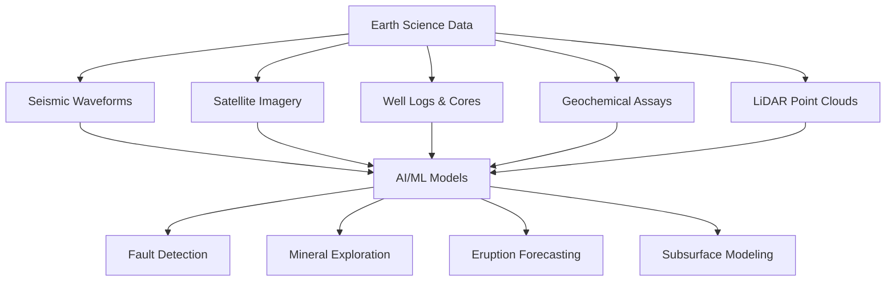

# Introduction to AI for Earth Science

## Overview

Earth science encompasses the study of our planet's solid structure, from the deep mantle to the surface crust — including geology, seismology, volcanology, tectonics, mineralogy, and geomorphology. These disciplines generate vast, heterogeneous datasets: seismic waveforms, well logs, satellite imagery, geochemical assays, LiDAR point clouds, and more. Traditional analysis relies heavily on expert interpretation, but the sheer volume and complexity of modern Earth science data have made artificial intelligence an indispensable tool.

### The Solid Earth Focus

AI for Earth science is distinct from environmental science (which focuses on ecology, climate, biodiversity, and conservation). Here, we focus on the **solid Earth** — understanding what lies beneath the surface, how tectonic plates move, where mineral deposits form, when volcanoes erupt, and how geological processes shape landscapes over millions of years.

### Why AI Matters

Geoscientists face three fundamental challenges that AI is uniquely positioned to address:

1. **Scale** — A single 3D seismic survey can produce terabytes of data. Manual interpretation of faults, horizons, and lithological boundaries is slow and subjective.
2. **Complexity** — Geological systems involve nonlinear, multi-scale processes, from crystal-level mineral reactions to continent-scale plate motions.
3. **Incomplete observations** — We can only sample the subsurface at discrete points such as boreholes and outcrops. AI helps interpolate and extrapolate from sparse data.

## Key Concepts

**Seismic Interpretation**
The process of using seismic reflection data to map subsurface geological structures. AI methods, particularly deep convolutional networks, can automatically detect faults, horizons, and sedimentary layers from 3D seismic volumes, reducing interpretation time from weeks to hours.

**Inverse Problems in Geophysics**
The task of recovering subsurface properties (density, velocity, resistivity) from surface or borehole measurements. These problems are typically ill-posed, meaning many subsurface models can fit the same observations. Physics-informed neural networks and Bayesian inference provide principled ways to incorporate geological constraints.

**Mineral Prospectivity Mapping**
The application of machine learning to predict where economically viable mineral deposits are likely to occur, based on geochemical, geophysical, and remote sensing data. This is a spatial classification problem where training labels come from known mineral occurrences.

**Phase Picking**
The process of identifying the arrival times of seismic waves (P-waves and S-waves) in continuous seismological recordings. Deep learning models like PhaseNet and EQTransformer can pick phases with accuracy rivaling human seismologists, enabling the processing of exponentially larger earthquake catalogs.

**Physics-Informed Neural Networks (PINNs)**
Neural networks that embed physical laws — such as the wave equation or heat diffusion equation — directly into the loss function during training. In Earth science, PINNs are used for seismic inversion, groundwater flow modeling, and mantle convection simulation.

## Types of AI Problems in Earth Science

Earth science AI problems broadly fall into several categories:

**Classification**
Identifying rock types from thin-section images, classifying seismic facies, and labeling geological features in satellite imagery. Typical models include CNNs and Vision Transformers trained on expert-annotated datasets.

**Regression and Prediction**
Estimating porosity from well logs, predicting earthquake magnitudes, and forecasting volcanic eruptions. These tasks often use gradient-boosted trees for tabular well-log data or deep sequence models for temporal event forecasting.

**Inverse Problems**
Recovering subsurface velocity models from seismic data or inferring mantle properties from surface observations. This is one of the hardest problem classes, requiring careful integration of physical constraints with learned representations.

**Anomaly Detection**
Identifying unusual geochemical signatures that indicate ore deposits or detecting precursory signals before volcanic events. Isolation forests, autoencoders, and one-class SVMs are common approaches.

**Segmentation**
Delineating fault networks, mapping geological units from remote sensing data, and extracting drainage patterns from digital elevation models. U-Net and its variants dominate this category.



## Key Datasets in Earth Science AI

| Dataset Type | Examples | Typical ML Use |
|---|---|---|
| Seismic reflection | SEG-Y traces, 2D/3D surveys | Fault/horizon detection, inversion |
| Well logs | Gamma ray, resistivity, sonic | Facies classification, porosity prediction |
| Satellite imagery | Landsat, Sentinel-2, ASTER | Mineral mapping, landslide detection |
| Geochemical | XRF, ICP-MS assays | Anomaly detection, ore targeting |
| LiDAR/DEM | Airborne LiDAR, SRTM | Structural mapping, geomorphology |
| Seismological | Broadband waveforms, catalogs | Earthquake detection, phase picking |

## A Simple Example: Rock Classification

A classic entry point is classifying rock types from images. Given a labeled dataset of thin-section photomicrographs, a convolutional neural network (CNN) can learn to distinguish igneous, sedimentary, and metamorphic rocks:

```python
import torch
import torch.nn as nn
from torchvision import models, transforms

# Transfer learning with a pretrained ResNet
model = models.resnet18(pretrained=True)
model.fc = nn.Linear(model.fc.in_features, 3)  # 3 classes: igneous, sedimentary, metamorphic

transform = transforms.Compose([
    transforms.Resize((224, 224)),
    transforms.ToTensor(),
    transforms.Normalize(mean=[0.485, 0.456, 0.406],
                         std=[0.229, 0.224, 0.225])
])

# Training loop (simplified)
criterion = nn.CrossEntropyLoss()
optimizer = torch.optim.Adam(model.parameters(), lr=1e-4)

for epoch in range(10):
    for images, labels in train_loader:
        outputs = model(images)
        loss = criterion(outputs, labels)
        optimizer.zero_grad()
        loss.backward()
        optimizer.step()
```

## Connection to the Broader AI Landscape

Earth science AI draws on the same foundations as other scientific AI domains — deep learning, physics-informed neural networks, generative models — but adapts them to geological constraints. Geological data is often spatially correlated, irregularly sampled, and governed by physical laws (conservation of mass, thermodynamics, wave equations). Throughout this track, we will explore how standard ML techniques are adapted to honor these domain-specific properties.

## What You'll Learn in This Track

This track covers 11 lessons progressing from foundational concepts to advanced frontiers:

- **Beginner**: Data types, mineral exploration, seismic analysis, volcano monitoring
- **Intermediate**: Geochemical modeling, structural geology, geospatial AI, subsurface characterization
- **Advanced**: Physics-informed geodynamics, frontiers in paleoclimate and planetary geology

By the end, you will understand how AI is reshaping our ability to explore, monitor, and model the solid Earth.

## Exercises/Projects

1. **Data Exploration**: Visit the USGS Earthquake Hazards Program website and download a recent earthquake catalog. Plot the events on a world map using `matplotlib` and `basemap` or `cartopy`. Compute basic statistics including magnitude distribution, depth histogram, and spatial clustering.

2. **Rock Classification**: Using the PyTorch code example above, collect 30 images of igneous, sedimentary, and metamorphic rocks from public geology databases. Train a simple CNN classifier and report the confusion matrix and F1 score.

3. **Literature Review**: Find one recent paper (2022–2026) applying deep learning to an Earth science problem of your choice (seismic interpretation, mineral exploration, or volcano monitoring). Write a 500-word summary covering the problem, dataset, model architecture, and key results.

4. **Phase Picking Demo**: Explore the open-source PhaseNet or EQTransformer repository on GitHub. Read the documentation and identify what seismic data format is required as input. Describe in your own words how the model architecture differs from a standard image classifier.

## Further Reading

- Bergen, K. J., Johnson, P. A., de Hoop, M. V., & Beroza, G. C. (2019). "Machine Learning for Data-Driven Discovery in Solid Earth Geoscience." *Science*, 363(6433).
- Reichstein, M., et al. (2019). "Deep Learning and Process Understanding for Data-Driven Earth System Science." *Nature*, 566, 195–204.
- Mousavi, S. M., Ellsworth, W. L., Zhu, W., Chuang, L. Y., & Beroza, G. C. (2020). "Earthquake Transformer — An Attentive Deep-Learning Model for Simultaneous Earthquake Detection and Phase Picking." *Nature Communications*, 11, 3952.
- Raissi, M., Perdikaris, P., & Karniadakis, G. E. (2019). "Physics-Informed Neural Networks: A Deep Learning Framework for Solving Forward and Inverse Problems Involving Nonlinear Partial Differential Equations." *Journal of Computational Physics*, 378, 686–707.
