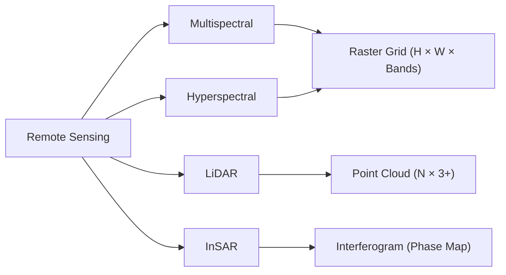

# Geological Data Types and Representations

## Overview

Before applying AI to Earth science problems, we must understand the diverse data types geologists work with and how to represent them in formats suitable for machine learning. Geological data spans multiple scales (millimeters to thousands of kilometers), multiple modalities (images, time series, tabular assays, 3D volumes), and often carries inherent uncertainty from sparse sampling. This lesson surveys the major geological data types and their ML representations.

## Rock Types and Mineral Compositions

Rocks are classified into three major groups — **igneous** (formed from magma), **sedimentary** (deposited by water, wind, or ice), and **metamorphic** (transformed by heat and pressure). Each group contains dozens of specific rock types characterized by mineral assemblages, textures, and chemical compositions.

For ML, rock descriptions are typically encoded as:

- **Categorical features**: Rock type labels (granite, sandstone, schist)
- **Compositional vectors**: Major oxide percentages ($\text{SiO}_2$, $\text{Al}_2\text{O}_3$, $\text{Fe}_2\text{O}_3$, ...) that sum to ~100%
- **Image data**: Thin-section photomicrographs under plane-polarized and cross-polarized light

Compositional data requires special treatment because the components are constrained to a constant sum. The **isometric log-ratio (ILR) transform** maps $D$-component compositions to $D-1$ unconstrained coordinates:

$$\text{ilr}(\mathbf{x}) = \mathbf{V}^T \ln(\mathbf{x})$$

where $\mathbf{V}$ is a contrast matrix derived from a sequential binary partition of the components.

## Structural Geology Data

Structural measurements describe the orientation and deformation of rock bodies:

- **Strike and dip**: Orientation of planar features (bedding, faults, foliations), typically recorded as azimuth/dip pairs
- **Fold geometry**: Axial plane orientation, interlimb angle, fold wavelength
- **Fault attributes**: Displacement, sense of motion, kinematic indicators

These directional measurements live on a sphere. Representing them for ML often uses **direction cosines** $(l, m, n)$ rather than raw angles to avoid discontinuities at 0°/360°:

$$l = \cos(\text{plunge}) \cos(\text{bearing}), \quad m = \cos(\text{plunge}) \sin(\text{bearing}), \quad n = \sin(\text{plunge})$$

## Borehole Logs

Well logs are continuous depth-indexed measurements recorded as a drill hole penetrates the subsurface. Common log types include:

| Log Type | Measurement | ML Use |
|---|---|---|
| Gamma Ray (GR) | Natural radioactivity | Lithology indicator |
| Resistivity | Electrical resistance | Fluid content |
| Sonic (DT) | Acoustic travel time | Porosity, velocity |
| Density (RHOB) | Bulk density | Porosity estimation |
| Neutron (NPHI) | Hydrogen index | Gas detection |

Well logs are naturally represented as **multivariate time series** (indexed by depth rather than time). A typical ML representation stacks multiple log curves into a matrix $\mathbf{X} \in \mathbb{R}^{N_{\text{depth}} \times N_{\text{logs}}}$:

```python
import numpy as np
import pandas as pd

# Load well log data (LAS format -> DataFrame)
logs = pd.read_csv("well_logs.csv")
features = logs[["GR", "RESISTIVITY", "SONIC", "DENSITY", "NEUTRON"]].values

# Normalize per-feature
from sklearn.preprocessing import StandardScaler
scaler = StandardScaler()
features_scaled = scaler.fit_transform(features)

# Sliding window for sequence models
def create_windows(data, window_size=50):
    windows = []
    for i in range(len(data) - window_size):
        windows.append(data[i:i + window_size])
    return np.array(windows)

X = create_windows(features_scaled, window_size=50)
```

## Remote Sensing Data

Remote sensing provides synoptic views of the Earth's surface across multiple spectral bands:

- **Multispectral** (Landsat, Sentinel-2): 4–13 bands covering visible to SWIR wavelengths
- **Hyperspectral** (AVIRIS, EnMAP): 100–400 narrow bands enabling mineral identification through absorption features
- **LiDAR**: Point clouds with $(x, y, z)$ coordinates for high-resolution topography
- **InSAR**: Interferometric synthetic aperture radar measuring millimeter-scale ground deformation



Hyperspectral images are represented as 3D tensors $\mathbf{I} \in \mathbb{R}^{H \times W \times B}$ where $B$ can exceed 200 bands. Dimensionality reduction (PCA, autoencoders) is often applied before classification.

## Geochemical Assays

Geochemical surveys measure elemental or oxide concentrations in rock, soil, or stream sediment samples. Key considerations for ML:

- **Compositional closure**: Concentrations sum to a constant (e.g., 100% or $10^6$ ppm), creating spurious correlations. Always apply log-ratio transforms (ALR, CLR, or ILR) before standard ML algorithms.
- **Below detection limit (BDL)**: Values below instrument sensitivity are censored. Common strategies include imputation at $\text{DL}/2$ or model-based approaches.
- **Spatial correlation**: Nearby samples are not independent — geostatistical methods or spatial cross-validation are needed.

## Time-Series Data: Volcano Monitoring

Volcanic monitoring networks produce continuous time series from multiple sensor types:

- Seismometers (earthquake counts, tremor amplitude)
- Gas sensors ($\text{SO}_2$, $\text{CO}_2$ flux)
- GPS/InSAR (ground deformation)
- Tiltmeters (edifice tilt)

These multivariate, irregularly sampled time series are often aligned to a common time grid and represented as tensors for sequence models (LSTMs, Transformers).

## Summary

Geological data is inherently diverse and spatially structured. Successful AI applications require careful attention to data representation — using log-ratio transforms for compositions, direction cosines for orientations, sliding windows for depth-indexed logs, and appropriate spatial handling for gridded and point-cloud data. Choosing the right representation is often as important as choosing the right model.
