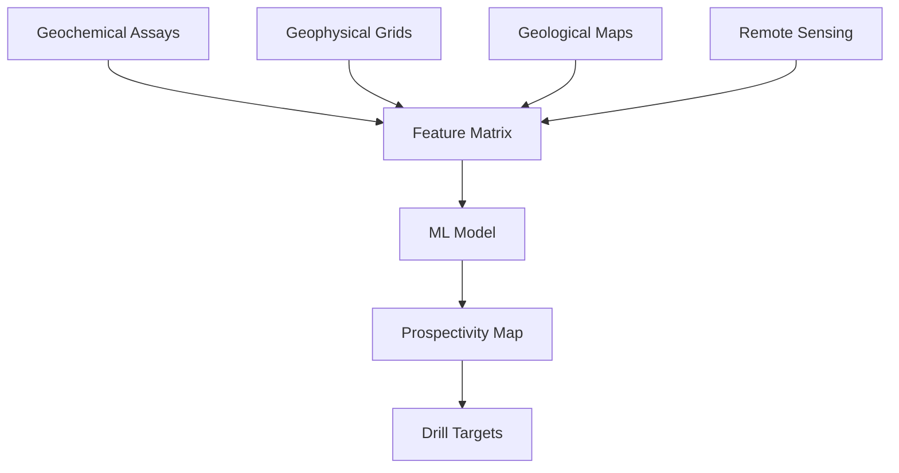

# Machine Learning for Mineral Exploration

## Overview

Mineral exploration — the search for economically viable ore deposits — is one of the most impactful applications of AI in Earth science. Traditional exploration relies on geological mapping, geochemical sampling, and geophysical surveys interpreted by expert geologists. ML accelerates this process by integrating multi-source data to identify prospective targets, reducing the cost and environmental footprint of exploration.

The core ML task is **prospectivity mapping**: given a set of geological, geochemical, and geophysical features at locations across a region, predict the probability that each location hosts mineralization.

## Data Integration for Exploration

Exploration datasets are inherently multi-modal. A typical ML pipeline integrates:

- **Geochemical data**: Stream sediment or soil assays (Au, Cu, As, Sb, pathfinder elements)
- **Geophysical data**: Magnetic surveys (total magnetic intensity), gravity (Bouguer anomaly), radiometrics (K, Th, U)
- **Geological maps**: Lithology, structures (faults, folds), alteration zones, stratigraphic contacts
- **Remote sensing**: Satellite-derived mineral indices, vegetation stress anomalies



All layers must be co-registered to a common spatial grid. Categorical variables (lithology, structure type) are one-hot encoded, while continuous variables are standardized. Geochemical data undergoes log-ratio transformation to handle compositional closure.

## Ensemble Methods for Prospectivity Mapping

Random forests and gradient boosted trees are the workhorses of mineral prospectivity mapping, valued for their ability to handle mixed data types, capture nonlinear relationships, and provide feature importance rankings.

```python
import numpy as np
from sklearn.ensemble import RandomForestClassifier, GradientBoostingClassifier
from sklearn.model_selection import StratifiedKFold
from sklearn.metrics import roc_auc_score

# X: feature matrix (N_samples x N_features)
# y: binary labels (1 = known deposit, 0 = non-deposit)

# Random Forest
rf = RandomForestClassifier(
    n_estimators=500,
    max_depth=15,
    min_samples_leaf=5,
    class_weight="balanced",  # handle class imbalance
    random_state=42
)

# Spatial cross-validation (critical for geological data)
cv = StratifiedKFold(n_splits=5, shuffle=True, random_state=42)
auc_scores = []

for train_idx, test_idx in cv.split(X, y):
    rf.fit(X[train_idx], y[train_idx])
    probs = rf.predict_proba(X[test_idx])[:, 1]
    auc_scores.append(roc_auc_score(y[test_idx], probs))

print(f"Mean AUC: {np.mean(auc_scores):.3f} ± {np.std(auc_scores):.3f}")
```

**Class imbalance** is a major challenge: known deposits are rare compared to barren locations. Strategies include:

- Oversampling positive examples (SMOTE)
- Adjusting class weights in the loss function
- Using anomaly detection frameworks instead of binary classification

## Feature Importance Analysis

One of the most valuable outputs of tree-based models is **feature importance**, which tells geologists which variables are most predictive of mineralization:

```python
import matplotlib.pyplot as plt

importances = rf.feature_importances_
feature_names = ["Au_ppm", "As_ppm", "TMI", "Bouguer", "K_rad",
                 "dist_to_fault", "lithology_granite", "NDVI"]

sorted_idx = np.argsort(importances)[::-1]
plt.barh(range(len(importances)),
         importances[sorted_idx], align="center")
plt.yticks(range(len(importances)),
           [feature_names[i] for i in sorted_idx])
plt.xlabel("Feature Importance")
plt.title("Mineral Prospectivity Drivers")
plt.tight_layout()
plt.show()
```

This interpretability bridges the gap between ML predictions and geological understanding — a geologist can validate whether the important features align with known metallogenic processes.

## Anomaly Detection for Geochemical Targeting

An alternative to supervised classification is treating mineral deposits as **anomalies** in geochemical space. Since deposits are rare and their signatures can differ from known training examples, unsupervised anomaly detection can identify novel targets:

The **Mahalanobis distance** measures how far a sample is from the multivariate mean of the background population:

$$D_M(\mathbf{x}) = \sqrt{(\mathbf{x} - \boldsymbol{\mu})^T \mathbf{\Sigma}^{-1} (\mathbf{x} - \boldsymbol{\mu})}$$

where $\boldsymbol{\mu}$ is the mean vector and $\mathbf{\Sigma}$ is the covariance matrix of background samples. High $D_M$ values indicate anomalous geochemistry that may warrant further investigation.

Isolation forests offer a more flexible nonparametric alternative:

```python
from sklearn.ensemble import IsolationForest

iso_forest = IsolationForest(
    n_estimators=300,
    contamination=0.05,  # expected proportion of anomalies
    random_state=42
)
anomaly_scores = iso_forest.fit_predict(X_geochem)
# -1 = anomaly (potential target), 1 = normal (background)
```

## Integrating Geological Knowledge

Pure data-driven models can produce geologically implausible predictions. Strategies to inject domain knowledge include:

- **Feature engineering**: Distance to nearest fault, distance to intrusive contacts, structural complexity indices
- **Spatial priors**: Weighting training samples by geological favorability
- **Constrained predictions**: Masking areas where mineralization is geologically impossible (e.g., deep water bodies)
- **Expert-in-the-loop**: Iterative refinement where geologists validate and re-label model predictions

## Case Study: Gold Prospectivity in Western Australia

The Yilgarn Craton in Western Australia hosts world-class orogenic gold deposits. ML studies integrating geochemistry (As, Sb, W as pathfinder elements), magnetics (identifying greenstone-granite contacts), and proximity to crustal-scale shear zones have achieved AUC scores exceeding 0.90, successfully identifying previously unknown prospects that were later confirmed by drilling.

## Summary

ML for mineral exploration combines multi-source geological data with ensemble learning and anomaly detection to generate prospectivity maps. The keys to success are careful data integration, handling of class imbalance, spatial cross-validation, and — critically — close collaboration between data scientists and domain geologists to ensure predictions are geologically meaningful.
