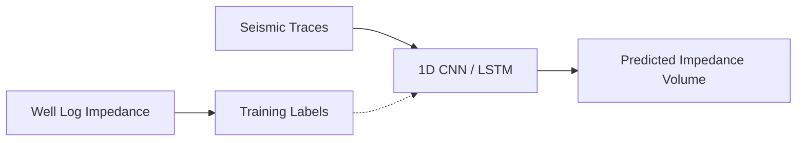

# Seismic Data Analysis with Deep Learning

## Overview

Seismic data is the primary tool for imaging the Earth's subsurface. In exploration geophysics, controlled sources (vibroseis trucks, air guns) generate seismic waves that reflect off geological boundaries. The recorded waveforms are processed into images of subsurface structure. Traditionally, interpreting these images — picking horizons, mapping faults, classifying facies — requires months of expert work on large 3D surveys. Deep learning has revolutionized this workflow, enabling automated interpretation that is faster, more consistent, and often more accurate than manual analysis.

## Seismic Data Fundamentals

A seismic reflection survey produces data organized as:

- **Traces**: Individual waveform recordings at receiver locations, sampled at 1–4 ms intervals
- **Gathers**: Collections of traces sharing a common attribute (shot, receiver, midpoint)
- **Stacked sections**: 2D images formed by summing traces at common midpoints, suppressing noise
- **3D volumes**: Full $x$-$y$-$z$ cubes after migration, where $z$ is two-way travel time (TWT) or depth

The data can be viewed as a 3D tensor $\mathbf{S} \in \mathbb{R}^{N_x \times N_y \times N_t}$ — essentially a volumetric image, making it a natural fit for convolutional neural networks.

**Pre-stack vs. post-stack**: Pre-stack data retains offset/angle information and enables amplitude-versus-offset (AVO) analysis. Post-stack data is simpler but loses angular information. Most DL applications work on post-stack data, though pre-stack approaches are emerging.

## CNNs for Fault Detection

Faults are discontinuities in rock layers caused by tectonic stress. They are critical for understanding structural geology, assessing seismic hazards, and evaluating hydrocarbon traps. Manual fault interpretation in a 3D seismic volume can take weeks.

A U-Net architecture is widely used for semantic segmentation of faults:

```python
import torch
import torch.nn as nn

class FaultUNet(nn.Module):
    def __init__(self, in_channels=1):
        super().__init__()
        # Encoder
        self.enc1 = self._block(in_channels, 64)
        self.enc2 = self._block(64, 128)
        self.enc3 = self._block(128, 256)
        self.pool = nn.MaxPool2d(2)
        # Bottleneck
        self.bottleneck = self._block(256, 512)
        # Decoder
        self.up3 = nn.ConvTranspose2d(512, 256, 2, stride=2)
        self.dec3 = self._block(512, 256)
        self.up2 = nn.ConvTranspose2d(256, 128, 2, stride=2)
        self.dec2 = self._block(256, 128)
        self.up1 = nn.ConvTranspose2d(128, 64, 2, stride=2)
        self.dec1 = self._block(128, 64)
        self.out = nn.Conv2d(64, 1, 1)

    def _block(self, in_c, out_c):
        return nn.Sequential(
            nn.Conv2d(in_c, out_c, 3, padding=1),
            nn.BatchNorm2d(out_c),
            nn.ReLU(inplace=True),
            nn.Conv2d(out_c, out_c, 3, padding=1),
            nn.BatchNorm2d(out_c),
            nn.ReLU(inplace=True)
        )

    def forward(self, x):
        e1 = self.enc1(x)
        e2 = self.enc2(self.pool(e1))
        e3 = self.enc3(self.pool(e2))
        b = self.bottleneck(self.pool(e3))
        d3 = self.dec3(torch.cat([self.up3(b), e3], dim=1))
        d2 = self.dec2(torch.cat([self.up2(d3), e2], dim=1))
        d1 = self.dec1(torch.cat([self.up1(d2), e1], dim=1))
        return torch.sigmoid(self.out(d1))
```

The network takes a seismic section as input and outputs a per-pixel fault probability map. Training uses labeled examples where expert interpreters have marked fault locations.

## Horizon Detection

Horizons are reflective boundaries between geological layers. Automated horizon tracking uses:

- **Patch-based CNNs**: Classify whether a local patch is centered on a horizon
- **Recurrent approaches**: Track horizons trace-by-trace using LSTMs
- **Multi-task learning**: Jointly predict horizons and faults, since they are geometrically related

## Seismic Inversion with Neural Networks

Seismic inversion recovers physical properties (acoustic impedance, velocity) from reflection data. The forward model relates impedance $Z(t)$ to the reflection coefficient:

$$r(t) = \frac{Z(t + \Delta t) - Z(t)}{Z(t + \Delta t) + Z(t)}$$

The seismic trace is the convolution of the reflectivity with a source wavelet: $s(t) = w(t) * r(t)$.

Inverting this process is ill-posed. Neural network approaches learn the mapping directly from seismic traces to impedance, often using well log data as ground truth:



## Velocity Model Building

Accurate depth imaging requires a velocity model $v(x, y, z)$. Full waveform inversion (FWI) is computationally expensive. Deep learning accelerates this by:

- Learning an approximate velocity model from shot gathers using encoder-decoder architectures
- Providing initial models for physics-based FWI refinement
- Using physics-informed loss functions that enforce the wave equation

The loss combines data misfit and physical constraints:

$$\mathcal{L} = \underbrace{\|d_{\text{obs}} - d_{\text{pred}}\|^2}_{\text{data misfit}} + \lambda \underbrace{\left\|\frac{\partial^2 u}{\partial t^2} - v^2 \nabla^2 u\right\|^2}_{\text{wave equation residual}}$$

## Summary

Deep learning has transformed seismic interpretation from a bottleneck-prone manual task to a scalable, automated workflow. U-Nets and similar architectures excel at fault and horizon detection, while neural network inversion and velocity model building push toward end-to-end subsurface characterization. The key challenge remains obtaining sufficient labeled training data — a problem increasingly addressed through synthetic seismic modeling and transfer learning.
