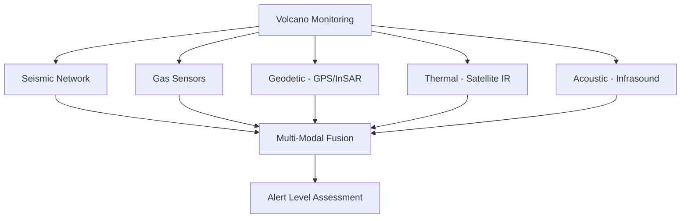

# AI for Volcano Monitoring and Hazard Prediction

## Overview

Volcanic eruptions are among Earth's most dramatic and hazardous geological events. Over 800 million people live within 100 km of an active volcano. Modern monitoring networks generate continuous streams of seismic, geochemical, geodetic, and thermal data — creating a multi-modal time-series problem ideally suited to AI. The goal: detect precursory signals and forecast eruptions with enough lead time for evacuation and hazard mitigation.

## Monitoring Data Streams

Volcano observatories deploy diverse sensor networks on and around active volcanoes:



Each data stream carries different precursory information:

| Signal | What It Measures | Precursory Pattern |
|---|---|---|
| Seismic tremor | Fluid movement in conduits | Increasing harmonic tremor amplitude |
| Volcano-tectonic earthquakes | Rock fracturing | Swarm activity, migration toward surface |
| SO₂ flux | Magma degassing | Increasing emissions before eruptions |
| CO₂/SO₂ ratio | Magma depth/composition | Ratio changes indicate deep magma ascent |
| Ground deformation | Magma intrusion | Inflation, tilt changes |
| Thermal anomalies | Surface heating | Hot spots at summit/flanks |

## Time-Series Classification for Seismic Events

Volcanic seismicity includes several event types — volcano-tectonic (VT) earthquakes, long-period (LP) events, tremor, and hybrid events. Classifying these automatically is essential for real-time monitoring:

```python
import torch
import torch.nn as nn

class SeismicClassifier(nn.Module):
    """1D CNN for volcanic seismic event classification."""
    def __init__(self, n_classes=4):
        super().__init__()
        self.features = nn.Sequential(
            nn.Conv1d(3, 32, kernel_size=7, padding=3),  # 3-component seismogram
            nn.ReLU(),
            nn.MaxPool1d(4),
            nn.Conv1d(32, 64, kernel_size=5, padding=2),
            nn.ReLU(),
            nn.MaxPool1d(4),
            nn.Conv1d(64, 128, kernel_size=3, padding=1),
            nn.ReLU(),
            nn.AdaptiveAvgPool1d(1)
        )
        self.classifier = nn.Linear(128, n_classes)

    def forward(self, x):
        x = self.features(x).squeeze(-1)
        return self.classifier(x)

# Classes: VT (volcano-tectonic), LP (long-period),
#          TR (tremor), HB (hybrid)
```

Spectrogram-based approaches using 2D CNNs on the short-time Fourier transform (STFT) of seismic signals achieve >95% accuracy on benchmark datasets from volcanoes like Kīlauea and Etna.

## Multi-Modal Data Fusion

No single monitoring stream reliably predicts eruptions. The power lies in combining streams. A common architecture uses separate encoders per modality, followed by a fusion layer:

$$\mathbf{h}_{\text{fused}} = f_{\text{fusion}}(\mathbf{h}_{\text{seismic}}, \mathbf{h}_{\text{gas}}, \mathbf{h}_{\text{deformation}}, \mathbf{h}_{\text{thermal}})$$

Fusion strategies include:

- **Early fusion**: Concatenate raw features into a single vector
- **Late fusion**: Train separate models per modality and combine predictions
- **Attention-based fusion**: Learn which modalities are most informative at each time step

Attention-based approaches are particularly effective because the relative importance of each signal changes during the lead-up to an eruption — seismic signals may dominate early, while gas emissions become critical days before.

## Eruption Forecasting

Forecasting frameworks treat the problem as a **temporal classification** or **survival analysis** task:

- **Binary classification**: Given the last $T$ hours of multi-modal data, will an eruption occur within the next $\Delta t$ hours?
- **Survival models**: Estimate the hazard function $h(t)$ — the instantaneous probability of eruption at time $t$ given no eruption so far

The failure forecast method (FFM), a physics-based approach, models the acceleration of precursory signals:

$$\frac{d\Omega}{dt} = A \Omega^{\alpha}$$

where $\Omega$ is the observable rate (e.g., seismic event rate) and $\alpha$ is a material constant. When $\alpha > 1$, the rate accelerates to infinity at the predicted failure time. Neural networks can learn generalizations of this pattern across volcanoes.

## Lava Flow Modeling

Once an eruption begins, predicting lava flow paths is critical for evacuation planning. Physics-based models like MOLASSES and FLOWGO simulate flow propagation over digital elevation models (DEMs). ML accelerates these simulations:

- **Neural emulators**: Train networks on thousands of physics-based simulations to produce near-instant predictions
- **Input**: Vent location, eruption rate, DEM, rheological parameters
- **Output**: Spatial probability of lava inundation

## Case Studies

**Kīlauea, Hawaii (2018)**: The lower East Rift Zone eruption was preceded by weeks of increasing seismicity and summit inflation detectable by ML models. Retrospective analysis showed that LSTM-based forecasters could have provided 48-hour advance warning.

**Mt. St. Helens (1980)**: The catastrophic lateral blast was preceded by a growing cryptodome (bulge). Modern InSAR + ML deformation analysis could track such features with millimeter precision.

**Eyjafjallajökull, Iceland (2010)**: The ash cloud that disrupted European air travel highlights the need for real-time eruption characterization. AI-based plume tracking using satellite imagery now enables rapid aviation hazard assessment.

## Summary

AI for volcano monitoring integrates multi-modal time series — seismic, gas, geodetic, and thermal — to classify volcanic events, detect precursory signals, and forecast eruptions. Attention-based fusion methods are especially promising because they adapt to the changing importance of each data stream. The ultimate goal is robust, real-time early warning systems that protect communities living in volcanic shadow zones.
