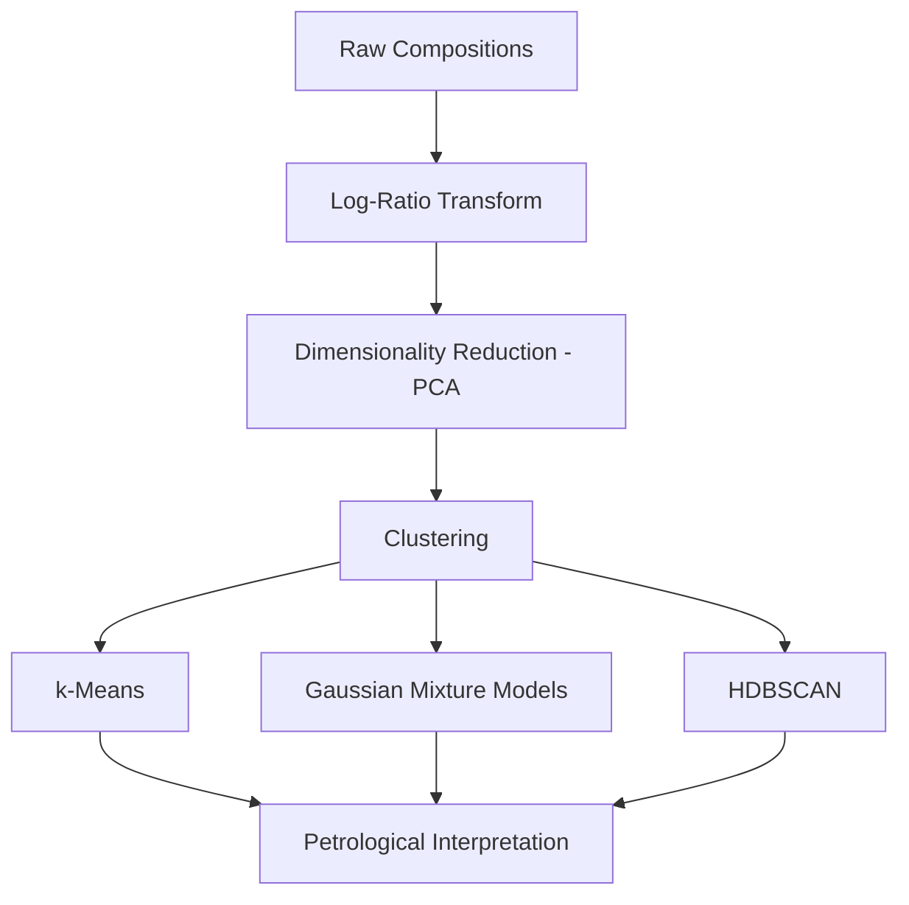

# Machine Learning for Geochemical Modeling

## Overview

Geochemistry — the study of chemical compositions of rocks, minerals, soils, and fluids — underpins much of Earth science. From classifying igneous rock suites to identifying hydrothermal alteration halos around ore deposits, geochemical data drives geological interpretation. However, geochemical data is **compositional**: major oxide analyses (SiO₂, Al₂O₃, FeO, MgO, CaO, Na₂O, K₂O, TiO₂) sum to approximately 100%, creating a mathematically constrained space that violates the assumptions of standard statistical methods. ML for geochemistry must handle this constraint explicitly.

## Compositional Data Analysis (CoDa)

The **simplex constraint** means that geochemical data lives on a $(D-1)$-dimensional simplex $\mathcal{S}^D$, not in standard Euclidean space. Applying standard statistics (correlations, PCA, k-means) directly to raw compositions produces spurious results — a phenomenon known as **Aitchison's warning**.

The solution is to apply **log-ratio transformations** before ML:

**Centered log-ratio (CLR)**:
$$\text{clr}(\mathbf{x})_i = \ln\left(\frac{x_i}{g(\mathbf{x})}\right), \quad g(\mathbf{x}) = \left(\prod_{j=1}^D x_j\right)^{1/D}$$

**Isometric log-ratio (ILR)**:
$$\text{ilr}(\mathbf{x}) = \mathbf{V}^T \cdot \text{clr}(\mathbf{x})$$

where $\mathbf{V}$ is a $(D \times (D-1))$ contrast matrix. The ILR transform maps compositions to unconstrained Euclidean coordinates suitable for any standard ML algorithm.

```python
import numpy as np
from sklearn.preprocessing import FunctionTransformer

def clr_transform(X):
    """Centered log-ratio transform for compositional data."""
    log_X = np.log(X)
    geometric_mean = log_X.mean(axis=1, keepdims=True)
    return log_X - geometric_mean

def ilr_transform(X):
    """Isometric log-ratio transform."""
    D = X.shape[1]
    clr = clr_transform(X)
    # Helmert sub-matrix as contrast matrix
    V = np.zeros((D, D - 1))
    for i in range(D - 1):
        V[:i + 1, i] = 1.0 / (i + 1)
        V[i + 1, i] = -(i + 1.0) / (i + 1)
        V[:, i] *= np.sqrt((i + 1.0) / (i + 2.0))
    return clr @ V

# Apply before any ML algorithm
X_ilr = ilr_transform(X_compositions)
```

## Clustering for Petrological Classification

Unsupervised clustering of geochemical data reveals natural groupings corresponding to rock types, alteration assemblages, or magmatic suites. After log-ratio transformation, standard algorithms apply:



**Gaussian Mixture Models (GMM)** are particularly natural for geochemistry because different rock types often form distinct multivariate normal clusters in log-ratio space:

```python
from sklearn.mixture import GaussianMixture

# Determine optimal number of clusters via BIC
bic_scores = []
for k in range(2, 10):
    gmm = GaussianMixture(n_components=k, covariance_type="full",
                           random_state=42)
    gmm.fit(X_ilr)
    bic_scores.append(gmm.bic(X_ilr))

optimal_k = np.argmin(bic_scores) + 2
gmm_final = GaussianMixture(n_components=optimal_k,
                              covariance_type="full", random_state=42)
labels = gmm_final.fit_predict(X_ilr)
```

## Anomaly Detection in Geochemical Surveys

Exploration geochemistry seeks **anomalies** — samples whose chemistry deviates from the regional background, potentially indicating mineralization. After CoDa-aware preprocessing, anomaly detection methods include:

- **Mahalanobis distance** in ILR space: $D_M = \sqrt{(\mathbf{z} - \boldsymbol{\mu})^T \mathbf{\Sigma}^{-1} (\mathbf{z} - \boldsymbol{\mu})}$ where $\mathbf{z} = \text{ilr}(\mathbf{x})$
- **Robust PCA**: Identifies samples that deviate from the low-rank structure of background data
- **Isolation Forest**: Nonparametric method that isolates anomalies by random partitioning

The key insight is that anomaly detection on **raw** compositions can produce artifacts due to the closure constraint. Always transform first.

## Element Mobility Modeling

During weathering and hydrothermal alteration, some elements are mobilized (gained or lost) while others remain immobile. Understanding element mobility is critical for:

- Identifying the original (protolith) rock composition
- Quantifying mass transfer during alteration
- Recognizing pathfinder element halos around deposits

The **isocon method** plots altered vs. unaltered compositions. Immobile elements plot along a reference line; mobile elements deviate. ML can automate this:

```python
from sklearn.linear_model import RANSACRegressor

# Identify immobile elements via robust regression
# altered_conc and fresh_conc are vectors of element concentrations
ransac = RANSACRegressor(random_state=42)
ransac.fit(fresh_conc.reshape(-1, 1), altered_conc)

# Inliers = immobile elements (on the isocon line)
immobile_mask = ransac.inlier_mask_
mobile_elements = element_names[~immobile_mask]
```

## Tie to Mineralogy

Geochemical compositions ultimately reflect mineral assemblages. **Normative mineralogy** calculations (e.g., CIPW norm) convert bulk chemistry to idealized mineral proportions. ML approaches can learn this mapping more flexibly:

$$\mathbf{x}_{\text{chem}} = \mathbf{A} \cdot \mathbf{m}_{\text{mineral}} + \boldsymbol{\epsilon}$$

where $\mathbf{A}$ is the mineral stoichiometry matrix and $\mathbf{m}$ is the mineral proportion vector. Constrained regression (non-negative, sum-to-one) or neural networks with softmax outputs can solve this inverse problem.

## Summary

ML for geochemistry demands compositional awareness — applying standard methods to raw compositions is mathematically invalid. Log-ratio transforms (CLR, ILR) unlock the full toolkit of ML algorithms for clustering, classification, and anomaly detection. Combined with domain knowledge about element mobility and mineral stoichiometry, CoDa-aware ML provides powerful tools for petrological classification and exploration targeting.
