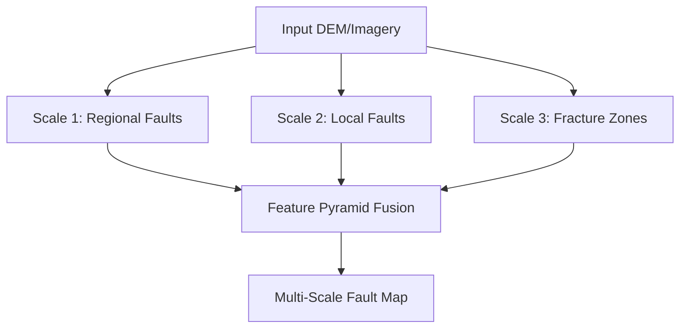
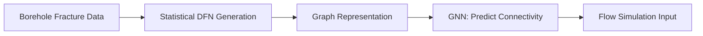

# AI for Structural Geology and Fault Analysis

## Overview

Structural geology studies how rocks deform under tectonic forces — producing faults, folds, joints, and foliations. Understanding these structures is critical for earthquake hazard assessment, resource extraction (faults control fluid flow), and tectonic reconstruction. Traditionally, structural analysis relies heavily on field mapping and manual interpretation of remote sensing data. AI is now automating fault trace detection, classifying fold geometries, predicting fracture networks, and even inverting for paleostress fields.

## Automatic Fault Trace Detection

Faults appear in satellite imagery, digital elevation models (DEMs), and geological maps as linear or curvilinear features. Detecting them automatically involves several AI approaches:

**Semantic segmentation** with U-Nets applied to DEMs and hillshade maps:

```python
import torch
import torch.nn as nn
import torchvision.transforms as T

# Input: hillshade DEM tile (256 x 256, 1 channel)
# Output: fault probability map (256 x 256)

transform = T.Compose([
    T.ToTensor(),
    T.Normalize(mean=[0.5], std=[0.5])
])

# Using a pretrained segmentation model
model = torch.hub.load("mateuszbuda/brain-segmentation-pytorch",
                        "unet", in_channels=1, out_channels=1,
                        init_features=32, pretrained=False)
```

**Edge detection + classification**: Extract linear features using the Hough transform or ridge detection, then classify each lineament as fault, river, road, or artifact using a CNN on the local image patch.

**Multi-scale detection**: Faults span orders of magnitude in length (meters to hundreds of kilometers). A feature pyramid network (FPN) processes images at multiple resolutions to detect faults at all scales:



## Fold Classification

Folds — buckles in layered rock — are classified by geometry (symmetric, asymmetric, overturned), tightness (gentle, open, tight, isoclinal), and mechanism (buckling, flexural slip, passive flow). An ML classifier trained on geometric parameters can categorize folds from cross-section images:

Key geometric features extracted from fold profiles:
- **Interlimb angle** $\theta$: Angle between fold limbs (gentle: $120°$–$180°$; tight: $30°$–$70°$; isoclinal: $\approx 0°$)
- **Aspect ratio**: Amplitude / wavelength
- **Asymmetry index**: Ratio of limb lengths
- **Hinge curvature**: $\kappa = 1/r$ at the fold hinge

These can be computed from digitized fold profiles and fed into gradient-boosted classifiers:

$$P(\text{fold type} \mid \theta, \text{AR}, \text{AI}, \kappa) = \text{softmax}(f_{\text{GBM}}(\theta, \text{AR}, \text{AI}, \kappa))$$

## Stress Field Modeling

The stress state at a point in the Earth is described by a symmetric tensor:

$$\boldsymbol{\sigma} = \begin{pmatrix} \sigma_{xx} & \sigma_{xy} & \sigma_{xz} \\ \sigma_{xy} & \sigma_{yy} & \sigma_{yz} \\ \sigma_{xz} & \sigma_{yz} & \sigma_{zz} \end{pmatrix}$$

**Paleostress inversion** recovers the stress tensor from fault-slip data (fault plane orientations + slickenline directions). Classical methods (Angelier's direct inversion) solve:

$$\boldsymbol{\tau}_{\text{predicted}} = \boldsymbol{\sigma} \cdot \hat{\mathbf{n}} - (\hat{\mathbf{n}}^T \boldsymbol{\sigma} \hat{\mathbf{n}}) \hat{\mathbf{n}}$$

where $\hat{\mathbf{n}}$ is the fault normal and $\boldsymbol{\tau}$ is the resolved shear stress. The misfit between predicted and observed slip directions is minimized.

Neural networks can learn this inversion from synthetic fault-slip datasets, handling noise and polysense (multiple stress states) better than classical methods:

```python
class StressInverter(nn.Module):
    def __init__(self, n_faults_max=50):
        super().__init__()
        # Input: set of (strike, dip, rake) measurements
        self.encoder = nn.Sequential(
            nn.Linear(3, 64),
            nn.ReLU(),
            nn.Linear(64, 128),
            nn.ReLU()
        )
        self.pooling = nn.AdaptiveAvgPool1d(1)  # permutation invariant
        self.decoder = nn.Sequential(
            nn.Linear(128, 64),
            nn.ReLU(),
            nn.Linear(64, 6)  # 6 independent stress tensor components
        )

    def forward(self, fault_data):
        # fault_data: (batch, n_faults, 3)
        h = self.encoder(fault_data)  # (batch, n_faults, 128)
        h = h.permute(0, 2, 1)       # (batch, 128, n_faults)
        h = self.pooling(h).squeeze(-1)  # (batch, 128)
        return self.decoder(h)
```

## Fracture Network Prediction

Discrete fracture networks (DFNs) control fluid flow in reservoirs, aquifers, and geothermal systems. Predicting fracture density, orientation, and connectivity from limited borehole or outcrop data is a key challenge.

**Graph neural networks (GNNs)** are a natural fit — fracture intersections form a graph where nodes are intersection points and edges are fracture segments:



Generative models (VAEs, GANs) trained on mapped fracture networks can produce stochastically realistic DFN realizations conditioned on sparse observations — essential for uncertainty quantification in reservoir modeling.

## Earthquake Rupture Modeling

AI assists in modeling how earthquake ruptures propagate along fault systems:

- **Rupture segmentation**: Predicting which fault segments will rupture together vs. independently
- **Ground motion prediction**: Neural networks trained on earthquake catalogs and site conditions predict peak ground acceleration (PGA) — the key input for seismic hazard maps
- **Coulomb stress transfer**: ML accelerates calculation of how one earthquake changes stress on nearby faults, enabling aftershock forecasting

## Summary

AI for structural geology spans fault detection from imagery, fold classification from geometric parameters, stress tensor inversion from fault-slip data, fracture network prediction with GNNs, and earthquake rupture modeling. These tools transform structural geology from a largely qualitative, map-based discipline into a quantitative, data-driven science while maintaining the physical and geometric constraints that make structural interpretations geologically valid.
