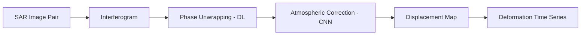

# Geospatial AI and Remote Sensing for Geology

## Overview

Remote sensing provides a bird's-eye view of Earth's geology — from mapping mineral distributions across vast terrains to detecting millimeter-scale ground deformation. The explosion of satellite data (Sentinel, Landsat, ASTER, EnMAP) combined with advances in deep learning has created a new discipline of **geospatial AI** that is transforming geological mapping, hazard monitoring, and resource exploration. This lesson covers the key remote sensing modalities and the AI methods applied to each.

## Hyperspectral Image Analysis for Mineral Mapping

Minerals have characteristic absorption features in the visible to shortwave infrared (VNIR-SWIR, 0.4–2.5 μm) spectrum. Hyperspectral sensors capture 100–400 narrow spectral bands, enabling identification of specific minerals:

- **Iron oxides**: Absorption near 0.9 μm (Fe³⁺ crystal field transitions)
- **Clays (kaolinite, montmorillonite)**: Al-OH absorption at 2.2 μm
- **Carbonates**: CO₃ absorption at 2.35 μm
- **Sulfates (gypsum, alunite)**: S-O features at 1.75 μm and 2.2 μm

Traditional spectral unmixing decomposes each pixel into a linear mixture of endmember spectra:

$$\mathbf{r}_{\text{pixel}} = \sum_{k=1}^{K} a_k \mathbf{e}_k + \boldsymbol{\epsilon}, \quad \sum_k a_k = 1, \quad a_k \geq 0$$

where $\mathbf{e}_k$ are endmember spectra and $a_k$ are abundances. Deep learning approaches replace this with learned nonlinear unmixing:

```python
import torch
import torch.nn as nn

class HyperspectralAutoencoder(nn.Module):
    """Autoencoder for nonlinear spectral unmixing."""
    def __init__(self, n_bands=200, n_endmembers=5):
        super().__init__()
        self.encoder = nn.Sequential(
            nn.Linear(n_bands, 128),
            nn.ReLU(),
            nn.Linear(128, 64),
            nn.ReLU(),
            nn.Linear(64, n_endmembers),
            nn.Softmax(dim=-1)  # abundance fractions sum to 1
        )
        self.decoder = nn.Sequential(
            nn.Linear(n_endmembers, 64),
            nn.ReLU(),
            nn.Linear(64, 128),
            nn.ReLU(),
            nn.Linear(128, n_bands)
        )

    def forward(self, x):
        abundances = self.encoder(x)  # (batch, n_endmembers)
        reconstruction = self.decoder(abundances)  # (batch, n_bands)
        return reconstruction, abundances
```

The softmax constraint ensures physically meaningful abundance estimates. The decoder learns the nonlinear mapping from abundances back to spectra, accounting for intimate mixing effects that violate the linear model.

## InSAR for Ground Deformation

Interferometric Synthetic Aperture Radar (InSAR) measures ground displacement by comparing the phase of radar signals from repeat satellite passes. Phase differences encode line-of-sight displacement with millimeter precision:

$$\Delta \phi = \frac{4\pi}{\lambda} d_{\text{LOS}} + \phi_{\text{topo}} + \phi_{\text{atmo}} + \phi_{\text{noise}}$$

where $\lambda$ is the radar wavelength and $d_{\text{LOS}}$ is the line-of-sight displacement. AI helps with:

- **Phase unwrapping**: Resolving the $2\pi$ ambiguity in interferometric phase using deep learning (replacing error-prone traditional algorithms)
- **Atmospheric correction**: CNNs trained to separate atmospheric delay from deformation signal
- **Time-series analysis**: Persistent scatterer InSAR (PS-InSAR) and SBAS use stacks of interferograms; ML identifies stable scatterers and extracts displacement time series



Applications include monitoring volcanic inflation, fault creep, subsidence from groundwater extraction, and post-earthquake deformation.

## LiDAR for Geological Mapping

Airborne LiDAR penetrates vegetation canopy to reveal bare-earth topography at centimeter resolution. For geology, this is transformative — fault scarps, landslide scars, and subtle structural features hidden by forest become visible.

AI applications on LiDAR-derived DEMs include:

- **Automatic geomorphic feature extraction**: CNNs detect fault scarps, alluvial fans, river terraces
- **Point cloud classification**: PointNet-family architectures classify raw LiDAR points into ground, vegetation, buildings, and geological features
- **Change detection**: Comparing multi-temporal LiDAR surveys to quantify erosion, mass wasting, or volcanic resurfacing

```python
# PointNet-inspired classification of LiDAR points
class GeoPointNet(nn.Module):
    def __init__(self, n_classes=5):
        super().__init__()
        self.mlp1 = nn.Sequential(
            nn.Linear(3, 64), nn.ReLU(),
            nn.Linear(64, 128), nn.ReLU(),
            nn.Linear(128, 256), nn.ReLU()
        )
        self.classifier = nn.Sequential(
            nn.Linear(256, 128), nn.ReLU(),
            nn.Linear(128, n_classes)
        )

    def forward(self, points):
        # points: (batch, N_points, 3)
        features = self.mlp1(points)              # (batch, N, 256)
        global_feat = features.max(dim=1)[0]      # (batch, 256)
        return self.classifier(global_feat)
```

## CNNs for Geological Feature Extraction

Satellite imagery (Sentinel-2, Landsat) provides medium-resolution multispectral data suitable for regional geological mapping:

- **Lithological classification**: Mapping rock units from spectral + textural features
- **Lineament extraction**: Detecting geological linear features (faults, dykes, contacts)
- **Alteration mapping**: Identifying zones of hydrothermal alteration using band ratios

Transfer learning from ImageNet-pretrained models is effective even for geological imagery — the low-level features (edges, textures) transfer well, while domain-specific patterns are learned in later layers.

## Change Detection for Landslide Monitoring

Landslides are a major geohazard. AI-based change detection compares multi-temporal images to identify new slope failures:

- **Siamese networks**: Two identical CNNs process before/after images; the difference in feature space flags changes
- **Attention-based methods**: Focus on regions of maximal change while ignoring seasonal vegetation variation
- **Pixel-level classification**: Segment each pixel as stable, slow-moving, or failed

Combining InSAR-derived displacement rates with optical imagery change detection creates robust early warning systems for slow-moving landslides that threaten communities and infrastructure.

## Summary

Geospatial AI for geology leverages the unique capabilities of each remote sensing modality — hyperspectral for mineral chemistry, InSAR for deformation, LiDAR for high-resolution topography, and multispectral for regional mapping. Deep learning has enabled nonlinear spectral unmixing, automated phase unwrapping, point cloud classification, and multi-temporal change detection, making remote geological analysis faster, more comprehensive, and more quantitative than ever before.
