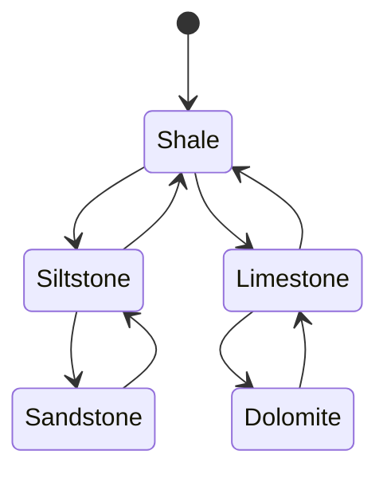
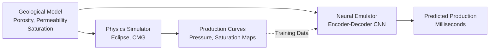

# AI for Subsurface Characterization and Reservoir Modeling

## Overview

Characterizing the subsurface — determining rock types, porosity, permeability, fluid content, and their spatial distribution — is fundamental to hydrocarbon extraction, groundwater management, geothermal energy, and carbon sequestration. Direct measurements exist only at wells (boreholes), which sample a tiny fraction of the subsurface. AI bridges this gap by learning relationships between well data and spatially continuous geophysical measurements (seismic), enabling 3D geological models with quantified uncertainty.

## Well Log Interpretation with ML

Well logs measure physical properties continuously along a borehole (gamma ray, resistivity, sonic velocity, density, neutron porosity). Traditional interpretation uses **crossplots** — plotting one log against another to identify lithology and fluid content. ML automates and extends this:

```python
import numpy as np
from sklearn.ensemble import GradientBoostingClassifier
from sklearn.metrics import classification_report

# Features: well log measurements at each depth sample
# Target: facies labels from core descriptions
features = ["GR", "RESISTIVITY", "SONIC", "DENSITY", "NEUTRON", "PE"]

X_train = well_data_train[features].values
y_train = well_data_train["FACIES"].values

X_test = well_data_test[features].values
y_test = well_data_test["FACIES"].values

clf = GradientBoostingClassifier(
    n_estimators=300,
    max_depth=5,
    learning_rate=0.1,
    random_state=42
)
clf.fit(X_train, y_train)
y_pred = clf.predict(X_test)

print(classification_report(y_test, y_pred,
      target_names=["Sandstone", "Siltstone", "Shale",
                     "Limestone", "Dolomite"]))
```

## Facies Classification

**Electrofacies** are groups of log responses that correspond to distinct rock types. Sequence-aware models capture the vertical ordering constraints — certain facies transitions are geologically forbidden:



Hidden Markov Models (HMMs) and LSTMs naturally encode these transition probabilities:

```python
import torch
import torch.nn as nn

class FaciesLSTM(nn.Module):
    def __init__(self, n_logs=6, hidden_size=64, n_facies=5):
        super().__init__()
        self.lstm = nn.LSTM(n_logs, hidden_size, num_layers=2,
                            batch_first=True, bidirectional=True)
        self.fc = nn.Linear(hidden_size * 2, n_facies)

    def forward(self, x):
        # x: (batch, depth_samples, n_logs)
        out, _ = self.lstm(x)
        return self.fc(out)  # (batch, depth_samples, n_facies)
```

The bidirectional LSTM considers context from both above and below each depth point, mimicking how a geologist examines the full log before assigning facies.

## Porosity and Permeability Prediction

**Porosity** ($\phi$) — the fraction of pore space in rock — and **permeability** ($k$) — the ease of fluid flow — are critical reservoir properties. Porosity is estimated from density and neutron logs:

$$\phi_D = \frac{\rho_{\text{matrix}} - \rho_{\text{bulk}}}{\rho_{\text{matrix}} - \rho_{\text{fluid}}}$$

Permeability lacks a direct log measurement and is traditionally estimated from core plug analyses at sparse intervals. ML learns the porosity-permeability relationship and its dependence on lithology:

$$\log(k) = f_{\text{NN}}(\phi, \text{GR}, \text{SONIC}, \text{facies})$$

Neural networks capture the nonlinear, facies-dependent transforms better than classical Kozeny-Carman equations, especially in heterogeneous carbonates.

## Neural Reservoir Emulators

Reservoir simulation — solving coupled flow equations for multiphase fluid movement through porous media — is computationally expensive. A single simulation of a million-cell model can take hours. **Neural emulators** (surrogate models) approximate the simulator:



The emulator is trained on hundreds of simulation runs with varied geological realizations. Once trained, it produces near-instant predictions, enabling:

- **History matching**: Calibrating geological models to observed production data via optimization
- **Uncertainty quantification**: Running thousands of Monte Carlo realizations
- **Real-time decision support**: Evaluating drilling scenarios on the fly

A common architecture encodes the 3D property model with 3D convolutions and predicts time-series outputs with temporal convolutions or LSTMs:

```python
class ReservoirEmulator(nn.Module):
    def __init__(self):
        super().__init__()
        # Encode 3D geological model
        self.spatial_encoder = nn.Sequential(
            nn.Conv3d(3, 32, kernel_size=3, padding=1),  # porosity, perm, Sw
            nn.ReLU(),
            nn.Conv3d(32, 64, kernel_size=3, stride=2, padding=1),
            nn.ReLU(),
            nn.AdaptiveAvgPool3d(4),
            nn.Flatten()
        )
        # Decode to production time series
        self.temporal_decoder = nn.Sequential(
            nn.Linear(64 * 64, 256),
            nn.ReLU(),
            nn.Linear(256, 100)  # 100 time steps of oil rate
        )

    def forward(self, geo_model):
        z = self.spatial_encoder(geo_model)
        return self.temporal_decoder(z)
```

## Uncertainty Quantification

Subsurface models are inherently uncertain — we extrapolate from sparse wells across kilometers. ML-based UQ approaches include:

- **Ensemble methods**: Train multiple models on bootstrapped data; spread = uncertainty
- **Monte Carlo Dropout**: Use dropout at inference time as approximate Bayesian inference
- **Deep ensembles**: Train $N$ networks with different random initializations; predictive variance estimates epistemic uncertainty
- **Conditional generative models**: VAEs or GANs produce multiple plausible geological realizations conditioned on well data

The predictive uncertainty at a location $\mathbf{x}$ can be decomposed:

$$\text{Var}[y|\mathbf{x}] = \underbrace{\text{Var}_{\theta}[\mathbb{E}[y|\mathbf{x},\theta]]}_{\text{epistemic (model)}} + \underbrace{\mathbb{E}_{\theta}[\text{Var}[y|\mathbf{x},\theta]]}_{\text{aleatoric (data)}}$$

## Summary

AI for subsurface characterization connects sparse well measurements to spatial geological models through ML-based log interpretation, facies classification, and property prediction. Neural reservoir emulators accelerate simulation by orders of magnitude, enabling uncertainty quantification and real-time decision support. The integration of physics constraints (valid facies transitions, flow equations) with data-driven learning produces models that are both accurate and geologically plausible.
