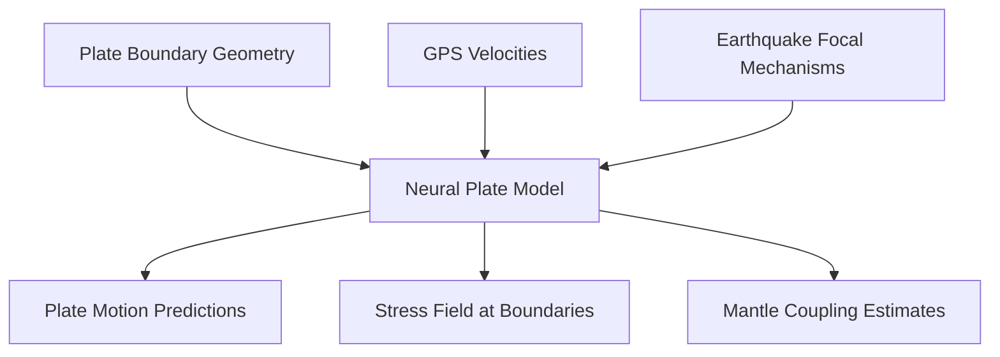

# Physics-Informed Machine Learning for Geodynamics

## Overview

Geodynamics studies the large-scale motions of Earth's interior — mantle convection, plate tectonics, slab subduction, and the thermal evolution of the planet. These processes are governed by well-known physics (conservation of mass, momentum, and energy) but involve extreme computational costs when modeled at realistic resolution. Physics-informed machine learning (PIML) offers a path forward by embedding physical laws directly into neural network training, producing models that are both data-efficient and physically consistent.

## The Stokes Equations for Mantle Flow

Mantle convection is governed by the Stokes equations (inertia is negligible at geological timescales):

$$-\nabla p + \nabla \cdot \left[\eta(\dot{\varepsilon}, T) \dot{\boldsymbol{\varepsilon}}\right] + \rho(T) \mathbf{g} = 0$$
$$\nabla \cdot \mathbf{u} = 0$$

coupled with the energy equation:

$$\rho c_p \left(\frac{\partial T}{\partial t} + \mathbf{u} \cdot \nabla T\right) = \nabla \cdot (k \nabla T) + H$$

where $\mathbf{u}$ is velocity, $p$ is pressure, $\eta$ is viscosity (strongly temperature- and strain-rate-dependent), $T$ is temperature, and $H$ is radiogenic heat production. Solving these equations numerically at global scale with realistic rheology requires millions of CPU hours.

## Physics-Informed Neural Networks (PINNs) for Geodynamics

PINNs encode the governing PDEs in the loss function. For a 2D mantle convection problem, the network $\mathcal{N}_\theta(x, z, t) \to (u, w, p, T)$ is trained by minimizing:

$$\mathcal{L} = \lambda_{\text{data}} \mathcal{L}_{\text{data}} + \lambda_{\text{PDE}} \mathcal{L}_{\text{PDE}} + \lambda_{\text{BC}} \mathcal{L}_{\text{BC}}$$

where:

$$\mathcal{L}_{\text{PDE}} = \left\|\nabla \cdot \mathbf{u}\right\|^2 + \left\|-\nabla p + \nabla \cdot (\eta \dot{\boldsymbol{\varepsilon}}) + \rho g \hat{\mathbf{z}}\right\|^2 + \left\|\rho c_p \left(\frac{\partial T}{\partial t} + \mathbf{u} \cdot \nabla T\right) - k\nabla^2 T - H\right\|^2$$

```python
import torch
import torch.nn as nn
import torch.autograd as autograd

class MantlePINN(nn.Module):
    def __init__(self):
        super().__init__()
        self.net = nn.Sequential(
            nn.Linear(3, 128),  # input: (x, z, t)
            nn.Tanh(),
            nn.Linear(128, 128),
            nn.Tanh(),
            nn.Linear(128, 128),
            nn.Tanh(),
            nn.Linear(128, 4)   # output: (u, w, p, T)
        )

    def forward(self, x, z, t):
        inp = torch.stack([x, z, t], dim=-1)
        return self.net(inp)

def physics_loss(model, x, z, t, Ra):
    """Compute PDE residuals using automatic differentiation."""
    x.requires_grad_(True)
    z.requires_grad_(True)
    t.requires_grad_(True)

    out = model(x, z, t)
    u, w, p, T = out[..., 0], out[..., 1], out[..., 2], out[..., 3]

    # Automatic differentiation for spatial derivatives
    u_x = autograd.grad(u.sum(), x, create_graph=True)[0]
    w_z = autograd.grad(w.sum(), z, create_graph=True)[0]

    T_t = autograd.grad(T.sum(), t, create_graph=True)[0]
    T_x = autograd.grad(T.sum(), x, create_graph=True)[0]
    T_z = autograd.grad(T.sum(), z, create_graph=True)[0]
    T_xx = autograd.grad(T_x.sum(), x, create_graph=True)[0]
    T_zz = autograd.grad(T_z.sum(), z, create_graph=True)[0]

    # Continuity: div(u) = 0
    continuity = u_x + w_z

    # Energy: dT/dt + u*dT/dx + w*dT/dz = (T_xx + T_zz)
    energy = T_t + u * T_x + w * T_z - (T_xx + T_zz)

    # Momentum (simplified, Boussinesq): buoyancy term Ra*T
    # Full implementation includes viscosity and pressure gradients

    return (continuity**2).mean() + (energy**2).mean()
```

## Plate Tectonics Modeling

Plate motions are driven by mantle convection and controlled by plate boundary forces (ridge push, slab pull, basal drag). ML approaches include:



- **Kinematic models**: Neural networks fit plate rotation poles and velocities to GPS data, handling complex deformation zones where rigid plate assumptions break down
- **Dynamic models**: PINNs solve the force balance on plates, predicting velocities from boundary forces and basal tractions

## Slab Dynamics and Subduction

When oceanic lithosphere subducts into the mantle, the slab's trajectory depends on its density, viscosity, trench geometry, and interaction with the 660-km discontinuity. Neural operators (DeepONet, Fourier Neural Operators) can learn the slab evolution operator:

$$\mathcal{G}_\theta: (T_0, \eta, \text{geometry}) \to T(x, z, t)$$

mapping initial conditions and material properties to the full spatiotemporal temperature field. Training on hundreds of 2D numerical simulations, these operators generalize to unseen parameter combinations orders of magnitude faster than re-running simulations.

## Glacial Isostatic Adjustment (GIA)

GIA — the slow rebound of Earth's crust after ice sheet removal — depends on the mantle's viscosity profile. Observations (relative sea level, GPS uplift rates) constrain the viscosity structure through an inverse problem:

$$\min_{\eta(r)} \|\mathbf{d}_{\text{obs}} - \mathcal{F}[\eta(r)]\|^2$$

where $\mathcal{F}$ is the GIA forward model. Neural network surrogates for $\mathcal{F}$ accelerate the Bayesian inversion:

```python
# Neural surrogate for GIA forward model
class GIASurrogate(nn.Module):
    def __init__(self, n_viscosity_layers=5, n_observations=200):
        super().__init__()
        self.net = nn.Sequential(
            nn.Linear(n_viscosity_layers, 128),
            nn.ReLU(),
            nn.Linear(128, 256),
            nn.ReLU(),
            nn.Linear(256, 128),
            nn.ReLU(),
            nn.Linear(128, n_observations)
        )

    def forward(self, viscosity_profile):
        return self.net(viscosity_profile)

# Use in MCMC for Bayesian inversion
# Surrogate replaces expensive GIA simulation in likelihood evaluation
```

## Inverse Problems in Geophysics

Many geodynamic questions are **inverse problems** — inferring unobservable properties from surface measurements:

| Observations | Unknown | Method |
|---|---|---|
| Seismic travel times | 3D velocity structure | Tomographic inversion |
| Gravity anomalies | Density distribution | Gravity inversion |
| Surface heat flow | Mantle temperature | Thermal modeling |
| Magnetic anomalies | Susceptibility/magnetization | Magnetic inversion |

PINNs and neural operators enable differentiable forward models, making gradient-based inversion tractable for these high-dimensional problems. The key advantage: automatic differentiation provides exact gradients of the physics with respect to unknown parameters.

## Summary

Physics-informed ML for geodynamics embeds conservation laws into neural network training, producing models that respect the Stokes equations, energy conservation, and material constraints. Applications span mantle convection, plate tectonics, slab dynamics, glacial isostatic adjustment, and geophysical inversion. Neural operators and surrogates accelerate simulations by orders of magnitude, enabling Bayesian inference on problems previously too expensive to invert.
