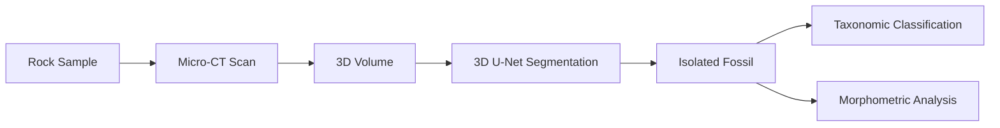
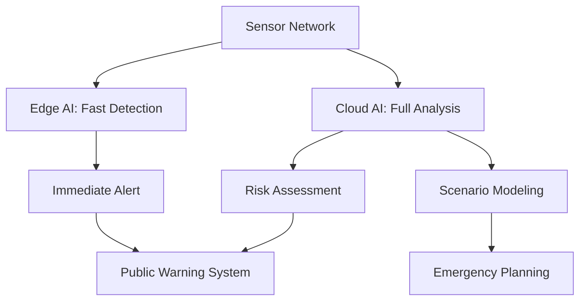

## Frontiers: AI for Earth's Past and Future

## Overview

The frontiers of AI for Earth science extend in two temporal directions — deep into the past (reconstructing paleoclimate, detecting fossils, tracing mineral evolution over billions of years) and forward into the future (predicting geohazards, securing critical mineral supply chains, and exploring other planetary bodies). This lesson surveys the cutting-edge research pushing AI into these frontier areas.

## Paleoclimate Reconstruction with ML

Understanding past climates provides context for current climate change and validates climate models. Paleoclimate proxies — ice cores ($\delta^{18}\text{O}$, $\text{CO}_2$ bubbles), ocean sediment cores (foraminifera assemblages), tree rings, speleothems — are sparse, noisy, and indirectly related to climate variables. ML helps bridge the gap:

**Proxy-to-climate transfer functions**: Neural networks learn nonlinear mappings from proxy measurements to climate variables (temperature, precipitation, ice volume):

$$T_{\text{surface}}(t) = f_{\text{NN}}\left(\delta^{18}\text{O}(t),\ \text{Mg/Ca}(t),\ \text{foram assemblage}(t)\right)$$

```python
import torch
import torch.nn as nn

class PaleoclimateTransfer(nn.Module):
    def __init__(self, n_proxies=10, n_climate_vars=3):
        super().__init__()
        self.net = nn.Sequential(
            nn.Linear(n_proxies, 64),
            nn.ReLU(),
            nn.Linear(64, 32),
            nn.ReLU(),
            nn.Linear(32, n_climate_vars)  # T, precip, ice volume
        )

    def forward(self, proxies):
        return self.net(proxies)
```

**Spatial interpolation**: Gaussian processes and neural processes interpolate between sparse proxy sites to create global paleoclimate maps, accounting for the spatially varying relationship between proxies and climate.

**Age-depth modeling**: Bayesian neural networks improve the chronology of sediment cores by learning sedimentation rate patterns from radiocarbon dates and biostratigraphic events.

## AI for Paleontology

Paleontology — the study of ancient life through fossils — increasingly benefits from AI:

**Fossil detection in CT scans**: Synchrotron and micro-CT imaging of rock samples reveals internal fossils. 3D CNNs segment fossil material from surrounding matrix:



**Automated taxonomic classification**: CNNs trained on museum specimen images classify fossils to genus or species level. Transfer learning from ImageNet, fine-tuned on paleontological collections, achieves expert-level accuracy for well-represented taxa.

**Radiometric age estimation**: ML models predict the age of geological formations from combinations of biostratigraphic, magnetostratigraphic, and geochemical data, improving correlation between sites.

## Mineral Evolution and Critical Mineral Prediction

**Mineral evolution** — the idea that Earth's mineral diversity has increased over geological time, driven by tectonics, atmospheric oxygenation, and biological evolution — is a frontier research area. AI contributes by:

- **Predicting undiscovered mineral species**: Graph neural networks trained on crystal structure databases predict which mineral compositions are thermodynamically plausible but not yet discovered
- **Critical mineral prospectivity**: With growing demand for lithium, cobalt, rare earth elements, and other technology metals, ML models predict the locations of undiscovered deposits:

```python
# Critical mineral prospectivity model
features = {
    "geological": ["lithology", "age", "tectonic_setting"],
    "geochemical": ["Li_ppm", "REE_total", "Nb_Ta_ratio"],
    "geophysical": ["magnetic_anomaly", "gravity_gradient"],
    "remote_sensing": ["alteration_index", "clay_abundance"]
}

# Ensemble model combining geological knowledge with data-driven features
from sklearn.ensemble import StackingClassifier
from sklearn.linear_model import LogisticRegression

estimators = [
    ("rf", RandomForestClassifier(n_estimators=500)),
    ("gbm", GradientBoostingClassifier(n_estimators=300)),
    ("svm", SVC(probability=True))
]

stacking_model = StackingClassifier(
    estimators=estimators,
    final_estimator=LogisticRegression(),
    cv=5
)
```

## AI for Geohazard Risk Assessment

Geohazards — earthquakes, landslides, volcanic eruptions, tsunamis, subsidence — threaten billions of people. AI enables next-generation risk assessment:

**Earthquake early warning**: Neural networks detect P-waves within seconds of an earthquake, estimating magnitude and location before damaging S-waves and surface waves arrive. Systems like the ShakeAlert use ML to provide seconds to minutes of warning.

**Landslide susceptibility mapping**: ML models combining slope, lithology, rainfall, land cover, and proximity to roads/rivers produce probabilistic susceptibility maps:

$$P(\text{landslide} \mid \mathbf{x}) = \sigma\left(\beta_0 + \sum_i \beta_i x_i + f_{\text{nonlinear}}(\mathbf{x})\right)$$

**Multi-hazard early warning networks**: Integrated sensor networks with edge AI process data locally for rapid detection, while cloud-based models perform full analysis:



## Planetary Geology: Mars, Moon, and Beyond

AI for Earth science extends naturally to other planetary bodies, where data is even sparser and field geology is impossible:

- **Mars terrain classification**: CNNs classify Martian surface types (bedrock, regolith, aeolian deposits, impact ejecta) from HiRISE and CTX imagery
- **Crater detection and dating**: Object detection networks (YOLO, Faster R-CNN) automate crater counting — the primary method for dating planetary surfaces
- **Lunar resource mapping**: Hyperspectral analysis of Moon Mineralogy Mapper data identifies water ice deposits and mineral resources for future missions
- **Autonomous geological survey agents**: Rovers equipped with onboard ML make real-time decisions about which rocks to analyze, optimizing scientific return with limited communication bandwidth

## Autonomous Geological Survey Agents

The concept of AI-driven geological survey extends to Earth as well. Autonomous drones equipped with hyperspectral cameras and onboard inference can:

1. Plan survey paths based on geological uncertainty
2. Identify interesting outcrops in real time
3. Adjust sampling strategy based on preliminary results
4. Build geological maps iteratively with active learning

This represents a convergence of robotics, computer vision, and geological domain knowledge — agents that "think like a geologist" while operating in remote or hazardous terrain.

## Summary

The frontiers of AI for Earth science push into deep time (paleoclimate, paleontology, mineral evolution), forward to future risks (geohazard early warning, critical mineral supply), and outward to other worlds (Mars, Moon). These applications share a common thread: using AI to extract maximum insight from sparse, heterogeneous data under physical constraints — the defining challenge of Earth science AI.
