# Introduction to AI for Education

## Overview

The application of artificial intelligence to education is one of the oldest and most enduring threads in AI research. Long before deep learning or large language models captured public attention, researchers were building computer systems designed to teach. Understanding this history is essential for appreciating where the field stands today and where it is headed.

The story begins in the early 1970s at Bolt Beranek and Newman (BBN), where Jaime Carbonell developed **SCHOLAR**, one of the first intelligent tutoring systems (ITS). SCHOLAR used a semantic network to represent knowledge about South American geography and could engage students in mixed-initiative Socratic dialogues -- asking questions, evaluating answers, and generating follow-up prompts. Around the same time, the BUGGY system at BBN and the WEST system at MIT explored how to model student misconceptions in arithmetic, laying the groundwork for what would become the student modeling subfield.

Through the 1980s and early 1990s, the ITS community produced landmark systems including Anderson's **Cognitive Tutors** for algebra and geometry at Carnegie Mellon University. These systems were grounded in ACT-R cognitive theory and used production rules to trace students' problem-solving steps in real time, providing targeted hints and feedback. The Cognitive Tutor Algebra I program eventually became one of the few AI-in-education systems to undergo large-scale randomized controlled trials, with results published in peer-reviewed journals showing statistically significant learning gains.

The 1990s web revolution transformed the landscape. The emergence of web-based learning management systems (LMS) like WebCT and Blackboard created massive digital repositories of student interaction data for the first time. Researchers began applying data mining and machine learning techniques to these logs, giving birth to **Educational Data Mining (EDM)** as a distinct research community. The first International Conference on Educational Data Mining was held in 2008, formalizing a field that had been growing for over a decade.

The 2010s brought two parallel waves. First, **Massive Open Online Courses (MOOCs)** from platforms like Coursera, edX, and Udacity enrolled millions of learners worldwide, generating unprecedented volumes of clickstream, assessment, and forum data. Second, advances in deep learning enabled new approaches to knowledge tracing, natural language processing for educational content, and automated essay scoring that surpassed earlier statistical methods.

The 2020s have been defined by the rise of **large language models (LLMs)**. Systems like GPT-4, Claude, and Gemini can serve as conversational tutors, generate practice problems, provide detailed explanations, and even grade open-ended responses. Khan Academy's Khanmigo, Duolingo Max, and numerous startup products have integrated LLMs into learning workflows, raising both excitement about personalized education at scale and concerns about accuracy, equity, and the changing role of human teachers.

Today, AI for education encompasses a broad taxonomy of systems and techniques. **Intelligent Tutoring Systems (ITS)** are the classic category: interactive systems that model both domain knowledge and individual student understanding to deliver personalized instruction. **Adaptive Learning Platforms** focus on dynamically adjusting content difficulty, sequencing, and presentation based on ongoing learner performance. **Educational Data Mining** applies statistical and machine learning methods to discover patterns in educational data -- predicting dropout, identifying at-risk students, and uncovering effective learning strategies. **Conversational Tutors and AI Teaching Assistants** use natural language understanding and generation to interact with students in dialogue, answering questions, prompting reflection, and managing course logistics.

Evaluating AI-in-education systems requires careful attention to metrics. **Learning gains** (often measured as pre-test to post-test improvement, normalized by the maximum possible gain) remain the gold standard. **Time-to-mastery** captures efficiency -- can the AI help students learn the same material faster? **Engagement metrics** such as session duration, return rate, and completion rate indicate whether students actually use the system. Increasingly, researchers also track **equity metrics**, measuring whether AI tools reduce or widen achievement gaps across demographic groups.

Significant challenges persist. Educational datasets are often **small and noisy** compared to those in computer vision or NLP, because collecting labeled learning data requires expensive human annotation and institutional review board (IRB) approval. The **cold-start problem** is acute: a new student has no interaction history, making personalization difficult until sufficient data is gathered. **Transfer learning** across subjects and populations is unreliable -- a model trained on college-level physics students in the United States may fail when applied to middle-school mathematics in Kenya. Finally, **ethical concerns** around student data privacy, algorithmic bias, over-reliance on automation, and the potential displacement of human educators demand ongoing attention from researchers, policymakers, and practitioners alike.

This lesson series will take you from these foundational concepts through the technical architectures, algorithms, and practical tools that define modern AI for education.

## Key Concepts

- **Intelligent Tutoring System (ITS)**: A computer system that provides personalized instruction by modeling domain knowledge, tracking student understanding, and making pedagogical decisions about what to teach next and how to present it.
- **Adaptive Learning**: An educational approach that uses algorithms to dynamically adjust the content, difficulty, and sequencing of learning materials based on each student's ongoing performance and inferred knowledge state.
- **Educational Data Mining (EDM)**: The application of data mining, machine learning, and statistical methods to data generated in educational settings, with the goal of discovering patterns that can improve teaching and learning.
- **Learning Gain**: A measure of how much a student has learned, typically computed as the normalized difference between pre-test and post-test scores: $g = \frac{\text{post} - \text{pre}}{\text{max} - \text{pre}}$.
- **Cold-Start Problem**: The difficulty of making accurate predictions or personalizing instruction for a new learner who has no prior interaction history in the system.
- **Knowledge Tracing**: The task of modeling a student's evolving knowledge state over time based on their sequence of correct and incorrect responses to practice items.

## Technical Details

At the beginner level, the most important technical idea is how an educational AI system collects data, builds a model of the student, and uses that model to make instructional decisions. The general pipeline is:

1. **Interaction Logging** -- the system records every student action: answers submitted, hints requested, time spent, pages visited.
2. **Feature Extraction** -- raw logs are transformed into meaningful features: percent correct on recent items, average response time, number of hint requests per problem.
3. **Student Modeling** -- a machine learning model estimates the student's current knowledge state, typically as a vector of probabilities across a set of skills or concepts.
4. **Decision Making** -- a pedagogical policy uses the student model to select the next activity: a new problem, a review item, a hint, or a change of topic.
5. **Feedback and Adaptation** -- the student's response to the chosen activity is logged, the student model is updated, and the cycle repeats.

A simple example of computing normalized learning gain in Python:

```python
import numpy as np

# Pre-test and post-test scores for a class of students (out of 100)
pre_scores = np.array([45, 52, 38, 60, 55, 42, 50, 48, 35, 58])
post_scores = np.array([78, 85, 70, 90, 82, 75, 80, 77, 68, 88])
max_score = 100

# Normalized learning gain: g = (post - pre) / (max - pre)
gains = (post_scores - pre_scores) / (max_score - pre_scores)
print("Individual normalized gains:", np.round(gains, 3))
print("Mean normalized gain:", round(np.mean(gains), 3))

# Hake's classification:
# g >= 0.7 -> high gain, 0.3 <= g < 0.7 -> medium gain, g < 0.3 -> low gain
mean_g = np.mean(gains)
if mean_g >= 0.7:
    print("Classification: High gain")
elif mean_g >= 0.3:
    print("Classification: Medium gain")
else:
    print("Classification: Low gain")
```

## Diagrams

**Taxonomy of AI for Education**

```mermaid
flowchart TD
    AI["AI for Education"]

    AI --> ITS["Intelligent Tutoring Systems"]
    AI --> ALP["Adaptive Learning Platforms"]
    AI --> EDM["Educational Data Mining"]
    AI --> CT["Conversational Tutors"]
    AI --> ATA["AI Teaching Assistants"]

    ITS --> ITS1["Cognitive Tutors"]
    ITS --> ITS2["Constraint-Based Tutors"]
    ITS --> ITS3["Example-Tracing Tutors"]

    ALP --> ALP1["Knowledge Tracing"]
    ALP --> ALP2["Content Sequencing"]
    ALP --> ALP3["Difficulty Adaptation"]

    EDM --> EDM1["Dropout Prediction"]
    EDM --> EDM2["Learning Analytics"]
    EDM --> EDM3["Behavior Clustering"]

    CT --> CT1["Socratic Dialogue"]
    CT --> CT2["LLM-Based Tutors"]
    CT --> CT3["Language Learning Bots"]

    ATA --> ATA1["Automated Grading"]
    ATA --> ATA2["Question Answering"]
    ATA --> ATA3["Course Management"]
```



## Exercises/Projects

1. **Historical Research**: Choose one of the early ITS systems mentioned (SCHOLAR, BUGGY, or Cognitive Tutor). Read the original paper or a comprehensive review and write a one-page summary describing the system's architecture, the domain it tutored, and its reported effectiveness.
2. **Learning Gain Analysis**: Using the Python code above, create a dataset of 30 simulated students with varying pre-test and post-test scores. Compute the mean normalized learning gain and produce a histogram of individual gains using `matplotlib`.
3. **Taxonomy Mapping**: Find three commercially available AI-for-education products (e.g., Duolingo, Khan Academy, Coursera). Classify each one according to the taxonomy diagram above and justify your classification with specific features of the product.
4. **Ethics Discussion**: Write a 500-word essay discussing one ethical concern related to AI in education. Consider issues such as data privacy, algorithmic bias, digital divide, or the impact on the teaching profession.

## Further Reading

- Carbonell, J. R. (1970). "AI in CAI: An Artificial Intelligence Approach to Computer-Assisted Instruction." *IEEE Transactions on Man-Machine Systems*, 11(4), 190-202.
- Anderson, J. R., Corbett, A. T., Koedinger, K. R., & Pelletier, R. (1995). "Cognitive Tutors: Lessons Learned." *Journal of the Learning Sciences*, 4(2), 167-207.
- Baker, R. S., & Inventado, P. S. (2014). "Educational Data Mining and Learning Analytics." In *Learning Analytics* (pp. 61-75). Springer.
- Kasneci, E., et al. (2023). "ChatGPT for Good? On Opportunities and Challenges of Large Language Models for Education." *Learning and Individual Differences*, 103, 102274.
