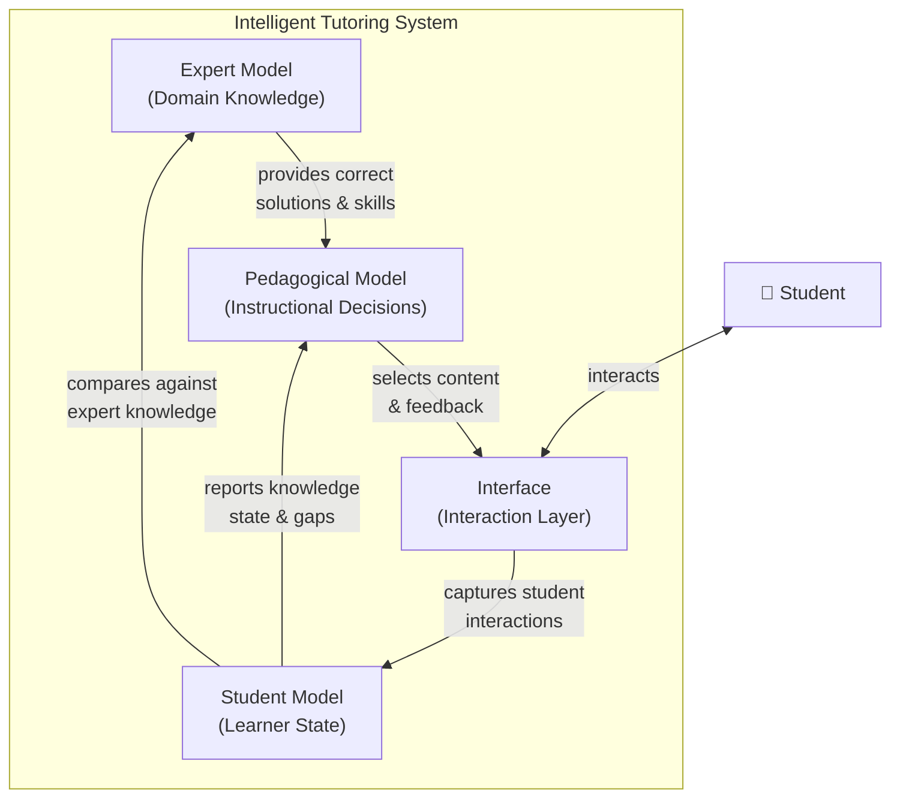
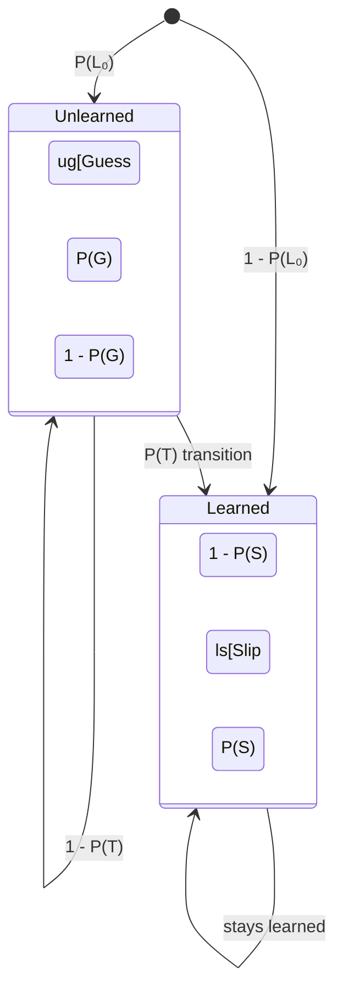

# Intelligent Tutoring Systems

## Overview

Intelligent Tutoring Systems (ITS) represent the most mature and well-studied category of AI-in-education technology. An ITS is a computer program that provides personalized, one-on-one instruction to learners by combining knowledge of the subject matter with a model of each individual student's understanding. The foundational architecture of an ITS, first articulated by Hartley and Sleeman in 1973 and refined by VanLehn in 2006, consists of four interacting components: the **Expert Model**, the **Student Model**, the **Pedagogical Model**, and the **Interface**.

The **Expert Model** (also called the domain model) encodes the knowledge and skills that the system is designed to teach. There are several approaches to knowledge representation. **Production rules** are condition-action pairs (IF-THEN rules) that capture procedural knowledge -- for example, "IF the equation has the form ax + b = c, THEN subtract b from both sides." John Anderson's ACT-R theory formalized this approach and underpinned the Carnegie Learning **Cognitive Tutors**, which became the most commercially successful ITS in history, used by hundreds of thousands of students in algebra and geometry courses. **Bayesian networks** represent domain knowledge as a directed acyclic graph where nodes are concepts or skills and edges encode prerequisite or causal relationships, with probabilities capturing uncertainty. **Ontologies** provide a formal, structured vocabulary for the domain, enabling the system to reason about relationships between concepts (e.g., "quadratic equations" are a type of "polynomial equations" which require "factoring" as a prerequisite skill).

The **Student Model** is the heart of an ITS. Its purpose is to maintain a dynamic, individualized representation of what the learner knows, does not know, and may have misconceptions about. The simplest approach is the **overlay model**, which represents the student's knowledge as a subset of the expert model -- each skill or concept has an associated probability of mastery, and learning corresponds to increasing these probabilities over time. More sophisticated approaches include **bug libraries**, which catalog common errors and their underlying misconceptions (e.g., a student who always subtracts the smaller digit from the larger in multi-digit subtraction, regardless of position, has the "smaller-from-larger" bug). **Misconception modeling** extends bug libraries by representing incorrect knowledge structures that generate systematic errors.

The most influential student modeling technique is **Bayesian Knowledge Tracing (BKT)**, introduced by Corbett and Anderson in 1995. BKT models each skill as a two-state Hidden Markov Model: the student either knows the skill (learned state) or does not (unlearned state). Four parameters govern the model: $P(L_0)$ (initial probability of knowing the skill), $P(T)$ (probability of transitioning from unlearned to learned on each practice opportunity), $P(G)$ (probability of guessing correctly despite not knowing), and $P(S)$ (probability of slipping -- answering incorrectly despite knowing). The update rule after an observation is:

$$P(L_t) = P(L_{t-1}) + P(T) \cdot (1 - P(L_{t-1}))$$

This formula describes how the probability of mastery increases with each practice opportunity, given that unlearned students have a chance of transitioning to the learned state.

**Deep Knowledge Tracing (DKT)**, introduced by Piech et al. in 2015, replaced the hand-crafted HMM with a recurrent neural network (specifically, an LSTM) that takes the sequence of student interactions as input and predicts the probability of answering each skill correctly at the next time step. DKT achieved substantial improvements over BKT on several benchmark datasets, though subsequent work has shown that careful tuning of BKT can narrow the gap and that DKT can suffer from interpretability issues.

The **Pedagogical Model** (also called the tutor model) decides what instructional action to take given the current student model state. This may involve selecting the next problem, choosing whether to give a hint or let the student struggle, deciding when to advance to a new topic, or determining when to revisit previously mastered material for spaced practice. Pedagogical decisions can be implemented as hand-crafted decision rules, decision trees, or -- increasingly -- reinforcement learning policies that are optimized to maximize long-term learning outcomes.

The **Interface** mediates all interaction between the student and the system. Early ITS had text-based command-line interfaces; modern systems feature rich graphical environments, interactive problem workspaces, animated pedagogical agents, and increasingly voice-based or chat-based interfaces powered by NLP.

Among the most extensively evaluated ITS is the **Cognitive Tutor** for algebra developed at Carnegie Mellon. In a landmark study by Ritter et al. (2007), students using the Cognitive Tutor showed statistically significant improvements on standardized tests compared to control classrooms, with effect sizes ranging from 0.2 to 0.4 standard deviations -- meaningful gains in educational research where interventions of any kind often show small effects.

## Key Concepts

- **Expert Model (Domain Model)**: The component of an ITS that represents the knowledge, skills, and problem-solving strategies of the subject being taught, typically encoded as production rules, Bayesian networks, or ontologies.
- **Student Model**: A dynamic, individualized representation of a learner's current knowledge state, including what the student has mastered, what remains unlearned, and what misconceptions they may hold.
- **Bayesian Knowledge Tracing (BKT)**: A probabilistic method for estimating student mastery of individual skills over time using a two-state Hidden Markov Model with parameters for initial knowledge, learning rate, guess rate, and slip rate.
- **Deep Knowledge Tracing (DKT)**: A neural network approach to knowledge tracing that uses recurrent architectures (LSTMs or GRUs) to model the temporal sequence of student interactions and predict future performance.
- **Pedagogical Model**: The component of an ITS that decides instructional actions -- such as selecting problems, giving hints, or changing topics -- based on the current student model.
- **Overlay Model**: A student modeling approach that represents the student's knowledge as a subset of the expert model, assigning a mastery probability to each concept or skill.

## Technical Details

Implementing Bayesian Knowledge Tracing requires estimating four parameters per skill and then updating the mastery probability after each student response. Below is a complete Python implementation:

```python
import numpy as np

class BayesianKnowledgeTracing:
    """
    Bayesian Knowledge Tracing (BKT) for a single skill.

    Parameters:
        p_L0: float - initial probability of knowing the skill
        p_T:  float - probability of learning on each opportunity
        p_G:  float - probability of guessing correctly when skill is unknown
        p_S:  float - probability of slipping (error) when skill is known
    """
    def __init__(self, p_L0=0.1, p_T=0.2, p_G=0.25, p_S=0.1):
        self.p_L0 = p_L0
        self.p_T = p_T
        self.p_G = p_G
        self.p_S = p_S
        self.p_L = p_L0  # current mastery estimate

    def update(self, correct: bool) -> float:
        """Update mastery estimate given an observed response."""
        # Posterior: P(L | observation)
        if correct:
            p_correct_given_L = 1.0 - self.p_S
            p_correct_given_notL = self.p_G
            p_L_given_obs = (p_correct_given_L * self.p_L) / (
                p_correct_given_L * self.p_L + p_correct_given_notL * (1 - self.p_L)
            )
        else:
            p_wrong_given_L = self.p_S
            p_wrong_given_notL = 1.0 - self.p_G
            p_L_given_obs = (p_wrong_given_L * self.p_L) / (
                p_wrong_given_L * self.p_L + p_wrong_given_notL * (1 - self.p_L)
            )

        # Transition: account for learning
        # P(L_t) = P(L_{t-1}|obs) + P(T) * (1 - P(L_{t-1}|obs))
        self.p_L = p_L_given_obs + self.p_T * (1 - p_L_given_obs)
        return self.p_L

# Simulate a student practicing a skill
bkt = BayesianKnowledgeTracing(p_L0=0.05, p_T=0.15, p_G=0.2, p_S=0.05)
responses = [False, False, True, True, True, True, False, True, True, True]

print("Step | Response | P(Mastery)")
print("-----|----------|----------")
for i, r in enumerate(responses):
    p = bkt.update(r)
    print(f"  {i+1:2d} | {'Correct' if r else 'Wrong':>8s} | {p:.4f}")

# Mastery threshold: typically 0.95
if bkt.p_L >= 0.95:
    print("\nStudent has reached mastery!")
else:
    print(f"\nStudent has not yet reached mastery (P(L) = {bkt.p_L:.4f})")
```

The four BKT parameters are typically estimated using Expectation-Maximization (EM) on historical student data. For each skill, the EM algorithm iterates between estimating the hidden knowledge states (E-step) and updating the parameters to maximize the likelihood of the observed response sequences (M-step).

## Diagrams

**ITS Four-Component Architecture**



**Bayesian Knowledge Tracing State Diagram**



## Exercises/Projects

1. **BKT Parameter Exploration**: Using the BKT code above, experiment with different parameter settings. What happens when the guess rate P(G) is set very high (e.g., 0.5)? What about when the slip rate P(S) exceeds the guess rate? Document your findings and explain why certain parameter combinations produce unrealistic behavior.
2. **Multi-Skill BKT Tracker**: Extend the BKT implementation to track mastery across multiple skills simultaneously. Create a `StudentModel` class that maintains a dictionary of `BayesianKnowledgeTracing` objects, one per skill. Simulate a student working through a sequence of problems tagged with different skills and visualize the mastery curves using `matplotlib`.
3. **Compare BKT and DKT**: Read the original DKT paper by Piech et al. (2015). Summarize the key architectural differences between BKT and DKT. What advantages does DKT offer? What are its limitations in terms of interpretability and parameter count?
4. **Design an ITS**: Choose a small domain you know well (e.g., basic fractions, Python loops, music theory intervals). Design the four components of an ITS for that domain on paper: list 10 production rules for the expert model, describe 3 common misconceptions for the student model, write 5 pedagogical rules, and sketch the interface.

## Further Reading

- Corbett, A. T., & Anderson, J. R. (1995). "Knowledge Tracing: Modeling the Acquisition of Procedural Knowledge." *User Modeling and User-Adapted Interaction*, 4(4), 253-278.
- Piech, C., et al. (2015). "Deep Knowledge Tracing." *Advances in Neural Information Processing Systems (NeurIPS)*, 28.
- VanLehn, K. (2006). "The Behavior of Tutoring Systems." *International Journal of Artificial Intelligence in Education*, 16(3), 227-265.
- Ritter, S., et al. (2007). "Cognitive Tutor: Applied Research in Mathematics Education." *Psychonomic Bulletin & Review*, 14(2), 249-255.
