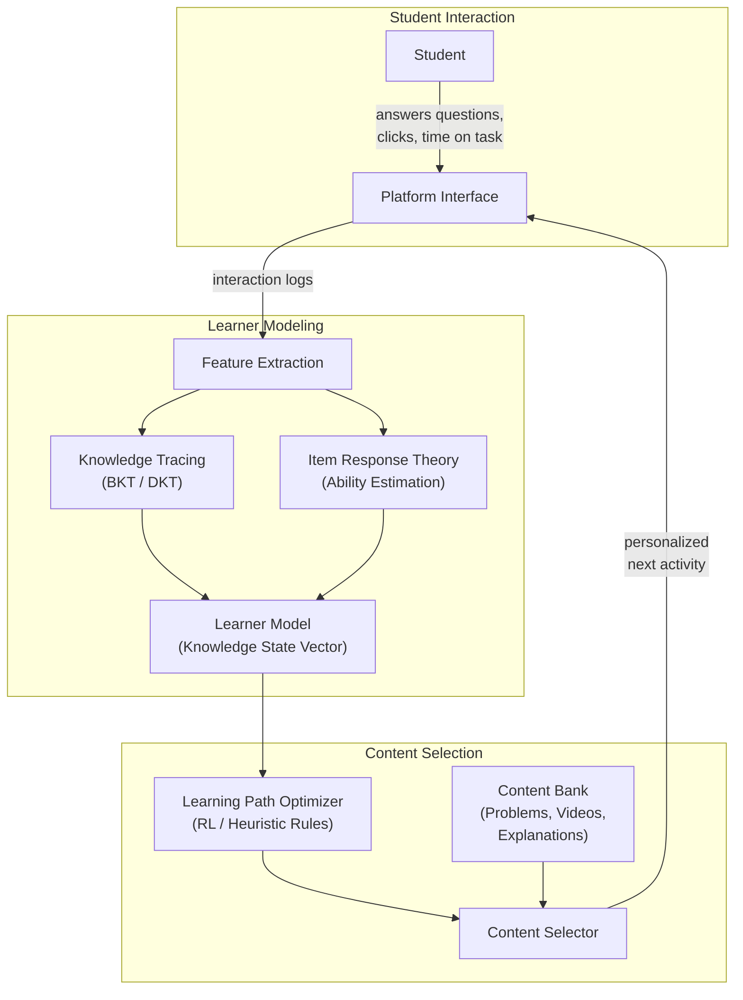
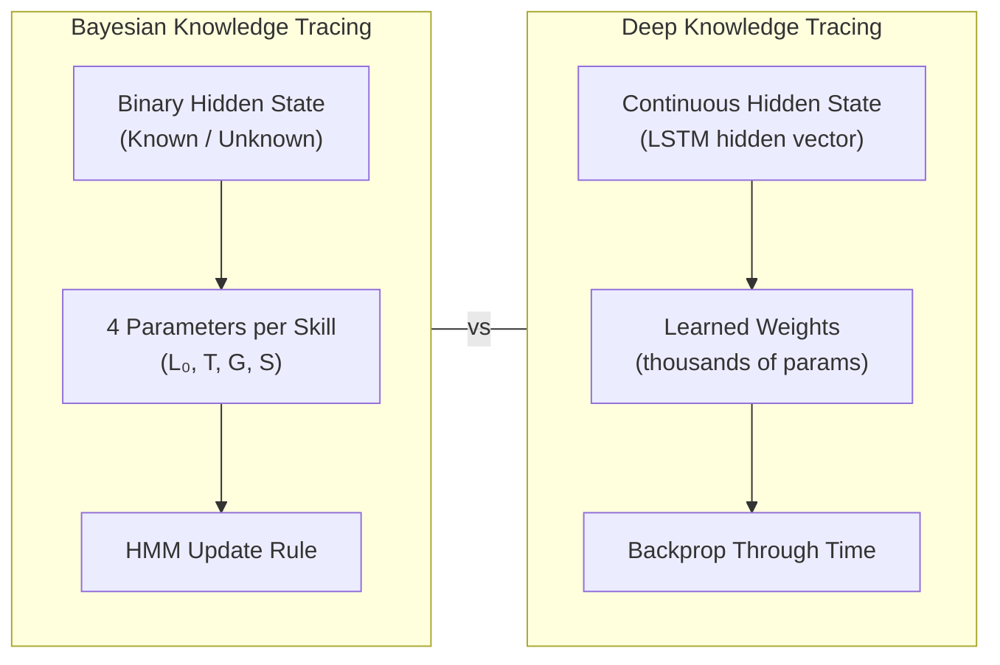

## Adaptive Learning Platforms

## Overview

Adaptive learning platforms represent the commercial and practical frontier of AI in education. While intelligent tutoring systems often focus on a single domain with carefully hand-crafted expert models, adaptive learning platforms are designed to scale across many subjects by relying on data-driven algorithms to personalize the learning experience. The core promise is simple: rather than delivering the same content in the same order to every student, the platform continuously adjusts what each learner sees based on their demonstrated knowledge, performance patterns, and learning trajectory.

The foundation of any adaptive learning platform is a **learner model** -- a computational representation of each student's current state. Modern learner models are multidimensional. The most critical dimension is the **knowledge state**: which concepts and skills has the student mastered, which are partially learned, and which are completely unknown? This is typically represented as a vector of mastery probabilities across a skill map or knowledge graph. Beyond knowledge, platforms may also model **cognitive abilities** such as working memory capacity and processing speed, **learning style preferences** (visual vs. textual, worked examples vs. practice problems), and **metacognitive skills** such as self-regulation, help-seeking behavior, and persistence in the face of difficulty.

**Knowledge tracing** is the algorithmic engine that drives the knowledge state component of the learner model. As discussed in the previous lesson, **Bayesian Knowledge Tracing (BKT)** models each skill as a two-state Hidden Markov Model. While BKT remains widely used due to its interpretability and modest data requirements, it has well-known limitations: it treats each skill independently (ignoring relationships between skills), it assumes a single learning rate per skill (ignoring individual differences), and its binary latent state (known vs. unknown) is a coarse approximation of the continuum of understanding.

**Deep Knowledge Tracing (DKT)**, introduced by Piech et al. in 2015, addresses several of these limitations by using a Long Short-Term Memory (LSTM) recurrent neural network to model the entire sequence of student interactions. At each time step $t$, the LSTM takes the previous hidden state $h_{t-1}$ and the current input $x_t$ (an encoding of the skill attempted and whether the response was correct) and produces an updated hidden state:

$$h_t = \text{LSTM}(h_{t-1}, x_t)$$

The hidden state $h_t$ is then passed through a fully connected layer with sigmoid activation to produce a vector of predicted probabilities for each skill. DKT can implicitly capture skill dependencies and individual learning dynamics because the LSTM's hidden state serves as a rich, continuous representation of the student's knowledge. However, DKT requires substantially more training data and offers less interpretability than BKT.

Complementary to knowledge tracing is **Item Response Theory (IRT)**, a family of psychometric models originating from educational measurement. The two-parameter logistic (2PL) IRT model gives the probability that a student with ability $\theta$ answers an item with discrimination $a$ and difficulty $b$ correctly:

$$P(\text{correct}|\theta, a, b) = \frac{1}{1 + e^{-a(\theta - b)}}$$

Here, $\theta$ is the student's latent ability (a single real number), $b$ is the item difficulty (the ability level at which the probability of a correct response is 50%), and $a$ is the item discrimination (how steeply the probability curve rises around the difficulty point). IRT is the basis of **computerized adaptive testing (CAT)**, where the system selects the next test item to maximize information about the student's ability level, efficiently zeroing in on a precise estimate with fewer items than a fixed-length test.

Once the learner model is established, the platform must decide **what to teach next**. This is the problem of **learning path optimization**. Classical approaches use heuristic rules (e.g., "advance to the next topic when mastery exceeds 0.95," "review a skill if mastery drops below 0.8"). More recent work frames this as a **reinforcement learning (RL)** problem, where the platform is an agent, the student's knowledge state is the environment state, instructional actions (selecting problems, offering hints, choosing content types) are the action space, and the reward signal is derived from learning gains or engagement. Deep RL methods such as DQN and policy gradient algorithms have been explored in research prototypes, though most production systems still rely on simpler policies due to the difficulty of defining reward functions and the cost of online exploration with real students.

Several commercial platforms illustrate these ideas. **Knewton** (acquired by Wiley in 2019) was one of the first large-scale adaptive learning engines, using a knowledge graph of concepts and a real-time recommendation system to sequence content from partnered textbook publishers. **Duolingo** uses a spaced repetition system informed by a variant of the half-life regression model, which estimates how quickly each learner forgets each word or grammar concept and schedules reviews accordingly. **Khan Academy** integrates mastery-based progression where students must demonstrate proficiency through practice exercises before advancing, with an underlying knowledge map that tracks dependencies between skills. **Coursera** uses machine learning to personalize course recommendations and has experimented with adaptive assessments that adjust difficulty based on student performance.

The effectiveness of adaptive learning platforms is supported by a growing body of evidence. A 2018 meta-analysis by Kulik and Fletcher found that adaptive learning systems produced an average effect size of 0.41 standard deviations compared to conventional instruction -- roughly equivalent to moving a student from the 50th percentile to the 66th percentile.

## Key Concepts

- **Learner Model**: A multidimensional computational representation of a student's current knowledge state, cognitive abilities, learning preferences, and metacognitive skills, maintained and updated in real time by the adaptive platform.
- **Deep Knowledge Tracing (DKT)**: A neural network approach that uses LSTM or GRU architectures to model the temporal sequence of student interactions and predict future performance across multiple skills simultaneously.
- **Item Response Theory (IRT)**: A family of psychometric models that relate a student's latent ability to their probability of answering items of known difficulty correctly, used for adaptive testing and ability estimation.
- **Computerized Adaptive Testing (CAT)**: A testing paradigm where item selection is dynamically adjusted based on the student's responses to previous items, maximizing measurement precision with fewer questions.
- **Learning Path Optimization**: The problem of selecting the optimal sequence of instructional activities to maximize learning outcomes, increasingly framed as a reinforcement learning problem.
- **Spaced Repetition**: A learning technique where review intervals are gradually increased based on the learner's retention strength, often modeled using forgetting curves.

## Technical Details

Below is an implementation of the two-parameter IRT model and a simple computerized adaptive testing loop:

```python
import numpy as np
from scipy.optimize import minimize_scalar

class IRTModel:
    """Two-parameter logistic Item Response Theory model."""

    def __init__(self, num_items: int, seed: int = 42):
        rng = np.random.RandomState(seed)
        # Item parameters: difficulty (b) and discrimination (a)
        self.b = rng.normal(0, 1, num_items)       # difficulty
        self.a = rng.uniform(0.5, 2.5, num_items)  # discrimination

    def prob_correct(self, theta: float, item_idx: int) -> float:
        """P(correct | theta, a, b) = 1 / (1 + exp(-a*(theta - b)))"""
        a = self.a[item_idx]
        b = self.b[item_idx]
        return 1.0 / (1.0 + np.exp(-a * (theta - b)))

    def fisher_information(self, theta: float, item_idx: int) -> float:
        """Fisher information of item at given ability level."""
        p = self.prob_correct(theta, item_idx)
        a = self.a[item_idx]
        return a**2 * p * (1 - p)

def adaptive_test(model: IRTModel, true_theta: float, num_questions: int = 10):
    """
    Simulate a computerized adaptive test.

    Selects items that maximize Fisher information at the current
    ability estimate, then updates the estimate via MLE.
    """
    responses = []
    items_used = []
    theta_hat = 0.0  # initial ability estimate

    for step in range(num_questions):
        # Select item with maximum information at current estimate
        available = [i for i in range(len(model.b)) if i not in items_used]
        best_item = max(available, key=lambda i: model.fisher_information(theta_hat, i))
        items_used.append(best_item)

        # Simulate student response
        p = model.prob_correct(true_theta, best_item)
        correct = np.random.random() < p
        responses.append(int(correct))

        # Update ability estimate via maximum likelihood
        def neg_log_likelihood(theta):
            ll = 0
            for item, resp in zip(items_used, responses):
                p_c = model.prob_correct(theta, item)
                p_c = np.clip(p_c, 1e-10, 1 - 1e-10)
                ll += resp * np.log(p_c) + (1 - resp) * np.log(1 - p_c)
            return -ll

        result = minimize_scalar(neg_log_likelihood, bounds=(-4, 4), method='bounded')
        theta_hat = result.x

        print(f"Q{step+1}: Item {best_item:2d} (b={model.b[best_item]:+.2f}) "
              f"| {'✓' if correct else '✗'} | θ̂ = {theta_hat:+.3f}")

    print(f"\nTrue ability: {true_theta:+.3f}")
    print(f"Estimated ability: {theta_hat:+.3f}")
    print(f"Error: {abs(theta_hat - true_theta):.3f}")

# Run adaptive test
np.random.seed(123)
model = IRTModel(num_items=50)
adaptive_test(model, true_theta=1.2, num_questions=10)
```

A simple DKT model in PyTorch:

```python
import torch
import torch.nn as nn

class DeepKnowledgeTracing(nn.Module):
    """
    DKT model using LSTM.

    Input: sequence of (skill_id, correctness) pairs, one-hot encoded
    Output: predicted probability of correctness for each skill at each step
    """
    def __init__(self, num_skills: int, hidden_dim: int = 128):
        super().__init__()
        self.num_skills = num_skills
        # Input: one-hot encoding of (skill, correct/incorrect) -> 2 * num_skills
        self.lstm = nn.LSTM(input_size=2 * num_skills, hidden_size=hidden_dim, batch_first=True)
        self.fc = nn.Linear(hidden_dim, num_skills)

    def forward(self, x: torch.Tensor) -> torch.Tensor:
        """
        Args:
            x: (batch, seq_len, 2 * num_skills) one-hot interaction encoding
        Returns:
            (batch, seq_len, num_skills) predicted mastery probabilities
        """
        h, _ = self.lstm(x)          # h: (batch, seq_len, hidden_dim)
        logits = self.fc(h)           # (batch, seq_len, num_skills)
        return torch.sigmoid(logits)

# Example usage
num_skills = 20
model = DeepKnowledgeTracing(num_skills=num_skills, hidden_dim=64)
# Simulated batch: 4 students, 15 interactions each
dummy_input = torch.randn(4, 15, 2 * num_skills)
predictions = model(dummy_input)
print(f"Prediction shape: {predictions.shape}")  # (4, 15, 20)
print(f"Sample mastery probs: {predictions[0, -1, :5].detach().numpy().round(3)}")
```

## Diagrams

**Adaptive Learning Platform Architecture**



**Knowledge Tracing Comparison**



## Exercises/Projects

1. **IRT Item Analysis**: Using the IRT code above, generate 50 items and plot their Item Characteristic Curves (ICC) -- the probability of a correct response as a function of ability $\theta$ from -3 to +3. Identify which items are hardest, easiest, and most discriminating.
2. **CAT Simulation Study**: Run the adaptive test simulation 100 times with different true ability levels uniformly sampled from [-2, 2]. Plot the estimation error as a function of the number of questions administered (from 5 to 20). How many questions does CAT need to achieve an average error below 0.3?
3. **DKT Training**: Using the DKT model skeleton above, train it on the ASSISTments 2009 dataset (publicly available). Split the data into training and test sets, train for 50 epochs, and report the AUC-ROC on the test set. Compare with a BKT baseline.
4. **Platform Comparison**: Sign up for free trials of two adaptive learning platforms (e.g., Duolingo and Khan Academy). Use each for at least 30 minutes. Document how each platform adapts to your performance: does it get harder when you succeed? Does it review topics you struggled with? Write a comparison of their adaptation strategies.

## Further Reading

- Piech, C., et al. (2015). "Deep Knowledge Tracing." *Advances in Neural Information Processing Systems (NeurIPS)*, 28.
- Embretson, S. E., & Reise, S. P. (2000). *Item Response Theory for Psychologists*. Lawrence Erlbaum Associates.
- Kulik, J. A., & Fletcher, J. D. (2016). "Effectiveness of Intelligent Tutoring Systems: A Meta-Analytic Review." *Review of Educational Research*, 86(1), 42-78.
- Settles, B., & Meeder, B. (2016). "A Trainable Spaced Repetition Model for Language Learning." *Proceedings of the 54th Annual Meeting of the Association for Computational Linguistics (ACL)*.
