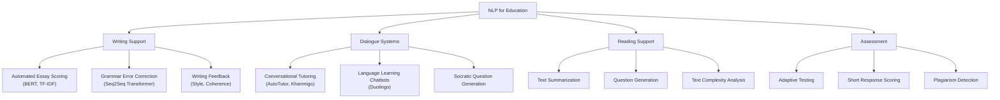
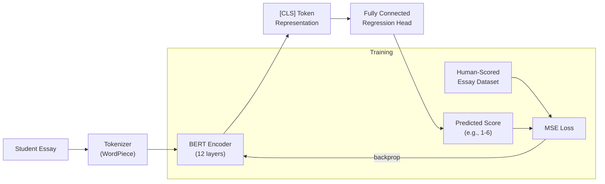

# NLP for Education

## Overview

Natural Language Processing (NLP) has become one of the most impactful areas of AI in education. Language is the primary medium through which humans teach and learn -- through lectures, textbooks, essays, conversations, and feedback. NLP technologies that can understand, generate, and evaluate natural language are therefore central to automating and enhancing educational experiences. This lesson surveys the major applications of NLP in education: automated essay scoring, conversational tutoring, grammar error correction, language learning chatbots, reading comprehension assistance, and text complexity analysis.

**Automated Essay Scoring (AES)** is one of the oldest and most commercially successful applications of NLP in education. The challenge is to assign a holistic quality score to a student-written essay, matching the score that a trained human rater would give. Early AES systems like **e-rater** (developed by ETS for the GRE and TOEFL) relied on hand-crafted features: essay length, vocabulary sophistication, syntactic complexity, discourse coherence, and grammatical error counts. These features were fed into linear regression or ordinal regression models. Modern AES has shifted to transformer-based approaches. A BERT-based AES model fine-tunes a pre-trained language model on a dataset of human-scored essays. The essay is tokenized and passed through the transformer; the final hidden state of the [CLS] token serves as a dense representation of the entire essay, which is then passed through a regression head:

$$y = W \cdot \text{Transformer}(\text{[CLS]}, \text{essay tokens}) + b$$

The model is trained to minimize the mean squared error between predicted and human-assigned scores. On the Automated Student Assessment Prize (ASAP) dataset, BERT-based models achieve quadratic weighted kappa (QWK) scores above 0.80, approaching human inter-rater reliability. However, AES systems remain controversial: they can be gamed by writing long, syntactically complex but semantically vacuous text, and they struggle with creative or unconventional writing.

**Conversational tutoring** uses dialogue systems to engage students in learning conversations. The pioneering system in this area is **AutoTutor**, developed by Art Graesser and colleagues at the University of Memphis beginning in the late 1990s. AutoTutor engages students in multi-turn Socratic dialogues about physics and computer literacy, using expectation and misconception-tailored dialogue moves: pumping for more information, prompting with hints, giving positive feedback, correcting misconceptions, and summarizing key points. AutoTutor has been shown to produce learning gains of approximately 0.8 standard deviations (a large effect) compared to re-reading a textbook.

The rise of LLMs has dramatically expanded the possibilities for conversational tutoring. Modern LLM-based tutors can generate Socratic questions that guide students toward understanding without simply giving away the answer. **Socratic question generation** involves prompting the model to ask questions that probe the student's reasoning, identify gaps, and scaffold toward the correct understanding -- a technique that has been formalized in systems like Khan Academy's Khanmigo.

**Language learning chatbots** are another major application. Duolingo's chatbot feature allows learners to practice conversational skills in a target language with an AI partner. The system uses NLP to understand learner utterances (which may contain grammatical errors), generate contextually appropriate responses, and provide corrective feedback. The challenge is balancing communicative fluency (keeping the conversation going) with accuracy feedback (correcting errors without discouraging the learner).

**Grammar Error Correction (GEC)** treats grammatical error correction as a sequence-to-sequence translation problem: the input is a sentence with errors, and the output is the corrected version. Modern GEC systems use transformer-based encoder-decoder architectures trained on large corpora of annotated errors. The CoNLL-2014 shared task and the BEA-2019 shared task established standard benchmarks, and state-of-the-art systems now achieve F0.5 scores above 0.65 on these benchmarks. GEC is integrated into writing tools like Grammarly and Microsoft Editor.

**Reading comprehension assistance** uses NLP to help students understand complex texts. Applications include automated summarization (condensing long texts into key points), question generation (creating comprehension questions from a passage), and vocabulary explanation (identifying difficult words and providing definitions in context). LLMs have made these capabilities highly accessible, as they can summarize, explain, and generate questions with minimal task-specific training.

**Text complexity analysis** measures how difficult a text is to read, helping educators match materials to student reading levels. Classical readability formulas like Flesch-Kincaid rely on surface features (average sentence length and syllable count). Modern approaches use NLP to capture deeper features: syntactic parse tree depth, lexical diversity, cohesion (how well sentences connect to each other), and the proportion of words from academic word lists. These features can be combined in regression models to predict text difficulty on scales like the Common European Framework of Reference (CEFR) levels.

## Key Concepts

- **Automated Essay Scoring (AES)**: The use of NLP and machine learning to automatically assign quality scores to student-written essays, typically trained on datasets of human-scored essays.
- **Conversational Tutoring**: An instructional approach where an AI system engages students in multi-turn natural language dialogue, using pedagogical strategies such as Socratic questioning, hinting, and misconception correction.
- **Grammar Error Correction (GEC)**: The task of automatically detecting and correcting grammatical errors in text, typically framed as a sequence-to-sequence problem using encoder-decoder neural architectures.
- **Socratic Question Generation**: The automatic generation of questions that probe a student's understanding and guide them toward deeper reasoning, rather than simply providing the answer.
- **Text Complexity Analysis**: The computational assessment of how difficult a text is to read and understand, using features ranging from surface statistics (word and sentence length) to deep linguistic properties (syntax, cohesion, vocabulary).
- **Quadratic Weighted Kappa (QWK)**: A metric for evaluating agreement between predicted and actual ordinal scores, commonly used in AES to measure how closely machine scores match human rater scores.

## Technical Details

Below is a complete Python implementation of a TF-IDF-based essay similarity scorer, which forms the foundation of many simple AES approaches:

```python
import numpy as np
from sklearn.feature_extraction.text import TfidfVectorizer
from sklearn.metrics.pairwise import cosine_similarity

class EssaySimilarityScorer:
    """
    Simple essay scoring based on TF-IDF similarity to reference essays.

    Scores a new essay by computing its cosine similarity to a set of
    reference essays with known scores, then predicts via weighted average.
    """

    def __init__(self):
        self.vectorizer = TfidfVectorizer(
            max_features=5000,
            stop_words='english',
            ngram_range=(1, 2)
        )
        self.reference_vectors = None
        self.reference_scores = None

    def fit(self, essays: list[str], scores: list[float]):
        """Fit the scorer on a set of reference essays with known scores."""
        self.reference_vectors = self.vectorizer.fit_transform(essays)
        self.reference_scores = np.array(scores)

    def score(self, essay: str, k: int = 5) -> float:
        """
        Score a new essay.

        Computes cosine similarity to all reference essays, then returns
        the weighted average score of the k most similar references.
        """
        essay_vec = self.vectorizer.transform([essay])
        similarities = cosine_similarity(essay_vec, self.reference_vectors).flatten()

        # Get top-k most similar reference essays
        top_k_idx = np.argsort(similarities)[-k:]
        top_k_sims = similarities[top_k_idx]
        top_k_scores = self.reference_scores[top_k_idx]

        # Weighted average by similarity
        if top_k_sims.sum() == 0:
            return np.mean(self.reference_scores)
        weighted_score = np.average(top_k_scores, weights=top_k_sims)
        return round(weighted_score, 2)


# Example usage with sample essays
reference_essays = [
    "Machine learning algorithms can identify complex patterns in data. "
    "Supervised learning uses labeled examples to train models that generalize "
    "to new data. Neural networks with multiple layers can learn hierarchical "
    "representations, enabling breakthroughs in computer vision and NLP.",

    "AI is cool and does stuff with computers. It makes things work better.",

    "The development of artificial intelligence has transformed numerous "
    "industries. Deep learning, a subset of machine learning, utilizes neural "
    "networks with many layers to automatically extract features from raw data. "
    "Applications include medical image analysis, autonomous vehicles, and "
    "natural language understanding.",

    "Computers are machines that process information. They use electricity.",
]
reference_scores = [8.0, 3.0, 9.0, 2.0]  # scores out of 10

scorer = EssaySimilarityScorer()
scorer.fit(reference_essays, reference_scores)

# Score a new essay
new_essay = (
    "Artificial intelligence and machine learning have revolutionized "
    "how we approach complex problems. Deep neural networks learn useful "
    "representations from large datasets, enabling applications from "
    "language translation to image recognition."
)
predicted_score = scorer.score(new_essay)
print(f"Predicted essay score: {predicted_score}/10")
```

A simple text complexity analyzer:

```python
import re
from collections import Counter

def analyze_text_complexity(text: str) -> dict:
    """
    Compute readability and complexity metrics for a text.

    Returns Flesch-Kincaid grade level and additional statistics.
    """
    sentences = re.split(r'[.!?]+', text)
    sentences = [s.strip() for s in sentences if s.strip()]
    words = re.findall(r'\b[a-zA-Z]+\b', text)
    num_sentences = len(sentences)
    num_words = len(words)

    # Count syllables (approximation)
    def count_syllables(word):
        word = word.lower()
        if len(word) <= 3:
            return 1
        count = len(re.findall(r'[aeiouy]+', word))
        if word.endswith('e'):
            count -= 1
        return max(count, 1)

    num_syllables = sum(count_syllables(w) for w in words)
    avg_sentence_length = num_words / max(num_sentences, 1)
    avg_syllables_per_word = num_syllables / max(num_words, 1)

    # Flesch-Kincaid Grade Level
    fk_grade = (0.39 * avg_sentence_length +
                11.8 * avg_syllables_per_word - 15.59)

    # Lexical diversity (type-token ratio)
    unique_words = len(set(w.lower() for w in words))
    lexical_diversity = unique_words / max(num_words, 1)

    # Long word ratio (words with 3+ syllables)
    long_words = sum(1 for w in words if count_syllables(w) >= 3)
    long_word_ratio = long_words / max(num_words, 1)

    return {
        'num_sentences': num_sentences,
        'num_words': num_words,
        'avg_sentence_length': round(avg_sentence_length, 1),
        'avg_syllables_per_word': round(avg_syllables_per_word, 2),
        'flesch_kincaid_grade': round(fk_grade, 1),
        'lexical_diversity': round(lexical_diversity, 3),
        'long_word_ratio': round(long_word_ratio, 3),
    }


# Compare two texts
simple_text = ("The cat sat on the mat. It was a big cat. The mat was red. "
               "The cat liked the mat a lot.")
complex_text = ("Computational linguistics encompasses methodologies for "
                "analyzing morphological, syntactic, and semantic structures "
                "of natural language. Contemporary approaches leverage "
                "transformer architectures pre-trained on extensive corpora "
                "to achieve unprecedented performance on downstream tasks.")

print("Simple text:", analyze_text_complexity(simple_text))
print("Complex text:", analyze_text_complexity(complex_text))
```

## Diagrams

**NLP for Education Application Map**



**BERT-Based Essay Scoring Pipeline**



## Exercises/Projects

1. **Essay Scorer Evaluation**: Using the TF-IDF essay scorer above, create a dataset of 20 short essays (you can write them yourself at varying quality levels or use excerpts from the ASAP dataset). Score them manually and with the system. Compute the Pearson correlation between your human scores and the predicted scores.
2. **Readability Comparison**: Collect three texts on the same topic at different reading levels (e.g., a Wikipedia article, a children's encyclopedia entry, and an academic paper abstract). Run the text complexity analyzer on each and compare the metrics. Do the Flesch-Kincaid grade levels match your intuition?
3. **Socratic Question Generator**: Using an LLM API (e.g., OpenAI or Anthropic), write a Python script that takes a student's incorrect answer and the correct answer as input, and generates a Socratic follow-up question that guides the student toward the right reasoning without revealing the answer directly. Test it on 5 different misconceptions.
4. **GEC with Transformers**: Fine-tune a small seq2seq model (e.g., T5-small) on the Lang-8 or W&I+LOCNESS grammar error correction dataset. Evaluate on the BEA-2019 test set and report precision, recall, and F0.5.

## Further Reading

- Devlin, J., et al. (2019). "BERT: Pre-training of Deep Bidirectional Transformers for Language Understanding." *Proceedings of NAACL-HLT 2019*.
- Graesser, A. C., et al. (2004). "AutoTutor: A Tutor with Dialogue in Natural Language." *Behavior Research Methods, Instruments, & Computers*, 36(2), 180-192.
- Bryant, C., et al. (2019). "The BEA-2019 Shared Task on Grammatical Error Correction." *Proceedings of the 14th Workshop on Innovative Use of NLP for Building Educational Applications*.
- Crossley, S. A., Kyle, K., & McNamara, D. S. (2016). "The Tool for the Automatic Analysis of Text Cohesion (TAACO): Automatic Assessment of Local, Global, and Text Cohesion." *Behavior Research Methods*, 48(4), 1227-1237.
