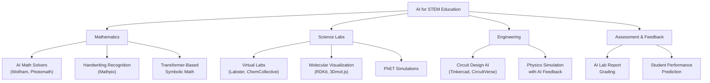
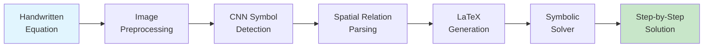

# AI for STEM Education

## Overview

STEM education — science, technology, engineering, and mathematics — has long relied on textbooks, lectures, and hands-on labs to develop problem-solving skills. Yet these traditional approaches face persistent challenges: abstract mathematical concepts are difficult to visualize, wet-lab resources are expensive and limited, physics experiments can be dangerous or impractical at scale, and individual feedback on problem sets is labor-intensive for instructors. Artificial intelligence is transforming STEM education by providing intelligent tools that adapt to each learner's pace, generate step-by-step solutions, simulate laboratory environments, and offer real-time feedback on complex problem-solving tasks.

**AI for mathematics education** has seen remarkable progress. AI-powered math problem solvers such as Wolfram Alpha, Photomath, and Microsoft Math Solver can parse mathematical expressions from text or images, solve them symbolically or numerically, and present step-by-step solution paths. Mathpix takes this further by using optical character recognition (OCR) specialized for mathematical handwriting — students can photograph handwritten equations, and Mathpix converts them into LaTeX or structured digital representations that downstream solvers can process. Under the hood, these systems combine convolutional neural networks for image recognition with sequence-to-sequence models for translating visual math into symbolic expressions.

More advanced research explores **MathAI** — the use of neural networks for equation solving and mathematical reasoning. Transformer-based models have shown surprising capability in symbolic mathematics: Lample and Charton (2020) demonstrated that sequence-to-sequence transformers can learn to perform symbolic integration and solve ordinary differential equations, outperforming commercial computer algebra systems on certain problem classes. These models treat mathematical expressions as sequences of tokens (variables, operators, constants) and learn to manipulate them through attention mechanisms, effectively learning the "grammar" of mathematical transformation.

**AI for science labs** addresses one of the most resource-constrained areas of STEM education. Virtual chemistry labs such as Labster and ChemCollective allow students to conduct experiments in simulated environments where reagent costs are zero, safety hazards are eliminated, and experiments can be repeated indefinitely. Molecular visualization tools powered by AI, such as those built on RDKit and 3Dmol.js, let students explore molecular structures interactively, with AI suggesting conformations, predicting properties, and highlighting functional groups. In physics, AI-driven simulation platforms generate realistic scenarios — from projectile motion to electromagnetic wave propagation — and provide intelligent feedback on student predictions before revealing simulation results.

**PhET Interactive Simulations**, developed at the University of Colorado Boulder, represent a pioneering approach to AI-integrated science learning. While originally built as Java and HTML5 simulations, modern extensions incorporate AI to personalize the experience: adaptive difficulty adjustment based on student interaction patterns, intelligent hint systems that detect when a student is stuck, and analytics dashboards that help instructors understand class-wide misconceptions. When combined with machine learning backends, PhET-style simulations can model each student's understanding and dynamically adjust parameters to keep learners in their zone of proximal development.

**AI for circuit design education** brings intelligent tutoring to electrical engineering. Tools like CircuitVerse and Tinkercad Circuits allow students to build and simulate circuits virtually, while AI layers can analyze student designs, detect common errors (short circuits, incorrect component values, missing ground connections), and provide targeted feedback. Machine learning models trained on thousands of student circuit submissions can identify misconception patterns — for instance, students who consistently confuse series and parallel resistance — and generate remedial exercises tailored to those specific gaps.

AI-generated feedback on lab reports represents another frontier. Natural language processing models can analyze student-written lab reports, checking not just grammar and structure but scientific reasoning: Does the hypothesis follow from the background? Are the methods described with sufficient detail for reproducibility? Do the conclusions follow from the data? Systems like these reduce the grading burden on instructors while providing students with faster, more detailed feedback than they would typically receive.

The convergence of these technologies points toward a future where every STEM student has access to a personalized AI tutor that can solve problems step-by-step, run virtual experiments, and provide instant feedback — democratizing access to high-quality STEM education regardless of institutional resources.

---

## Key Concepts

- **AI-Powered Math Solvers**: Systems that parse mathematical problems from text or images and generate step-by-step solutions using symbolic computation, neural sequence-to-sequence models, or hybrid approaches combining both.
- **Handwriting Recognition for Math (Mathpix)**: Specialized OCR systems that convert handwritten mathematical notation into structured digital formats (LaTeX, MathML) using CNNs for character recognition and RNNs/transformers for sequence decoding.
- **Symbolic Mathematics with Transformers**: The application of transformer architectures to symbolic math tasks (integration, differentiation, equation solving) by treating mathematical expressions as token sequences and learning transformation rules through attention mechanisms.
- **Virtual Science Labs**: AI-enhanced simulation environments that replicate physical, chemical, or biological laboratory experiments, allowing students to conduct experiments safely, repeatedly, and at low cost with intelligent feedback.
- **PhET Simulations**: Interactive STEM simulations originally from the University of Colorado Boulder, increasingly integrated with AI for adaptive difficulty, misconception detection, and personalized learning pathways.
- **AI-Generated Lab Report Feedback**: NLP-based systems that analyze student lab reports for scientific reasoning quality, structural completeness, and alignment between hypotheses, methods, data, and conclusions.
- **Zone of Proximal Development (ZPD)**: A concept from Vygotsky's educational theory describing the range of tasks a learner can perform with guidance but not yet independently — AI systems aim to keep students within this zone for optimal learning.

---

## Technical Details

### Math Handwriting Recognition Pipeline

The pipeline for converting handwritten math to solvable expressions involves multiple stages:

1. **Image preprocessing**: Binarization, noise removal, stroke normalization
2. **Symbol segmentation**: Identifying individual characters and operators
3. **Spatial relationship parsing**: Understanding superscripts, subscripts, fractions, and nested structures
4. **LaTeX generation**: Converting the spatial parse tree into a LaTeX string
5. **Symbolic solving**: Passing the LaTeX to a CAS or neural solver

### Transformer-Based Math Solving

Transformers for symbolic math use an encoder-decoder architecture where the input is a tokenized mathematical expression and the output is the solution. The key innovation is representing mathematical expressions as prefix notation trees, which eliminates ambiguity and makes the sequence-to-sequence mapping more learnable.

### Polynomial Regression for Student Performance Prediction

```python
import numpy as np
from sklearn.preprocessing import PolynomialFeatures
from sklearn.linear_model import LinearRegression
from sklearn.model_selection import train_test_split
from sklearn.metrics import mean_squared_error, r2_score

# Simulated dataset: hours studied, lab attendance rate, prior GPA
# predicting physics exam score
np.random.seed(42)
n_students = 200

hours_studied = np.random.uniform(1, 20, n_students)
lab_attendance = np.random.uniform(0.3, 1.0, n_students)
prior_gpa = np.random.uniform(2.0, 4.0, n_students)

# True relationship has nonlinear components
physics_score = (
    15 * np.sqrt(hours_studied)
    + 20 * lab_attendance ** 2
    + 10 * prior_gpa
    - 0.3 * hours_studied ** 2
    + np.random.normal(0, 3, n_students)
)
physics_score = np.clip(physics_score, 0, 100)

# Feature matrix
X = np.column_stack([hours_studied, lab_attendance, prior_gpa])
y = physics_score

# Split data
X_train, X_test, y_train, y_test = train_test_split(
    X, y, test_size=0.2, random_state=42
)

# Compare linear vs polynomial regression
for degree in [1, 2, 3]:
    poly = PolynomialFeatures(degree=degree, include_bias=False)
    X_train_poly = poly.fit_transform(X_train)
    X_test_poly = poly.transform(X_test)

    model = LinearRegression()
    model.fit(X_train_poly, y_train)
    y_pred = model.predict(X_test_poly)

    rmse = np.sqrt(mean_squared_error(y_test, y_pred))
    r2 = r2_score(y_test, y_pred)
    print(f"Degree {degree}: RMSE={rmse:.2f}, R²={r2:.3f}, "
          f"Features={X_train_poly.shape[1]}")

# Identify most important features from degree-2 model
poly2 = PolynomialFeatures(degree=2, include_bias=False)
X_train_poly2 = poly2.fit_transform(X_train)
model2 = LinearRegression().fit(X_train_poly2, y_train)

feature_names = poly2.get_feature_names_out(
    ["hours", "lab_attend", "prior_gpa"]
)
importance = np.abs(model2.coef_)
top_features = np.argsort(importance)[::-1][:5]

print("\nTop 5 predictive features for physics performance:")
for idx in top_features:
    print(f"  {feature_names[idx]}: coeff={model2.coef_[idx]:.3f}")
```

---

## Diagrams

### AI for STEM Education Ecosystem



### Math Handwriting Recognition Pipeline



---

## Exercises

1. **Math OCR Exploration**: Take a photo of a handwritten equation and use the Mathpix API (or Mathpix Snip) to convert it to LaTeX. Compare the accuracy for simple vs. complex expressions (e.g., single-variable polynomial vs. multi-line system of equations with matrices). Document where the recognition fails and hypothesize why.

2. **Virtual Lab Design**: Using a framework like Streamlit or Gradio, build a simple virtual physics lab where students input initial velocity and angle for a projectile. Simulate the trajectory, then add an AI component that compares the student's predicted landing distance (entered before simulation) against the actual result and provides Socratic feedback.

3. **Performance Prediction Extension**: Extend the polynomial regression code example to include additional features (e.g., homework completion rate, time spent on virtual labs, number of office-hour visits). Experiment with regularization (Ridge, Lasso) to prevent overfitting with higher-degree polynomials. Which features are most predictive?

4. **Transformer for Simple Math**: Using a small transformer model (or fine-tuning a pretrained one), train a sequence-to-sequence model to solve single-variable linear equations (e.g., "3x + 5 = 17" -> "x = 4"). Start with a synthetic dataset of 10,000 equations. Evaluate accuracy and analyze failure modes.

---

## Further Reading

- Lample, G., & Charton, F. (2020). "Deep Learning for Symbolic Mathematics." *International Conference on Learning Representations (ICLR)*.
- Wieman, C. E., Adams, W. K., & Perkins, K. K. (2008). "PhET: Simulations That Enhance Learning." *Science*, 322(5902), 682–683.
- Rau, M. A. (2017). "Conditions for the Effectiveness of Multiple Visual Representations in Enhancing STEM Learning." *Educational Psychology Review*, 29(4), 717–761.
- Sakulkueakulsuk, B. et al. (2018). "Kids Making AI: Integrating Machine Learning, Gamification, and Social Context in STEM Education." *IEEE International Conference on Teaching, Assessment, and Learning for Engineering (TALE)*.
