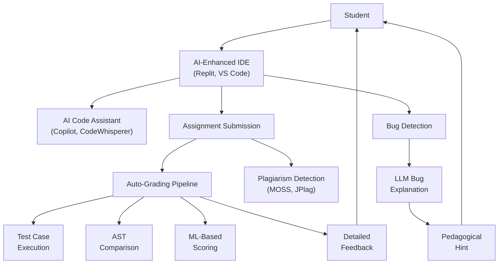
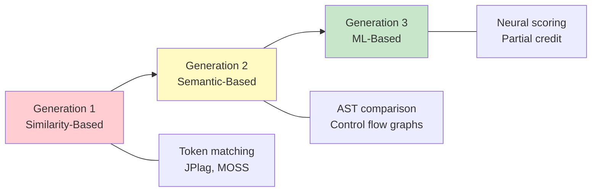

# AI for Code Education

## Overview

Learning to program is one of the most important skills of the 21st century, yet it remains one of the hardest to teach at scale. Programming courses face notoriously high dropout rates — introductory CS courses at universities often see 30–50% of students fail or withdraw. The core challenge is that programming requires immediate, precise, and personalized feedback: a single misplaced semicolon can produce a cryptic error message, a subtle logical error can produce wrong output with no error at all, and the gap between "understanding the concept" and "writing working code" is enormous. AI is transforming code education by providing intelligent teaching assistants, automated grading systems, bug explanation tools, and personalized learning platforms that can scale individual tutoring to millions of learners.

**AI teaching assistants** for programming have become increasingly sophisticated. GitHub Copilot, powered by OpenAI's Codex model, can autocomplete code, generate entire functions from natural language descriptions, and explain existing code in plain English. In educational settings, Copilot serves as a pair programmer that helps students overcome syntax barriers and focus on algorithmic thinking. Amazon CodeWhisperer offers similar capabilities with a focus on AWS integration and security scanning. GitHub Classroom AI extends these tools into the educational workflow, allowing instructors to create assignments where AI can provide hints without giving away solutions, and automatically assess submissions.

**How AI explains code** is a fascinating technical challenge. Two primary approaches dominate. The first is **AST-based explanation**: the code is parsed into an Abstract Syntax Tree, and rule-based or template-based systems traverse the tree to generate natural language descriptions of each node ("this is a for loop that iterates over the list `students`"). The second is **transformer-based natural language generation (NLG)**: large language models like GPT-4 or Code Llama take raw source code as input and generate free-form explanations. The transformer approach produces more fluent and contextual explanations but can hallucinate incorrect descriptions, while the AST approach is more reliable but less natural.

**Auto-grading** of programming assignments has evolved through three generations. The first generation uses **similarity-based** approaches: tools like JPlag and MOSS (Measure Of Software Similarity) compare student submissions against each other and reference solutions using token-based or string-matching algorithms, primarily designed for plagiarism detection but also useful for basic grading. The second generation employs **semantic-based** methods: AST comparison algorithms parse student code into tree structures and compare them against reference solutions, tolerating superficial differences (variable names, code formatting) while detecting structural equivalence. The third and current generation uses **ML-based** grading: neural models trained on thousands of graded submissions learn to predict scores directly from code features, capturing nuances like code efficiency, style, and partial correctness that rule-based systems miss.

**Bug explanation** represents a particularly impactful application of LLMs in code education. When a student's code fails, traditional error messages are often incomprehensible to beginners ("TypeError: unsupported operand type(s) for +: 'int' and 'str'" means nothing to someone who has not yet learned about type systems). LLM-based bug localization systems can take the student's code, the error message, and the assignment specification, then generate a plain-English explanation of what went wrong, why it went wrong, and a hint toward fixing it — without giving away the solution.

**Data-driven code education** uses analytics to understand student learning at scale. By analyzing patterns in thousands of student code submissions, researchers can identify common misconceptions (e.g., students who confuse `=` and `==`, or who do not understand variable scope), track learning trajectories, and design targeted interventions. Misconception detection systems use clustering algorithms on AST representations of student code to identify groups of students making the same conceptual error, enabling instructors to address widespread misunderstandings with targeted explanations.

Several **platforms** have pioneered AI-assisted code education. Code.org uses AI to provide hints in its block-based programming curriculum for K-12 students. Grasshopper (by Google) teaches JavaScript through progressive challenges with AI-powered hint systems. Mimo offers mobile-first coding lessons with personalized learning paths. Replit has integrated AI directly into its cloud IDE, providing code completion, explanation, and debugging assistance.

**Personalized hints with reinforcement learning** represent the cutting edge. Rather than using static hint sequences, RL-based systems learn optimal hint policies by modeling the student as an environment: the state is the student's current code and history, actions are possible hints, and the reward signal is whether the student eventually solves the problem. This approach, pioneered by systems like the Deep Thought tutor, learns to give the minimal hint necessary to unblock the student without over-scaffolding.

---

## Key Concepts

- **Abstract Syntax Tree (AST)**: A tree representation of source code where each node represents a syntactic construct (function definition, loop, assignment, expression). ASTs abstract away surface-level details like whitespace and comments, enabling structural comparison of code.
- **Similarity-Based Plagiarism Detection (JPlag, MOSS)**: Tools that tokenize source code and use string-matching or token-sequence algorithms to detect suspiciously similar submissions, widely used in CS education for academic integrity.
- **Semantic Code Comparison**: Comparing programs based on their structural meaning (via AST comparison, control flow graphs, or data flow analysis) rather than textual similarity, enabling detection of equivalent programs with different surface syntax.
- **LLM-Based Bug Localization**: Using large language models to identify the location and nature of bugs in student code, generating human-readable explanations and pedagogically appropriate hints.
- **Misconception Detection**: Automated identification of systematic conceptual errors in student code using clustering, pattern mining, or classification on AST or behavioral features.
- **Reinforcement Learning for Hint Generation**: Modeling the hint-giving process as a sequential decision problem where an RL agent learns to select hints that maximize the probability of student success while minimizing scaffold dependency.
- **Auto-Grading**: Automated assessment of programming assignments using test-case evaluation, code similarity, AST comparison, or ML-based scoring models.

---

## Technical Details

### AST-Based Code Similarity

Code similarity detection is foundational to both plagiarism detection and auto-grading. The key insight is that two programs can look very different textually but have identical AST structures. By comparing ASTs, we can detect structural equivalence while ignoring cosmetic differences.

### Code Explanation Pipeline

Modern code explanation systems typically follow this pipeline:

1. **Parsing**: Source code is parsed into an AST
2. **Segmentation**: The AST is segmented into meaningful blocks (functions, loops, conditionals)
3. **Feature extraction**: Each block is annotated with features (complexity, variable usage, control flow)
4. **NLG**: A language model generates explanations for each block
5. **Assembly**: Block-level explanations are assembled into a coherent narrative

### AST-Based Code Similarity Comparison

```python
import ast
from collections import Counter
from difflib import SequenceMatcher


def extract_ast_features(code: str) -> dict:
    """Extract structural features from Python code's AST."""
    try:
        tree = ast.parse(code)
    except SyntaxError:
        return {"error": True}

    features = {
        "node_types": Counter(),
        "depth": 0,
        "num_functions": 0,
        "num_loops": 0,
        "num_conditionals": 0,
        "num_assignments": 0,
        "num_calls": 0,
    }

    def walk(node, depth=0):
        features["node_types"][type(node).__name__] += 1
        features["depth"] = max(features["depth"], depth)

        if isinstance(node, (ast.FunctionDef, ast.AsyncFunctionDef)):
            features["num_functions"] += 1
        elif isinstance(node, (ast.For, ast.While)):
            features["num_loops"] += 1
        elif isinstance(node, ast.If):
            features["num_conditionals"] += 1
        elif isinstance(node, (ast.Assign, ast.AugAssign)):
            features["num_assignments"] += 1
        elif isinstance(node, ast.Call):
            features["num_calls"] += 1

        for child in ast.iter_child_nodes(node):
            walk(child, depth + 1)

    walk(tree)
    return features


def normalize_ast(code: str) -> str:
    """Normalize an AST by stripping variable names and docstrings."""
    try:
        tree = ast.parse(code)
    except SyntaxError:
        return ""

    # Rename all variables to generic names
    var_map = {}
    counter = [0]

    class Normalizer(ast.NodeTransformer):
        def visit_Name(self, node):
            if node.id not in var_map:
                var_map[node.id] = f"var_{counter[0]}"
                counter[0] += 1
            node.id = var_map[node.id]
            return node

        def visit_FunctionDef(self, node):
            if node.name not in var_map:
                var_map[node.name] = f"func_{counter[0]}"
                counter[0] += 1
            node.name = var_map[node.name]
            # Remove docstrings
            if (node.body and isinstance(node.body[0], ast.Expr)
                    and isinstance(node.body[0].value, ast.Constant)
                    and isinstance(node.body[0].value.value, str)):
                node.body = node.body[1:]
            self.generic_visit(node)
            return node

    normalizer = Normalizer()
    normalized_tree = normalizer.visit(tree)
    return ast.dump(normalized_tree)


def ast_similarity(code1: str, code2: str) -> float:
    """Compute similarity between two code snippets based on AST structure."""
    norm1 = normalize_ast(code1)
    norm2 = normalize_ast(code2)

    if not norm1 or not norm2:
        return 0.0

    # Sequence-based similarity on normalized AST dumps
    seq_sim = SequenceMatcher(None, norm1, norm2).ratio()

    # Feature-based similarity
    feat1 = extract_ast_features(code1)
    feat2 = extract_ast_features(code2)

    if "error" in feat1 or "error" in feat2:
        return seq_sim

    # Cosine similarity on node type counts
    all_types = set(feat1["node_types"].keys()) | set(
        feat2["node_types"].keys()
    )
    vec1 = [feat1["node_types"].get(t, 0) for t in all_types]
    vec2 = [feat2["node_types"].get(t, 0) for t in all_types]

    dot = sum(a * b for a, b in zip(vec1, vec2))
    mag1 = sum(a ** 2 for a in vec1) ** 0.5
    mag2 = sum(a ** 2 for a in vec2) ** 0.5
    cosine_sim = dot / (mag1 * mag2) if mag1 and mag2 else 0.0

    # Weighted combination
    return 0.6 * seq_sim + 0.4 * cosine_sim


# Example: two implementations of the same function
code_a = """
def find_max(numbers):
    \"\"\"Find the maximum value in a list.\"\"\"
    best = numbers[0]
    for num in numbers:
        if num > best:
            best = num
    return best
"""

code_b = """
def maximum(lst):
    result = lst[0]
    idx = 1
    while idx < len(lst):
        if lst[idx] > result:
            result = lst[idx]
        idx += 1
    return result
"""

code_c = """
def sort_list(arr):
    for i in range(len(arr)):
        for j in range(i + 1, len(arr)):
            if arr[j] < arr[i]:
                arr[i], arr[j] = arr[j], arr[i]
    return arr
"""

print(f"Similarity (A vs B, same logic): {ast_similarity(code_a, code_b):.3f}")
print(f"Similarity (A vs C, different): {ast_similarity(code_a, code_c):.3f}")

# Extract and compare features
for label, code in [("Code A", code_a), ("Code B", code_b), ("Code C", code_c)]:
    feats = extract_ast_features(code)
    print(f"\n{label} features:")
    print(f"  Functions: {feats['num_functions']}, Loops: {feats['num_loops']}")
    print(f"  Conditionals: {feats['num_conditionals']}, Depth: {feats['depth']}")
```

---

## Diagrams

### AI Code Education Architecture



### Auto-Grading Evolution



---

## Exercises

1. **AST Exploration**: Write three different Python implementations of a function that computes the factorial of a number (recursive, iterative with for-loop, iterative with while-loop). Use the `ast` module to dump and compare their ASTs. How similar are they structurally? Modify the similarity code from the example to handle these cases.

2. **Bug Explanation System**: Build a simple bug explanation tool using an LLM API (e.g., OpenAI or Anthropic). Given a Python function, an expected output, and an actual (incorrect) output, prompt the LLM to explain the bug in beginner-friendly language without revealing the fix. Evaluate it on 10 common beginner bugs (off-by-one errors, type errors, scope issues).

3. **Plagiarism Detection**: Implement a simplified MOSS-like system. Tokenize Python source files using the `tokenize` module, apply winnowing (selecting a subset of k-gram hashes), and compute pairwise similarity between a set of student submissions. Test it on a dataset where you intentionally create renamed, reordered, and restructured copies of a base solution.

4. **RL Hint Policy Simulation**: Design a simplified simulation of the hint-giving problem. Model a student solving a 5-step programming task. At each step, the student has a probability of getting stuck (varying by difficulty). An agent can give hints of varying specificity (vague, moderate, specific). Implement a Q-learning agent that learns when to give which hint level to maximize the student's eventual success while minimizing total hints given.

---

## Further Reading

- Piech, C. et al. (2015). "Learning Program Embeddings to Propagate Feedback on Student Code." *International Conference on Machine Learning (ICML)*.
- Prabhakar, S. et al. (2023). "JPlag: Detecting Software Plagiarism at Scale." *Journal of Systems and Software*.
- Rivers, K. & Koedinger, K. R. (2017). "Data-Driven Hint Generation in Vast Solution Spaces: a Self-Improving Python Programming Tutor." *International Journal of Artificial Intelligence in Education*, 27(1), 37–64.
- Chen, M. et al. (2021). "Evaluating Large Language Models Trained on Code." *arXiv preprint arXiv:2107.03374*.
