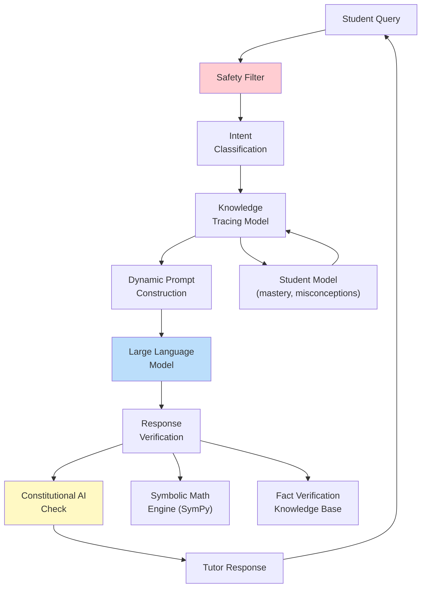
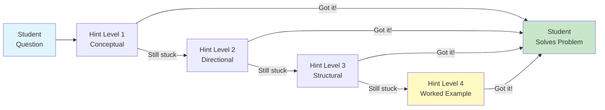

# Large Language Models as Tutors

## Overview

The emergence of large language models (LLMs) such as GPT-4, Claude, Gemini, and Llama has created what many consider the most significant opportunity in the history of educational technology: the possibility of providing every student on Earth with a personal, patient, knowledgeable tutor available 24 hours a day. Benjamin Bloom's famous "2 sigma problem" (1984) showed that students who receive one-on-one tutoring perform two standard deviations better than students in conventional classrooms — but society has never been able to afford a personal tutor for every student. LLMs may finally make this economically feasible. However, deploying LLMs as educational tutors introduces profound technical challenges around pedagogical alignment, hallucination, safety, and the fundamental tension between an AI that can instantly give answers and the educational goal of helping students construct their own understanding.

**Socratic tutoring with LLMs** is the most educationally grounded approach to using language models in teaching. Rather than simply answering student questions, a Socratic LLM tutor asks guiding questions that lead the student to discover the answer themselves. For example, if a student asks "What is the derivative of x^3?", a Socratic tutor should not respond with "3x^2" but instead ask "Do you remember the power rule? What does it say about derivatives of x^n?" This approach is grounded in constructivist learning theory, which holds that knowledge is more durable and transferable when learners actively construct it rather than passively receive it. Implementing Socratic behavior in LLMs requires careful prompt engineering, as the default training objective of language models (predicting the most likely next token) naturally biases them toward giving direct answers.

**Prompt engineering for education** has become a specialized discipline. The key technique is crafting system prompts that enforce pedagogical style. A well-designed educational system prompt specifies the tutor's role ("You are a patient Socratic tutor for introductory calculus"), prohibits certain behaviors ("Never give the final answer directly"), prescribes pedagogical strategies ("Always start by asking what the student already knows about the topic"), and defines escalation protocols ("If the student is stuck after three hints, provide a worked example of a similar but different problem"). Chain-of-thought tutoring extends this by instructing the LLM to reason through its pedagogical decisions in a hidden scratchpad: "The student seems to understand derivatives but is confusing the chain rule with the product rule. I should give an example that highlights the difference."

**LLM-based writing tutors** are among the most mature applications. LLMs can analyze student essays for argument structure, evidence usage, clarity, grammar, and adherence to assignment rubrics. Unlike simple grammar checkers (Grammarly), LLM tutors can engage in multi-turn dialogue about the writing: "Your thesis statement in paragraph one claims X, but your evidence in paragraph three seems to support Y instead. Can you explain how they connect?" This kind of higher-order feedback on argumentation and coherence was previously only possible from human instructors.

**Math tutoring with LLMs** presents unique challenges because language models are fundamentally text-prediction systems, not symbolic reasoners. LLMs can generate impressively detailed step-by-step solutions, but they sometimes make arithmetic errors, skip logical steps, or present mathematically incorrect reasoning that "looks right" to a student who does not know better. Effective math tutoring systems therefore combine LLMs with symbolic computation engines: the LLM handles the natural language dialogue and pedagogical scaffolding, while a computer algebra system (SymPy, Wolfram Alpha) verifies the mathematical correctness of each step.

**Code tutoring with LLMs** leverages the strong code understanding capabilities of models trained on large code corpora. LLMs can explain code line by line, suggest debugging strategies, generate test cases, and guide students through algorithm design. The key challenge is calibrating the level of help: providing too much code spoils the learning, while providing too little leaves the student stuck.

The **limitations** of LLM tutors are significant and must be understood. **Hallucination** is the most dangerous failure mode: an LLM tutor might confidently explain an incorrect solution, teach a nonexistent theorem, or cite fabricated research papers. **Inconsistent difficulty calibration** means the same LLM might give a graduate-level explanation to a middle schooler or an oversimplified explanation to an advanced student, even within the same conversation. **Lack of long-term memory** (in standard deployments) means the tutor cannot track student progress across sessions, build a model of the student's strengths and weaknesses, or remember what was covered last week. **Safety concerns** include the risk of students developing emotional dependence on AI tutors, the potential for generating inappropriate content, and the danger of students using LLM tutors to cheat rather than learn.

**Real-world systems** are rapidly deploying LLM tutors. **Khanmigo**, developed by Khan Academy using GPT-4, is perhaps the most prominent educational LLM tutor. It is designed to never give direct answers, always ask guiding questions, and provide teachers with summaries of student interactions. **Carnegie Learning's AI tutor** combines LLMs with its established cognitive tutoring framework, using knowledge tracing models to decide when the LLM should intervene. These systems demonstrate that effective LLM tutoring requires more than just an LLM — it requires careful integration with pedagogical frameworks, student modeling, and safety guardrails.

**Constitutional AI for educational alignment** is an emerging approach to ensuring LLM tutors behave pedagogically. Inspired by Anthropic's Constitutional AI work, educational constitutional AI defines a set of pedagogical principles (the "constitution") that the tutor must follow: "Always guide rather than tell," "Adapt explanations to the student's demonstrated level," "Never fabricate information — say 'I'm not sure' when uncertain." The LLM is trained or fine-tuned to self-evaluate its responses against these principles and revise them before presenting to the student.

---

## Key Concepts

- **Socratic Tutoring**: An instructional method where the tutor asks carefully sequenced questions to guide the student toward discovering the answer, rather than providing direct answers. Based on constructivist learning theory.
- **System Prompt Engineering**: The design of initial instructions given to an LLM that define its role, behavior constraints, pedagogical approach, and escalation protocols for educational interactions.
- **Chain-of-Thought Tutoring**: Instructing an LLM to reason through its pedagogical decisions in a hidden reasoning trace before generating its visible response, enabling more deliberate and adaptive tutoring behavior.
- **Bloom's 2 Sigma Problem**: The finding that students receiving one-on-one tutoring outperform conventionally taught students by two standard deviations, establishing the gold standard that AI tutors aspire to match.
- **Hallucination in Education**: When an LLM tutor generates plausible-sounding but factually incorrect information, particularly dangerous in educational contexts where students lack the expertise to detect errors.
- **Constitutional AI for Education**: Defining a set of pedagogical principles that an LLM tutor must follow, then training or prompting the model to self-evaluate and revise its responses against these principles.
- **Knowledge Tracing Integration**: Combining LLM dialogue capabilities with student modeling systems that track mastery of specific knowledge components, enabling the tutor to adapt its behavior based on what the student knows and does not know.

---

## Technical Details

### Socratic Tutor System Prompt Design

The effectiveness of an LLM tutor depends heavily on the system prompt. Key components include:

1. **Role definition**: Specifying the subject, level, and pedagogical approach
2. **Behavior constraints**: What the tutor must never do (give answers, skip steps)
3. **Scaffolding protocols**: How to escalate from minimal to maximal hints
4. **Error handling**: How to respond when the student makes a mistake
5. **Meta-cognitive prompts**: Encouraging students to reflect on their learning process

### Implementing a Socratic Math Tutor

```python
from dataclasses import dataclass
import json

@dataclass
class TutoringSession:
    """Manages a Socratic tutoring session with hint escalation."""
    subject: str
    level: str
    max_hints_before_example: int = 3
    hint_count: int = 0
    conversation_history: list = None

    def __post_init__(self):
        self.conversation_history = []

    def get_system_prompt(self) -> str:
        return f"""You are a patient, encouraging Socratic tutor for {self.subject} \
at the {self.level} level.

CORE PRINCIPLES:
1. NEVER give the final answer directly. Guide the student to discover it.
2. Start by asking what the student already knows about the topic.
3. Break complex problems into smaller, manageable steps.
4. When the student makes an error, do NOT say "that's wrong." Instead, ask a
   question that helps them discover the error themselves.
5. Celebrate genuine understanding, not just correct answers.

HINT ESCALATION PROTOCOL:
- Hint Level 1 (Conceptual): Ask what general concept or theorem applies.
- Hint Level 2 (Directional): Point toward the specific technique needed.
- Hint Level 3 (Structural): Outline the solution steps without filling them in.
- Hint Level 4 (Worked Example): Show a SIMILAR but DIFFERENT worked example.
  Only use Level 4 after the student has attempted at least 3 times.

RESPONSE FORMAT:
- Keep responses under 150 words unless showing a worked example.
- Use LaTeX notation for math: $x^2$ for inline, $$\\int f(x)dx$$ for display.
- End each response with a question that advances the student's thinking.

SAFETY:
- If the student asks about non-academic topics, gently redirect.
- If the student expresses frustration, acknowledge it and simplify your approach.
- If you are unsure about a mathematical fact, say so explicitly.
"""

    def build_messages(self, student_message: str) -> list[dict]:
        """Build the message list for the LLM API call."""
        messages = [{"role": "system", "content": self.get_system_prompt()}]

        # Add conversation history
        for msg in self.conversation_history:
            messages.append(msg)

        # Add current student message
        messages.append({"role": "user", "content": student_message})
        return messages

    def process_student_message(self, student_message: str) -> str:
        """
        Process a student message and generate a tutor response.
        In production, this calls an LLM API. Here we demonstrate the logic.
        """
        messages = self.build_messages(student_message)

        # In production: response = openai.ChatCompletion.create(...)
        # Here we simulate the pedagogical decision logic:

        # Detect if student is asking for a direct answer
        direct_answer_phrases = [
            "what is the answer", "just tell me", "give me the answer",
            "solve it for me", "i give up"
        ]
        is_asking_for_answer = any(
            phrase in student_message.lower()
            for phrase in direct_answer_phrases
        )

        if is_asking_for_answer:
            self.hint_count += 1
            if self.hint_count >= self.max_hints_before_example:
                hint_level = "worked_example"
            else:
                hint_level = f"level_{self.hint_count}"
        else:
            hint_level = "socratic_question"

        # Log the pedagogical decision (hidden from student)
        decision_trace = {
            "student_intent": "requesting_answer" if is_asking_for_answer
                             else "working_through",
            "hint_count": self.hint_count,
            "hint_level": hint_level,
            "reasoning": f"Student has asked for help {self.hint_count} times. "
                        f"Using {hint_level} strategy."
        }
        print(f"[Tutor Decision Trace]: {json.dumps(decision_trace, indent=2)}")

        # In production, include hint_level in a hidden system message
        # to guide the LLM's response style
        tutor_response = self._generate_response(hint_level, student_message)

        # Update conversation history
        self.conversation_history.append(
            {"role": "user", "content": student_message}
        )
        self.conversation_history.append(
            {"role": "assistant", "content": tutor_response}
        )

        return tutor_response

    def _generate_response(self, hint_level: str, student_msg: str) -> str:
        """Simulate tutor response based on hint level."""
        responses = {
            "socratic_question": (
                "That's a great start! Can you tell me what mathematical "
                "concept you think applies here? What patterns do you notice?"
            ),
            "level_1": (
                "I understand this is challenging. Let's think about it "
                "step by step. What is the first thing you would need to "
                "figure out to solve this problem?"
            ),
            "level_2": (
                "Here's a nudge: think about how the power rule works for "
                "derivatives. If you have $x^n$, what happens to the "
                "exponent? Can you apply that idea here?"
            ),
            "level_3": (
                "Let me outline the steps without filling them in:\n"
                "1. Identify the type of expression\n"
                "2. Recall the relevant rule\n"
                "3. Apply the rule to each term\n"
                "4. Simplify\n"
                "Can you try step 1?"
            ),
            "worked_example": (
                "I can see you're really struggling, and that's okay! "
                "Let me show you a SIMILAR example:\n\n"
                "If we want the derivative of $x^4$:\n"
                "- Using the power rule: bring down the 4, reduce exponent "
                "by 1\n"
                "- Result: $4x^3$\n\n"
                "Now, can you apply the same logic to YOUR problem?"
            ),
        }
        return responses.get(hint_level, responses["socratic_question"])

# Demonstration
session = TutoringSession(subject="Calculus I", level="introductory")
print("=== Socratic Tutoring Session ===\n")

exchanges = [
    "What is the derivative of x^3 + 2x?",
    "I don't know, just tell me the answer",
    "I really can't figure it out, please help",
    "OK so I bring down the exponent... 3x^2 + 2?",
]

for student_msg in exchanges:
    print(f"Student: {student_msg}")
    response = session.process_student_message(student_msg)
    print(f"Tutor: {response}\n")
```

---

## Diagrams

### LLM Tutor Architecture



### Hint Escalation Protocol



---

## Exercises

1. **Socratic Prompt Design**: Design three different system prompts for an LLM tutor — one for introductory biology, one for high school algebra, and one for graduate-level machine learning. For each, define: role, prohibited behaviors, hint escalation protocol, and at least two example exchanges. Test them with an LLM and evaluate whether the tutor maintains Socratic behavior when students pressure it for direct answers.

2. **Hallucination Detection**: Conduct an experiment with an LLM (GPT-4, Claude, etc.) acting as a math tutor. Ask it to solve 20 calculus problems step-by-step. For each solution, independently verify every step. Document: (a) how many solutions were fully correct, (b) what types of errors occurred, (c) how confident the LLM appeared when making errors. Propose a verification pipeline to catch these errors.

3. **Constitutional AI for Education**: Define a "pedagogical constitution" of 10 principles that an educational LLM tutor should follow. Then, take 10 example tutor responses (some good, some problematic) and evaluate each against your constitution. Implement a simple automated evaluator that uses an LLM to score responses against each principle on a 1–5 scale.

4. **Knowledge Tracing Integration**: Design (on paper or in code) a system that combines Bayesian Knowledge Tracing with an LLM tutor. Define 5 knowledge components for a topic of your choice. Implement the BKT update equations and show how the estimated mastery probabilities would change the LLM's system prompt dynamically across a 10-question tutoring session.

---

## Further Reading

- Bloom, B. S. (1984). "The 2 Sigma Problem: The Search for Methods of Group Instruction as Effective as One-to-One Tutoring." *Educational Researcher*, 13(6), 4–16.
- Khan, S. & OpenAI (2023). "Harnessing GPT-4 for Education: Khanmigo and the Future of AI Tutoring." Khan Academy Technical Report.
- Bai, Y. et al. (2022). "Constitutional AI: Harmlessness from AI Feedback." *arXiv preprint arXiv:2212.08073*.
- Kasneci, E. et al. (2023). "ChatGPT for Good? On Opportunities and Challenges of Large Language Models for Education." *Learning and Individual Differences*, 103, 102274.
