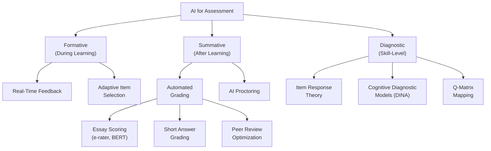
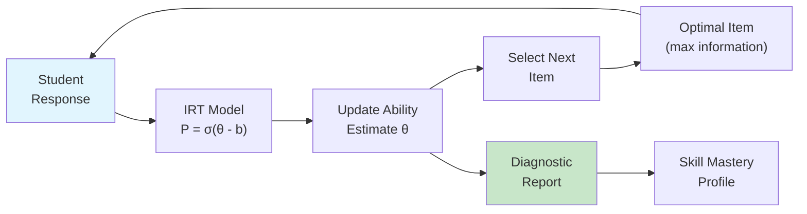

# AI for Educational Assessment

## Overview

Educational assessment — the process of measuring what students know and can do — is one of the oldest and most consequential functions in education. From ancient Chinese civil service examinations to modern standardized tests, assessment shapes curricula, determines academic trajectories, and allocates opportunities. Yet traditional assessment faces fundamental limitations: human grading is slow, expensive, and inconsistent; multiple-choice tests measure recognition rather than deep understanding; and high-stakes exams create anxiety that distorts performance. Artificial intelligence is transforming assessment by enabling faster, more frequent, more nuanced, and potentially fairer measurement of student learning.

**Formative assessment** — ongoing evaluation during the learning process — benefits enormously from AI. The core value proposition is real-time feedback: instead of waiting days or weeks for a graded assignment, students receive immediate, actionable feedback as they work. AI-powered formative assessment systems monitor student responses in real time, identify patterns of misunderstanding, and provide targeted hints or supplementary explanations. Intelligent tutoring systems like Carnegie Learning's MATHia track student performance on each sub-skill, updating a probabilistic model of mastery after every response and adjusting the difficulty and focus of subsequent problems accordingly. This creates a tight feedback loop that accelerates learning far beyond what periodic human-graded assessments can achieve.

**Summative assessment** — evaluation at the end of a learning period — is being transformed by AI in two major ways. First, **automated exam grading** uses natural language processing and machine learning to score open-ended responses (essays, short answers, explanations) at scale. Systems like ETS's e-rater for essay scoring and various BERT-based models for short-answer grading can achieve inter-rater reliability comparable to human graders. Second, **AI-powered proctoring** systems use computer vision and behavioral analytics to monitor exam-takers remotely, detecting potential academic integrity violations through gaze tracking, audio analysis, and screen monitoring — though these systems raise significant privacy and equity concerns.

**Knowledge assessment models** provide the mathematical foundation for AI-based assessment. **Item Response Theory (IRT)** is the dominant psychometric framework, modeling the probability of a correct response as a function of the student's latent ability and the item's characteristics (difficulty, discrimination, guessing). The simplest IRT model, the **1-Parameter Logistic (1PL) or Rasch model**, assumes the probability of a correct response depends only on the difference between student ability and item difficulty: $P(\text{correct}) = \sigma(\theta - b)$ where $\theta$ is student ability, $b$ is item difficulty, and $\sigma$ is the logistic function. More complex models add discrimination and guessing parameters. The **DINA (Deterministic Input, Noisy "And" gate) model** is a cognitive diagnostic model that goes beyond a single ability score. It models whether a student has mastered each of several discrete skills, and predicts item responses based on whether the student has mastered all skills required by that item.

The **Q-matrix** is a fundamental concept linking assessment items to skills. It is a binary matrix where rows represent assessment items and columns represent skills (knowledge components). An entry of 1 indicates that the item requires that skill. For example, a Q-matrix for an algebra test might show that item 3 requires "factoring quadratics" and "solving linear equations" but not "graphing." The Q-matrix enables diagnostic assessment: rather than just producing a total score, the system can estimate mastery of each individual skill, providing far more actionable feedback to students and instructors.

**Multimodal assessment** extends AI-based evaluation beyond written responses. Eye-tracking data reveals attention patterns and reading strategies. Keystroke dynamics capture writing process information (time spent planning vs. revising, deletion patterns that indicate uncertainty). Audio analysis in oral exams can evaluate pronunciation, fluency, and prosody. Combining these modalities provides a richer picture of student understanding than any single channel. Research by D'Mello et al. has shown that multimodal affect detection (combining facial expression, posture, and interaction patterns) can predict student engagement and learning outcomes with surprising accuracy.

**Game-based assessment** embeds measurement within interactive learning environments. **Stealth assessment** — assessment that occurs invisibly within gameplay — avoids the anxiety and performance distortion of traditional testing. Students play educational games while the system logs their actions, decisions, and strategies, using Bayesian inference networks to estimate competencies in real time. **Evidence-Centered Design (ECD)**, developed by Mislevy and colleagues at ETS, provides a theoretical framework for designing such assessments: it specifies what competencies are being measured (the student model), what observable behaviors constitute evidence (the evidence model), and what tasks elicit those behaviors (the task model).

**Psychometric considerations** are critical for AI-based assessment. **Validity** asks whether the assessment measures what it claims to measure — an AI grading system that gives high scores to essays with sophisticated vocabulary but poor arguments has low validity. **Reliability** asks whether the assessment produces consistent results — an AI grading system whose scores vary significantly when the same essay is submitted multiple times has low reliability. **Fairness** asks whether the assessment produces equitable results across demographic groups — if an AI grading system systematically gives lower scores to essays written by non-native English speakers on science exams, it may be measuring language proficiency rather than science knowledge, introducing construct-irrelevant bias.

**Automated short-answer grading** with transformer models like BERT represents the current state of the art. These systems fine-tune pretrained language models on datasets of student responses paired with human-assigned grades, learning to predict scores for new responses. The best systems achieve quadratic weighted kappa scores above 0.8 with human graders across diverse subjects, though performance degrades on highly creative or unconventional responses. **Peer review automation** uses AI to optimize the peer review process: matching reviewers to submissions based on expertise, detecting low-quality reviews, calibrating peer scores against expert scores, and aggregating multiple peer reviews into reliable composite scores.

---

## Key Concepts

- **Item Response Theory (IRT)**: A family of psychometric models that relate the probability of a correct response to latent student ability and item characteristics (difficulty, discrimination, guessing). The foundation of modern computerized adaptive testing.
- **Q-Matrix**: A binary matrix mapping assessment items (rows) to required skills/knowledge components (columns). Enables diagnostic assessment that identifies specific skill deficiencies rather than just producing aggregate scores.
- **DINA Model**: A cognitive diagnostic model that assumes a student must have mastered ALL skills required by an item to have a high probability of answering correctly. Uses slip and guess parameters to account for noise.
- **Stealth Assessment**: Assessment embedded invisibly within learning activities (especially games) that measures student competencies through behavioral observation without the anxiety and performance distortion of traditional tests.
- **Evidence-Centered Design (ECD)**: A framework for assessment design that explicitly specifies the student model (what to measure), evidence model (what behaviors constitute evidence), and task model (what tasks elicit those behaviors).
- **Formative vs. Summative Assessment**: Formative assessment occurs during learning to provide feedback and guide instruction; summative assessment occurs after learning to evaluate achievement. AI enhances both but through different mechanisms.
- **Psychometric Fairness**: The requirement that an assessment produces equitable results across demographic groups, measuring the intended construct without systematic bias from construct-irrelevant factors.

---

## Technical Details

### IRT 1PL (Rasch) Model

The Rasch model is the simplest IRT model. It models the probability of student $i$ answering item $j$ correctly as:

$$P(X_{ij} = 1 | \theta_i, b_j) = \frac{1}{1 + e^{-(\theta_i - b_j)}}$$

where $\theta_i$ is the ability of student $i$ and $b_j$ is the difficulty of item $j$. Parameters are typically estimated using maximum likelihood or Bayesian methods.

### DINA Model

The DINA model uses the Q-matrix to define an ideal response pattern. For student $i$ and item $j$:

$$\eta_{ij} = \prod_{k=1}^{K} \alpha_{ik}^{q_{jk}}$$

where $\alpha_{ik}$ is 1 if student $i$ has mastered skill $k$, and $q_{jk}$ is the Q-matrix entry. Then:

$$P(X_{ij} = 1) = (1 - s_j)^{\eta_{ij}} \cdot g_j^{(1 - \eta_{ij})}$$

where $s_j$ is the slip parameter (probability of incorrect response despite mastery) and $g_j$ is the guess parameter (probability of correct response despite non-mastery).

### IRT 1PL Parameter Estimation in Python

```python
import numpy as np
from scipy.optimize import minimize
from scipy.special import expit  # logistic sigmoid

def simulate_irt_data(
    n_students: int = 500,
    n_items: int = 20,
    seed: int = 42
) -> tuple[np.ndarray, np.ndarray, np.ndarray]:
    """Simulate response data from a 1PL IRT model."""
    rng = np.random.default_rng(seed)

    # True parameters
    theta_true = rng.normal(0, 1, n_students)      # student abilities
    b_true = rng.uniform(-2, 2, n_items)            # item difficulties

    # Generate response matrix
    # P(correct) = sigmoid(theta_i - b_j)
    prob_matrix = expit(theta_true[:, None] - b_true[None, :])
    responses = (rng.random((n_students, n_items)) < prob_matrix).astype(int)

    return responses, theta_true, b_true

def neg_log_likelihood_1pl(
    params: np.ndarray,
    responses: np.ndarray,
    n_students: int,
    n_items: int
) -> float:
    """Negative log-likelihood for the 1PL IRT model."""
    theta = params[:n_students]
    b = params[n_students:n_students + n_items]

    # Compute probability matrix: P(X=1) = sigmoid(theta_i - b_j)
    logits = theta[:, None] - b[None, :]
    probs = expit(logits)

    # Clip for numerical stability
    probs = np.clip(probs, 1e-10, 1 - 1e-10)

    # Log-likelihood
    ll = np.sum(
        responses * np.log(probs) + (1 - responses) * np.log(1 - probs)
    )
    return -ll

def estimate_1pl_parameters(
    responses: np.ndarray,
    max_iter: int = 1000
) -> tuple[np.ndarray, np.ndarray]:
    """Estimate 1PL IRT parameters using maximum likelihood."""
    n_students, n_items = responses.shape

    # Initialize: abilities from proportion correct, difficulties from
    # proportion incorrect
    prop_correct_student = responses.mean(axis=1)
    prop_correct_item = responses.mean(axis=0)

    # Use log-odds as initial estimates
    theta_init = np.log(
        (prop_correct_student + 0.01) / (1 - prop_correct_student + 0.01)
    )
    b_init = -np.log(
        (prop_correct_item + 0.01) / (1 - prop_correct_item + 0.01)
    )

    params_init = np.concatenate([theta_init, b_init])

    # Optimize
    result = minimize(
        neg_log_likelihood_1pl,
        params_init,
        args=(responses, n_students, n_items),
        method="L-BFGS-B",
        options={"maxiter": max_iter, "disp": False}
    )

    theta_est = result.x[:n_students]
    b_est = result.x[n_students:n_students + n_items]

    # Center the estimates (identifiability constraint)
    mean_theta = theta_est.mean()
    theta_est -= mean_theta
    b_est -= mean_theta

    return theta_est, b_est

def evaluate_estimation(
    theta_true: np.ndarray, theta_est: np.ndarray,
    b_true: np.ndarray, b_est: np.ndarray
):
    """Evaluate parameter recovery quality."""
    # Center true parameters for fair comparison
    theta_true_c = theta_true - theta_true.mean()
    b_true_c = b_true - b_true.mean()  # not used below but conceptually needed

    # Correlation between true and estimated
    theta_corr = np.corrcoef(theta_true_c, theta_est)[0, 1]
    b_corr = np.corrcoef(b_true, b_est)[0, 1]

    # RMSE
    # Align scale: regress estimated on true
    theta_rmse = np.sqrt(np.mean((theta_true_c - theta_est) ** 2))
    b_rmse = np.sqrt(np.mean((b_true - b_est) ** 2))

    print("Parameter Recovery Results:")
    print(f"  Ability (theta): correlation = {theta_corr:.4f}, "
          f"RMSE = {theta_rmse:.4f}")
    print(f"  Difficulty (b):   correlation = {b_corr:.4f}, "
          f"RMSE = {b_rmse:.4f}")

# Run the full pipeline
print("Simulating 1PL IRT data...")
responses, theta_true, b_true = simulate_irt_data(
    n_students=500, n_items=20
)
print(f"Response matrix shape: {responses.shape}")
print(f"Overall proportion correct: {responses.mean():.3f}")

print("\nEstimating parameters via MLE...")
theta_est, b_est = estimate_1pl_parameters(responses)

print()
evaluate_estimation(theta_true, theta_est, b_true, b_est)

# Show item difficulty estimates
print("\nEstimated Item Difficulties (sorted):")
sorted_items = np.argsort(b_est)
for rank, idx in enumerate(sorted_items):
    print(f"  Item {idx:2d}: b_est={b_est[idx]:+.3f}, "
          f"b_true={b_true[idx]:+.3f}, "
          f"prop_correct={responses[:, idx].mean():.3f}")

# Classify students into mastery levels
mastery_threshold = 0.5
n_mastery = np.sum(theta_est > mastery_threshold)
n_struggling = np.sum(theta_est < -mastery_threshold)
n_developing = len(theta_est) - n_mastery - n_struggling
print(f"\nStudent Classification:")
print(f"  Mastery (theta > {mastery_threshold}):  {n_mastery} students")
print(f"  Developing:                            {n_developing} students")
print(f"  Struggling (theta < -{mastery_threshold}): {n_struggling} students")
```

---

## Diagrams

### AI Assessment Ecosystem



### IRT Model Decision Flow



---

## Exercises

1. **IRT Exploration**: Extend the code example to implement the 2PL IRT model, which adds a discrimination parameter $a_j$ for each item: $P = \sigma(a_j(\theta_i - b_j))$. Compare parameter recovery between the 1PL and 2PL models when the true data is generated from a 2PL model. How much does ignoring discrimination hurt ability estimation?

2. **Q-Matrix Design**: Choose a topic you know well (e.g., introductory Python programming). Identify 5 knowledge components (e.g., "variable assignment," "for loops," "list indexing," "function definition," "conditional logic"). Design 10 assessment items and construct the Q-matrix. Then implement the DINA model and simulate student responses for students with different mastery profiles.

3. **Automated Short-Answer Grading**: Using a pretrained sentence transformer (e.g., `sentence-transformers/all-MiniLM-L6-v2`), build a simple short-answer grading system. Collect 5 reference answers for a question, embed them, and score new student responses based on cosine similarity to the reference embeddings. Evaluate against a small hand-graded dataset and analyze failure cases.

4. **Fairness Audit**: Take a real or simulated assessment dataset with demographic information. Compute differential item functioning (DIF) for each item by comparing IRT difficulty estimates across demographic groups. Identify items with significant DIF and hypothesize why they might be biased. Propose modifications to reduce bias while maintaining measurement validity.

---

## Further Reading

- Baker, F. B., & Kim, S.-H. (2004). *Item Response Theory: Parameter Estimation Techniques*. CRC Press.
- Mislevy, R. J., Almond, R. G., & Lukas, J. F. (2003). "A Brief Introduction to Evidence-Centered Design." *ETS Research Report Series*.
- Shute, V. J. (2011). "Stealth Assessment in Computer-Based Games to Support Learning." *Computer Games and Instruction*, 55(2), 503–524.
- Sung, C., Dhamecha, T. I., & Mukhi, N. (2019). "Improving Short Answer Grading Using Transformer-Based Pre-training." *International Conference on Artificial Intelligence in Education (AIED)*.
