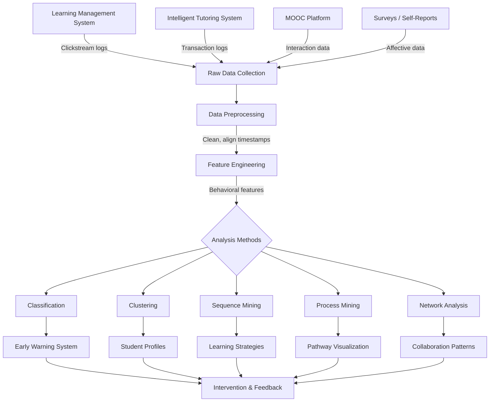
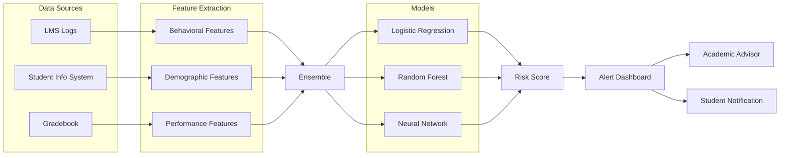
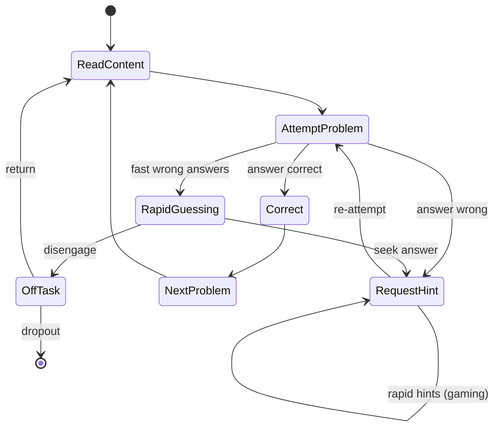

# Educational Data Mining

## Overview

Educational Data Mining (EDM) is a research field concerned with developing methods for exploring the unique types of data that come from educational settings, using those methods to better understand students and the environments in which they learn. As educational institutions increasingly adopt digital learning platforms -- learning management systems (LMS) like Canvas and Moodle, intelligent tutoring systems like ASSISTments and Carnegie Learning, and massive open online courses (MOOCs) on Coursera and edX -- they generate vast amounts of fine-grained interaction data. Every click, every pause, every hint request, every answer submitted creates a digital trace of the learning process. EDM transforms these traces into actionable insights.

The **data types** in EDM span a wide spectrum. **Clickstream data** captures every URL visited, button pressed, and page transition within a digital learning environment, providing a temporal sequence of interactions. **Log data** from tutoring systems records problem attempts, hint requests, error messages, and scaffolding steps at a granular level -- often timestamped to the millisecond. **LMS data** includes assignment submissions, grade records, discussion forum posts, quiz attempts, and resource access patterns. **Self-report data** from surveys and questionnaires captures affective states, motivation levels, and metacognitive strategies that are not directly observable from system logs. Increasingly, **multimodal data** -- webcam feeds, eye-tracking, keystroke dynamics, and physiological sensors -- supplements traditional log data to provide richer pictures of the learning experience.

A central application of EDM is the identification of **behavioral patterns** that correlate with learning outcomes. **Help-seeking behavior** is well-studied: students who use hints and help features appropriately tend to learn more, while those who "abuse" hints -- requesting all hints immediately without attempting the problem -- show lower learning gains. **Gaming the system** refers to behaviors where students exploit system properties rather than genuinely engaging with content, such as systematic guessing, rapid hint requests to obtain answers, or intentional errors to trigger worked examples. Ryan Baker's seminal work showed that gaming the system correlates with reduced learning by roughly 25% compared to non-gaming peers. **Off-task behavior** -- detected through unusually long pauses, switching between applications, or absence of interaction -- is another critical signal. Models that detect these behaviors in real time can trigger interventions, such as motivational messages or alternative activities.

**Early warning systems** represent one of the most impactful practical applications of EDM. These systems predict which students are at risk of failing a course, dropping out of a program, or falling behind academically, allowing educators to intervene before it is too late. The features that power these predictions include **time-on-task** (total and per-problem), **response time patterns** (unusually fast responses suggest guessing; very slow responses suggest confusion), **error rates** and their trajectories over time, **help-seeking frequency**, **login frequency and regularity**, **assignment submission timing** (procrastination patterns), and **discussion forum participation**. Classification models commonly used include **logistic regression** (interpretable and effective for many settings), **random forests** (handling nonlinear interactions well), and **neural networks** (capturing complex temporal patterns). Purdue University's Course Signals system was a pioneering deployment: using LMS data and demographic features, it generated traffic-light indicators for students, and studies reported improved retention rates of 21% in some cohorts.

**Process mining** applies techniques from business process analysis to reconstruct the actual learning strategies students employ, as opposed to the intended instructional sequence. By analyzing event logs, process mining algorithms (such as the Alpha algorithm or inductive mining) can discover process models that reveal common learning paths, deviations, bottlenecks, and loops. This helps instructional designers understand how students actually navigate course materials versus how they were expected to.

Beyond prediction, EDM employs a rich toolkit of analytical methods. **Clustering** groups students by behavioral profiles, revealing archetypes such as "engaged learners," "strategic minimalists," and "disengaged browsers." **Sequence mining** discovers frequent subsequences of actions that predict success or failure -- for instance, the pattern "read notes, attempt problem, review feedback, reattempt" may be a signature of effective learners. **Association rule mining** finds co-occurring behaviors and outcomes, such as "students who access supplementary videos AND participate in forums tend to earn higher grades." **Network analysis** examines collaboration patterns in discussion forums and group projects, identifying central and peripheral students, knowledge brokers, and isolated learners.

Several benchmark datasets have advanced the field. The **PSLC DataShop** (Pittsburgh Science of Learning Center) hosts hundreds of datasets from intelligent tutoring systems, with standardized formats for transaction-level data. **ASSISTments** data, particularly the 2009-2010 and 2012-2013 datasets, are widely used for knowledge tracing and dropout prediction research. The **KDD Cup 2010** challenge provided large-scale algebra tutoring data that spurred advances in student modeling and feature engineering.

Ethical considerations loom large in EDM. **FERPA** (Family Educational Rights and Privacy Act) in the United States restricts how student records can be shared and used. **Informed consent** is often complex in educational contexts -- students may feel coerced if participation in data collection is tied to required coursework. The specter of **surveillance** is real: continuous monitoring of every click can feel intrusive and may alter student behavior (a chilling effect). Data minimization, de-identification, and clear governance policies are essential safeguards.

## Key Concepts

- **Clickstream Data**: A sequential record of every user interaction within a digital learning environment, including page views, button clicks, and navigation events, typically timestamped for temporal analysis.
- **Gaming the System**: A set of student behaviors that exploit properties of an educational system to progress without genuine learning, such as rapid hint requests, systematic guessing, or deliberate errors to trigger answers.
- **Early Warning System (EWS)**: A predictive analytics system that identifies students at risk of academic failure, dropout, or disengagement, enabling timely human or automated interventions.
- **Process Mining**: A family of techniques that reconstruct, analyze, and visualize actual workflows or learning paths from event log data, comparing observed behavior against intended processes.
- **Knowledge Tracing**: Modeling a student's evolving knowledge state over time based on their sequence of correct and incorrect responses, used to predict future performance.
- **Association Rule Mining**: A method for discovering co-occurring patterns in transactional data, expressed as rules of the form "if X then Y" with support and confidence metrics.
- **FERPA**: The Family Educational Rights and Privacy Act, a US federal law that governs access to and disclosure of student educational records, directly affecting how EDM data can be collected, stored, and shared.

## Technical Details

### Early Warning System with Clickstream Features

```python
import pandas as pd
import numpy as np
from sklearn.model_selection import train_test_split, StratifiedKFold
from sklearn.ensemble import RandomForestClassifier, GradientBoostingClassifier
from sklearn.linear_model import LogisticRegression
from sklearn.metrics import classification_report, roc_auc_score
from sklearn.preprocessing import StandardScaler

def extract_student_features(logs: pd.DataFrame) -> pd.DataFrame:
    """
    Extract behavioral features from LMS clickstream logs.

    logs columns: student_id, timestamp, action_type, resource_id, duration_sec
    action_type: 'page_view', 'quiz_attempt', 'forum_post', 'assignment_submit',
                 'hint_request', 'video_watch'
    """
    features = logs.groupby("student_id").agg(
        total_actions=("action_type", "count"),
        total_time=("duration_sec", "sum"),
        mean_session_duration=("duration_sec", "mean"),
        std_session_duration=("duration_sec", "std"),
        num_quiz_attempts=("action_type", lambda x: (x == "quiz_attempt").sum()),
        num_hint_requests=("action_type", lambda x: (x == "hint_request").sum()),
        num_forum_posts=("action_type", lambda x: (x == "forum_post").sum()),
        num_video_watches=("action_type", lambda x: (x == "video_watch").sum()),
        num_assignments=("action_type", lambda x: (x == "assignment_submit").sum()),
        num_unique_resources=("resource_id", "nunique"),
    ).reset_index()

    # Derived features
    features["hint_per_quiz"] = (
        features["num_hint_requests"] / features["num_quiz_attempts"].replace(0, 1)
    )
    features["engagement_ratio"] = (
        features["num_forum_posts"] + features["num_video_watches"]
    ) / features["total_actions"].replace(0, 1)

    # Temporal regularity: std of days between logins
    login_regularity = (
        logs.groupby("student_id")["timestamp"]
        .apply(lambda ts: ts.sort_values().diff().dt.days.std())
        .reset_index(name="login_regularity_std")
    )
    features = features.merge(login_regularity, on="student_id", how="left")
    features["login_regularity_std"] = features["login_regularity_std"].fillna(0)

    return features

def build_early_warning_system(features: pd.DataFrame, labels: pd.Series):
    """
    Train and evaluate an early warning system.
    labels: 1 = at-risk (dropout/failing), 0 = on-track
    """
    feature_cols = [c for c in features.columns if c != "student_id"]
    X = features[feature_cols].values
    y = labels.values

    scaler = StandardScaler()
    X = scaler.fit_transform(X)

    models = {
        "Logistic Regression": LogisticRegression(
            class_weight="balanced", max_iter=1000
        ),
        "Random Forest": RandomForestClassifier(
            n_estimators=200, class_weight="balanced", random_state=42
        ),
        "Gradient Boosting": GradientBoostingClassifier(
            n_estimators=200, learning_rate=0.1, random_state=42
        ),
    }

    cv = StratifiedKFold(n_splits=5, shuffle=True, random_state=42)

    for name, model in models.items():
        aucs = []
        for train_idx, val_idx in cv.split(X, y):
            model.fit(X[train_idx], y[train_idx])
            probs = model.predict_proba(X[val_idx])[:, 1]
            aucs.append(roc_auc_score(y[val_idx], probs))
        print(f"{name}: Mean AUC = {np.mean(aucs):.3f} +/- {np.std(aucs):.3f}")

    # Train final model on all data and show feature importances
    best_model = RandomForestClassifier(
        n_estimators=200, class_weight="balanced", random_state=42
    )
    best_model.fit(X, y)

    importances = pd.Series(
        best_model.feature_importances_, index=feature_cols
    ).sort_values(ascending=False)
    print("\nTop feature importances:")
    print(importances.head(10))

    return best_model, scaler

def detect_gaming_behavior(logs: pd.DataFrame, threshold_seconds: float = 3.0):
    """
    Detect 'gaming the system' by identifying rapid hint-request sequences
    that suggest answer-copying rather than genuine help-seeking.
    """
    hint_logs = logs[logs["action_type"] == "hint_request"].sort_values(
        ["student_id", "timestamp"]
    )
    hint_logs["time_since_last_hint"] = hint_logs.groupby("student_id")[
        "timestamp"
    ].diff().dt.total_seconds()

    # Rapid consecutive hints (< threshold) suggest gaming
    gaming_events = hint_logs[
        hint_logs["time_since_last_hint"] < threshold_seconds
    ]
    gaming_counts = (
        gaming_events.groupby("student_id")
        .size()
        .reset_index(name="rapid_hint_count")
    )

    total_hints = (
        hint_logs.groupby("student_id")
        .size()
        .reset_index(name="total_hints")
    )
    gaming_stats = total_hints.merge(gaming_counts, on="student_id", how="left")
    gaming_stats["rapid_hint_count"] = gaming_stats["rapid_hint_count"].fillna(0)
    gaming_stats["gaming_ratio"] = (
        gaming_stats["rapid_hint_count"] / gaming_stats["total_hints"]
    )

    return gaming_stats
```

### Sequence Mining for Learning Strategies

```python
from collections import Counter
from itertools import combinations

def extract_action_sequences(logs: pd.DataFrame, window_size: int = 5):
    """
    Extract sliding-window action sequences per student for pattern mining.
    """
    sequences = {}
    for student_id, group in logs.sort_values("timestamp").groupby("student_id"):
        actions = group["action_type"].tolist()
        student_seqs = []
        for i in range(len(actions) - window_size + 1):
            student_seqs.append(tuple(actions[i:i + window_size]))
        sequences[student_id] = student_seqs
    return sequences

def find_frequent_subsequences(
    sequences: dict, min_support: float = 0.1, subseq_len: int = 3
):
    """
    Find frequent subsequences across all students.
    min_support: fraction of students who exhibit the pattern.
    """
    n_students = len(sequences)
    pattern_counts = Counter()

    for student_id, seqs in sequences.items():
        student_patterns = set()
        for seq in seqs:
            # Extract all subsequences of the given length
            for combo in combinations(range(len(seq)), subseq_len):
                subseq = tuple(seq[i] for i in combo)
                student_patterns.add(subseq)
        for pattern in student_patterns:
            pattern_counts[pattern] += 1

    frequent = {
        pattern: count / n_students
        for pattern, count in pattern_counts.items()
        if count / n_students >= min_support
    }
    return dict(sorted(frequent.items(), key=lambda x: -x[1]))
```

## Diagrams

### EDM Data Pipeline



### Early Warning System Architecture



### Student Behavioral Pattern Detection



## Exercises

1. **Build an At-Risk Student Classifier**: Using the ASSISTments 2009-2010 dataset (available at https://sites.google.com/site/assistmaborehm/), extract at least 10 behavioral features per student (time-on-task, hint usage, error rate, etc.) and train a logistic regression and random forest model to predict whether a student will answer the next problem correctly. Report AUC and compare feature importances between the two models.

2. **Gaming-the-System Detector**: Using the gaming detection logic from the technical section, implement a complete pipeline that (a) generates synthetic tutoring log data with both normal and gaming students, (b) labels gaming episodes using heuristic rules (rapid hints, systematic guessing), and (c) trains a classifier to detect gamers from their behavioral feature profiles. Evaluate precision and recall, discussing why false positives and false negatives have different costs in this context.

3. **Process Mining Visualization**: Collect your own clickstream data from an LMS (or use a publicly available MOOC dataset such as the Harvard-MIT HarvardX/MITx dataset on Dataverse). Apply the PM4Py Python library to reconstruct process models of student navigation paths. Compare the discovered process model to the intended course sequence and identify the most common deviations and bottlenecks.

4. **Ethical Audit of an EDM System**: Design a data governance framework for a hypothetical university deploying an early warning system. Address: What data is collected and for how long? Who has access to risk scores? How are students informed? What recourse do students have if flagged incorrectly? Write a two-page policy document addressing FERPA compliance, informed consent, data retention, and algorithmic transparency.

## Further Reading

- Baker, R. S. J. d., & Yacef, K. (2009). "The State of Educational Data Mining in 2009: A Review and Future Visions." *Journal of Educational Data Mining*, 1(1), 3-17.
- Romero, C., & Ventura, S. (2020). "Educational Data Mining and Learning Analytics: An Updated Survey." *WIREs Data Mining and Knowledge Discovery*, 10(3), e1355.
- Arnold, K. E., & Pistilli, M. D. (2012). "Course Signals at Purdue: Using Learning Analytics to Increase Student Success." *Proceedings of the 2nd International Conference on Learning Analytics and Knowledge (LAK '12)*, 267-270.
- Baker, R. S. (2007). "Modeling and Understanding Students' Off-Task Behavior in Intelligent Tutoring Systems." *Proceedings of the SIGCHI Conference on Human Factors in Computing Systems (CHI '07)*, 1059-1068.
