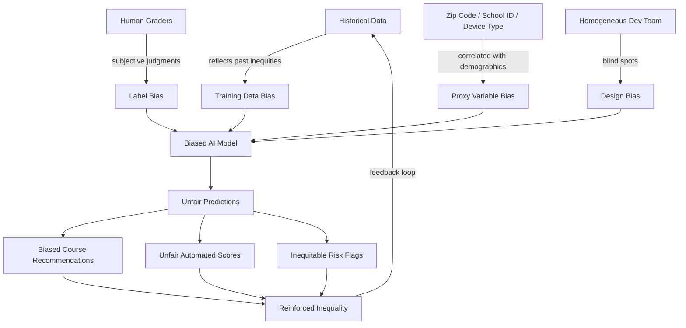
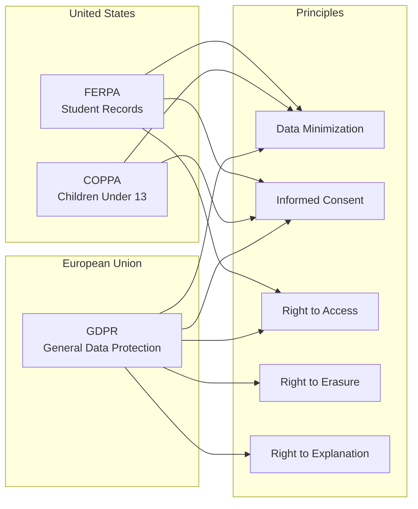

# Ethics and Equity in AI Education

## Overview

The deployment of artificial intelligence in education raises profound ethical questions that go beyond technical performance. An AI tutoring system may achieve impressive accuracy on knowledge tracing benchmarks, but if it systematically disadvantages certain student populations, violates privacy norms, or fosters unhealthy dependency, its net impact on education may be negative. Ethics and equity must be treated not as afterthoughts but as foundational design requirements for any AI system used in learning contexts.

**Data privacy** is the first and most immediate concern. Educational AI systems collect remarkably intimate data: not just grades and attendance, but moment-by-moment records of what a student reads, how long they hesitate before answering, when they seek help, and what mistakes they make. In the United States, **FERPA** (Family Educational Rights and Privacy Act) protects student education records, granting parents (and students over 18) rights to access and control disclosure of their records. **COPPA** (Children's Online Privacy Protection Act) imposes strict requirements on collecting data from children under 13, requiring verifiable parental consent -- a significant constraint for K-12 AI tools. In Europe, the **GDPR** (General Data Protection Regulation) provides even stronger protections, including the right to erasure, the right to explanation for automated decisions, and strict rules around data processing consent. **Data minimization** -- collecting only the data strictly necessary for the educational purpose -- is a core principle across these frameworks, yet many edtech platforms collect far more data than they need, often for commercial purposes like advertising or product development.

**Algorithmic bias** is perhaps the most technically complex ethical challenge. Automated essay scoring (AES) systems, widely used in standardized testing (e.g., ETS's e-rater), have been shown to exhibit **demographic disparities**. Studies have found that AES systems may penalize non-native English speakers, students who use African American Vernacular English (AAVE), or students from cultural backgrounds that favor rhetorical structures different from the Western academic essay. Recommendation systems that suggest courses, resources, or career paths can perpetuate existing inequalities if they are trained on historically biased data -- for instance, recommending STEM courses less frequently to female students because historical data reflects past enrollment patterns rather than potential.

The **sources of bias** in educational AI are multiple and often interacting. **Training data bias** occurs when the datasets used to build models reflect historical inequities -- if an essay scoring model is trained primarily on essays from affluent suburban schools, it may not generalize fairly to essays from under-resourced urban schools. **Label bias** arises when the ground-truth labels used for training encode human biases -- teacher grades, for example, have been shown to be influenced by student race and socioeconomic status. **Proxy variable bias** is particularly insidious: even when protected attributes like race are excluded from a model, variables like zip code, school ID, or internet access speed can serve as proxies, allowing the model to indirectly discriminate.

**Fairness metrics** provide mathematical frameworks for evaluating whether an AI system treats different groups equitably, though no single metric captures all dimensions of fairness. **Demographic parity** requires that positive outcomes (e.g., being recommended for an advanced course) occur at equal rates across demographic groups. **Equalized odds** requires that the model's true positive and false positive rates are equal across groups -- meaning the model is equally accurate for all populations. **Individual fairness** requires that similar students receive similar predictions, regardless of group membership. These metrics can conflict with each other: Chouldechova (2017) proved that except in trivial cases, it is mathematically impossible to simultaneously satisfy calibration, false positive parity, and false negative parity across groups with different base rates.

**Accessibility** is an equity dimension that AI can either improve or worsen. AI-powered tools hold enormous promise for students with disabilities: **Augmentative and Alternative Communication (AAC)** devices use language models to predict intended words and phrases for non-verbal students. AI-based **dyslexia support** tools can adjust text formatting, provide text-to-speech, and offer simplified summaries. **Visual impairment** tools use image captioning and scene description to make visual content accessible. However, if AI educational tools are designed without accessibility in mind -- for instance, if a virtual tutor relies entirely on visual diagrams without alt-text, or if a speech-based interface has no text alternative -- they create new barriers.

The **digital divide** remains a persistent equity challenge. Access to AI-powered educational tools strongly correlates with socioeconomic status (SES). Students in well-funded schools have reliable internet, modern devices, and institutional licenses for sophisticated AI platforms, while students in under-resourced communities may lack basic connectivity. The COVID-19 pandemic starkly revealed this divide: students without reliable internet access were effectively locked out of AI-enhanced remote learning. Deploying AI in education without addressing infrastructure gaps risks creating a two-tier system where AI amplifies existing advantages.

**Over-reliance on AI** poses a subtler but significant risk. When students become dependent on AI assistance for problem-solving, writing, or decision-making, they may experience **skill atrophy** -- the degradation of abilities they would otherwise develop through struggle and practice. A calculator analogy applies: calculators freed students from tedious arithmetic to focus on higher-order mathematical thinking, but eliminating all computational practice may undermine number sense. Similarly, AI writing assistants that generate polished prose may prevent students from developing their own writing voice and critical thinking skills. The pedagogical challenge is finding the right level of AI scaffolding that supports learning without replacing it.

**Transparency and explainability** are essential for trust and accountability. When an AI system flags a student as at-risk, recommends remedial coursework, or scores an essay, stakeholders -- students, parents, teachers, administrators -- need to understand why. Black-box models that produce predictions without explanations undermine trust and make it impossible to identify and correct errors or biases. Explainable AI (XAI) techniques, such as SHAP values, LIME, and attention visualization, can help, but there is a tension between model complexity (which often improves accuracy) and interpretability.

**Governance** frameworks are emerging to address these challenges. School districts and universities are developing **AI policies** that specify approved tools, data handling procedures, and acceptable use guidelines. **UNESCO's Recommendation on the Ethics of Artificial Intelligence** (2021) provides an international framework that emphasizes human oversight, transparency, fairness, and privacy. The EU AI Act classifies educational AI systems as "high-risk," subjecting them to stringent requirements including conformity assessments, risk management systems, and human oversight provisions.

## Key Concepts

- **FERPA (Family Educational Rights and Privacy Act)**: US federal law protecting the privacy of student education records, granting parents and eligible students rights to access records and control their disclosure.
- **COPPA (Children's Online Privacy Protection Act)**: US federal law requiring verifiable parental consent before collecting personal information from children under 13, directly impacting K-12 edtech tools.
- **Algorithmic Bias**: Systematic and repeatable errors in an AI system that create unfair outcomes for specific groups, often reflecting historical inequities encoded in training data or model design.
- **Demographic Parity**: A fairness criterion requiring that the probability of a positive outcome is equal across all demographic groups, regardless of the base rate of the outcome in each group.
- **Equalized Odds**: A fairness criterion requiring that a classifier's true positive rate and false positive rate are equal across protected groups, ensuring equal accuracy for all populations.
- **Data Minimization**: The principle of collecting, processing, and retaining only the minimum amount of personal data necessary for a specified purpose, reducing privacy risk.
- **Digital Divide**: The gap between individuals, households, and communities in access to information and communication technologies, including internet connectivity, devices, and digital literacy.

## Technical Details

### Bias Detection in an Automated Scoring System

```python
import pandas as pd
import numpy as np
from sklearn.linear_model import LinearRegression
from sklearn.metrics import mean_squared_error

def audit_scoring_bias(
    scores_df: pd.DataFrame,
    predicted_col: str = "ai_score",
    human_col: str = "human_score",
    group_col: str = "demographic_group",
):
    """
    Audit an automated scoring system for demographic bias.
    
    scores_df: DataFrame with columns for AI scores, human scores,
               and demographic group membership.
    """
    results = {}
    groups = scores_df[group_col].unique()

    print("=== Per-Group Scoring Analysis ===\n")
    for group in groups:
        subset = scores_df[scores_df[group_col] == group]
        ai_mean = subset[predicted_col].mean()
        human_mean = subset[human_col].mean()
        residual = (subset[predicted_col] - subset[human_col]).mean()
        rmse = np.sqrt(mean_squared_error(subset[human_col], subset[predicted_col]))

        results[group] = {
            "n": len(subset),
            "ai_mean": ai_mean,
            "human_mean": human_mean,
            "mean_residual": residual,
            "rmse": rmse,
        }
        print(f"Group: {group}")
        print(f"  N = {len(subset)}")
        print(f"  AI Mean Score = {ai_mean:.2f}")
        print(f"  Human Mean Score = {human_mean:.2f}")
        print(f"  Mean Residual (AI - Human) = {residual:+.3f}")
        print(f"  RMSE = {rmse:.3f}\n")

    # Differential validity: does the model predict equally well for all groups?
    print("=== Differential Validity Check ===\n")
    for group in groups:
        subset = scores_df[scores_df[group_col] == group]
        correlation = subset[predicted_col].corr(subset[human_col])
        print(f"Group {group}: Pearson r = {correlation:.3f}")

    return pd.DataFrame(results).T


def compute_fairness_metrics(
    predictions: np.ndarray,
    labels: np.ndarray,
    groups: np.ndarray,
    threshold: float = 0.5,
):
    """
    Compute fairness metrics for a binary classification system
    (e.g., at-risk prediction, course recommendation).
    """
    pred_binary = (predictions >= threshold).astype(int)
    unique_groups = np.unique(groups)

    metrics = {}
    for group in unique_groups:
        mask = groups == group
        g_pred = pred_binary[mask]
        g_labels = labels[mask]

        tp = ((g_pred == 1) & (g_labels == 1)).sum()
        fp = ((g_pred == 1) & (g_labels == 0)).sum()
        tn = ((g_pred == 0) & (g_labels == 0)).sum()
        fn = ((g_pred == 0) & (g_labels == 1)).sum()

        positive_rate = g_pred.mean()  # Demographic parity metric
        tpr = tp / max(tp + fn, 1)     # True positive rate
        fpr = fp / max(fp + tn, 1)     # False positive rate

        metrics[group] = {
            "positive_rate": positive_rate,
            "true_positive_rate": tpr,
            "false_positive_rate": fpr,
            "n": mask.sum(),
        }

    metrics_df = pd.DataFrame(metrics).T
    print("=== Fairness Metrics ===\n")
    print(metrics_df.to_string())

    # Check demographic parity
    rates = metrics_df["positive_rate"]
    dp_ratio = rates.min() / max(rates.max(), 1e-10)
    print(f"\nDemographic Parity Ratio (min/max): {dp_ratio:.3f}")
    print(f"  (>= 0.8 is often considered acceptable, the '4/5ths rule')")

    # Check equalized odds
    tpr_diff = metrics_df["true_positive_rate"].max() - metrics_df["true_positive_rate"].min()
    fpr_diff = metrics_df["false_positive_rate"].max() - metrics_df["false_positive_rate"].min()
    print(f"\nEqualized Odds:")
    print(f"  TPR gap across groups: {tpr_diff:.3f}")
    print(f"  FPR gap across groups: {fpr_diff:.3f}")

    return metrics_df
```

### Accessibility Checker for Educational Content

```python
def check_content_accessibility(content: dict) -> dict:
    """
    Audit educational content for basic accessibility issues.
    
    content: dict with keys like 'images', 'videos', 'text_elements',
             'interactive_elements'
    """
    issues = []

    # Check images for alt text
    for img in content.get("images", []):
        if not img.get("alt_text"):
            issues.append({
                "type": "missing_alt_text",
                "severity": "high",
                "element": img.get("src", "unknown"),
                "recommendation": "Add descriptive alt text for screen readers",
            })
        elif len(img.get("alt_text", "")) < 10:
            issues.append({
                "type": "insufficient_alt_text",
                "severity": "medium",
                "element": img.get("src", "unknown"),
                "recommendation": "Alt text should be descriptive (10+ characters)",
            })

    # Check videos for captions
    for video in content.get("videos", []):
        if not video.get("has_captions"):
            issues.append({
                "type": "missing_captions",
                "severity": "high",
                "element": video.get("title", "unknown"),
                "recommendation": "Add closed captions for deaf/hard-of-hearing users",
            })
        if not video.get("has_transcript"):
            issues.append({
                "type": "missing_transcript",
                "severity": "medium",
                "element": video.get("title", "unknown"),
                "recommendation": "Provide a text transcript as an alternative",
            })

    # Check text readability
    for text in content.get("text_elements", []):
        word_count = len(text.get("content", "").split())
        if text.get("font_size", 16) < 14:
            issues.append({
                "type": "small_font",
                "severity": "medium",
                "element": text.get("id", "unknown"),
                "recommendation": "Use minimum 14px font for readability",
            })

    # Check interactive elements for keyboard navigation
    for elem in content.get("interactive_elements", []):
        if not elem.get("keyboard_accessible"):
            issues.append({
                "type": "no_keyboard_access",
                "severity": "high",
                "element": elem.get("id", "unknown"),
                "recommendation": "Ensure all interactions can be completed via keyboard",
            })

    summary = {
        "total_issues": len(issues),
        "high_severity": sum(1 for i in issues if i["severity"] == "high"),
        "medium_severity": sum(1 for i in issues if i["severity"] == "medium"),
        "issues": issues,
    }

    print(f"Accessibility Audit: {summary['total_issues']} issues found")
    print(f"  High severity: {summary['high_severity']}")
    print(f"  Medium severity: {summary['medium_severity']}")

    return summary
```

## Diagrams

### Sources of Bias in Educational AI



### Privacy Regulation Landscape



### Fairness-Accuracy Tradeoff

```mermaid
quadrantChart
    title Fairness vs Accuracy in AI Education Systems
    x-axis Low Accuracy --> High Accuracy
    y-axis Low Fairness --> High Fairness
    quadrant-1 Ideal: Fair and Accurate
    quadrant-2 Fair but Inaccurate
    quadrant-3 Neither Fair nor Accurate
    quadrant-4 Accurate but Unfair
    Unconstrained Model: [0.85, 0.35]
    Fairness-Constrained Model: [0.75, 0.80]
    Simple Baseline: [0.55, 0.70]
    Human Graders: [0.65, 0.60]
```

## Exercises

1. **Bias Audit of an Essay Scorer**: Using the ASAP (Automated Student Assessment Prize) dataset from Kaggle, train a simple automated essay scoring model (e.g., using TF-IDF features with ridge regression). Then simulate demographic groups by partitioning essays by essay length quartile as a proxy. Compute the mean residual (predicted - actual score) for each group and evaluate whether the model systematically over- or under-scores certain groups. Discuss what additional demographic data would be needed for a complete bias audit.

2. **Fairness Metric Comparison**: Implement the three fairness metrics (demographic parity, equalized odds, individual fairness) for a binary at-risk student classifier. Use a synthetic dataset where base rates differ across groups. Demonstrate empirically that optimizing for one metric worsens another, replicating the impossibility result. Visualize the tradeoffs.

3. **Privacy-Preserving Learning Analytics**: Research and implement a simple differential privacy mechanism for a student grade reporting system. Add calibrated Laplace noise to aggregate statistics (mean grade, pass rate) computed per course section, and show how the privacy budget (epsilon) trades off against the utility (accuracy) of the reported statistics. Discuss what epsilon values would be appropriate for educational contexts.

4. **Accessibility Evaluation**: Select three popular AI-powered educational tools (e.g., Khan Academy, Duolingo, ChatGPT). Evaluate each against WCAG 2.1 Level AA accessibility guidelines, focusing on: keyboard navigation, screen reader compatibility, color contrast, and alternative text for visual content. Write a comparative report with specific recommendations for improvement.

## Further Reading

- Holstein, K., Wortman Vaughan, J., Daume III, H., Dudik, M., & Wallach, H. (2019). "Improving Fairness in Machine Learning Systems: What Do Industry Practitioners Need?" *Proceedings of the 2019 CHI Conference on Human Factors in Computing Systems*, Paper 600.
- Baker, R. S., & Hawn, A. (2022). "Algorithmic Bias in Education." *International Journal of Artificial Intelligence in Education*, 32(4), 1052-1092.
- UNESCO. (2021). "Recommendation on the Ethics of Artificial Intelligence." United Nations Educational, Scientific and Cultural Organization.
- Chouldechova, A. (2017). "Fair Prediction with Disparate Impact: A Study of Bias in Recidivism Prediction Instruments." *Big Data*, 5(2), 153-163.
