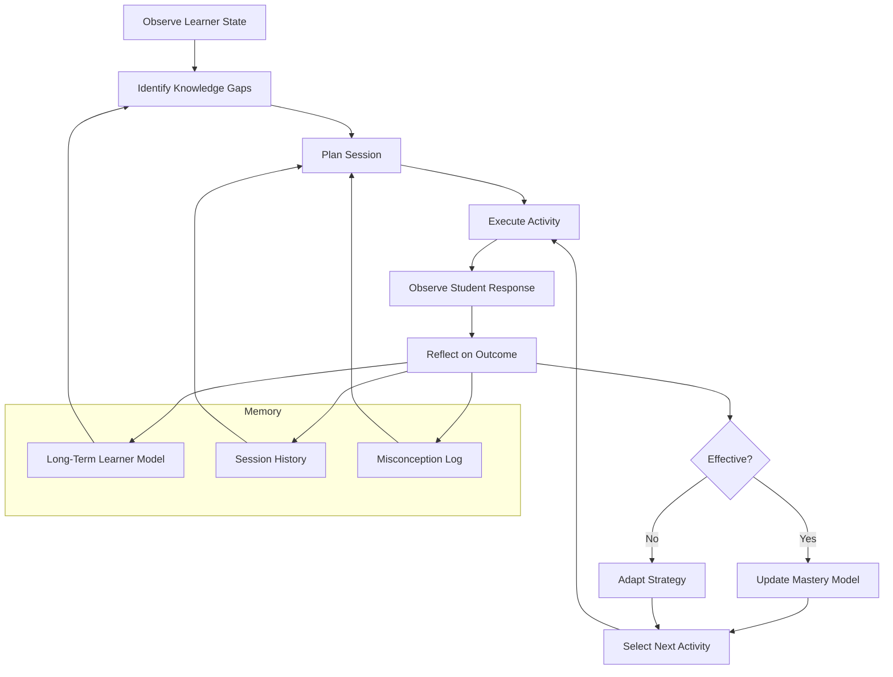
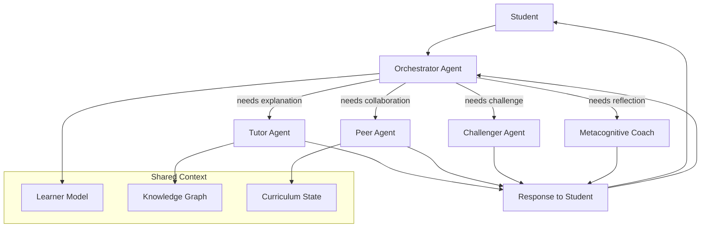
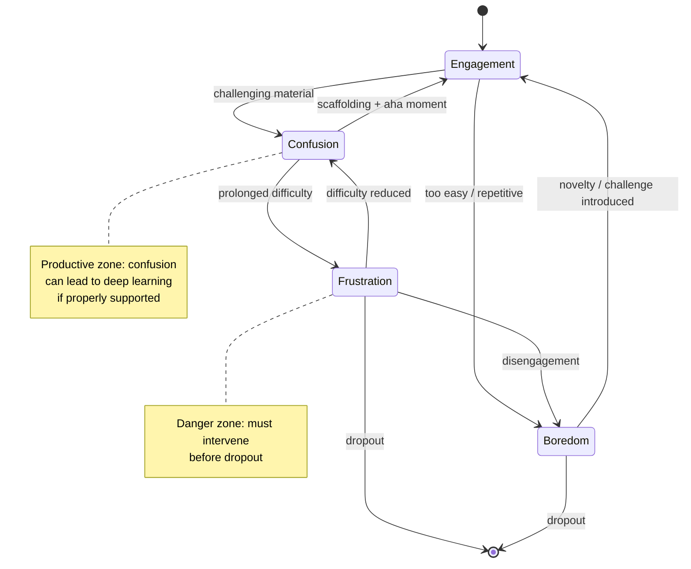

# Frontiers: AI-Native Education

## Table of Contents
- [Overview](#overview)
- [Key Concepts](#key-concepts)
- [Technical Details](#technical-details)
- [Diagrams](#diagrams)
- [Exercises](#exercises)
- [Further Reading](#further-reading)

---

## Overview

The current generation of educational AI -- adaptive learning platforms, automated grading systems,
intelligent tutoring systems -- represents AI grafted onto existing educational structures.
These tools improve efficiency and personalization within traditional paradigms,
but they do not fundamentally reimagine what education could be.
The frontier of AI in education asks a more radical question:
What would education look like if it were designed from scratch around AI capabilities?
This is the vision of **AI-native education**, and it encompasses autonomous learning companions,
multi-agent pedagogical systems, emotional AI, multimodal interaction,
and self-driving learning architectures.

**Agentic learning companions** represent a paradigm shift from reactive AI
(which responds to student queries) to proactive AI
(which autonomously plans, reflects, and adapts).
Drawing on the recent explosion of large language model (LLM) agents,
an agentic learning companion does not wait for a student to ask for help --
it monitors the student's progress, identifies emerging misconceptions,
plans a sequence of interventions, reflects on whether those interventions worked,
and adapts its strategy accordingly.
Architecturally, these systems use a planning module
(which decomposes learning goals into subgoals),
a memory module (which maintains a persistent model of the student's knowledge,
preferences, and emotional state),
a tool-use module (which can retrieve educational content, generate problems,
run simulations, or search the web),
and a reflection module (which evaluates the effectiveness of past actions
and updates the agent's strategy).
Systems like Cognii's virtual learning assistant and emerging LLM-based tutors
from research labs at Stanford and CMU are early steps in this direction.

**AI-native curricula** go further by designing entire educational experiences
around AI from the ground up.
Instead of a fixed syllabus with AI-assisted tutoring,
an AI-native curriculum is dynamically generated and continuously adapted.
The AI identifies what a student needs to learn,
selects or creates the optimal content and activities,
sequences them for maximum retention
(using spaced repetition algorithms and knowledge tracing),
and adjusts difficulty in real time.
The curriculum itself becomes a living, personalized entity rather than a static document.
This concept challenges deep assumptions about standardization in education,
raising questions about how to ensure equity and quality control
when every student's experience is different.

**Multi-agent learning systems** deploy multiple AI agents that play distinct pedagogical roles
within a single learning environment.
One agent might serve as a Socratic tutor, asking probing questions.
Another might act as a peer collaborator, working alongside the student on problems.
A third might play a devil's advocate,
challenging the student's reasoning to strengthen critical thinking.
A fourth might serve as a metacognitive coach,
prompting the student to reflect on their learning strategies.
Research on multi-agent debate and collaboration in LLMs (e.g., Du et al., 2023)
suggests that multiple agents can produce more nuanced and accurate outputs than single agents,
and this principle extends naturally to pedagogy.

**Emotional AI** (affective computing applied to education) aims to detect and respond
to students' emotional states in real time. Current approaches use
**facial expression analysis** (detecting emotions like confusion, frustration,
boredom, and engagement from webcam video using models like AffectNet),
**voice analysis** (detecting affect from prosodic features like pitch,
speaking rate, and energy),
and **physiological signals** (electrodermal activity,
heart rate variability from wearable sensors).
The D'Mello and Graesser model of affective dynamics in learning identifies key transitions:
confusion, if properly managed, can lead to deeper learning,
but if it escalates to frustration and then boredom, learning collapses.
Emotionally aware AI can intervene at critical transition points --
offering encouragement when frustration builds,
providing scaffolding when confusion persists,
or introducing novelty when boredom sets in.

**Multimodal learning interfaces** move beyond text-based interaction.
Emerging systems can process and respond to
**speech** (natural conversation with a tutor),
**handwritten input** (recognizing mathematical notation, diagrams,
and free-form writing on tablets),
**gesture** (interpreting pointing, drawing in the air,
or manipulating virtual objects),
and **gaze** (tracking what the student is looking at
to infer attention and confusion).
The integration of these modalities creates more natural
and expressive learning interactions.
For instance, a student could explain their reasoning verbally while sketching a diagram,
and the AI could interpret both channels simultaneously to assess understanding.

**VR/AR combined with AI** creates immersive learning environments
that would be impossible in physical classrooms.
Imagine learning organic chemistry by manipulating 3D molecular models with your hands in VR,
guided by an AI tutor that can see exactly how you are rotating and connecting atoms
and can intervene when you make a structural error.
Or learning history by walking through an AI-generated reconstruction of ancient Rome,
where AI-driven characters respond to your questions in historically informed ways.
Meta's and Apple's investments in spatial computing,
combined with advances in generative AI, are making these scenarios increasingly feasible.

**Long-term learner modeling** extends student models from tracking performance
within a single course to tracking cognitive and skill development
over years or even a lifetime.
A truly long-term learner model would capture not just what a student knows now,
but how their learning style has evolved,
what strategies have worked for them in the past across different domains,
and what developmental stage they are at.
This requires solving significant technical challenges in model persistence,
transfer across platforms, and graceful handling of concept drift as the learner grows.

**Self-driving learning** envisions AI systems that autonomously identify knowledge gaps
without requiring explicit assessment.
By analyzing a student's work products, conversations, and interactions with content,
the AI infers what the student does and does not understand,
then automatically generates targeted learning experiences to fill gaps.
The student does not take a test and receive a score --
the AI continuously and invisibly assesses and adapts,
much like a GPS that continuously recalculates the route
without requiring the driver to state their current position.

**Emerging research directions** include **neuro-symbolic AI tutors** that combine
the reasoning capabilities of symbolic AI (logical inference, knowledge graphs)
with the language understanding of neural networks,
enabling tutors that can both explain step-by-step reasoning
and engage in natural conversation.
**Causal learning models** go beyond correlational predictions
to understand why a student is struggling, enabling more targeted interventions.
**Meta-learning tutors** use meta-learning (learning to learn)
to rapidly adapt to new students with minimal data,
solving the cold-start problem that plagues traditional student modeling.

## Key Concepts

- **Agentic Learning Companion**: An autonomous AI agent that proactively plans, executes,
  reflects on, and adapts pedagogical strategies for an individual learner,
  rather than merely responding to queries.
- **AI-Native Curriculum**: An educational program designed from the ground up
  around AI capabilities, featuring dynamically generated and continuously adapted content,
  sequencing, and assessment.
- **Multi-Agent Learning System**: An educational environment deploying multiple AI agents
  in distinct pedagogical roles (tutor, peer, coach, challenger)
  to create richer learning interactions.
- **Affective Computing**: The branch of AI concerned with detecting, interpreting,
  and responding to human emotions, using signals from facial expressions, voice,
  physiology, and behavior.
- **Multimodal Interaction**: Communication between human and AI that spans
  multiple input/output channels (text, speech, gesture, gaze, drawing) simultaneously.
- **Long-Term Learner Model**: A persistent representation of a student's knowledge, skills,
  preferences, and growth trajectory that spans multiple courses, platforms, and years.
- **Neuro-Symbolic AI**: An approach combining neural networks
  (pattern recognition, language understanding) with symbolic reasoning
  (logic, knowledge graphs) for systems that can both perceive and reason.

## Technical Details

### Agentic Learning Companion Architecture

```python
from dataclasses import dataclass, field
from typing import Optional
import json

@dataclass
class LearnerState:
    """Persistent model of the learner."""
    knowledge_map: dict = field(default_factory=dict)  # concept -> mastery level [0, 1]
    emotional_state: str = "neutral"
    learning_style_prefs: dict = field(default_factory=dict)
    session_history: list = field(default_factory=list)
    misconceptions: list = field(default_factory=list)
    goals: list = field(default_factory=list)

class AgenticLearningCompanion:
    """
    An autonomous AI agent that plans, acts, observes, and reflects
    to guide a student's learning.
    """

    def __init__(self, llm_client, knowledge_base, learner_state: LearnerState):
        self.llm = llm_client
        self.kb = knowledge_base
        self.state = learner_state
        self.plan = []
        self.action_log = []

    def identify_knowledge_gaps(self) -> list:
        """Analyze learner state to find concepts needing attention."""
        gaps = []
        for concept, mastery in self.state.knowledge_map.items():
            if mastery < 0.6:
                # Check prerequisites
                prereqs = self.kb.get_prerequisites(concept)
                unmet_prereqs = [
                    p for p in prereqs
                    if self.state.knowledge_map.get(p, 0) < 0.7
                ]
                gaps.append({
                    "concept": concept,
                    "mastery": mastery,
                    "unmet_prerequisites": unmet_prereqs,
                    "priority": self._compute_priority(concept, mastery, unmet_prereqs),
                })
        return sorted(gaps, key=lambda g: g["priority"], reverse=True)

    def _compute_priority(self, concept, mastery, unmet_prereqs):
        """Priority = goal relevance * (1 - mastery) * prereq readiness."""
        goal_relevance = any(
            concept in self.kb.get_path_to(g) for g in self.state.goals
        )
        prereq_readiness = 1.0 if not unmet_prereqs else 0.5
        return (1.5 if goal_relevance else 1.0) * (1 - mastery) * prereq_readiness

    def plan_session(self, duration_minutes: int = 30) -> list:
        """
        Create a session plan: sequence of activities targeting knowledge gaps,
        respecting emotional state and learning preferences.
        """
        gaps = self.identify_knowledge_gaps()
        prompt = f"""You are a pedagogical planning agent. Given the learner's state,
create a {duration_minutes}-minute session plan.

Learner emotional state: {self.state.emotional_state}
Learning style preferences: {json.dumps(self.state.learning_style_prefs)}
Top knowledge gaps: {json.dumps(gaps[:5])}
Recent session outcomes: {json.dumps(self.state.session_history[-3:])}

Rules:
- If the learner is frustrated, start with a confidence-building activity.
- If bored, introduce novelty or challenge.
- Alternate between explanation, practice, and reflection.
- Address prerequisites before advanced concepts.

Return a JSON list of activities with: type, concept, duration_min, description."""

        response = self.llm.generate(prompt)
        self.plan = json.loads(response)
        return self.plan

    def execute_activity(self, activity: dict) -> dict:
        """Execute a single learning activity and observe the result."""
        if activity["type"] == "explanation":
            content = self._generate_explanation(activity["concept"])
            return {"type": "explanation", "content": content}

        elif activity["type"] == "practice":
            problem = self._generate_problem(activity["concept"])
            return {"type": "practice", "problem": problem}

        elif activity["type"] == "reflection":
            prompt_text = self._generate_reflection_prompt(activity["concept"])
            return {"type": "reflection", "prompt": prompt_text}

        elif activity["type"] == "socratic_dialogue":
            question = self._generate_socratic_question(activity["concept"])
            return {"type": "socratic", "question": question}

        return {"type": "unknown"}

    def reflect_and_adapt(self, activity_result: dict, student_response: str):
        """
        Reflect on the outcome of an activity and update the learner model.
        This is the key 'learning to teach' step.
        """
        prompt = f"""Evaluate the student's response to this activity.

Activity: {json.dumps(activity_result)}
Student response: {student_response}
Current knowledge map: {json.dumps(self.state.knowledge_map)}

Assess:
1. Did the student demonstrate understanding? (mastery_delta: -0.1 to +0.2)
2. Any misconceptions revealed? (list them)
3. Emotional state update? (engaged/confused/frustrated/bored/neutral)
4. Should we adjust the session plan? (continue/simplify/skip/revisit)

Return JSON with: mastery_delta, misconceptions, emotional_state, plan_action."""

        reflection = json.loads(self.llm.generate(prompt))

        # Update learner state
        concept = activity_result.get("concept", "")
        if concept in self.state.knowledge_map:
            self.state.knowledge_map[concept] = max(0, min(1,
                self.state.knowledge_map[concept] + reflection["mastery_delta"]
            ))

        self.state.emotional_state = reflection["emotional_state"]
        self.state.misconceptions.extend(reflection.get("misconceptions", []))

        self.action_log.append({
            "activity": activity_result,
            "response": student_response,
            "reflection": reflection,
        })

        return reflection

    def _generate_explanation(self, concept):
        style = self.state.learning_style_prefs.get("explanation", "concrete examples")
        prompt = f"Explain '{concept}' using {style}. Learner level: " \
                 f"{self.state.knowledge_map.get(concept, 0):.1f}/1.0"
        return self.llm.generate(prompt)

    def _generate_problem(self, concept):
        mastery = self.state.knowledge_map.get(concept, 0)
        difficulty = "easy" if mastery < 0.3 else "medium" if mastery < 0.7 else "hard"
        prompt = f"Generate a {difficulty} practice problem on '{concept}'."
        return self.llm.generate(prompt)

    def _generate_reflection_prompt(self, concept):
        return self.llm.generate(
            f"Create a metacognitive reflection prompt about learning '{concept}'."
        )

    def _generate_socratic_question(self, concept):
        misconceptions = [m for m in self.state.misconceptions if concept in m]
        prompt = f"Ask a Socratic question about '{concept}' that addresses " \
                 f"these misconceptions: {misconceptions}"
        return self.llm.generate(prompt)
```

### Multi-Agent Pedagogical System

```python
from enum import Enum

class AgentRole(Enum):
    TUTOR = "tutor"
    PEER = "peer"
    CHALLENGER = "challenger"
    COACH = "metacognitive_coach"

class PedagogicalAgent:
    """A single agent with a specific pedagogical role."""

    ROLE_PROMPTS = {
        AgentRole.TUTOR: (
            "You are a patient, knowledgeable tutor. Explain concepts clearly, "
            "use analogies, and guide the student step by step. Never give "
            "answers directly -- lead the student to discover them."
        ),
        AgentRole.PEER: (
            "You are a fellow student working on the same material. You sometimes "
            "make mistakes. Think aloud, share your reasoning, and collaborate. "
            "Ask the student to explain things to you (teaching is learning)."
        ),
        AgentRole.CHALLENGER: (
            "You are a devil's advocate. Challenge the student's reasoning, "
            "present counterexamples, ask 'what if' questions, and push for "
            "deeper understanding. Be respectful but intellectually rigorous."
        ),
        AgentRole.COACH: (
            "You are a metacognitive coach. Help the student reflect on HOW they "
            "are learning, not just WHAT. Ask about strategies, prompt planning "
            "before problem-solving, and encourage self-monitoring."
        ),
    }

    def __init__(self, role: AgentRole, llm_client):
        self.role = role
        self.llm = llm_client
        self.system_prompt = self.ROLE_PROMPTS[role]
        self.conversation_history = []

    def respond(self, student_message: str, context: dict) -> str:
        self.conversation_history.append({"role": "user", "content": student_message})
        messages = [{"role": "system", "content": self.system_prompt}]
        messages.append({
            "role": "system",
            "content": f"Current topic: {context.get('topic', 'unknown')}. "
                       f"Student mastery: {context.get('mastery', 'unknown')}. "
                       f"Emotional state: {context.get('emotion', 'neutral')}.",
        })
        messages.extend(self.conversation_history[-10:])  # Last 10 turns

        response = self.llm.generate(messages=messages)
        self.conversation_history.append({"role": "assistant", "content": response})
        return response

class MultiAgentOrchestrator:
    """
    Orchestrates multiple pedagogical agents, deciding which agent
    should engage based on the learning context.
    """

    def __init__(self, llm_client):
        self.agents = {
            role: PedagogicalAgent(role, llm_client) for role in AgentRole
        }
        self.llm = llm_client
        self.active_agent = AgentRole.TUTOR

    def select_agent(self, student_message: str, learner_state: LearnerState) -> AgentRole:
        """Decide which agent should respond based on pedagogical context."""
        prompt = f"""Given the student's message and state, select the best agent role.

Student message: "{student_message}"
Emotional state: {learner_state.emotional_state}
Current mastery of topic: {list(learner_state.knowledge_map.values())[-1] if learner_state.knowledge_map else 0.5}
Recent misconceptions: {learner_state.misconceptions[-3:]}

Roles:
- tutor: for explanation, guidance, step-by-step help
- peer: for collaborative exploration, when student needs to articulate thinking
- challenger: for deepening understanding, when mastery is moderate-high
- metacognitive_coach: for strategy reflection, when student seems stuck or unfocused

Return exactly one role name."""

        role_name = self.llm.generate(prompt).strip().lower()
        role_map = {r.value: r for r in AgentRole}
        return role_map.get(role_name, AgentRole.TUTOR)

    def process_turn(self, student_message: str, learner_state: LearnerState) -> dict:
        selected_role = self.select_agent(student_message, learner_state)
        agent = self.agents[selected_role]

        context = {
            "topic": learner_state.goals[0] if learner_state.goals else "general",
            "mastery": list(learner_state.knowledge_map.values())[-1]
                if learner_state.knowledge_map else 0.5,
            "emotion": learner_state.emotional_state,
        }

        response = agent.respond(student_message, context)

        return {
            "agent_role": selected_role.value,
            "response": response,
            "rationale": f"Selected {selected_role.value} based on learner state",
        }
```

### Emotion Detection for Adaptive Learning

```python
import numpy as np

def extract_text_emotion_features(text: str, nlp_model) -> dict:
    """
    Extract emotion-related features from student text input.
    Uses sentiment analysis and linguistic cues.
    """
    # Sentiment scores
    sentiment = nlp_model.analyze_sentiment(text)

    # Linguistic cues for learning-specific emotions
    confusion_markers = [
        "i don't understand", "confused", "what do you mean",
        "huh", "lost", "makes no sense", "???",
    ]
    frustration_markers = [
        "this is stupid", "i give up", "ugh", "impossible",
        "i hate this", "why won't this work", "!!!",
    ]
    engagement_markers = [
        "interesting", "cool", "what if", "i think",
        "let me try", "so basically", "oh i see",
    ]
    boredom_markers = [
        "boring", "whatever", "idk", "can we move on",
        "too easy", "already know this",
    ]

    text_lower = text.lower()
    features = {
        "sentiment_score": sentiment["score"],
        "confusion_score": sum(1 for m in confusion_markers if m in text_lower) / len(confusion_markers),
        "frustration_score": sum(1 for m in frustration_markers if m in text_lower) / len(frustration_markers),
        "engagement_score": sum(1 for m in engagement_markers if m in text_lower) / len(engagement_markers),
        "boredom_score": sum(1 for m in boredom_markers if m in text_lower) / len(boredom_markers),
        "question_marks": text.count("?") / max(len(text.split()), 1),
        "exclamation_marks": text.count("!") / max(len(text.split()), 1),
        "message_length": len(text.split()),
        "response_time_sec": None,  # filled externally
    }

    return features

def adaptive_emotional_response(emotion: str, context: dict) -> dict:
    """
    Determine pedagogical strategy based on detected emotion.
    Based on D'Mello & Graesser's affective dynamics model.
    """
    strategies = {
        "confusion": {
            "action": "scaffold",
            "message_tone": "supportive and clear",
            "approach": "Break down the concept into smaller steps. "
                        "Confusion can lead to learning if properly supported.",
            "avoid": "Do not give the answer directly. Guide discovery.",
        },
        "frustration": {
            "action": "reduce_difficulty",
            "message_tone": "empathetic and encouraging",
            "approach": "Acknowledge the difficulty. Offer a simpler version "
                        "or a different angle. Restore confidence.",
            "avoid": "Do not push harder. Do not minimize the difficulty.",
        },
        "boredom": {
            "action": "increase_challenge",
            "message_tone": "energetic and curious",
            "approach": "Introduce a surprising fact, a harder problem, "
                        "or a real-world application to re-engage.",
            "avoid": "Do not repeat material. Do not simplify further.",
        },
        "engagement": {
            "action": "maintain_flow",
            "message_tone": "matched energy",
            "approach": "Keep the current pace and difficulty. Build on momentum. "
                        "Introduce slightly harder material when ready.",
            "avoid": "Do not disrupt flow with unnecessary scaffolding.",
        },
        "neutral": {
            "action": "probe",
            "message_tone": "warm and inviting",
            "approach": "Ask a thought-provoking question to spark engagement. "
                        "Check understanding with a low-stakes challenge.",
            "avoid": "Do not assume neutrality means understanding.",
        },
    }

    strategy = strategies.get(emotion, strategies["neutral"])
    return strategy
```

## Diagrams

### Agentic Learning Companion Loop



### Multi-Agent Pedagogical Architecture



### Affective Dynamics in Learning



## Exercises

1. **Build a Minimal Agentic Tutor**: Using an LLM API (OpenAI, Anthropic, or open-source),
   implement a simplified version of the agentic learning companion.
   Your agent should maintain a knowledge map for a small domain
   (e.g., 10 concepts in introductory statistics), generate practice problems,
   evaluate student responses, update mastery estimates, and plan the next activity.
   Test it with at least 3 simulated learning sessions
   and track how the knowledge map evolves.

2. **Multi-Agent Debate for Learning**: Implement a two-agent system
   where a Tutor agent and a Challenger agent discuss a topic
   (e.g., "Is correlation sufficient to infer causation?").
   The student observes the debate and then answers comprehension questions.
   Compare learning outcomes (measured by pre/post quiz scores)
   between students who interact with a single tutor
   versus those who observe the multi-agent debate.
   Use synthetic student simulations if human participants are unavailable.

3. **Emotion-Adaptive Response System**: Build a text-based emotion detection system
   using the feature extraction approach from the technical section.
   Collect a small dataset of student messages (at least 50)
   labeled with emotions (confused, frustrated, engaged, bored, neutral).
   Train a simple classifier (logistic regression or small neural network)
   and integrate it with a response strategy selector
   that adapts the tutoring approach based on detected emotion.
   Evaluate the classifier's accuracy
   and discuss the consequences of misclassification for each emotion.

4. **Long-Term Learner Model Design**: Design (on paper or in code) a schema
   for a long-term learner model that could persist across multiple courses and years.
   Address: What data should it store?
   How should mastery estimates decay over time (forgetting curves)?
   How should it handle concept drift as the learner develops?
   How should it transfer across different subject domains?
   Implement a prototype that simulates a learner progressing through three courses
   over two semesters, showing how the model evolves.

## Further Reading

- Du, Y., Li, S., Torralba, A., Tenenbaum, J. B., & Mordatch, I. (2023).
  "Improving Factuality and Reasoning in Language Models through Multiagent Debate."
  *Proceedings of the 40th International Conference on Machine Learning (ICML)*.
- D'Mello, S., & Graesser, A. (2012).
  "Dynamics of Affective States during Complex Learning."
  *Learning and Instruction*, 22(2), 145-157.
- Park, J. S., O'Brien, J. C., Cai, C. J., et al. (2023).
  "Generative Agents: Interactive Simulacra of Human Behavior."
  *Proceedings of the 36th Annual ACM Symposium on User Interface Software
  and Technology (UIST)*.
- VanLehn, K. (2011).
  "The Relative Effectiveness of Human Tutoring,
  Intelligent Tutoring Systems, and Other Tutoring Systems."
  *Educational Psychologist*, 46(4), 197-221.
