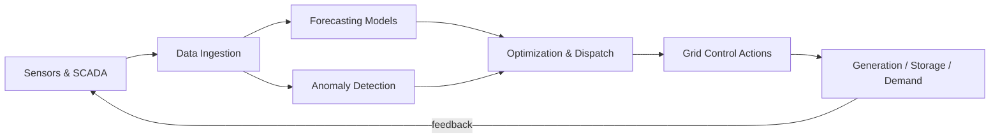

# Introduction to AI for Energy

## Overview

The modern energy system is undergoing its most profound transformation since electrification. The shift from centralized fossil-fuel generation to distributed renewables, the electrification of transport, and the growing urgency of climate goals are creating a system that is orders of magnitude more complex than the grids designed a century ago. Artificial intelligence is emerging as the essential tool for managing this complexity.

Historically, power systems operated on simple heuristics: build large plants close to demand, dispatch cheapest generators first (merit-order dispatch), and maintain spinning reserves for reliability. This paradigm worked when generation was controllable and demand was predictable. Today, neither holds: solar and wind output is weather-dependent, millions of electric vehicles act as mobile loads (and potential storage), and prosumers with rooftop panels both consume and produce electricity.

AI for Energy spans a wide range of applications:

1. **Forecasting** — Predicting solar irradiance, wind speed, and electricity demand hours to days ahead using deep learning.
2. **Grid optimization** — Real-time dispatch, voltage regulation, and congestion management with reinforcement learning.
3. **Predictive maintenance** — Detecting equipment failures before they cause outages using sensor data and anomaly detection.
4. **Energy storage** — Optimizing battery charge/discharge cycles to maximize value and minimize degradation.
5. **Demand response** — Shifting flexible loads (HVAC, EV charging, industrial processes) to match supply.
6. **Nuclear fusion** — RL-based plasma control in tokamak reactors (DeepMind's work with ITER and TCV).

This track takes you from grid fundamentals through renewable forecasting, storage optimization, and building energy management, all the way to autonomous energy systems at the frontier.

**AI for Energy Pipeline**



## Key Concepts

- **Power Grid**: The interconnected system of generators, transmission lines, substations, and distribution networks that deliver electricity from producers to consumers.
- **SCADA (Supervisory Control and Data Acquisition)**: Industrial control systems that monitor and manage grid infrastructure. SCADA data is a primary input for AI models in energy.
- **Merit-Order Dispatch**: The traditional method of dispatching power plants from cheapest to most expensive marginal cost. AI can improve on this by accounting for uncertainty and network constraints.
- **Renewable Intermittency**: Solar and wind generation varies with weather, creating forecasting challenges that AI addresses with time-series deep learning.
- **Demand Response (DR)**: Programs that incentivize consumers to shift electricity usage to off-peak times, enabling grid flexibility.
- **Distributed Energy Resources (DERs)**: Small-scale generation and storage (rooftop solar, home batteries, EVs) connected at the distribution level.
- **Digital Twin**: A virtual replica of a physical energy system used for simulation, optimization, and what-if analysis.

## Core Mathematics

The power flow equations are the foundation of grid analysis. For a bus $i$ in the network:

$$P_i = \sum_{k=1}^{N} |V_i| |V_k| (G_{ik} \cos \theta_{ik} + B_{ik} \sin \theta_{ik})$$

$$Q_i = \sum_{k=1}^{N} |V_i| |V_k| (G_{ik} \sin \theta_{ik} - B_{ik} \cos \theta_{ik})$$

where $P_i$ and $Q_i$ are real and reactive power, $V_i$ is voltage magnitude, $G_{ik}$ and $B_{ik}$ are conductance and susceptance, and $\theta_{ik} = \theta_i - \theta_k$ is the voltage angle difference.

The economic dispatch problem minimizes total generation cost:

$$\min \sum_{i=1}^{N_g} C_i(P_i) \quad \text{s.t.} \quad \sum_{i} P_i = P_{\text{demand}} + P_{\text{loss}}$$

where $C_i(P_i)$ is typically a quadratic cost function $C_i = a_i P_i^2 + b_i P_i + c_i$.

## Code Examples

```python
import numpy as np

def economic_dispatch(demand: float, generators: list[dict]) -> dict:
    """
    Simple lambda-iteration economic dispatch.
    Each generator has cost C = a*P^2 + b*P + c, with Pmin and Pmax.

    Args:
        demand: total load demand in MW
        generators: list of dicts with keys 'a', 'b', 'Pmin', 'Pmax'

    Returns:
        dict mapping generator index to dispatched power
    """
    # Lambda iteration: marginal cost = dC/dP = 2*a*P + b => P = (lambda - b) / (2*a)
    lambda_low, lambda_high = 0.0, 200.0

    for _ in range(100):
        lam = (lambda_low + lambda_high) / 2
        total = 0.0
        for g in generators:
            p = (lam - g['b']) / (2 * g['a'])
            p = np.clip(p, g['Pmin'], g['Pmax'])
            total += p
        if total > demand:
            lambda_high = lam
        else:
            lambda_low = lam

    dispatch = {}
    for i, g in enumerate(generators):
        p = (lam - g['b']) / (2 * g['a'])
        dispatch[i] = float(np.clip(p, g['Pmin'], g['Pmax']))
    return dispatch


# Example: 3-generator system
generators = [
    {'a': 0.004, 'b': 5.3, 'Pmin': 100, 'Pmax': 500},
    {'a': 0.006, 'b': 5.5, 'Pmin': 50,  'Pmax': 400},
    {'a': 0.009, 'b': 5.8, 'Pmin': 50,  'Pmax': 300},
]
result = economic_dispatch(demand=800, generators=generators)
print("Dispatched power (MW):", result)
```

## Exercises

1. **Grid Basics**: Explain why adding more renewable generation to a grid increases the need for AI-based forecasting and control. What specific challenges does intermittency create?
2. **Economic Dispatch**: Modify the code above to include transmission losses using Kron's loss formula $P_{\text{loss}} = \sum_i \sum_j P_i B_{ij} P_j$. How does this change the optimal dispatch?
3. **Data Exploration**: Download a public smart meter dataset (e.g., the Pecan Street Dataport or UK Power Networks). Plot daily load profiles and identify patterns that a forecasting model could learn.
4. **Conceptual Design**: Sketch an AI pipeline for a utility that wants to reduce outage times. What data sources, models, and control actions would you include?

## Further Reading

- Hatziargyriou, N. et al. "AI in Power Systems" — IEEE Power and Energy Magazine (2024)
- IEA, "Electricity Grids and Secure Energy Transitions" (2023) — comprehensive report on grid modernization
- U.S. DOE, "AI for Energy" initiative — https://www.energy.gov/artificial-intelligence
- Duchesne, L. et al. "Recent Developments in Machine Learning for Energy Systems" — Applied Energy (2020)
